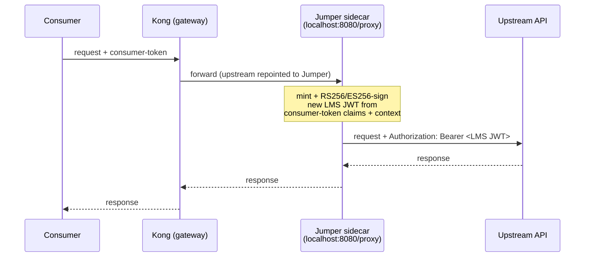
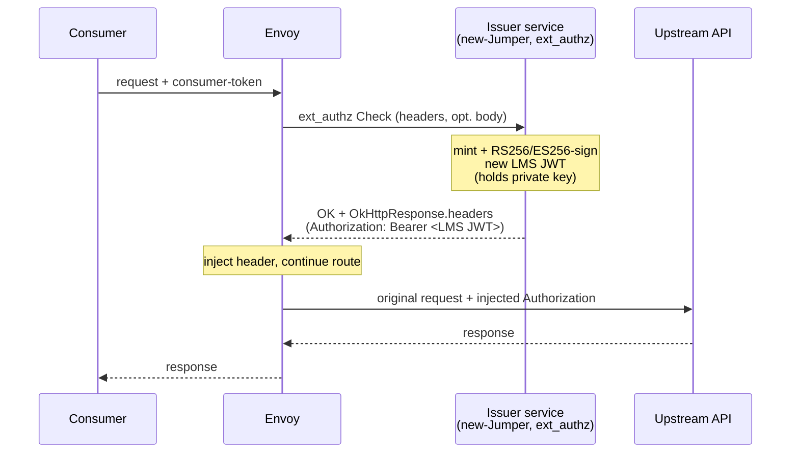

<!--
SPDX-FileCopyrightText: 2025 Deutsche Telekom AG

SPDX-License-Identifier: CC0-1.0
-->

# LastMileSecurity Token Issuing — Kong/Jumper → Envoy xDS

Per-request flow: mint a new LastMileSecurity (LMS) JWT via an external issuer
service, inject it, then forward the original request to the real upstream API.

## Mapping row

| Feature | Current (cited) | xDS construct | Rung | Why not higher |
|---|---|---|---|---|
| LMS token issuing | Upstream repointed to local Jumper sidecar (`jumper.go:14`, `last_mile_security.go:57`); Jumper mints JWT from `JumperConfig.OAuth` (`jumper.go:55`) then calls real upstream. Req AU-03: new gateway-signed JWT from incoming claims + request context (`requirements.md:60`). | `ext_authz` HTTP filter → external issuer (new-Jumper) returns token via `OkHttpResponse.headers`; Envoy injects `Authorization`, routes to real upstream cluster | 3 (ext_authz) + 4 (issuer signs) | R1 no built-in issuer; R2 no stock filter signs; R3 Lua/Wasm have no private-key signing → signing descends to external issuer. Plumbing holds at rung 3. |

## Today (Jumper as upstream)

## Target (Envoy ext_authz issuer call-out)

Key difference: Envoy owns upstream routing; the issuer is a thin side call
that only mints and returns the token, it does not proxy.

## Rung tally

1 ext_authz filter (plumbing) + 1 new-Jumper issuer (signing only).

## Setup plan

Decisions (from code):
- Signing key scope: **per-realm** (issuer selects by route `RealmName`, `security_types.go:44`).
- Mechanism: **ext_authz** (issuer only returns a token; ext_proc streaming unneeded).
- Request body: **not needed** (`with_request_body` off) — all claim sources are headers/CRD spec.

### P0 — Issuer service (new-Jumper) — blocks everything
1. **Key management** — per-realm signing keys in Secret/secret-manager; rotation; publish JWKS per realm for upstream verification.
2. **gRPC ext_authz Check server** — implement `envoy.service.auth.v3.Authorization`; mint + RS256/ES256-sign JWT; return `OkHttpResponse.headers` with `Authorization: Bearer <token>`.
3. **Claim derivation** (AU-03):
   - `realm`, `environment` ← route context headers (`last_mile_security.go:63`)
   - `remote_api_url`, `api_base_path` ← upstream (`last_mile_security.go:87-88`)
   - `aud` ← `Claim.Value` literal or `ValueFrom: ConsumerClientId` (`security_types.go:65-78`)
   - `scope` ← `M2M.Scopes` (`security_types.go:149`)
   - `sub`, `clientId`, `azp` ← incoming consumer-token
   - `iss`, `exp`, `iat` ← issuer-computed per request

### P1 — Envoy xDS wiring (operator emission) — depends on P0
4. **ext_authz HTTP filter** in HCM chain → issuer cluster; `authorization_response.allowed_upstream_headers` = `Authorization`.
5. **Issuer cluster** — static/EDS cluster to the issuer service.
6. **FeatureBuilder Envoy path** — LMS branch: **stop repointing upstream to localhost** (`last_mile_security.go:57`); emit ext_authz + keep real upstream cluster.

### P2 — Correctness & rollout
7. **Per-route enable** — LMS gated by `IsUsed` (`!PassThrough && no Failover`, `last_mile_security.go:43`); apply via `typed_per_filter_config`, not global.
8. **Failure mode** — `failure_mode_allow: false` (fail closed: issuer down → reject).
9. **Tests** — issuer unit (claim mapping, signing) + envtest for emitted xDS; upstream verifies via JWKS.
