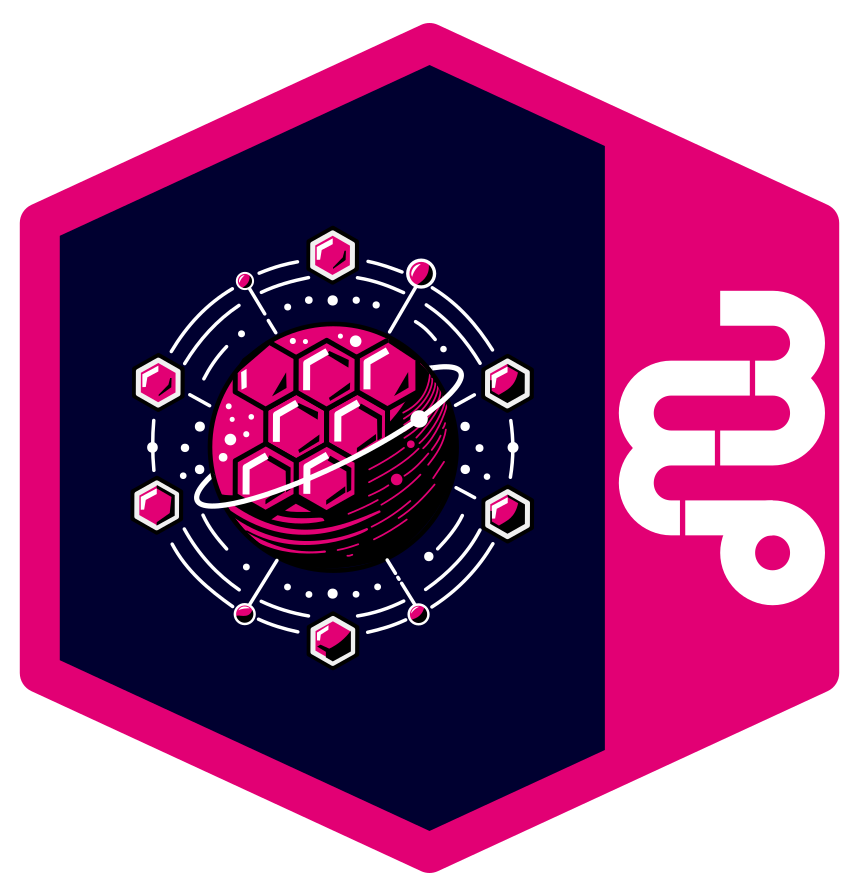

<!--
SPDX-FileCopyrightText: 2025 Deutsche Telekom AG

SPDX-License-Identifier: CC0-1.0    
-->

  
  <h1 align="center">Control Plane</h1>

  A cloud-agnostic orchestration platform for self-service API management across multi-cloud environments.

---

As part of the [Open Telekom Integration Platform](https://github.com/telekom/Open-Telekom-Integration-Platform), the Control Plane enables platform engineers and application teams to manage APIs, configure approval workflows, and mesh services across cloud boundaries — all from a single, unified interface.

📖 **[Read the full documentation](https://telekom.github.io/controlplane/)**

## Code of Conduct

This project has adopted the [Contributor Covenant](https://www.contributor-covenant.org/) in version 2.1 as our code of conduct. Please see the details in our [CODE_OF_CONDUCT.md](CODE_OF_CONDUCT.md). All contributors must abide by the code of conduct.

## Licensing

This project follows the [REUSE standard for software licensing](https://reuse.software/).    
Each file contains copyright and license information, and license texts can be found in the [./LICENSES](./LICENSES) folder. For more information visit https://reuse.software/.    
You can find a guide for developers at https://telekom.github.io/reuse-template/.
