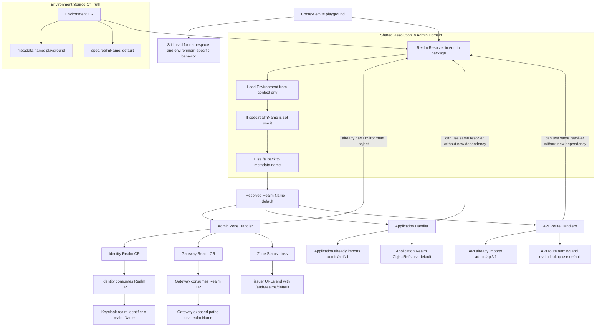

<!--
SPDX-FileCopyrightText: 2026 Deutsche Telekom AG

SPDX-License-Identifier: CC0-1.0    
-->

# Problem

Current Implementation: Environment Name will always become the Realm name
- Example POC Environment -> POC Realm

This works fine for QA environments. However, on PLAYGROUND and other environments it will cause issues, as customers on certain environments are used to have the realm name be "default".
- Example (from oldCP - Playground Cluster):
    - default Environment -> default Realm (only default exists, but we want to name it now)
    - https://xxxx.de/auth/realms/default <- this suffix is dynamically generated via the realm name (!)

Ultimate goal: Decouple the Realm-Name from the Environment Name, so that we can have more flexibility in naming the realms, and not be forced to have the same name as the environment.

# Datamodel  

The `EnvironmentSpec` currently only has a `Foo` field -- there is **no `RealmName` field** to allow overriding the convention.
The coupling is enforced purely by the `naming` package and the fact that `contextutil.EnvFromContextOrDie(ctx)` is passed directly wherever a realm name is needed.


# Summary
- Best would be to introduce a `RealmName` field in the `EnvironmentSpec` and make the handlers read from that instead of assuming the convention. This would allow us to have different realm names for different environments, including the ability to keep "default" for certain environments if desired.

# The Core Coupling Point

[`admin/internal/handler/util/naming/naming.go`](#admin) -- This is where the 1:1 identity between environment name and realm name is established.

# The Full Coupling Chain

```
Context ("env" key)
    │
    ▼
contextutil.EnvFromContextOrDie(ctx)  ──►  envName (string)
    │
    ▼
c.Get(ctx, ObjectKey{Name: envName, Namespace: envName}, environment)  ──►  *adminv1.Environment
    │
    ▼
naming.ForDefaultIdentityRealm(environment)  ──►  environment.GetName()  ==  envName
naming.ForDefaultGatewayRealm(environment)   ──►  environment.GetName()  ==  envName
naming.ForTeamApiIdentityRealm(environment)  ──►  "team-" + environment.GetName()
naming.ForTeamApiGatewayRealm(environment)   ──►  "team-" + environment.GetName()
    │
    ▼
createIdentityRealm(ctx, hc, idp, realmName)  ──►  Realm.ObjectMeta.Name = realmName
createGatewayRealm(ctx, hc, gw, realmName)    ──►  Realm.ObjectMeta.Name = realmName
    │
    ▼
urls.ForGatewayRealm(baseUrl, realmName)       ──►  "<baseUrl>/auth/realms/<envName>"
url.JoinPath(baseUrl, "auth/realms/", realmName) ──►  "<baseUrl>/auth/realms/<envName>"
```


# Domain Details

Code places where the realm name is being used, with detailed findings from codebase scan:

## Admin

### Handler

- [remoteorganization/handler.go](https://github.com/telekom/controlplane/blob/785d313074077e93511c9ee1d7dd75ee2647cc50/admin/internal/handler/remoteorganization/handler.go#L73-L75) (but perhaps is subject to refactoring regardless)
    - Uses `envName` from `contextutil.EnvFromContextOrDie(ctx)` to create namespace names with pattern `<envName>--<remoteOrgId>`
    - Not directly creating realms, but establishes the pattern of environment name as canonical identifier

- [zones/handler.go](https://github.com/telekom/controlplane/blob/785d313074077e93511c9ee1d7dd75ee2647cc50/admin/internal/handler/zone/handler.go) 
    - **This is the orchestration hub where realms are created.** Detailed coupling points:
    - [Line 87](https://github.com/telekom/controlplane/blob/785d313074077e93511c9ee1d7dd75ee2647cc50/admin/internal/handler/zone/handler.go#L87): `createIdentityRealm(ctx, hc, idp, naming.ForDefaultIdentityRealm(handlingContext.Environment))` -- realm name = env name
    - [Line 92](https://github.com/telekom/controlplane/blob/785d313074077e93511c9ee1d7dd75ee2647cc50/admin/internal/handler/zone/handler.go#L92): `url.JoinPath(idpUrl, "auth/realms/", identityRealm.Name)` -- realm name baked into the issuer URL
    - [Line 113](https://github.com/telekom/controlplane/blob/785d313074077e93511c9ee1d7dd75ee2647cc50/admin/internal/handler/zone/handler.go#L113): `createGatewayRealm(ctx, hc, gw, naming.ForDefaultGatewayRealm(handlingContext.Environment))` -- same pattern
    - [Line 119](https://github.com/telekom/controlplane/blob/785d313074077e93511c9ee1d7dd75ee2647cc50/admin/internal/handler/zone/handler.go#L119): `url.JoinPath(gwUrl, "auth/realms/", gatewayRealm.Name)` -- realm name baked into LMS issuer URL
    - [Lines 134](https://github.com/telekom/controlplane/blob/785d313074077e93511c9ee1d7dd75ee2647cc50/admin/internal/handler/zone/handler.go#L134), [141](https://github.com/telekom/controlplane/blob/785d313074077e93511c9ee1d7dd75ee2647cc50/admin/internal/handler/zone/handler.go#L141): Team API realms created with `"team-" + envName`
    - Inside `createGatewayRealm` ([~line 276](https://github.com/telekom/controlplane/blob/785d313074077e93511c9ee1d7dd75ee2647cc50/admin/internal/handler/zone/handler.go#L276)): realm name becomes embedded in the IssuerUrl
    - Inside `createIdentityRealm` ([~line 386](https://github.com/telekom/controlplane/blob/785d313074077e93511c9ee1d7dd75ee2647cc50/admin/internal/handler/zone/handler.go#L386)): `identityRealm.ObjectMeta.Name = labelutil.NormalizeValue(realmName)`

### Util

- basically sets realmName = environment name: [utils/Naming.go](https://github.com/telekom/controlplane/blob/785d313074077e93511c9ee1d7dd75ee2647cc50/admin/internal/handler/util/naming/naming.go#L21-L32)

- URL-Path realm suffix for the IssuerURLs: [utils/urls.go](https://github.com/telekom/controlplane/blob/785d313074077e93511c9ee1d7dd75ee2647cc50/admin/internal/handler/util/urls/urls.go#L40-L44)

## API

### Utils

- Hardcoded "default" check on the realm name: [routeUtil.go](https://github.com/telekom/controlplane/blob/785d313074077e93511c9ee1d7dd75ee2647cc50/api/internal/handler/util/route_util.go#L122-L128)
    - If env/realm is `"default"`, routes get names **without** prefix (e.g. `api-test-v1`)
    - Any other name gets a prefix (e.g. `poc--api-test-v1`)

    | realmName    | apiBasePath      | Resulting Route Name  |
    |--------------|------------------|-----------------------|
    | `"default"`  | `/api/test/v1`   | `api-test-v1`         |
    | `"poc"`      | `/api/test/v1`   | `poc--api-test-v1`    |

### Handler

- [apiexposure/handler.go, Line 90](https://github.com/telekom/controlplane/blob/785d313074077e93511c9ee1d7dd75ee2647cc50/api/internal/handler/apiexposure/handler.go#L90) -- Passes environment name directly as realm name:
    ```go
    route, err := util.CreateRealRoute(ctx, apiExp.Spec.Zone, apiExp, contextutil.EnvFromContextOrDie(ctx))
    ```
- [apiexposure/handler.go, Lines 97-98](https://github.com/telekom/controlplane/blob/785d313074077e93511c9ee1d7dd75ee2647cc50/api/internal/handler/apiexposure/handler.go#L97-L98) -- Same for proxy routes:
    ```go
    route, err := util.CreateProxyRoute(ctx, failoverZone, apiExp.Spec.Zone, apiExp.Spec.ApiBasePath,
        contextutil.EnvFromContextOrDie(ctx), ...)
    ```
- [apisubscription/handler.go, Lines 240-241](https://github.com/telekom/controlplane/blob/785d313074077e93511c9ee1d7dd75ee2647cc50/api/internal/handler/apisubscription/handler.go#L240-L241) and [Lines 290-291](https://github.com/telekom/controlplane/blob/785d313074077e93511c9ee1d7dd75ee2647cc50/api/internal/handler/apisubscription/handler.go#L290-L291) -- Same pattern for subscriptions

### Exception: Remote Handler

- [remote/handler.go, Line 159](https://github.com/telekom/controlplane/blob/785d313074077e93511c9ee1d7dd75ee2647cc50/api/internal/handler/apisubscription/remote/handler.go#L159) -- Uses `remoteOrg.Spec.Id` instead of env name. This is the **one call site** where the realm name is already decoupled from the environment name.

---

## Application

### Handler

- [application/handler.go](https://github.com/telekom/controlplane/blob/785d313074077e93511c9ee1d7dd75ee2647cc50/application/internal/handler/application/handler.go#L139)
    - `CreateIdentityClient` ([Line 139](https://github.com/telekom/controlplane/blob/785d313074077e93511c9ee1d7dd75ee2647cc50/application/internal/handler/application/handler.go#L139)):
      ```go
      realmName := contextutil.EnvFromContextOrDie(ctx)   // env == realm
      realmRef := &types.ObjectRef{Name: realmName, Namespace: namespace}
      idpClient.Spec.Realm = realmRef
      ```
    - `CreateGatewayConsumer` ([Line 201](https://github.com/telekom/controlplane/blob/785d313074077e93511c9ee1d7dd75ee2647cc50/application/internal/handler/application/handler.go#L201)):
      ```go
      realmName := contextutil.EnvFromContextOrDie(ctx)   // env == realm
      consumer.Spec.Realm = types.ObjectRef{Name: realmName, ...}
      ```
    - Both functions also propagate as labels: `config.BuildLabelKey("realm"): realmName`

### Downstream Impact

The realm `ObjectRef` created by the Application handler is consumed by:
- **Identity service**: `ClientSpec.Realm` is used to look up the actual `Realm` CR and communicate with Keycloak
- **Gateway service**: `ConsumerSpec.Realm` is used to associate the consumer with a gateway realm

### Architectural Constraint

> If an Application has the label `cp.ei.telekom.de/environment: foo`, then there **must** exist both an `identity.Realm` and a `gateway.Realm` CR named `foo` in each zone's namespace that the application targets.
---

## Gateway

### Handler

- [handler/realm/routes.go](https://github.com/telekom/controlplane/blob/785d313074077e93511c9ee1d7dd75ee2647cc50/gateway/internal/handler/realm/routes.go#L78-L93)
    - Realm name is embedded in **three** ways within `CreateRoute`:
      1. **Route object naming** ([Line 59](https://github.com/telekom/controlplane/blob/785d313074077e93511c9ee1d7dd75ee2647cc50/gateway/internal/handler/realm/routes.go#L59)): `realm.Name + "--" + string(routeType)` (e.g. `poc--issuer`)
      2. **Upstream path** ([Line 83](https://github.com/telekom/controlplane/blob/785d313074077e93511c9ee1d7dd75ee2647cc50/gateway/internal/handler/realm/routes.go#L83)): `fmt.Sprintf("/api/v1/issuer/%s", realm.Name)` -- path for Jumper proxy
      3. **Downstream path** ([Line 90](https://github.com/telekom/controlplane/blob/785d313074077e93511c9ee1d7dd75ee2647cc50/gateway/internal/handler/realm/routes.go#L90)): `fmt.Sprintf("/auth/realms/%s", realm.Name)` -- externally visible URL path
    - Three routes are auto-created per realm: issuer, certs, discovery
    - Route map:
      ```go
      var routeMap = map[RouteType]routeConfig{
          RouteTypeIssuer:    {UpstreamPathFormat: "/api/v1/issuer/%s",    DownstreamPathFormat: "/auth/realms/%s"},
          RouteTypeCerts:     {UpstreamPathFormat: "/api/v1/certs/%s",     DownstreamPathFormat: "/auth/realms/%s/protocol/openid-connect/certs"},
          RouteTypeDiscovery: {UpstreamPathFormat: "/api/v1/discovery/%s", DownstreamPathFormat: "/auth/realms/%s/.well-known/openid-configuration"},
      }
      ```

### Features -- Last-Mile Security

- [last_mile_security.go, Lines 57-103](https://github.com/telekom/controlplane/blob/785d313074077e93511c9ee1d7dd75ee2647cc50/gateway/internal/features/feature/last_mile_security.go#L57-L103)
    ```go
    realm := builder.GetRealm()
    envName := contextutil.EnvFromContextOrDie(ctx)
    rtpPlugin.Config.Add.AddHeader("environment", envName).AddHeader("realm", realm.Name)
    rtpPlugin.Config.Replace.AddHeader("environment", envName).AddHeader("realm", realm.Name)
    ```
    - Both `environment` and `realm` are injected as HTTP headers on every non-passthrough, non-failover request
    - Headers are set via both `Add` (if absent) and `Replace` (override existing), ensuring they are always authoritative

### Features -- Failover

- [failover.go, Lines 53-84](https://github.com/telekom/controlplane/blob/785d313074077e93511c9ee1d7dd75ee2647cc50/gateway/internal/features/feature/failover.go#L53-L84)
    ```go
    envName := contextutil.EnvFromContextOrDie(ctx)
    proxyRoutingCfg := &plugin.RoutingConfig{
        Realm:       route.Spec.Realm.Name,   // realm name
        Environment: envName,                  // env name
    }
    ```
    - Both `Realm` and `Environment` are embedded in the `RoutingConfig` struct (base64-encoded as a header for Jumper)


## Identity

- [identity/pkg/keycloak/mapper/mapper_realm.go](https://github.com/telekom/controlplane/blob/f15e0f713e96670d35e378018e10f8cc81489d2b/identity/pkg/keycloak/mapper/mapper_realm.go#L14-L19) -- realm.Name (which IS the env name) becomes the Keycloak RealmRepresentation.Realm field. This is where the K8s object name becomes the actual Keycloak realm identifier.
- [identity/internal/handler/realm/handler.go](https://github.com/telekom/controlplane/blob/f15e0f713e96670d35e378018e10f8cc81489d2b/identity/internal/handler/realm/handler.go#L48) ([L77](https://github.com/telekom/controlplane/blob/f15e0f713e96670d35e378018e10f8cc81489d2b/identity/internal/handler/realm/handler.go#L77), [L99](https://github.com/telekom/controlplane/blob/f15e0f713e96670d35e378018e10f8cc81489d2b/identity/internal/handler/realm/handler.go#L99)) -- realm.Name used for all Keycloak API calls (create, update, delete)
- [identity/internal/handler/realm/status.go](https://github.com/telekom/controlplane/blob/f15e0f713e96670d35e378018e10f8cc81489d2b/identity/internal/handler/realm/status.go#L37-L46) -- MapToRealmStatus builds issuer URL from realm.Name
- [identity/pkg/keycloak/client_config.go](https://github.com/telekom/controlplane/blob/f15e0f713e96670d35e378018e10f8cc81489d2b/identity/pkg/keycloak/client_config.go#L19-L36) -- URL construction: DetermineIssuerUrlFrom(adminUrl, realmName) builds /realms/<envName>
- [identity/pkg/keycloak/client_implementation.go](https://github.com/telekom/controlplane/blob/f15e0f713e96670d35e378018e10f8cc81489d2b/identity/pkg/keycloak/client_implementation.go#L153-L177) ([L344-L374](https://github.com/telekom/controlplane/blob/f15e0f713e96670d35e378018e10f8cc81489d2b/identity/pkg/keycloak/client_implementation.go#L344-L374)) -- All Keycloak HTTP API calls use realm.Name in URL paths

## Organization

### Webhook

- [webhook/v1/mutator/mutate.go](https://github.com/telekom/controlplane/blob/785d313074077e93511c9ee1d7dd75ee2647cc50/organization/internal/webhook/v1/mutator/mutate.go#L95-L96)
    - The mutator does **not** compute realm names itself. It reads pre-computed URLs from `zoneObj.Status.Links`:
      ```go
      TokenUrl: zoneObj.Status.Links.TeamIssuer + "/protocol/openid-connect/token"
      ```
    - The `TeamIssuer` URL already contains the realm name (e.g. `/auth/realms/team-poc`), which was set during Zone provisioning in the admin service

### Handler -- Identity Client and Gateway Consumer

- [identity_client.go, Line 41](https://github.com/telekom/controlplane/blob/785d313074077e93511c9ee1d7dd75ee2647cc50/organization/internal/handler/team/handler/identity_client/identity_client.go#L41):
    ```go
    identityClient.Spec.Realm = zoneObj.Status.TeamApiIdentityRealm
    ```
- [gateway_consumer.go, Line 38](https://github.com/telekom/controlplane/blob/785d313074077e93511c9ee1d7dd75ee2647cc50/organization/internal/handler/team/handler/gateway_consumer/gateway_consumer.go#L38):
    ```go
    gatewayConsumerObj.Spec.Realm = *zoneObj.Status.TeamApiGatewayRealm
    ```
- Both read realm references from `Zone.Status` fields, which were populated by the admin Zone handler using the `naming` package

---

## Tools

- Derives realm name from environment [route-tester/main.go](https://github.com/telekom/controlplane/blob/785d313074077e93511c9ee1d7dd75ee2647cc50/tools/route-tester/main.go#L85-L85)
    ```go
    realmName := environment // per convention, the realm name is the same as the environment name
    ```

## Possible Solution Concept

Introduce a dedicated `realmName` field on the `Environment` spec and make all realm-producing and realm-consuming code resolve the realm name from the `Environment` object instead of assuming `environment.name == realm.name`.

> [!NOTE]
> Check is needed that realmName does not equal to any existing env-name



## Analysis Of This Approach

### Upsides

- **Explicit domain model:** `Environment` becomes the canonical place to describe both the deployment environment and its externally visible realm identity.
- **Small conceptual change:** this keeps the existing architecture intact and mainly replaces an implicit convention with explicit configuration.
- **Fits the current orchestration flow:** the admin service already loads the `Environment` object, so resolving the realm name there is a natural extension.
- **Supports the concrete problem directly:** environments such as `playground` can now have the realm name `default` without renaming the environment itself.

### Downsides

- **Broader propagation than it first appears:** many components currently rely on the realm name indirectly through object names, URLs, route names, status links, and `ObjectRef`s.  They would now need to access env to get the right `realmObj`.
- **Migration complexity:** if a realm already exists with the old name and the configured `realmName` changes later, the system must decide whether to **rename, recreate, or reject** the change. 
- **Validation requirements:** the field needs validation rules. 

### Important Design Risks

- **Mutable vs immutable field:** `spec.realmName` should most likely be treated as **immutable after first reconciliation**. 
- **Defaulting source of truth:** if some handlers read `Environment.Spec.RealmName` directly while others still derive from context or object names, the system will become inconsistent. **A single resolver function is needed and should be used everywhere.**
