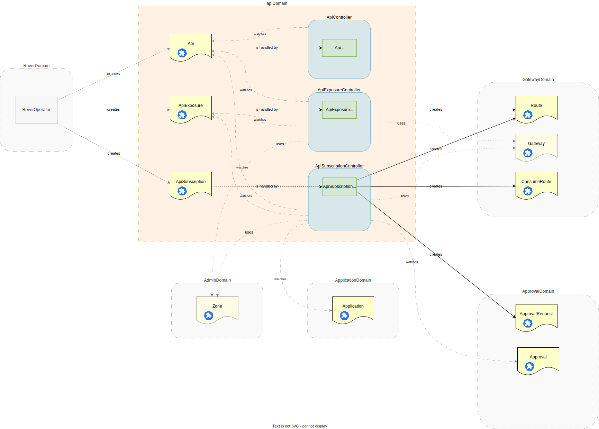

<!--
SPDX-FileCopyrightText: 2025 Deutsche Telekom AG

SPDX-License-Identifier: CC0-1.0    
-->

  <h1 align="center">API</h1>

  The Api domain is responsible for all Api-related resources: the Api itself as well as its Exposure and Subscription.

  <a href="#about"> About</a> •
  <a href="#features"> Features</a>

## About
This repository contains the implementation of the Api domain, which is responsible for managing the whole lifecycle of an API. 

The following diagram illustrates the architecture of the Api domain:

    

## Features

- **Api Management**: Manage the whole API lifecycle, including registering, exposing and subscribing.
- **Approval Handling**: Require approval when subscribing to APIs using the integration with the [Approval Domain](../approval).
- **Api Categories**: Classify APIs into categories and customize their behavior based on these categories.

The actual features that are supported by the gateway instance, are listed in [gateway domain](../gateway) as this domain is a abstract layer for the gateway to handle access control.

### Api Categories

You may create categories to classify your APIs. Each category can have specific properties that define its behavior.
The check for allowed categories is done at the earliest point in the [Rover Domain](../rover).

