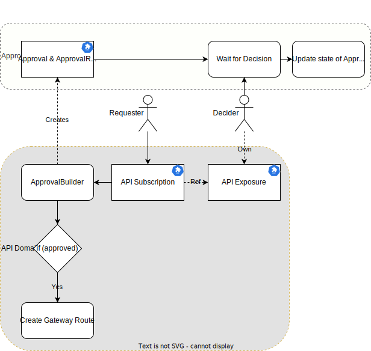
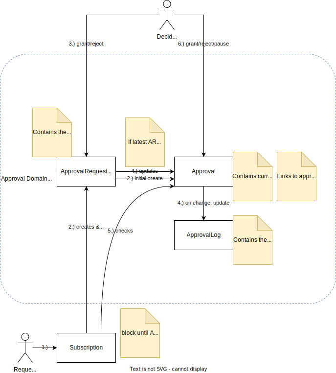
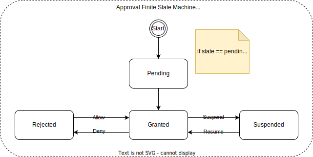
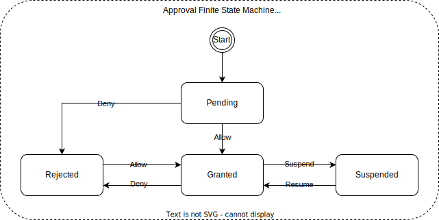
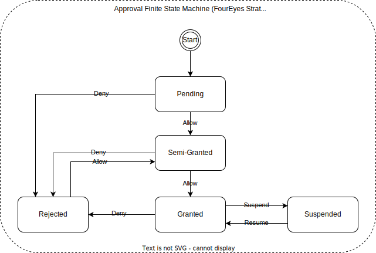

<!--
Copyright 2025 Deutsche Telekom IT GmbH

SPDX-License-Identifier: Apache-2.0
-->

<p align="center">
  <h1 align="center">Approval</h1>
</p>

<p align="center">
  The Approval domain provides an approval workflow for any subscription requests, such as `APISubscription` in `API` domain.
   It enables the creation, tracking and management of access requests.
</p>

<p align="center">
  <a href="#about">About</a> •
  <a href="#features">Features</a> •
  <a href="#integration">Integration</a> •
   <a href="#getting-started">Getting Started</a>
</p>


## About

This project defines custom resources (`Approval` and `ApprovalRequest`) to handle access approvals. 

It supports various approval strategies (e.g., `Auto`, `Simple` and `FourEyes`) and tracks the state of them. 

The solution is designed to integrate seamlessly with any Subscription-like CRDs (like `ApiSubscriptions` in our `API domain`), enabling control over your resource access.

The following diagram illustrates the overall interaction of the Approval domain:



### Actors
- **Requester**: The user that initiates the `Subscription` request for access to an `Exposure` (i.e. an exposed / subscribable resource). 
- **Decider**: The user reviews and approves/rejects the request. He is also the owner of the `Exposure`

### Components
- **`Approval` & `ApprovalRequest`**: The CRD that represents the approval process. It contains information about the request, the decider, and the approval strategy.
- **`Exposure`**: The CRD, which represents the resource that access is being requested for.
- **`Subscription`**: The CRD, which represents the request for access to an `Exposure`.

> [!Note]
> For more details about `Exposure` and `Subscription`, please refer to the API domain.

### Actions
Actions are abstract representations of features handled by the `Operator`.
- **ApprovalBuilder.Build**: The Creation of a `Subscription` resource triggers the creation of an `Approval` resource with the [ApprovalBuilder](api/v1/builder/builder.go).
- **Waiting for Decision**: The `Approval` resource is in a `Pending` state (depending on the approval strategy) until the decider makes a decision.
- **Update state of Approval**: Sets the state of the `Approval` resource. Details can be found in [Approval State](#approval-states).

## Features

* **Approval Workflow**: This domain supports the process of creating, updating and managing access requests. For more details, see [Approval Workflow](#approval-workflow).
* **Approval Strategies**: The `Approval` resource supports three approval strategies: `Auto`, `Simple` and `FourEyes`. For more details, see [Approval Strategies](#approval-strategies).
* **Approval States**: 
  - The `Approval` resource has several states that represent the current status of the approval process. For more details, see [Approval States](#approval-states).

### Approval Workflow

The Approval Workflow describes the process of creating, updating and managing API access requests. The following diagram illustrates the workflow. The steps are explained below.




1. **Request Creation**: A user (requester) creates any `Subscription` resource, such as `ApiSubscriptions`. 
The operator of the corresponding domain has to create an `ApprovalRequest` and updates it on any changes.
The `Subscription` needs to be blocked until the `Approval` is granted.

2. **ApprovalRequest**: 
The `ApprovalRequest` is created and contains information about the request, including the requester, the requested API, and the approval strategy.
It initially has the status of `Pending`, creates the `Approval` resource and contains a reference to the `Approval` resource.

3. **ApprovalRequest by Decider**: The decider can then review the request and decide whether to approve or reject it. 
The decider is the owner team of the application containing the `Exposure` to be subscribed to.
Depending on the outcome, the `ApprovalRequest` status is updated to `Granted` or `Rejected`, and the `Approval` resource is updated accordingly.
If the latest `ApprovalRequest` is granted, then both the `Approval` and `ApprovalRequest` resources contain the same data.

4. **Approval changes**: Once the `ApprovalRequest` is approved, the `Approval` resource is created and contains information about the approval, including the decider, the approval strategy, and the status of the request.
It contains the currently approved state. Furthermore, the `Approval` links to an `ApprovalLog` that contains the history of the approval process, including the status changes and any comments made by the decider.

5. **Access Granting**: Once approved and access to the requested API is granted, the `Subscription` 
resource, watching/listening to the `Approval` resource, can be updated to reflect the granted access by making the required 
configurations in the handler of the `Subscription` resource.

6. **Changing Approval anytime**: The decider can also change the access by updating the `Approval` resource anytime. The approval can be paused, granted and rejected.
By listing/watching the `Approval` resource, the `Subscription` resource can be updated to reflect those changes.

### Approval Strategies
There are three approval strategies supported by the `Approval` resource:
1. **Auto**: The request is automatically approved without any manual intervention. This strategy is suitable for low-risk requests.
2. **Simple**: The request requires a single approval to grant access. 
3. **FourEyes**: The request requires two approvals to grant access. This strategy is suitable for production environments.

### Trusted Teams

Trusted teams provide a mechanism to streamline the approval process for specific teams that are pre-authorized by the API owner. This feature enables automatic approval of subscription requests from designated trusted teams, bypassing the standard approval workflow.

#### How Trusted Teams Work

1. **Designation**: API owners can designate specific teams as "trusted" when exposing their APIs. These trusted teams are stored as `ObjectRef` references in the `ApiExposure` resource.

2. **Automatic Approval**: When a team designated as "trusted" requests access to an API, the system automatically applies the `Auto` approval strategy, regardless of the API's default approval strategy.

3. **Implementation**: The system verifies if the requester's team matches any of the trusted teams defined in the API exposure:
   ```go
   isTrustedTeamRequester, err = util.IsRequesterFromTrustedTeam(ctx, apiSub, apiExposure.Spec.Approval.TrustedTeams)
   if isTrustedTeamRequester {
       // Override to Auto approval strategy
       approvalStrategy = apiapi.ApprovalStrategyAuto
   }
   ```
#### Example Configuration

In a Rover resource that exposes an API:

```yaml
apiVersion: rover.ei.telekom.de/v1
kind: Rover
spec:
  exposures:
    - api:
        approval:
          strategy: Simple
          trustedTeams:
            - group: "trusted-group-1"
              team: "trusted-team-1"
            - group: "trusted-group-2"
              team: "trusted-team-2"
```

When a subscription request comes from any of these trusted teams, the approval is automatically granted without requiring manual intervention, regardless of the default `FourEyes` strategy.

> [!Note]
> The owner's team is automatically added as a trusted team, allowing them to subscribe to their own APIs without requiring approval.

### Approval States
The `Approval` resource has the following states. 
The transition between these states so so-called `Actions`, are defined in the `Approval` resource. 
The `Approval` resource can be in one of the following states:
- **Pending**: The request is pending approval. This is the initial state of the `Approval` resource.
- **Granted**: The request has been approved.
- **Rejected**: The request has been rejected. This state indicates that a decider has denied access.
- **Suspended**: The request has been suspended. This state indicates that the request is temporarily on hold and cannot be processed until further notice.
- **SemiGranted**: The request has been approved by one decider in the `FourEyes` strategy, but requires a second approval from another decider to be fully granted.
- **Expired**: The request has expired past its validity period.

Take a look at the following diagrams for illustration, taken from [`internal/fsm` (link)](internal/fsm). 

> [!Note]
> A list of available transitions is in the `Status` resource itself. Also, the diagram for the `ApprovalRequest` slightly differs due to no need for `Suspend` and `Resume` actions. These are directly done on the `Approval` resource.





## Roadmap

Certain features are partly present in the source code, but not ready for production use yet.
The following features are planned to be further implemented:

- `FourEyes` strategy: Integration of `SemiGranted` state into the `Approval` Flow.
-  APIs should be able to expire after a configured date. The integration of the `Expired` state into the `Approval` Flow.
- Separated `ApprovalLog` resource for more detailed history of the approval process (Currently, the latest `Approval` only states the last state).

## Integration

### Integration to any Subscription-like CRD

For code examples, please take a look at our reference implementation of the `ApiSubscriptions` CRD in the API domain.

Nevertheless, here is a short summary of key integration steps:

1. First, include the `Approval` and `ApprovalRequest` CRDs as `types.ObjectRef` (defined in the common library) in your `Subscriptions.Status` field of your new CRD.
   This ensures that every subscription request must have an associated approval. Here is an example of how to do this:

    ```go
    package v1
    
    import (
        "github.com/telekom/controlplane/common/pkg/types"
    )
    
    type SubscriptionStatus struct { //your new CRD, scaffolded by kubebuilder
        /*
            ...
        */
        //these fields you need to add
        Approval              *types.ObjectRef `json:"approval,omitempty"`
        ApprovalRequest       *types.ObjectRef `json:"approvalRequest,omitempty"`
    }
    ```

2. Add `ApprovalRequest` and `Approval` to the reconciler where the resourceManager is being setup (`func (r *SubscriptonReconciler) SetupWithManager(ctrl.Manager) error`), as being owned by your `Subscription` resource. 
   Furthermore, add Watcher-implementation to watch for changes in the `Approval` and `ApprovalRequest` resources.
   This ensures that the `ApprovalRequest` and `Approval` resources are managed by the `Subscription` reconciler lifecycle as well.

3. Within your `SubscriptionHandler`, build the `Approval` and `ApprovalRequest`. We recommend using the [`ApprovalBuilder (link)`](./api/v1/builder/builder.go). 
   For a simple example, see the code snippet from the `ApiSubscriptions` within the API domain.

4. Afterwards, check the status of the `Approval`resources by checking the response of the builder.
   If the result states that the subscription should not be further processed (i.e. `builder.ApprovalResultDenied` and `builder.ApprovalResultPending`), append the status to the status of the `Subscription` resource and return the reconciler.
   If the result is `builder.ApprovalResultGranted`, you can proceed with the subscription process (i.e. continue with the reconciler loop).

## Getting Started
### To Run the Test

It will install the required dependencies if not already installed and run the tests.

```sh
make test
```

### To Deploy on the cluster
**NOTE:**This image needs to be built beforehand.
This image ought to be published in the personal registry you specified.
And it is required to have access to pull the image from the working environment.
Make sure you have the proper permission to the registry if the above commands don’t work.

**Install the CRDs into the cluster:**

```sh
make install
```

**Deploy the Manager to the cluster with the image specified by `IMG`:**

```sh
make deploy IMG=<some-registry>/approval:tag
```

> [!Note]
> If you encounter RBAC errors, you may need to grant yourself cluster-admin privileges or be logged in as admin.

**Create instances of your solution**
You can apply the samples (examples) from the config/sample:

```sh
kubectl apply -k config/samples/
```

> [!Note]
> Ensure that the samples have default values to test them out.

### To Uninstall
**Delete the instances (CRs) from the cluster:**

```sh
kubectl delete -k config/samples/
```

**Delete the APIs(CRDs) from the cluster:**

```sh
make uninstall
```

**UnDeploy the controller from the cluster:**

```sh
make undeploy
```

 on the cluster