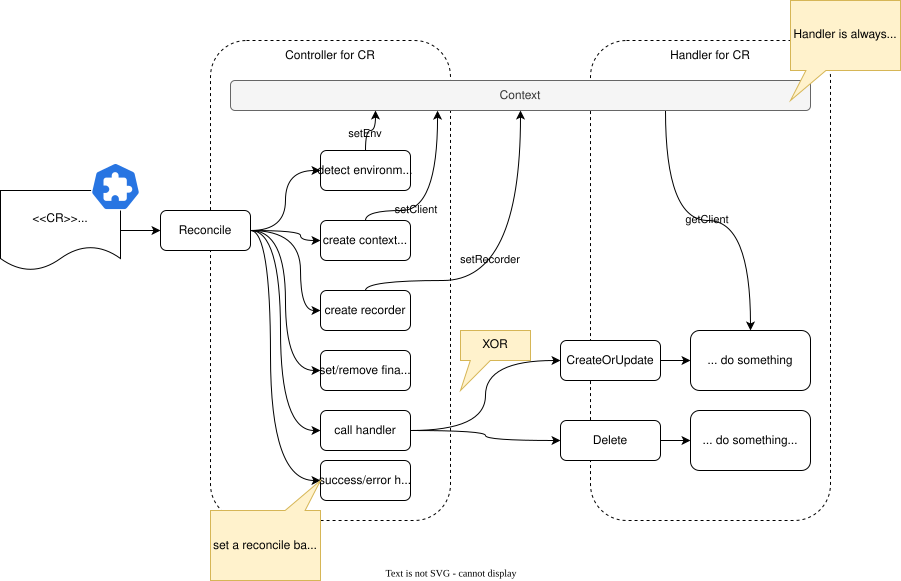

<!--
Copyright 2025 Deutsche Telekom IT GmbH

SPDX-License-Identifier: Apache-2.0
-->

<p align="center">
  
  <h1 align="center">Common</h1>
</p>

<p align="center">
  The common module provides shared functionality for all Operators implemented in the Controlplane.
</p>

<p align="center">
  <a href="#about">About</a> •
  <a href="#getting-started">Getting Started</a> •
  <a href="#configuration">Configuration</a>
</p>


## About

This module provides shared functionality for all [Operators](https://kubernetes.io/docs/concepts/extend-kubernetes/operator/) implemented using [kubebuilder](https://github.com/kubernetes-sigs/kubebuilder).
It contains the following components:

- **Controller**: The controller implements the reconciliation logic for a single custom resource (CR). It contains common logic for all controllers, such as handling finalizers, status updates, and error handling. It uses a **Handler** to process the CR.
- **Handler**: The handler is called by the controller to process the CR. It can either be a `deletion` or `createOrUpdate` request. The handler is responsible for reaching the desired state of the CR and needs to be implemented by the specific operator.
- **ScopedClient**: This client is a wrapper around the default kubebuilder client. It provides a simplified interface and is also context-aware. That means that it supports [virtual environments](#virtual-environments)
- **JanitorClient**: This client is an extension of the `ScopedClient`. It is used to clean up resources that are no longer needed.

In addition to these components, the module also provides some common utilities and interfaces that are used by the controllers and handlers. These include:

- **Condition**: This package provides a set of utilities for managing conditions on CRs. See [Conditions](#conditions) for more information.
- **Types**: This package provides some common types that are used by the controllers and handlers. These include the `Object` interface, which is an extension to the kubebuilder `Object` interface
- **Util**: This package provides some common utilities including context and labels
- **Config**: This package provides a set of default configurations that can be used by the controllers. See [Configuration](#configuration) for more information.
- **Errors**: This package provides specialized error types for controller operations. The `ctrlerrors` subpackage defines interfaces for handling different error scenarios in reconciliation loops, including `BlockedError`, `RetryableError`, and `RetryableWithDelayError`. These help controllers make intelligent decisions about whether to requeue, block processing, or apply specific retry delays when errors occur.

## Controller and Handler Flow

The controller contains common logic and are used by all operators:

1. **Fetch**: Get the CR that is referenced by the event. If its not found, just return.
2. **Environment Detection**: Get the environment from the CR. If it is not set, set the CR to blocked and return.
3. **Context Injection**: Inject the `ScopedClient` into the current context. This client is used to interact with the Kubernetes API and is aware of the environment.
4. **Handle**: Call the handler to process the CR. The handler is responsible for reaching the desired state of the CR. It can either be a `deletion` or `createOrUpdate` request.
5. **Error/Success**: If the handler returns an error, start the error-handling. If not, requeue the CR with a jitter.


The following diagram shows the flow of the controller and handler:

<div align="center">
    
</div>

## Virtual Environments

Each custom resource (CR) is located in an environment. The environment is determined by the controller by extracting it from the labels of the CR. If it is not set, the controller will set the CR to blocked and it will not be processed. 

This is done to virtualize a Kubernetes cluster and to run multiple controlplane instances in a single cluster.

## Conditions 

We use the conditions feature that Kubernetes offers. See [docs](https://github.com/kubernetes/community/blob/master/contributors/devel/sig-architecture/api-conventions.md#typical-status-properties) for more information.

Helper functions can be found in [pkg/condition/condition.go](pkg/condition/condition.go)

### Condition Types

The following condition types are supported ([pkg/condition/condition.go](pkg/condition/condition.go)):

- **Ready**: Indicates that the resource is ready and operational
  - **Status**: `True` = Ready, `False` = Not Ready, `Unknown` = Unknown state
  - **Reasons**: Custom per domain (e.g., "SubResourceProvisioned", "ConfigurationValid")
  
- **Processing**: Indicates that the resource is being processed or reconciled
  - **Status**:
    - `True` = Currently processing, 
    - `False` = Processing complete or blocked
  - Out-Of-The-Box supported **Reasons**: 
    - `Blocked` (when processing is blocked), 
    - `Done` (when processing is complete),


## Error Handling

The common module includes a robust error handling system through the `ctrlerrors` package, which provides specialized error types for different reconciliation scenarios:

- **BlockedError**: Indicates that a resource is blocked from further processing until some external condition is resolved. When a controller encounters a `BlockedError`, it updates the resource's status with a "Blocked" condition and doesn't requeue the resource for reconciliation.

- **RetryableError**: Signals a temporary issue that should be retried. When encountered, the controller will requeue the resource with a jittered backoff delay.

- **RetryableWithDelayError**: Extends `RetryableError` with a specific retry delay. This allows fine-grained control over how long to wait before the next reconciliation attempt.

All these error types can be created using helper functions (`BlockedErrorf`, `RetryableErrorf`, `RetryableWithDelayErrorf`) or by implementing the respective interfaces in your custom error types. The error handling system integrates with the controller flow to provide consistent behavior across all operators.

## Scripts

- **install_crds**: See [install_crds](scripts/install_crds/README.md) for more information


## Configuration

The common module provides a configuration system that allows operators to customize their behavior. 
The configuration is managed by the `config` package and uses [Viper](https://github.com/spf13/viper) for handling configuration values.

> [!NOTE] 
> The configuration system is optional. If you do not need any configuration, default values will be applied.

### Available Configuration Options

Take a look at the [./pkg/config/config.go](./pkg/config/config.go) file for all available configuration options and their default values.

### Using Configuration in Your Operator

To use the configuration in your operator, simply import the config package. 
The operator will automatically load the configuration values from the sources and do not need to be aware of viper.

> [!IMPORTANT]
> Operators are still able to provide their own configuration values as flags. However, these should be limited to default
> flags generated by kubebuilder such as `--metrics-bind-address`, `--health-probe-bind-address`, and `--leader-elect`.

Examples to use in `common` present configs: 
* [organization/internal/controller/group_controller.go](../organization/internal/controller/group_controller.go)

#### Add new custom configuration in a domain

Domains can additionally add custom configuration options that are not part of `common`.
Simply, add a new configuration key to the global [Viper](https://github.com/spf13/viper) configuration.

Take a look at the following example:
```go
package main

import "github.com/spf13/viper"

// use the viper package to set up your configuration
func main() {
	//....
	// Set up a default value for your configuration key
	key := "test-feature"
	viper.SetDefault(key, "defaultValue")

    // Bind the key to an environment variable
    viper.BindEnv(key, "TEST_FEATURE")
	//....
}
```

### Environment Variable Configuration

Environment variables provide a flexible way to configure operators in Kubernetes deployments. 
The environment variables follow the naming convention defined in [./pkg/config/config.go](./pkg/config/config.go),
mapping from internal configuration keys to uppercase environment variable names.

Control Plane Kubernetes deployments use application defaults, two ConfigMap levels, and explicit container environment entries:

```text
application defaults < controlplane-env < <component>-env < explicit container env
```

- `controlplane-env` contains shared settings, primarily feature flags.
- `<component>-env` contains operator overrides for one component.
- Explicit container `env` entries have the highest precedence and are reserved for fixed runtime wiring and Secret references.

Applications own their shipped defaults. Platform administrators create uniquely named component ConfigMaps explicitly; they do not merge or replace generators nested in component Kustomizations.

For example, a downstream overlay can provide global settings and Rover overrides without patching a Deployment:

```yaml
namespace: controlplane-system

configMapGenerator:
  - name: controlplane-env
    envs:
      - global-config.env
  - name: rover-env
    envs:
      - rover-config.env
```

Set the overlay namespace to the workload namespace, `controlplane-system` by default. This ensures the generated global and component ConfigMaps share the workload namespace so Kustomize can rewrite their hashed references.

The `rover-config.env` file contains key-value pairs:
```text
REQUEUE_AFTER_ON_ERROR=1m
REQUEUE_AFTER=30m
JITTER_FACTOR=0.9
MAX_BACKOFF=3m
MAX_CONCURRENT_RECONCILES=3
```

Workloads already reference these ConfigMaps as optional sources. Application code owns shipped defaults; operators create only the final, component-prefixed override name such as `rover-env` or `admin-env`. These names must be unique because the workloads share a namespace. Do not merge or replace a nested component generator through a remote Kustomize resource.

Kustomize adds content hashes to generated ConfigMap names and updates workload references. Changing configuration therefore triggers a rolling restart, where the process reads the new environment values at startup. Never store confidential values in these ConfigMaps; use Kubernetes Secrets instead.

## Getting Started

For any relevant commands, you can use the provided [Makefile](./Makefile) to build and test the project.
To get started, you need to follow the steps described in the [kubebuilder docs](https://book.kubebuilder.io/getting-started).

After scaffolding the project, you can use the common module:

```go
// This struct is generated by kubebuilder
type MyResourceReconciler struct {
	client.Client
	Scheme   *runtime.Scheme
	Recorder record.EventRecorder

	controller.Controller[*v1.MyResource] // We extend it using the controller
}

func (r *MyResourceReconciler) SetupWithManager(mgr ctrl.Manager) error {
	r.Recorder = mgr.GetEventRecorderFor("myresource-controller")
  // Our handler implement the handler.Handler[Object] interface
  handler := &MyResourceHandler{}
	r.Controller = controller.NewController(handler, r.Client, r.Recorder) 

	return ctrl.NewControllerManagedBy(mgr).
		For(&v1.MyResource{}).
		Complete(r)
}

func (r *MyResourceReconciler) Reconcile(ctx context.Context, req ctrl.Request) (ctrl.Result, error) {
  // In the Reconcile function that is required by the reconcile.Reconciler interface, we call the controller
  // to handle the request.
	return r.Controller.Reconcile(ctx, req, &v1.MyResource{})
}
```

All your business logic should be implemented in the `MyResourceHandler` struct (see [example](./pkg/handler/nop.go)). The controller will take care of the rest.
Additionally, your resource `MyResource` must implement the `Object` interface. 

## Controller source event metrics

`controlplane_controller_source_events_total{controller,role,source,verb,result}`
counts every event delivered to a controller, attributed to the watch that
produced it. `role` is `for`, `owns` or `watches`; `source` is the Kind of the
watched object; `verb` is `create`, `update`, `delete` or `generic`; `result` is
`passed` or `filtered` depending on whether that watch's own predicates admitted
the event.

Wire it into a watch with `controller.Count`, passing any filtering predicates as
trailing arguments rather than listing them alongside it:

```go
For(&gatewayv1.Route{}, builder.WithPredicates(cc.Count("route", cc.RoleFor))).
Watches(&gatewayv1.ConsumeRoute{},
    handler.EnqueueRequestsFromMapFunc(r.mapConsumeRouteToRoute),
    builder.WithPredicates(cc.Count("route", cc.RoleWatches, predicate.GenerationChangedPredicate{})))
```

Passing predicates to `Count` rather than beside it is what makes `result`
meaningful: `Count` sees the filtering decision and records it, instead of
counting events the controller then discards.

The `controller` argument must be the primary Kind lowercased ("route", not
"route-controller"), matching how controller-runtime labels its own metrics.

Query `result="passed"` for the traffic that actually drives reconciles, and the
`filtered` share to see how much noise a watch's predicates are absorbing.
