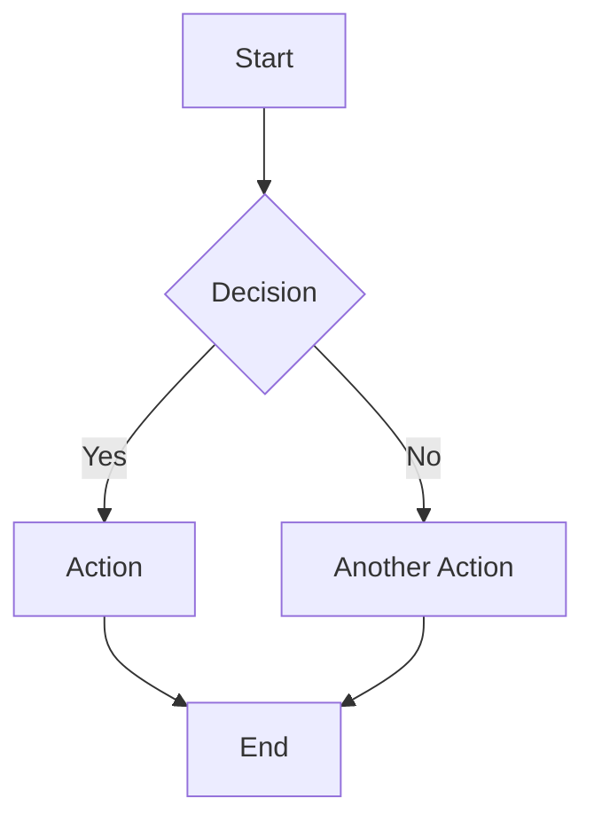

<!--
SPDX-FileCopyrightText: 2025 Deutsche Telekom AG

SPDX-License-Identifier: CC0-1.0
-->

<p align="center">
  <h1 align="center">Docusaurus Documentation</h1>
  Technical Docusaurus Documentation. Visit <a href="https://telekom.github.io/controlplane/">https://telekom.github.io/controlplane/</a> to view the contents.
</p>

<p align="center">
  <a href="#about">About</a> •
  <a href="#project-overview">Project Overview</a> •
  <a href="#features">Features</a> •
  <a href="#content-guidelines">Content Guidelines</a> •
  <a href="#documentation-structure">Documentation Structure</a> •
  <a href="#installation">Installation</a> •
  <a href="#usage-guide">Usage Guide</a>
</p>

## About

This directory contains the technical documentation for the Open Telekom Integration Platform's ControlPlane documentation platform.

> ![IMPORTANT]
> Visit [https://telekom.github.io/controlplane/](https://telekom.github.io/controlplane/) to view the actual content, as this documentation is for maintainers and contributors.

## Project Overview

This project creates comprehensive technical documentation for the Open Telekom Integration Platform's controlplane, using a hybrid approach that combines:

1. **Slidev Presentation**: A concise, visually engaging technical presentation suitable for meetings and knowledge sharing sessions
2. **Docusaurus Documentation**: Detailed technical documentation covering all aspects of the controlplane architecture and technology stack

The documentation provides a high-level overview of the platform architecture, concepts, and usage patterns.

> ![IMPORTANT]
> Domain-specific technical details remain in each domain's README.md file.
> The Docusaurus documentation focuses on general concepts, architecture overview, and cross-domain workflows.

## Features

### Slidev Presentation

- Interactive, browser-based presentation
- Code syntax highlighting for Go code examples
- Two-column layouts for code demonstrations
- Visual diagrams of architecture and components
- Presenter mode with notes and previews
- Exportable to PDF for offline sharing


Visit [https://sli.dev/](https://sli.dev/) to learn more about Slidev.

### Docusaurus Documentation

- Comprehensive technical documentation
- Organized by technology/framework
- Interactive code examples
- Mermaid.js diagram integration
- Full-text search capabilities
- Mobile-responsive design
- Dark/light mode support
- Support for Mermaid diagrams [Mermaid documentation](https://mermaid.js.org/)

Visit [https://docusaurus.io/](https://docusaurus.io/) to learn more about Docusaurus.

## Content Guidelines

### What Goes in Docusaurus?

Docusaurus should contain high-level information as well as any shared information between domains.
It is targeted for developers, operators and end-users of the controlplane.

- **Architecture Overview**: High-level system architecture and component interactions
- **Concepts**: Core concepts like Rovers, Zones, Environments, Teams
- **Getting Started**: Installation guides, quick start tutorials
- **Workflows**: Cross-domain workflows (e.g., API lifecycle from Rover to Gateway)
- **Best Practices**: Platform-wide best practices and patterns
- **Conventions**: Coding conventions shared between domains

### What Goes in Domain READMEs?

Generally speaking, the domain READMEs is for developers on an isolated domain level! It could contain the following:

- **API References**: Domain-specific API details
- **Implementation Details**: Internal architecture
- **Code Examples**: Domain-specific code integration examples
- **Technical Configuration**: Detailed configuration options


## Documentation Structure

- **Docusaurus (`pages/`)**: General platform overview, architecture, concepts, and getting started guides
- **Slidev (`presentation/`)**: Technical presentations for meetings and conferences
- **Domain READMEs**: Detailed technical documentation for each domain (API, Gateway, Identity, etc.)

### Project Structure

```
docs/
├── README.md              # This comprehensive documentation
├── package.json           # Root dependencies and scripts
├── presentation/          # Slidev presentation
│   ├── package.json       # Presentation dependencies
│   ├── slides.md          # Presentation content
│   ├── style.css          # Custom styling
│   └── public/
│       └── images/        # Presentation images
└── pages/                 # Docusaurus documentation
    ├── package.json       # Documentation dependencies
    ├── docusaurus.config.js # Docusaurus configuration
    ├── sidebars.js        # Navigation structure
    ├── docs/              # Documentation content
    │   ├── intro.md       # Introduction page
    │   ├── core-tech/     # Core technologies
    │   ├── web-frameworks/ # Web frameworks
    │   ├── storage/       # Storage implementation
    │   ├── testing/       # Testing frameworks
    │   ├── auth/          # Authentication
    │   ├── infrastructure/ # Deployment infrastructure
    │   └── monitoring/    # Logging and metrics
    ├── src/
    │   └── css/           # Custom CSS
    └── static/
        └── img/           # Documentation images
```

## Installation

### Prerequisites

Before you begin, ensure you have the following installed:

- **Node.js** (v20.0.0 or higher)
- **npm** (v9.0.0 or higher)


### Initial Setup

1. Navigate to the docs directory:

```bash
cd docs
```

2. Install dependencies:

```bash
npm install
```

3. Start the development server:

```bash
npm run pages:dev
```

## Usage Guide

### Using the Slidev Presentation

Slides are stored in `presentation/slides.md` as Markdown files.

Each slide follows this format:

```markdown
---
layout: default
---

# Slide Title

Slide content goes here

- Bullet points
- More points
```

For more information, see the [Slidev documentation](https://slidev.org/).

### Using the Docusaurus Documentation

Documentation content is stored in `pages/docs/` as Markdown files:

1. Find the appropriate file in the directory structure
2. Edit the Markdown content
3. The documentation will update in real-time if you're running the development server

For more information, see the [Docusaurus documentation](https://docusaurus.io/).

#### Adding New Pages to Docusaurus

1. Create a new Markdown file in the appropriate section directory:

```markdown
---
sidebar_position: 1
title: Your Page Title
---

# Page Title

Content goes here
```

2. Update `pages/sidebars.js` if needed to include the new page in navigation:

```js
module.exports = {
  tutorialSidebar: [
    'intro',
    {
      type: 'category',
      label: 'Your Category',
      items: ['your-category/your-new-page', 'your-category/another-page'],
    },
    // ...
  ],
};
```

#### Adding Diagrams

Docusaurus supports Mermaid diagrams out of the box.

Here is an easy example:

````markdown

````

> ![NOTE]
> For more information, see the [Mermaid documentation](https://mermaid.js.org/).

### Customization

#### Updating the Docusaurus Navigation

Edit `pages/docusaurus.config.js` to update the navbar:

```js
navbar: {
  title: 'Controlplane',
  items: [
    // Add or modify items here
    {
      type: 'docSidebar',
      sidebarId: 'tutorialSidebar',
      position: 'left',
      label: 'Documentation',
    },
    {
      href: '/presentation',
      label: 'Presentation',
      position: 'left',
    },
  ]
}
```