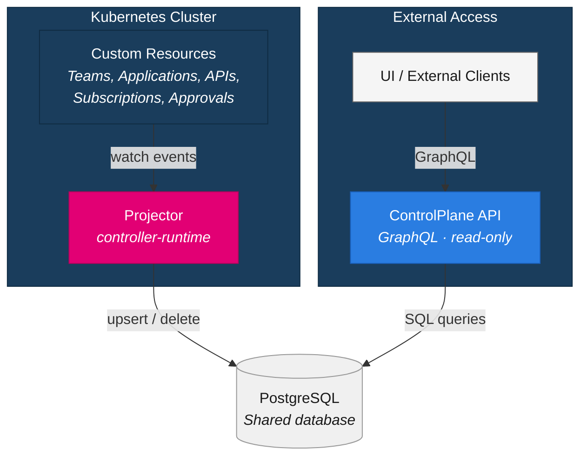
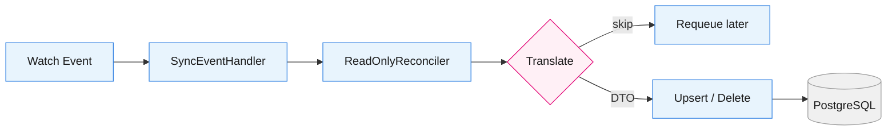
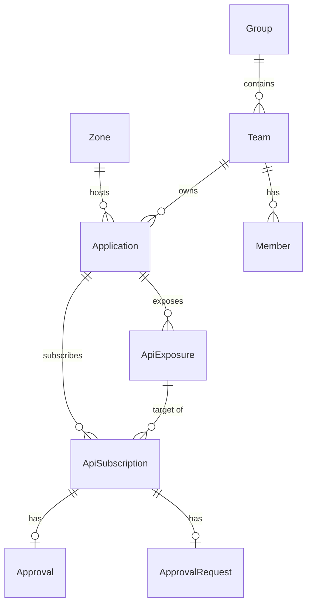

# ControlPlane API & Projector

The ControlPlane API and Projector together form the **UI Layer** of the Control Plane — an external, read-only access layer that makes the platform state available to clients outside of Kubernetes. They implement a **CQRS (Command Query Responsibility Segregation)** pattern: the Projector handles the *write side* of the read model by syncing Kubernetes resources into PostgreSQL, while the ControlPlane API handles the *read side* by serving that data through a GraphQL interface.

## Architecture

**Why this pattern?**

Kubernetes custom resources are the source of truth for the Control Plane. However, the Kubernetes API is not designed for the kind of queries a UI needs — filtered lists, paginated results, cross-resource joins, and team-scoped access. By projecting the relevant state into a relational database, the ControlPlane API can serve these queries efficiently without putting load on the Kubernetes API server.

## The Projector

The Projector is a Kubernetes controller built on [controller-runtime](https://github.com/kubernetes-sigs/controller-runtime). Unlike the domain operators, it is strictly **read-only** — it watches custom resources and writes their state to PostgreSQL, but never modifies anything in the cluster.

### Watched Resources

The Projector watches resources from the following domains:

| Domain | Resources | Description |
| ------ | --------- | ----------- |
| [Admin](./admin.mdx) | Zone | Deployment targets with gateway and IDP configuration |
| [Organization](./organization.mdx) | Group, Team | Organizational structure and team membership |
| [Application](./application.mdx) | Application | Applications with their identity and zone assignments |
| [API](./api.mdx) | ApiExposure, ApiSubscription | Exposed APIs and their subscriptions |
| [Approval](./approval.mdx) | Approval, ApprovalRequest | Approval workflows and pending requests |

### Processing Pipeline

Every watched resource follows the same processing pipeline, implemented using Go generics:

1. **Watch Event** — Kubernetes notifies the Projector of a create, update, or delete
2. **SyncEventHandler** — On delete events, the handler caches the last-known object so the Projector can derive its identity even after the resource is gone
3. **ReadOnlyReconciler** — Fetches the live resource from the cluster (or retrieves it from the delete cache)
4. **Translate** — Maps the Kubernetes resource to a domain-specific data transfer object (DTO). Resources that are incomplete or irrelevant are skipped
5. **Upsert / Delete** — Persists or removes the record in PostgreSQL, resolving foreign-key references to parent resources

### Dependency Resolution

Resources in the database form a hierarchy — an Application references a Team and a Zone, an ApiExposure references an Application, and so on. When the Projector processes a resource whose parent has not been synced yet, it returns a *dependency missing* error and retries after a short delay (configurable via `DEPENDENCY_DELAY`).

To avoid repeated database lookups for foreign keys, the Projector uses a high-performance in-memory cache (based on [Ristretto](https://github.com/dgraph-io/ristretto)) combined with request deduplication. This means concurrent reconciliations for resources with the same parent only trigger a single database query.

### Schema Migration

The Projector manages the database schema automatically. On startup, it runs a migration that creates or updates all tables, indexes, and constraints. This means you do not need to run manual migration scripts — just deploy the new version and the schema adapts.

## The ControlPlane API

The ControlPlane API is a **read-only GraphQL server** that serves the data projected into PostgreSQL. It is built with [gqlgen](https://gqlgen.com/) and uses the [ent](https://entgo.io/) ORM for type-safe database access.

### Data Model

The API exposes the following entities and their relationships:

Each entity carries common fields such as `id`, `createdAt`, `lastModifiedAt`, `statusPhase` (Ready, Pending, Error, or Unknown), `statusMessage`, `environment`, and `namespace`.

### GraphQL Queries

All top-level queries support **cursor-based pagination** (Relay-style), **filtering**, and **ordering**:

- `teams` — List teams with their applications and group membership
- `applications` — List applications with their zone, exposures, and subscriptions
- `apiExposures` — List exposed APIs with visibility, upstreams, and approval configuration
- `apiSubscriptions` — List subscriptions with their target exposure and approval state
- `approvals` / `approvalRequests` — List approval workflows and pending requests
- `zones` — List all available zones (no pagination, visible to all users)
- `node(id)` / `nodes(ids)` — Relay-compatible node lookups for any entity

### Team Isolation

The ControlPlane API enforces strict team-level isolation through a **privacy layer** built into the ORM. Every database query is automatically filtered based on the authenticated caller's identity:

| Caller Type | What They Can See |
| ----------- | ----------------- |
| **Team** | Only resources belonging to their own team |
| **Group** | Resources belonging to any team within their group |
| **Admin** | All resources, unrestricted |

This filtering is applied transparently — the GraphQL schema is the same for all callers, but the results are scoped automatically. No additional configuration is needed.

For approvals and approval requests, the isolation uses an **OR** rule: a resource is visible if the caller's team is *either* the subscriber's team *or* the exposure owner's team. This allows both sides of an approval to see the workflow.

#### Cross-Tenant Safety

When navigating relationships that cross team boundaries (for example, from a subscription to the target exposure owned by another team), the API returns **reduced types** (`TeamInfo`, `ApiExposureInfo`, `ApiSubscriptionInfo`) that expose only safe, non-sensitive fields. This prevents data leakage through graph traversal.

### Authentication

When security is enabled, the API expects a **JWT bearer token** in the `Authorization` header. The token's issuer must match one of the configured `trustedIssuers`. The API extracts the caller's identity (team, group, or admin role) from the JWT claims and uses it for team isolation.

When security is disabled (local development only), the API grants admin-level access to all queries.

## Domain Interactions

- **All domain operators** — The Projector reads custom resources managed by Admin, Organization, Application, API, and Approval operators. It depends on these operators to create and reconcile the source resources.
- **Identity domain** — The ControlPlane API relies on JWT tokens issued by the identity provider configured in the platform. The token claims determine the caller's team and access scope.

## Related Pages

- [Admin Journey: ControlPlane API & Projector](../admin-journey/controlplane-api.md) — Setup, configuration, and operational guidance
- [Architecture Overview](./overview.md) — How all domains fit together
- [Components](../overview/components.md) — Full list of platform services and libraries
