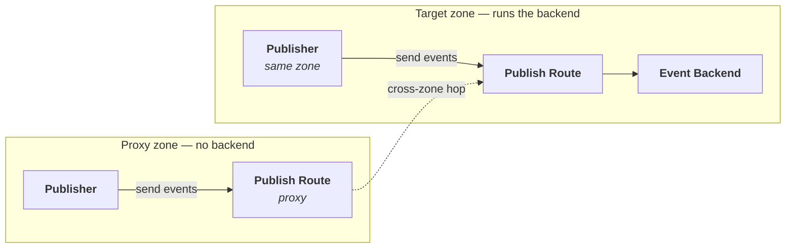
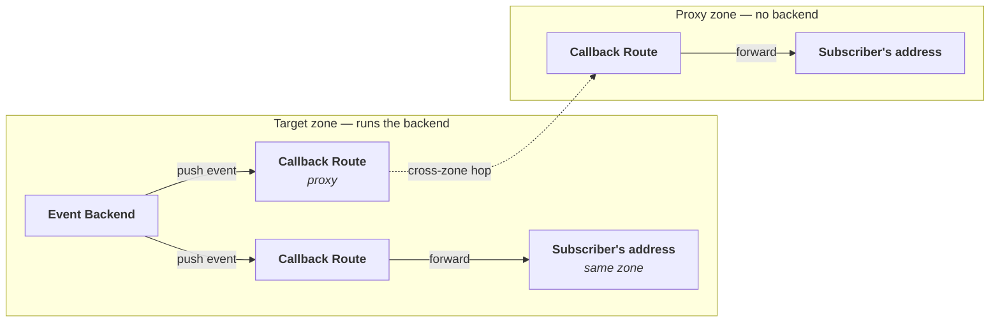
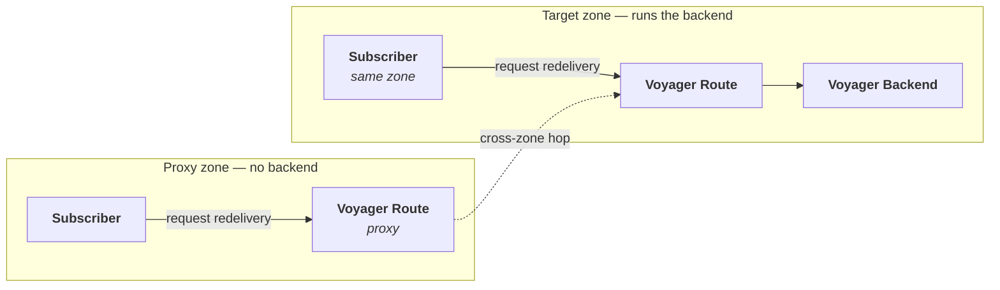
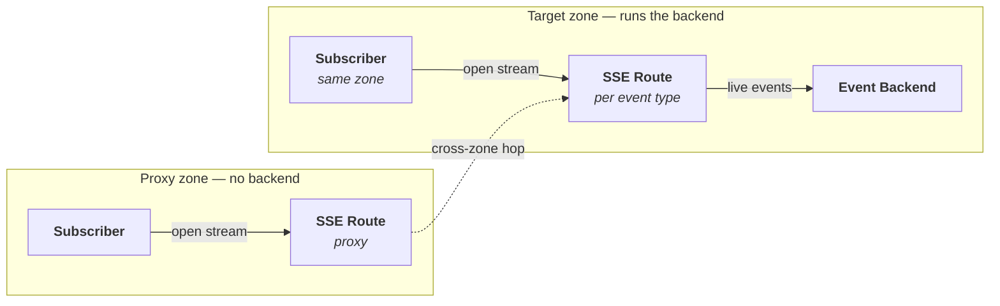

# Event Domain

:::info Optional Feature
The Event domain is an optional feature that must be explicitly enabled by a platform administrator through an EventConfig resource.
:::

The Event domain handles event publishing and subscribing within the Control Plane. It serves as the business-logic layer between the **Rover** domain (user configuration) and the **PubSub** domain (runtime configuration). Its core responsibilities include managing event types, handling approval for event subscriptions, and orchestrating cross-zone event meshing.

## Custom Resources

<CRDReference domain="event" />

## Cross-Zone Meshing

When event publishers and subscribers are in different zones, the Event domain automatically creates **proxy routes** to deliver events across zone boundaries. This enables:

- Events published in one cloud environment to be consumed in another
- SSE streams to be proxied across zones
- Callback deliveries to reach subscribers in remote zones

The mesh topology is configured through the EventConfig resource. With `fullMesh: true`, every zone can communicate with every other zone. Alternatively, you can list specific zone names for selective meshing.

## Event Routes

Events flow between three parties: the services that **send** them, the services that **receive** them, and the **event backend** (Horizon) that stores and distributes them. To carry that traffic, the Event domain wires up gateway routes. A route is simply an address on the gateway that accepts traffic and forwards it to the right place, so no participant ever needs to know where the backend actually lives.

There are four kinds of route. Three of them handle the everyday flow of events and are created **once per zone**, the moment the event feature is switched on in that zone. The fourth carries live streams and is created **once per event type**, when a provider exposes an event.

| Route | Created | Called by | What it does |
|-------|---------|-----------|--------------|
| **Publish** | Per zone | Event publishers | Accepts events that a service wants to send into the platform. |
| **Callback** | Per zone | The event backend (Horizon) | Delivers events to subscribers that asked to be *called back* at their own address. |
| **Voyager** | Per zone | Subscribers | Lets a subscriber ask for past events to be re-sent (redelivery). |
| **SSE** | Per event type | Subscribers | Streams events live to subscribers that asked for a continuous *server-sent events* connection. |

### Local routes and proxy routes

Every route comes in two flavours, and which one is used depends only on whether the two parties share a zone:

- **Local route** — when the sender and receiver are in the **same zone**, a single local route connects them directly.
- **Proxy route** — when they are in **different zones**, the platform adds a proxy route in the caller's own zone that quietly forwards the traffic across the zone boundary.

The proxy route is what makes [proxy zones](../admin-journey/environments-and-zones.md#proxy-zones) work: a zone that runs no backend of its own still exposes a full set of local addresses, and every one of them forwards to the target zone behind the scenes. Either way, each participant only ever talks to a gateway in its own zone, and the cross-zone hop stays invisible.

The external addresses that result from all of this are published on the `EventConfig` status — for example `publishUrl`, `callbackUrl`, and `voyagerUrl` for the local routes, and the `proxyCallbackUrls` / `proxyVoyagerUrls` maps (keyed by zone name) for the cross-zone proxy routes.

### Publish Route

The publish route is the front door for sending events. A publishing service simply posts its events to this address and is done — it never needs to know where the event backend actually lives.

When the publisher sits in the same zone as the event backend, the local publish route hands the events straight to the backend. When the publisher sits in a *proxy* zone that runs no backend of its own, the publish route there forwards the events to the target zone, whose own publish route then delivers them to the backend. Either way, the publisher uses the exact same kind of address.

### Callback Route

Some subscribers prefer to be *called back*: instead of fetching events, they give the platform an address of their own and let each event be pushed there. The callback route makes this happen. The event backend sends every event to the callback route, which reads the subscriber's real address (carried along with the request) and forwards the event to it.

When subscriber and backend share a zone, the local callback route forwards straight to the subscriber's address. When they are in different zones, the backend's zone forwards the event through a callback proxy route to the subscriber's zone, whose callback route then makes the final hand-off to the subscriber's address.

### Voyager Route

The Voyager route lets a subscriber ask for events to be re-sent — for example, to catch up on anything missed. The subscriber calls the Voyager route, which reaches the Voyager backend that replays the events.

In the same zone, the subscriber's request goes straight to the Voyager backend. Across zones, the subscriber calls the Voyager route in its own zone, which forwards the request to the provider zone where the backend lives. A subscriber sitting in a proxy zone always uses a simple local address; the forwarding to the target zone happens behind the scenes.

### SSE Route

Subscribers that want a live feed open a *server-sent events* (SSE) connection and receive events as they happen. Unlike the other three routes, an SSE route is created **for each event type**, because each stream carries one specific kind of event.

When the subscriber and the event backend share a zone, the SSE route connects the subscriber's stream directly to the backend. When they are in different zones, the subscriber opens the stream against its own zone, which forwards the connection to the provider zone where the events originate.

## Domain Interactions

The Event domain has the broadest cross-domain interaction surface in the platform:

- **Rover domain** — Rover files create EventExposure and EventSubscription resources.
- **PubSub domain** — The Event domain creates EventStore, Publisher, and Subscriber resources.
- **Gateway domain** — Creates routes for publishing, SSE delivery, and cross-zone proxy communication.
- **Identity domain** — Creates clients for OAuth2 token exchange between zones.
- **Application domain** — Reads Application resources for publisher and subscriber metadata.
- **Approval domain** — Creates Approval and ApprovalRequest resources for event subscriptions.
- **Admin domain** — Watches Zone resources for configuration changes.

## Related Pages

- [User Journey: Exposing Events](../user-journey/exposing-events.mdx)
- [User Journey: Subscribing to Events](../user-journey/subscribing-to-events.mdx)
- [Architecture: PubSub Domain](./pubsub.mdx)
