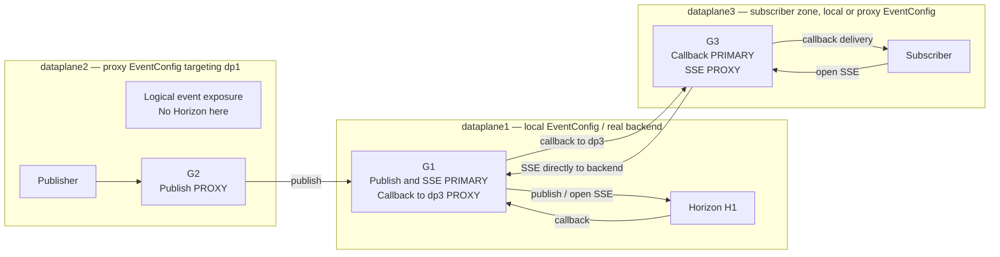
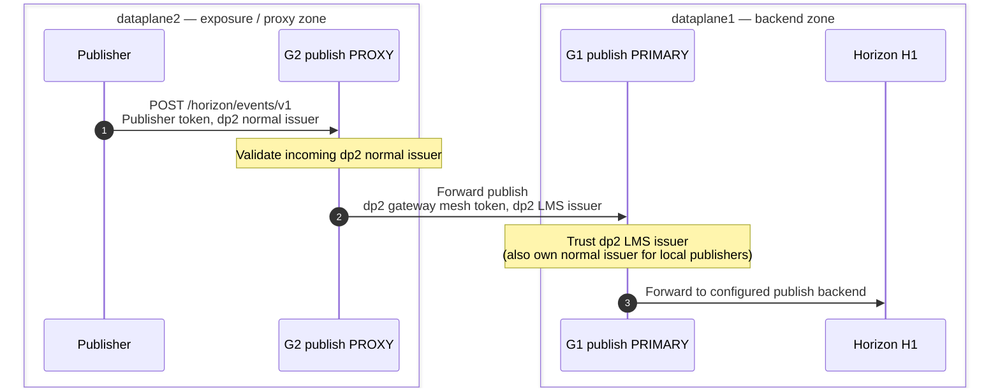
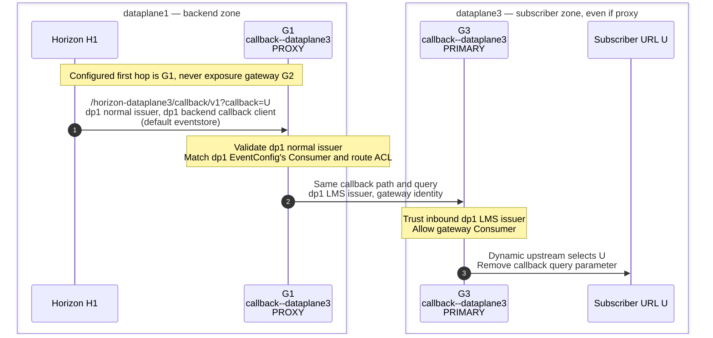
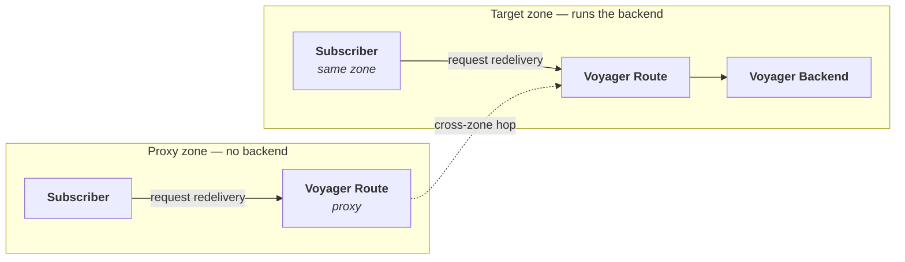
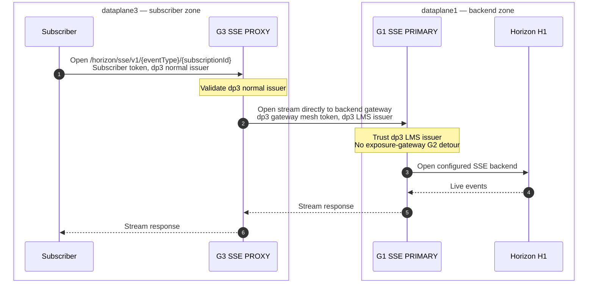

# Event Domain

:::info Optional Feature
The Event domain is an optional feature that must be explicitly enabled by a platform administrator through an EventConfig resource.
:::

The Event domain handles event publishing and subscribing within the Control Plane. It serves as the business-logic layer between the **Rover** domain (user configuration) and the **PubSub** domain (runtime configuration). Its core responsibilities include managing event types, handling approval for event subscriptions, and orchestrating cross-zone event meshing.

## Custom Resources

<CRDReference domain="event" />

## Cross-Zone Meshing

When event publishers and subscribers are in different zones, the Event domain automatically creates **proxy routes** to deliver events across zone boundaries. This enables:

- Events published in one cloud environment to be consumed in another
- SSE streams to be proxied across zones
- Callback deliveries to reach subscribers in remote zones

The mesh topology is configured through the EventConfig resource. With `fullMesh: true`, every zone can communicate with every other zone. Alternatively, you can list specific zone names for selective meshing.

## Event Routes

Events flow between three parties: the services that **send** them, the services that **receive** them, and the **event backend** (Horizon) that stores and distributes them. To carry that traffic, the Event domain wires up gateway routes. A route is simply an address on the gateway that accepts traffic and forwards it to the right place, so no participant ever needs to know where the backend actually lives.

There are four kinds of route. EventConfig creates the zone-level publish and callback routes, plus Voyager routes when that backend is configured. Meshing adds the needed forwarding routes. SSE routes are created **per event type**, with a primary at the backend and proxies for subscriber access.

| Route | Created | Called by | What it does |
|-------|---------|-----------|--------------|
| **Publish** | Per zone | Event publishers | Accepts events that a service wants to send into the platform. |
| **Callback** | Per zone | The event backend (Horizon) | Delivers events to subscribers that asked to be *called back* at their own address. |
| **Voyager** | Per zone | Subscribers | Lets a subscriber ask for past events to be re-sent (redelivery). |
| **SSE** | Per event type | Subscribers | Streams events live to subscribers that asked for a continuous *server-sent events* connection. |

### Primary routes and proxy routes

Two different settings use the word *proxy*:

- **EventConfig `local` or `proxy`** selects where the event backend runs. A proxy EventConfig uses a local (non-proxy) target zone's Horizon instead of running its own.
- **Route `PRIMARY` or `PROXY`** describes one forwarding step. A primary route reaches the backend or the final subscriber address; a proxy route forwards to another zone's gateway.

A proxy EventConfig therefore still owns a **primary callback route** for delivery to subscribers in its zone. Conversely, a local EventConfig owns **proxy callback routes** for delivery to other zones. Sharing the logical exposure zone does not guarantee that traffic stays in one zone: Horizon may run elsewhere.

External addresses are published on `EventConfig` status. Publish and Voyager URLs describe their routes; callback URLs describe **effective ingress** from Horizon. For a proxy zone, `callbackUrl` and `proxyCallbackUrls` therefore point to routes in its backend zone. Its `callbackRoute` references its own primary route for final subscriber delivery; `proxyCallbackRoutes` is empty. Only local backend EventConfigs own outbound callback routes.

### Event-proxy scenario

The following diagrams use one example throughout:

- **dataplane2 (dp2)** owns the logical event exposure. Its proxy EventConfig targets **dataplane1 (dp1)**.
- **dp1** runs Horizon and the primary publish and SSE routes for this event.
- **dataplane3 (dp3)** contains the subscriber. It may itself have a proxy EventConfig; that does not move callback delivery out of dp3 or add a detour through its backend.

`G1`, `G2`, and `G3` mean the gateways in those zones; `H1` means Horizon in dp1. The overview shows traffic direction, not resource ownership. SSE arrows show connection initiation; events return on that connection.

```mermaid
flowchart LR
    subgraph DP2["dataplane2 — proxy EventConfig targeting dp1"]
        E2["Logical event exposure<br/>No Horizon here"]
        P2["Publisher"] --> G2["G2<br/>Publish PROXY"]
    end
    subgraph DP1["dataplane1 — local EventConfig / real backend"]
        G1["G1<br/>Publish and SSE PRIMARY<br/>Callback to dp3 PROXY"]
        H1["Horizon H1"]
        G1 -->|"publish / open SSE"| H1
        H1 -->|"callback"| G1
    end
    subgraph DP3["dataplane3 — subscriber zone, local or proxy EventConfig"]
        G3["G3<br/>Callback PRIMARY<br/>SSE PROXY"]
        S3["Subscriber"]
        G3 -->|"callback delivery"| S3
        S3 -->|"open SSE"| G3
    end
    G2 -->|"publish"| G1
    G1 -->|"callback to dp3"| G3
    G3 -->|"SSE directly to backend"| G1
```

**Neither callbacks to dp3 nor dp3's SSE connection pass through G2.** The exposure determines which backend holds the event, not an intermediate gateway for every delivery.

:::note Token contract, not a live traffic trace
The sequences below describe the intended token contract reflected in the generated Routes, trusted issuers, Consumers, and gateway/Jumper configuration. **Normal issuer** means the zone's `status.links.gatewayIssuer` (`Links.Issuer` in code); **LMS issuer** means `status.links.gatewayLmsIssuer` (`Links.LmsIssuer`) for Last-Mile Security, including any `/spacegate` prefix. Route and controller tests check configuration, not live Jumper token exchange. Actual token issuance and forwarding must be verified in the deployed runtime; these diagrams are not evidence of an end-to-end test.
:::

An issuer setting validates the **incoming hop**. It is not selected merely because the receiving route is `PROXY`: G2's publish proxy and G3's SSE proxy accept normal local tokens, while the receiving primary in G1 trusts the sending gateway's LMS issuer.

### Publish Route

The publish route is the front door for sending events. A publishing service simply posts its events to this address and is done — it never needs to know where the event backend actually lives.

When the publisher sits in the same zone as the event backend, the local publish route hands the events straight to the backend. When the publisher sits in a *proxy* zone that runs no backend of its own, the publish route there forwards the events to the target zone, whose own publish route then delivers them to the backend. Either way, the publisher uses the exact same kind of address.

The Route resource is named `publish`; its public paths are **`/horizon/events/v1`** and the alias **`/horizon/publish/v1`**, not `/publish`. Gateway preset base paths may prefix these paths. The proxy forwards to the backend gateway's `/horizon/events/v1` path.

```mermaid
sequenceDiagram
    autonumber
    box dataplane2 — exposure / proxy zone
        participant P as Publisher
        participant G2 as G2 publish PROXY
    end
    box dataplane1 — backend zone
        participant G1 as G1 publish PRIMARY
        participant H1 as Horizon H1
    end
    P->>G2: POST /horizon/events/v1<br/>Publisher token, dp2 normal issuer
    Note over G2: Validate incoming dp2 normal issuer
    G2->>G1: Forward publish<br/>dp2 gateway mesh token, dp2 LMS issuer
    Note over G1: Trust dp2 LMS issuer<br/>(also own normal issuer for local publishers)
    G1->>H1: Forward to configured publish backend
```

### Callback Route

Some subscribers prefer to be *called back*: instead of fetching events, they give the platform an address of their own and let each event be pushed there. The callback route makes this happen. The event backend sends every event to the callback route, which reads the subscriber's real address (carried along with the request) and forwards the event to it.

Callback delivery starts in the **backend zone**, where Horizon runs. In this example, Horizon is configured with `https://dataplane1-gateway/horizon-dataplane3/callback/v1?callback=U`, where `U` represents the subscriber's URL. The hostname is illustrative; the actual address comes from the gateway preset. **Backend-local callback ingress means that gateway's advertised URL, not loopback or `localhost`.**

```mermaid
sequenceDiagram
    autonumber
    box dataplane1 — backend zone
        participant H1 as Horizon H1
        participant G1 as G1<br/>callback--dataplane3<br/>PROXY
    end
    box dataplane3 — subscriber zone, even if proxy
        participant G3 as G3<br/>callback--dataplane3<br/>PRIMARY
        participant S as Subscriber URL U
    end
    Note over H1,G1: Configured first hop is G1, never exposure gateway G2
    H1->>G1: /horizon-dataplane3/callback/v1?callback=U<br/>dp1 normal issuer, dp1 backend callback client<br/>(default eventstore)
    Note over G1: Validate dp1 normal issuer<br/>Match dp1 EventConfig's Consumer and route ACL
    G1->>G3: Same callback path and query<br/>dp1 LMS issuer, gateway identity
    Note over G3: Trust inbound dp1 LMS issuer<br/>Allow gateway Consumer
    G3->>S: Dynamic upstream selects U<br/>Remove callback query parameter
```

G1's outbound route is `PROXY` but accepts Horizon's **normal dp1 issuer**, not dp1's LMS issuer. The required callback client ID comes from the **dp1 backend EventConfig**, not dp2's proxy configuration. G3's primary callback route trusts its **own normal issuer plus inbound peers' LMS issuers**. Its allowed consumers include its own EventConfig's callback client for local callbacks and, when there are inbound peers, `gateway`. The G1 → G3 hop uses **`gateway`**, not a callback client ID. Inbound trust follows **dp1's outbound mesh permission to reach dp3**; a reverse dp3 → dp1 callback mesh is not required.

The subscriber's location changes the route, not the backend:

| Subscriber zone | Callback path from H1 | First URL advertised by dp2's EventConfig |
|---|---|---|
| **dp3**, local or proxy | H1 → G1 target-dp3 `PROXY` → G3 `PRIMARY` → subscriber | `proxyCallbackUrls[dataplane3]`: G1 `/horizon-dataplane3/callback/v1` |
| **dp2**, same logical zone as exposure | H1 → G1 target-dp2 `PROXY` → G2 `PRIMARY` → subscriber | `callbackUrl`: G1 `/horizon-dataplane2/callback/v1` |
| **dp1**, same zone as backend | H1 → G1 `PRIMARY` → subscriber | `proxyCallbackUrls[dataplane1]`: G1 `/horizon-dataplane1/callback/v1` |

#### Callback status and ownership

The proxy EventConfig **projects** (copies and filters) effective ingress URLs from its ready local backend. Remote subscriber zones must be allowed by the exposure's logical mesh; any cross-zone callback hop must also be allowed by the backend's mesh and have a usable URL. Same-logical-zone delivery to dp2 still needs the backend's outbound permission to dp2. Delivery within dp1 needs no outbound backend hop.

The proxy's `callbackRoute` tracks its owned primary in dp2, not the first hop advertised to Horizon. Its `proxyCallbackRoutes` is empty: proxy zones create **no outbound callback routes**. Previously owned outbound callback routes are removed by the janitor after all children are ready; cleanup is deferred while children are unready or reconciliation fails. Missing backend endpoints are not replaced with proxy-zone or reverse routes. The subscriber needs a ready EventConfig and an owned primary callback route, even when its own advertised callback URL points elsewhere.

Backend URL or mesh changes requeue the proxy configuration and affected subscriptions. The exposure copies the effective same-zone callback URL for discovery; remote URL-map changes can update subscriptions without changing that scalar. Changes to a subscriber's configuration also requeue callbacks and SSE subscriptions.

If the exposure's logical mesh explicitly disallows a callback subscriber zone, reconciliation deletes the subscription's owned PubSub Subscriber to deregister delivery. Temporary backend or EventConfig unavailability does not trigger that deletion. Restoring mesh permission allows provisioning again, subject to readiness and approval.

#### Managed callback identity

Every local or proxy EventConfig manages an identity Client **and a gateway Consumer** in its zone. Its effective `spec.mesh.client.clientId` (default **`eventstore`**) aligns that Client's client ID, that Consumer's `spec.name`, and the allow-list (ACL) on **its own** primary callback route and, for local backends only, outbound callback routes. Projecting a backend callback URL does not transfer those identities or ACLs. Kubernetes resource names are normalized; Kong uses the Consumer's `spec.name` as its username and custom ID, matching the callback token's `azp` claim.

The Consumer references the zone gateway and is owned by the EventConfig. Its readiness participates in reconciliation, changes are watched, and ownership controls cleanup. Horizon must use the **real backend EventConfig's callback client ID** with the backend's normal issuer, because that EventConfig owns the advertised first-hop route and ACL. If backend and proxy client IDs differ, the proxy ID cannot authenticate at that entry. The subsequent cross-zone hop uses **`gateway`** with the backend's LMS issuer, including when the subscriber is in the proxy zone itself.

### Voyager Route

The Voyager route lets a subscriber ask for events to be re-sent — for example, to catch up on anything missed. The subscriber calls the Voyager route, which reaches the Voyager backend that replays the events.

In the same zone, the subscriber's request goes straight to the Voyager backend. Across zones, the subscriber calls the Voyager route in its own zone, which forwards the request to the provider zone where the backend lives. A subscriber sitting in a proxy zone always uses a simple local address; the forwarding to the target zone happens behind the scenes.

```mermaid
graph LR
    subgraph PZ["Proxy zone — no backend"]
        U2["<b>Subscriber</b>"] -->|"request redelivery"| VR2["<b>Voyager Route</b><br/><i>proxy</i>"]
    end

    subgraph TZ["Target zone — runs the backend"]
        U1["<b>Subscriber</b><br/><i>same zone</i>"] -->|"request redelivery"| VR1["<b>Voyager Route</b>"]
        VR1 --> V["<b>Voyager Backend</b>"]
    end

    VR2 -.->|"cross-zone hop"| VR1
```

### SSE Route

Subscribers that want a live feed open a *server-sent events* (SSE) connection and receive events as they happen. Unlike the other three routes, an SSE route is created **for each event type**, because each stream carries one specific kind of event.

The **subscriber initiates** the connection to its own gateway. For this exposure, dp3's SSE proxy targets dp1's primary directly, not the exposure proxy dp2. This remains true if dp3 itself has a proxy EventConfig: the destination is the backend of the **subscribed event**, not dp3's own backend target. Both callback and SSE subscriptions require a ready subscriber EventConfig.

```mermaid
sequenceDiagram
    autonumber
    box dataplane3 — subscriber zone
        participant S as Subscriber
        participant G3 as G3 SSE PROXY
    end
    box dataplane1 — backend zone
        participant G1 as G1 SSE PRIMARY
        participant H1 as Horizon H1
    end
    S->>G3: Open /horizon/sse/v1/{eventType}/{subscriptionId}<br/>Subscriber token, dp3 normal issuer
    Note over G3: Validate dp3 normal issuer
    G3->>G1: Open stream directly to backend gateway<br/>dp3 gateway mesh token, dp3 LMS issuer
    Note over G1: Trust dp3 LMS issuer<br/>No exposure-gateway G2 detour
    G1->>H1: Open configured SSE backend
    H1-->>G1: Live events
    G1-->>G3: Stream response
    G3-->>S: Stream response
```

Subscribers in **dp2** similarly use G2's own-zone SSE `PROXY` → G1 `PRIMARY` → H1, with normal dp2 issuer on entry and dp2 LMS issuer at G1. Subscribers in **dp1** use G1's primary directly with their normal dp1 token. The primary's trusted issuers include dp1's normal issuer and the LMS issuers of the zones with SSE proxies for this event. Publish and SSE routes disable per-consumer ACL checks, but still configure issuer validation; callback routes additionally enforce their consumer allow-list.

## Domain Interactions

The Event domain has the broadest cross-domain interaction surface in the platform:

- **Rover domain** — Rover files create EventExposure and EventSubscription resources.
- **PubSub domain** — The Event domain creates EventStore, Publisher, and Subscriber resources.
- **Gateway domain** — Creates routes for publishing, SSE delivery, and cross-zone proxy communication, plus the managed callback Consumer.
- **Identity domain** — Creates clients for OAuth2 token exchange between zones.
- **Application domain** — Reads Application resources for publisher and subscriber metadata.
- **Approval domain** — Creates Approval and ApprovalRequest resources for event subscriptions.
- **Admin domain** — Watches Zone resources for configuration changes.

## Related Pages

- [User Journey: Exposing Events](../user-journey/exposing-events.mdx)
- [User Journey: Subscribing to Events](../user-journey/subscribing-to-events.mdx)
- [Architecture: PubSub Domain](./pubsub.mdx)
