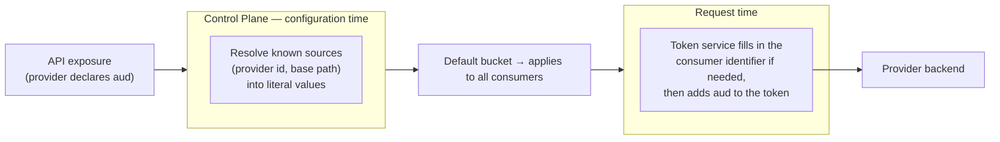
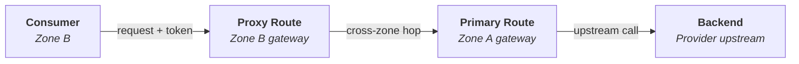
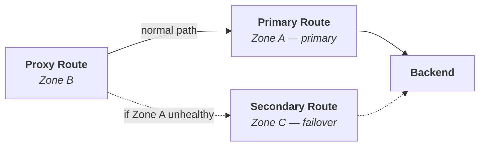

# Gateway Domain

The Gateway domain configures the API Gateway at runtime. It manages routes, consumers, and their access relationships. While the architecture is designed to be gateway-agnostic, the current implementation uses Kong as the underlying gateway technology.

## Custom Resources

<CRDReference domain="gateway" />

## Feature Architecture

The Gateway operator uses a plugin-based feature system for configuring route behavior. Each feature is implemented as a separate plugin that can be enabled or disabled per route, allowing fine-grained control over how requests are processed.

### Audience Claim Resolution

An API provider can require that every token reaching its backend carries an **audience claim** (`aud`), so the backend can confirm the token was meant for it. The provider declares this once on the API exposure, and the platform makes sure the claim is present on all traffic to that API.

The interesting part is *who* decides the actual value. Some sources are known when the API is configured, while one can only be known at the moment of each request. The Control Plane resolves as much as possible up front and leaves the rest to the request-time token service.

| Source | Known at configuration time? | Resolved by | Result |
| ------ | ---------------------------- | ----------- | ------ |
| Fixed value | Yes | The user | The literal value is used as-is. |
| Provider identifier | Yes — always the exposing application | Control Plane | Filled in as a literal value. |
| Base path | Yes | Control Plane | Filled in as a literal value. |
| Consumer identifier | No — differs for every consumer | Request-time token service | Left as a symbolic reference and filled in per request. |

The consumer identifier cannot be decided in advance: a single exposed API is shared by many consumers, so one fixed value could never represent all of them. Instead, the platform records the source symbolically, and the token service reads the calling consumer's identity from the incoming request and stamps it onto the outgoing token.

The resolved claims are grouped into a **default** bucket that applies to all consumers of the API. The audience claim is declared only on the API exposure by the provider; consumers do not configure it.

:::info
The audience claim is configured by API teams on their Rover file. See [Security: Audience Claims](../user-journey/features/security.mdx#audience-claims) for the user-facing configuration.
:::

## Route Types & Cross-Zone Meshing

Every gateway `Route` has a **type** that determines where it sends traffic. Together, these three types let consumers and providers live in different zones while still reaching each other — a pattern we call *meshing*.

| Type | Lives in | Sends traffic to | Purpose |
|------|----------|------------------|---------|
| **Primary** | The provider's zone | The provider's backend upstreams directly | The single egress point for an API. Every other route ultimately targets it. |
| **Proxy** | A subscriber's zone (when different from the provider's) | The provider zone's gateway (the primary route) | Forwards cross-zone requests. It never talks to the backend itself. |
| **Secondary** | A provider *failover* zone | The provider's backend upstreams (as a backup) | Stand-in for the primary route when the provider's primary zone is unhealthy. |

### Why proxy routes exist

A consumer always sends its request to the gateway in **its own zone**. If the API it wants is exposed in a *different* zone, that local gateway has no backend to call — so the Control Plane creates a **proxy route** there. The proxy route accepts the consumer's request, validates its token, and forwards the call across the zone boundary to the provider zone's **primary route**, which finally reaches the backend.

This keeps every consumer talking to a local gateway while the platform handles the cross-zone hop transparently.

If the consumer lives in the **same zone** as the provider, no proxy route is needed — the consumer reaches the primary route directly.

### Secondary routes and failover

When a provider declares a **failover zone**, the Control Plane creates a **secondary route** there carrying a copy of the provider's upstreams. The proxy routes are configured with the failover zone as a fallback target. A health-check service watches the provider's primary zone; if it becomes unhealthy, proxy routes redirect to the **secondary route** instead of the primary one, and traffic is served from the backup zone.

:::info
Route types are created by the **API domain**, not configured by hand. See [API Domain: Route Provisioning](./api.mdx#route-provisioning) for which resource creates which route, and [Failover](../admin-journey/features/failover.md) for the operator-facing setup.
:::

## Domain Interactions

- **Admin domain** — Zones define which gateway instance to use.
- **API domain** — Creates Routes for exposed APIs and ConsumeRoutes for subscriptions.
- **Application domain** — Creates Consumers for applications.
- **Organization domain** — Creates Consumers for teams.
- **Event domain** — Creates Routes for event publishing and SSE delivery.
- **Rover domain** — Configures rate limiting and load balancing via traffic management settings.

## Related Pages

- [Architecture: API Domain](./api.mdx)
- [Architecture: Identity Domain](./identity.mdx)
