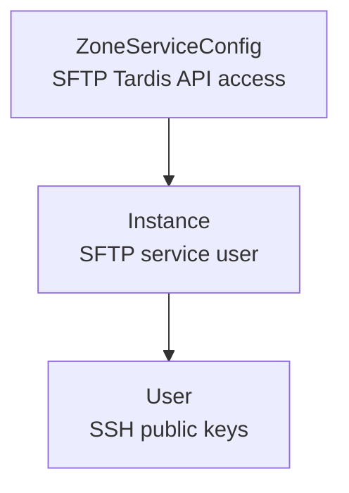

<!--
SPDX-FileCopyrightText: 2025 Deutsche Telekom AG

SPDX-License-Identifier: CC0-1.0
-->

# SFTP Domain

The SFTP domain manages SSH key-based access to the SFTP Service. It translates Kubernetes resources into SFTP Tardis API calls, provisions service users for SFTP instances, and keeps the public keys for those users synchronized from the declared `User` resources.

## Custom Resources

<CRDReference domain="sftp" />

## Resource Model

SFTP resources follow a simple dependency chain:

- A **ZoneServiceConfig** defines the SFTP Tardis API endpoint and OAuth2 client credentials for a zone. Its webhook validates the API settings before reconciliation.
- An **Instance** references a ZoneServiceConfig and represents one SFTP service user in the external service.
- A **User** references an Instance and contributes one or more SSH public keys to that instance.

## Reconciliation Flow

The ZoneServiceConfig controller validates the configured API credentials by creating or refreshing an SFTP service client. The Instance controller then uses that client to create or update the SFTP service user in the external service.

When User resources change, the Instance controller collects all Users that reference the Instance, canonicalizes their SSH public keys, deduplicates them by fingerprint, and updates the public key set for the SFTP service user.

## Domain Interactions

- **Secret Manager** — ZoneServiceConfig can resolve SFTP Tardis client secrets from Secret Manager references during reconciliation.
- **SFTP Tardis API** — The SFTP operator creates, updates, and deletes SFTP service users and synchronizes their public keys through this external API.

## Related Pages

- [Architecture Overview](./overview.md)
- [Reference: API](../reference/api.md)
