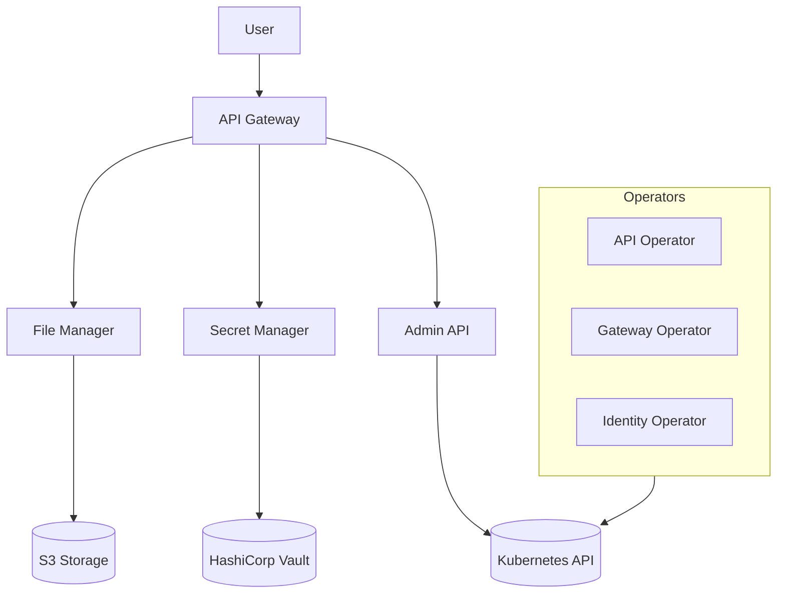

# Controlplane Technical Overview

Welcome to the technical documentation for the Open Telekom Integration Platform's Control Plane. This documentation serves as a comprehensive reference to the technologies, frameworks, and architectural patterns used throughout the project.

## What is the Control Plane?

The Control Plane is the central management layer for the Open Telekom Integration Platform, governing Kubernetes cluster operations. It maintains the system's desired state, manages workloads, and provides user interaction interfaces.

Key components include:
- **Operators** - Specialized control loops managing complex domain-specific applications 
- **API Servers** - RESTful APIs for managing Kubernetes custom resources
- **Libraries** - Shared code modules between different projects

## Repository Structure

The controlplane repository is organized into several key components:

- **file-manager** - File upload/download service with S3 backend
- **common-server** - Shared server utilities and middleware
- **admin** - Administrative APIs and controllers
- **api** - API management and exposure
- **gateway** - API Gateway functionality
- **identity** - Authentication and identity management

## Technology Stack at a Glance

- **Language**: Go 1.24.4
- **Framework**: Kubernetes Operator pattern with controller-runtime
- **Web**: Gofiber HTTP framework
- **Storage**: MinIO S3 client
- **Documentation**: OpenAPI/Swagger
- **Testing**: Testify, Mockery
- **Deployment**: Kubernetes, Helm charts

## Architecture Overview

The Control Plane follows a modular architecture based on microservices and Kubernetes operators:

## Presentation

Want a quick overview? Check out our [technical presentation](/presentation) for a concise introduction to the main frameworks and technologies used in the controlplane.