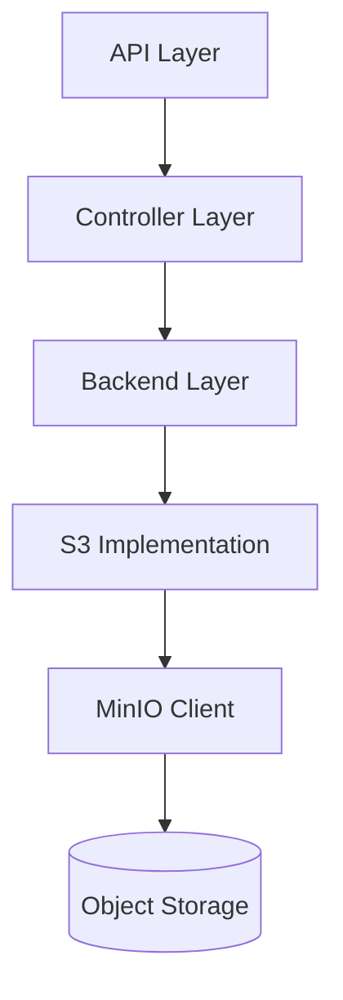

# S3 Storage with MinIO

The file-manager component of the Control Plane uses MinIO as an S3-compatible storage backend for file operations.

## Overview

MinIO is a high-performance, S3-compatible object storage system. The file-manager component implements storage interfaces that use the MinIO Go client library (`minio-go/v7`) to provide file upload and download capabilities.

## Integration Architecture

The file-manager component follows a clean separation of concerns:



## Backend Interface

The file-manager defines abstract interfaces for file operations:

```go
// pkg/backend/interface.go
type FileUploader interface {
    UploadFile(ctx context.Context, fileID string, file io.Reader) error
}

type FileDownloader interface {
    DownloadFile(ctx context.Context, fileID string) (io.ReadCloser, error)
}
```

## MinIO Implementation

The S3 backend implementation uses the MinIO client to fulfill these interfaces:

```go
// pkg/backend/s3/minio_wrapper.go
type MinioWrapper struct {
    client    *minio.Client
    bucket    string
    logger    logr.Logger
}

func NewMinioWrapper(endpoint, accessKey, secretKey, bucket string, useSSL bool) (*MinioWrapper, error) {
    // Initialize MinIO client
    client, err := minio.New(endpoint, &minio.Options{
        Creds:  credentials.NewStaticV4(accessKey, secretKey, ""),
        Secure: useSSL,
    })
    if err != nil {
        return nil, err
    }

    return &MinioWrapper{
        client: client,
        bucket: bucket,
        logger: log.WithName("minio-wrapper"),
    }, nil
}
```

### File Upload Implementation

```go
// pkg/backend/s3/file_uploader.go
func (m *MinioWrapper) UploadFile(ctx context.Context, fileID string, file io.Reader) error {
    // Get file size and create options
    options := minio.PutObjectOptions{
        ContentType: "application/octet-stream",
    }

    // Check if bucket exists and create it if needed
    exists, err := m.client.BucketExists(ctx, m.bucket)
    if err != nil {
        return fmt.Errorf("failed to check bucket existence: %w", err)
    }
    
    if !exists {
        err = m.client.MakeBucket(ctx, m.bucket, minio.MakeBucketOptions{})
        if err != nil {
            return fmt.Errorf("failed to create bucket: %w", err)
        }
    }

    // Upload the file
    _, err = m.client.PutObject(ctx, m.bucket, fileID, file, -1, options)
    if err != nil {
        return fmt.Errorf("failed to upload file: %w", err)
    }

    return nil
}
```

### File Download Implementation

```go
// pkg/backend/s3/file_downloader.go
func (m *MinioWrapper) DownloadFile(ctx context.Context, fileID string) (io.ReadCloser, error) {
    // Check if object exists
    _, err := m.client.StatObject(ctx, m.bucket, fileID, minio.StatObjectOptions{})
    if err != nil {
        return nil, fmt.Errorf("file not found: %w", err)
    }

    // Get object
    obj, err := m.client.GetObject(ctx, m.bucket, fileID, minio.GetObjectOptions{})
    if err != nil {
        return nil, fmt.Errorf("failed to get file: %w", err)
    }

    return obj, nil
}
```

## File Identifiers

The file-manager uses a structured approach for file identifiers:

```go
// pkg/backend/identifier/fileid_parser.go
type FileId struct {
    Environment string
    Group       string
    Team        string
    FileName    string
}

func ParseFileId(fileId string) (FileId, error) {
    parts := strings.Split(fileId, "--")
    if len(parts) != 4 {
        return FileId{}, errors.New("invalid file id format")
    }

    return FileId{
        Environment: parts[0],
        Group:       parts[1],
        Team:        parts[2],
        FileName:    parts[3],
    }, nil
}
```

## Checksum Validation

The file-manager uses CRC64 checksum validation to ensure file integrity:

```go
// api/copy_hash.go
func CalculateChecksum(reader io.Reader) (string, error) {
    hasher := crc64nvme.New()
    if _, err := io.Copy(hasher, reader); err != nil {
        return "", err
    }
    
    return strconv.FormatUint(hasher.Sum64(), 16), nil
}
```

## Security Considerations

The S3 backend implementation includes several security measures:

1. **Credentials Management** - Access keys are managed securely
2. **TLS Encryption** - Communication with S3 is encrypted (when useSSL=true)
3. **JWT Authentication** - API endpoints require valid authentication
4. **Access Control** - File IDs include group and team info for authorization

## Configuration

The S3 backend is configured through environment variables or config files:

```yaml
# Example configuration
s3:
  endpoint: "s3.example.com"
  accessKey: "${S3_ACCESS_KEY}"
  secretKey: "${S3_SECRET_KEY}"
  bucket: "file-manager"
  useSSL: true
```