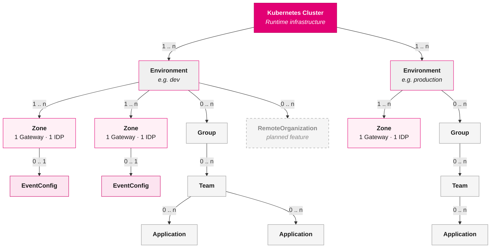

# Components

The Control Plane is made up of several domains, services, and shared libraries that work together to provide a complete API management and orchestration platform. This page gives a high-level overview of each component and how they relate to one another.

## Resource Hierarchy

Before diving into the individual components, the diagram below shows the resource model that these components manage. Each level is created inside the one above it, and the labels indicate how many child resources are allowed.

**Reading the diagram:**

- A single **Kubernetes Cluster** hosts one or more **Environments** (e.g. `dev`, `production`).
- Each **Environment** maps to its own Kubernetes namespace and contains **Zones**, **Groups**, and optionally **Remote Organizations**.
- A **Zone** is a deployment target with exactly one Gateway and one Identity Provider. You can create an **EventConfig** for a zone to enable eventing.
- **Groups** organize **Teams**, and each team owns one or more **Applications**.
- **Remote Organizations** (dashed border) are a planned feature for cross-platform federation.

## Domain Operators

Domain operators are the core building blocks of the Control Plane. Each operator manages a specific set of Kubernetes custom resources and reconciles them to the desired state.

| Domain | Purpose |
| ------ | ------- |
| [Admin](../architecture/admin.mdx) | Manages environments, zones, and remote organizations (planned feature) — the foundational infrastructure of the platform. |
| [Organization](../architecture/organization.mdx) | Manages teams and groups. Automatically provisions namespaces, identity clients, gateway consumers, and notification channels for each team. |
| [Application](../architecture/application.mdx) | Represents applications as an abstraction over Rover files. Provisions the identity and gateway resources an application needs to interact with the platform. |
| [Rover](../architecture/rover.mdx) | The primary user-facing entry point. Translates declarative Rover files into resources across the API, Application, Gateway, and Identity domains. |
| [API](../architecture/api.mdx) | Manages the full API lifecycle — registering, exposing, and subscribing. Supports API categories and integrates with the Approval domain. |
| [Approval](../architecture/approval.mdx) | Provides configurable approval workflows (Auto, Simple, FourEyes) for API and event subscriptions, including trusted-team bypass. |
| [Notification](../architecture/notification.mdx) | Handles notification delivery via Email, MS Teams, and Webhooks. Uses admin-defined templates and is triggered by other domains during lifecycle events. |
| [Gateway](../architecture/gateway.mdx) | Configures the API Gateway at runtime — routes, consumers, rate limiting, load balancing, and multi-tenant realms. |
| [Identity](../architecture/identity.mdx) | Manages identity providers, realms, and service-account clients through Keycloak. Provides authentication and authorization for all platform interactions. |
| [Event](../architecture/event.mdx) | Handles event publishing and subscribing, including cross-zone meshing. An optional feature that bridges user configuration (Rover) with the PubSub runtime. |
| [PubSub](../architecture/pubsub.mdx) | The runtime configuration layer for publish/subscribe messaging via Horizon. Managed exclusively by the Event domain. |

## Services

Services provide HTTP APIs that complement the operator-based architecture.

| Service | Purpose |
| ------- | ------- |
| **Rover Server** | The primary REST API entrypoint for customer configurations. Abstracts the Kubernetes API and handles validation, file uploads, and secret obfuscation before passing configurations to the Rover domain. |
| **[ControlPlane API](../architecture/controlplane-api.mdx)** | A read-only GraphQL API for the Control Plane UI. Exposes teams, applications, API exposures, subscriptions, and approvals from a PostgreSQL database with team-level isolation. |
| **[Projector](../architecture/controlplane-api.mdx)** | A read-only Kubernetes controller that watches custom resources and projects their state into the shared PostgreSQL database used by the ControlPlane API. |
| **Secret Manager** | A RESTful API for securely storing and retrieving secrets. Replaces sensitive values in custom resources with placeholder references. Supports Kubernetes Secrets and Conjur backends. |
| **File Manager** | A RESTful API for storing and retrieving files (primarily OpenAPI specifications). Supports Amazon S3 and MinIO backends. |

## CLI Tools

| Tool | Purpose |
| ---- | ------- |
| **Rover-CTL** | A command-line interface for managing Rover resources via the Rover Server REST API. Designed for CI/CD pipelines and developer workflows. |

## Shared Libraries

| Library | Purpose |
| ------- | ------- |
| **Common** | Shared Go module providing the reconciliation pattern (Controller + Handler), a context-aware Kubernetes client, condition management, error handling, and configuration utilities used by all operators. |
| **Common Server** | Shared Go module for building HTTP servers. Provides resource controllers, in-memory stores, OAuth2/OIDC security, and audit logging used by Rover Server and the ControlPlane API. |
