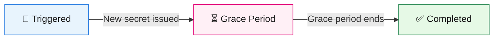

# Graceful Secret Rotation

Every application managed by the Control Plane receives a **client secret** that it uses to authenticate with the platform. Secrets have a limited lifetime — once they expire, your application can no longer access its APIs or events. Graceful secret rotation lets you replace an expiring secret **without downtime** by keeping both the old and new secrets valid during a configurable grace period.

## Why It Matters

Without graceful rotation, replacing a secret is an all-or-nothing operation: the moment a new secret is issued, the old one stops working. If any consumer still uses the old secret, it immediately loses access.

With graceful rotation:

1. A **new secret** is generated and becomes the primary credential.
2. The **old secret** remains valid for a grace period (configured by your platform administrator).
3. You have time to update all consumers before the old secret expires.

This eliminates the coordination problem of synchronizing secret updates across multiple services.

## Rotation Lifecycle

The rotation process follows these stages:



<br />

| Stage | What happens | What you need to do |
| ----- | ------------ | ------------------- |
| **Triggered** | You (or an automation) request a secret rotation. The platform generates a new secret and moves the current one into a "rotated" slot. | Retrieve the new secret from the Portal or CLI. |
| **Grace period** | Both secrets are accepted by the gateway and identity provider. | Update all consumers to use the new secret. |
| **Completed** | The grace period ends. Only the new secret is valid. The old secret is permanently removed. | Nothing — you're done (assuming consumers were updated). |

## How to Rotate a Secret

You can trigger a rotation in two ways.

### Using the Control Plane Portal

Navigate to your application's settings page and select **Rotate Secret**. The portal displays the new secret and shows the grace period deadline.

### Using the Roverctl CLI

Run the following command:

```bash
roverctl reset-secret -a <application-name>
```

The CLI returns the new `clientId` and `secret`. Store them securely — the secret value is only shown once.

## Notifications

The platform automatically sends email notifications to your team during the rotation lifecycle. These notifications are sent to the email address associated with your team's notification channel.

### Expiry Warning

Before your secret expires, you will receive one or more **reminder emails**. The exact schedule is configured by your platform administrator (for example, 30 days before expiry, then daily starting 7 days before). Each reminder includes:

### Rotation Confirmation

After a successful rotation, you receive a **confirmation email** with:

:::tip
You may attach calendar invites to these notifications so everyone can have a visible reminder of upcoming deadlines. See the [Attachments](../../admin-journey/notification-templates.md#attachments) section for details.
:::

## Checklist After Rotation

After triggering a rotation, follow these steps to ensure a smooth transition:

1. **Retrieve the new secret** from the Portal or CLI output.
2. **Update all consumers** — every service or deployment that uses the old secret.
3. **Verify connectivity** — confirm that updated consumers can authenticate successfully.
4. **Monitor the grace period** — the old secret will stop working at the deadline shown in the confirmation email.
5. **Remove the old secret** from any configuration stores, vaults, or environment variables.

:::caution
If you do not update all consumers before the grace period ends, those consumers will lose access. The platform does not extend the grace period automatically.
:::

## Related Pages

- [Security Features](./security.mdx) — OAuth2, basic auth, and IP restrictions
- [Managing Applications](../applications.mdx) — Application lifecycle
- [Admin Guide: Secret Rotation](../../admin-journey/features/secret-rotation.md) — Configuration for platform administrators
