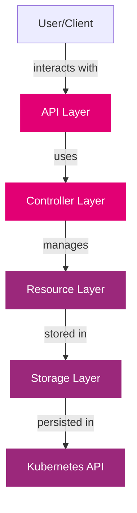
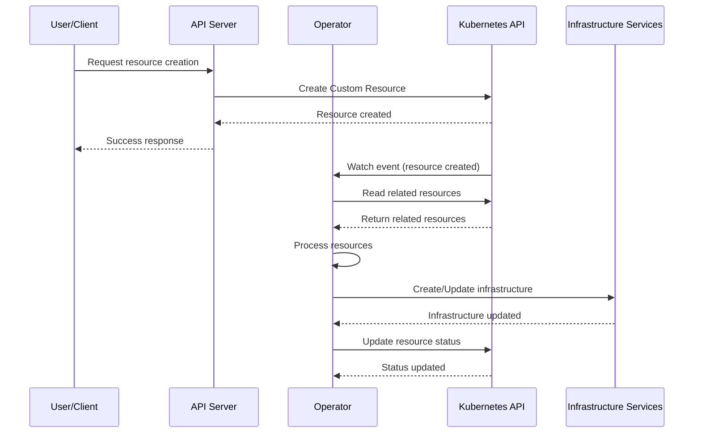
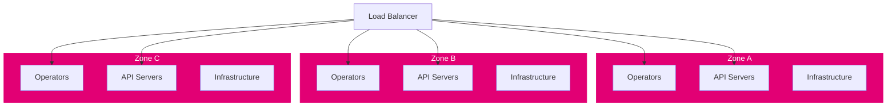

import PageHeader from '@site/src/components/PageHeader';
import FeatureCard from '@site/src/components/FeatureCard';
import CardGrid from '@site/src/components/CardGrid';
import InfoSection from '@site/src/components/InfoSection';

<PageHeader 
  title="Control Plane Architecture"
  description="Detailed architecture and component interactions of the Control Plane"
/>

## Architecture Overview

<InfoSection type="info" title="Modular design">
  The Control Plane follows a modular architecture with specialized components that work together to provide a complete platform for API management and workload orchestration. This approach enables extensibility, maintainability, and scalability.
</InfoSection>

The Control Plane architecture is built on cloud-native principles, using Kubernetes as its foundation and extending it with custom controllers and resources to create a comprehensive platform for managing APIs and workloads.

## Component Architecture

The diagram below illustrates how the different components of the Control Plane interact with each other and with external systems:

  

    <h3>Component Architecture</h3>
  

  

    
The Control Plane consists of operators, API servers, and libraries that interact with Kubernetes and external infrastructure components:

    
  

  

    
<strong>Key interactions:</strong>

    <ul>
      <li>Operators use the Kubernetes API to manage custom resources</li>
      <li>API Servers provide RESTful interfaces for clients and services</li>
      <li>Integration with external components like Gateway and Identity Providers</li>
    </ul>
  

## Architectural Layers

The Control Plane architecture is organized into several logical layers:

### API Layer

<CardGrid columns={2}>
  <FeatureCard
    title="REST APIs"
    description="RESTful interfaces that expose Control Plane functionality to clients, allowing them to create, read, update, and delete resources."
  />
  <FeatureCard
    title="Authentication & Authorization"
    description="Security mechanisms that ensure only authorized users and services can access Control Plane resources."
  />
</CardGrid>

### Controller Layer

<CardGrid columns={2}>
  <FeatureCard
    title="Operators"
    description="Custom controllers that implement domain-specific logic for managing Control Plane resources."
  />
  <FeatureCard
    title="Reconciliation Loops"
    description="Continuous processes that ensure the actual state of resources matches the desired state."
  />
</CardGrid>

### Resource Layer

<CardGrid columns={2}>
  <FeatureCard
    title="Custom Resources"
    description="Domain-specific resources defined by Custom Resource Definitions (CRDs) that represent Control Plane concepts."
  />
  <FeatureCard
    title="Resource Relationships"
    description="Connections between resources that define their hierarchy and interactions."
  />
</CardGrid>

### Storage Layer

<CardGrid columns={2}>
  <FeatureCard
    title="etcd"
    description="Distributed key-value store used by Kubernetes to store all cluster data, including Control Plane custom resources."
  />
  <FeatureCard
    title="Object Storage"
    description="S3-compatible storage used for storing files and other binary data that doesn't fit well in etcd."
  />
</CardGrid>

## Data Flow Architecture

<InfoSection type="note" title="Data Flow">
  Understanding the data flow between components helps in troubleshooting and optimizing the Control Plane.
</InfoSection>

The following diagram illustrates the data flow between major components of the Control Plane:

## Security Architecture

Security is a fundamental aspect of the Control Plane architecture, implemented at multiple levels:

<CardGrid columns={2}>
  <FeatureCard
    title="Authentication"
    description="Uses OAuth 2.0 for secure authentication of users and services. Integrates with identity providers like Keycloak."
  />
  <FeatureCard
    title="Authorization"
    description="Role-Based Access Control (RBAC) determines what actions users and services can perform on resources."
  />
  <FeatureCard
    title="Network Security"
    description="Network Policies restrict communication between components, ensuring that only authorized traffic is allowed."
  />
  <FeatureCard
    title="TLS Encryption"
    description="All communication between components is encrypted using TLS certificates managed by cert-manager."
  />
</CardGrid>

## High Availability Architecture

For production deployments, the Control Plane supports a high availability configuration:

Key aspects of the high availability design:

1. **Multi-Zone Deployment**: Components are deployed across multiple availability zones
2. **Stateless Design**: Core components are stateless, storing all state in Kubernetes resources
3. **Redundant Components**: Multiple replicas of each component ensure continued operation if some fail
4. **Load Balancing**: Distributes requests across available replicas

## Scalability Architecture

The Control Plane is designed for horizontal scalability:

<CardGrid columns={2}>
  <FeatureCard
    title="Component Scaling"
    description="Individual components can be scaled independently based on load and performance requirements."
  />
  <FeatureCard
    title="Resource Efficiency"
    description="Components are designed to use resources efficiently, with configurable resource requests and limits."
  />
  <FeatureCard
    title="Stateless Design"
    description="Stateless components can be scaled out without coordination, simplifying scaling operations."
  />
  <FeatureCard
    title="Controlled Dependencies"
    description="Minimal dependencies between components reduce the coordination required during scaling events."
  />
</CardGrid>

## Integration Architecture

The Control Plane integrates with various external systems:

<InfoSection type="tip" title="Integration">
  The Control Plane provides standardized integration points for connecting with external systems and services.
</InfoSection>

<CardGrid columns={2}>
  <FeatureCard
    title="API Gateway Integration"
    description="Integration with Kong Gateway for API management, routing, and policy enforcement."
  />
  <FeatureCard
    title="Identity Provider Integration"
    description="Integration with Keycloak for authentication, authorization, and identity management."
  />
  <FeatureCard
    title="Monitoring Integration"
    description="Integration with Prometheus for metrics collection and monitoring."
  />
  <FeatureCard
    title="Logging Integration"
    description="Integration with logging systems for centralized log collection and analysis."
  />
</CardGrid>

## Deployment Architecture

The Control Plane can be deployed in various configurations:

<CardGrid columns={3}>
  <FeatureCard
    title="Single Cluster"
    description="All components deployed in a single Kubernetes cluster, suitable for development and small-scale deployments."
  />
  <FeatureCard
    title="Multi-Cluster"
    description="Components distributed across multiple Kubernetes clusters for improved isolation and scalability."
  />
  <FeatureCard
    title="Hybrid Cloud"
    description="Components deployed across both on-premises and cloud environments, leveraging the strengths of each."
  />
</CardGrid>

## Related Pages

- [Components](components): Detailed information about Control Plane components
- [Operators](operators): Specialized controllers that manage Control Plane resources
- [Infrastructure](infrastructure): Infrastructure components required by the Control Plane