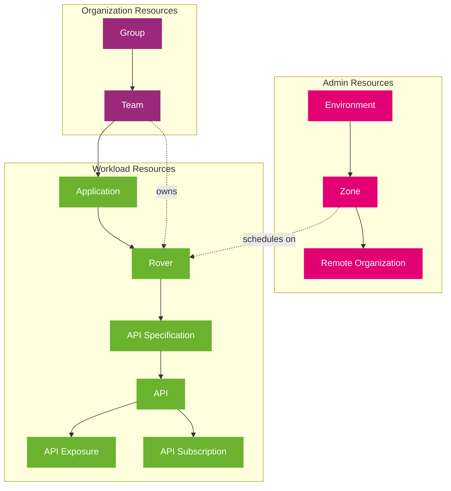

import PageHeader from '@site/src/components/PageHeader';
import FeatureCard from '@site/src/components/FeatureCard';
import CardGrid from '@site/src/components/CardGrid';
import InfoSection from '@site/src/components/InfoSection';

<PageHeader 
  title="Control Plane Components"
  description="Explore the key components and resource hierarchy of the Control Plane platform"
/>

<InfoSection type="tip" title="Platform composition">
  The Control Plane consists of multiple specialized components that work together to provide a complete platform for API management and workload orchestration. These components are organized in a hierarchical structure.
</InfoSection>

## Resource Hierarchy

<InfoSection type="note" title="Resource model">
  The Control Plane uses a hierarchical resource model with three main resource types that interact with each other. This model provides clear separation of concerns while enabling powerful resource relationships.
</InfoSection>

## Resource Types

### Admin Resources

Admin resources are platform-level resources managed by administrators that define the operational environment of the Control Plane.

<CardGrid columns={3}>
  <FeatureCard
    title="Environment"
    description="Logical groupings of zones and clusters that provide a high-level organizational structure for deployment targets."
  />
  <FeatureCard
    title="Zone"
    description="Represent deployment targets with specific capabilities. Zones are where workloads can be scheduled and executed."
  />
  <FeatureCard
    title="Remote Organization"
    description="References to organizations in remote clusters, enabling cross-cluster communication and resource sharing."
  />
</CardGrid>

### Organization Resources

Organization resources handle team and project management to establish clear ownership and responsibilities.

<CardGrid columns={2}>
  <FeatureCard
    title="Group"
    description="Logical groupings of teams that enable hierarchical organization of development and operational units."
  />
  <FeatureCard
    title="Team"
    description="Represent development or operational teams with members, defining who has access to and responsibility for workload resources."
  />
</CardGrid>

### Workload Resources

Workload resources are application and API resources that represent the services deployed and managed by the Control Plane.

<CardGrid columns={3}>
  <FeatureCard
    title="Application"
    description="Collections of related services that form a logical business function or capability."
  />
  <FeatureCard
    title="Rover"
    description="Deployable units that can be scheduled on clusters, representing the runtime aspects of applications."
  />
  <FeatureCard
    title="API Specification"
    description="Formal definitions of APIs using standards like OpenAPI, defining the interface contract for services."
  />
</CardGrid>

<CardGrid columns={3}>
  <FeatureCard
    title="API"
    description="Service interfaces with specifications that enable service discovery and integration."
  />
  <FeatureCard
    title="API Exposure"
    description="Configurations that define how APIs are exposed to consumers, including authentication and authorization settings."
  />
  <FeatureCard
    title="API Subscription"
    description="Definitions of service consumer relationships, managing access to APIs with appropriate permissions."
  />
</CardGrid>

## API Servers

<InfoSection type="info" title="API Servers">
  API Servers provide RESTful interfaces for managing Kubernetes custom resources. They enable programmatic interaction with Control Plane resources through standard HTTP methods.
</InfoSection>

<CardGrid columns={2}>
  <FeatureCard
    title="Secret Manager"
    description={
      <>
        
RESTful API for managing secrets. It allows you to store, retrieve, and delete secrets securely.

        <a href="https://github.com/telekom/controlplane/blob/main/secret-manager/README.md">Documentation →</a>
      </>
    }
  />
  
  <FeatureCard
    title="Rover Server"
    description={
      <>
        
RESTful API for managing Rover resources such as Rover Exposures and Subscriptions as well as ApiSpecifications.

        <a href="https://github.com/telekom/controlplane/blob/main/rover-server/README.md">Documentation →</a>
      </>
    }
  />
  
  <FeatureCard
    title="Organization Server"
    description={
      <>
        
RESTful API for managing Organization resources such as Groups and Teams.

        <a href="https://github.com/telekom/controlplane/blob/main/organization-server/README.md">Documentation →</a>
      </>
    }
  />
  
  <FeatureCard
    title="File Manager"
    description={
      <>
        
RESTful API for managing files. It allows you to store and retrieve files, keeping large data outside of Kubernetes.

        <a href="https://github.com/telekom/controlplane/blob/main/file-manager/README.md">Documentation →</a>
      </>
    }
  />
  
  <FeatureCard
    title="Controlplane API"
    description={
      <>
        
RESTful API for reading custom resources from the control plane from all domains.

        <a href="https://github.com/telekom/controlplane/blob/main/cpapi/README.md">Documentation →</a>
      </>
    }
  />
</CardGrid>

## Libraries

<InfoSection type="note" title="Shared code">
  The Control Plane uses several shared libraries to provide common functionality across different components.
</InfoSection>

<CardGrid columns={2}>
  <FeatureCard
    title="Common"
    description={
      <>
        
A core library that provides shared code and utilities used across the different Control Plane projects. Includes common types, helpers, and utilities.

        <a href="https://github.com/telekom/controlplane/blob/main/common/README.md">Documentation →</a>
      </>
    }
  />
  
  <FeatureCard
    title="Common-Server"
    description={
      <>
        
Module used to dynamically create REST-APIs for Kubernetes-CRDs. Provides consistent API generation and handling across multiple components.

        <a href="https://github.com/telekom/controlplane/blob/main/common-server/README.md">Documentation →</a>
      </>
    }
  />
</CardGrid>

## Component Interactions

The Control Plane components interact with each other through well-defined interfaces:

1. **Resource Ownership**: Teams own Applications, which contain Rovers
2. **Scheduling**: Zones determine where Rovers can be scheduled
3. **API Management**: Rovers provide APIs through API Specifications
4. **Access Control**: API Exposures and Subscriptions control access to APIs

For a detailed view of how these components interact, see the [Architecture](architecture) page.

## Related Pages

- [Operators](operators): Learn about the specialized controllers that manage Control Plane resources
- [Architecture](architecture): See how components interact in the overall system design
- [Infrastructure](infrastructure): Explore the underlying infrastructure components required by the Control Plane