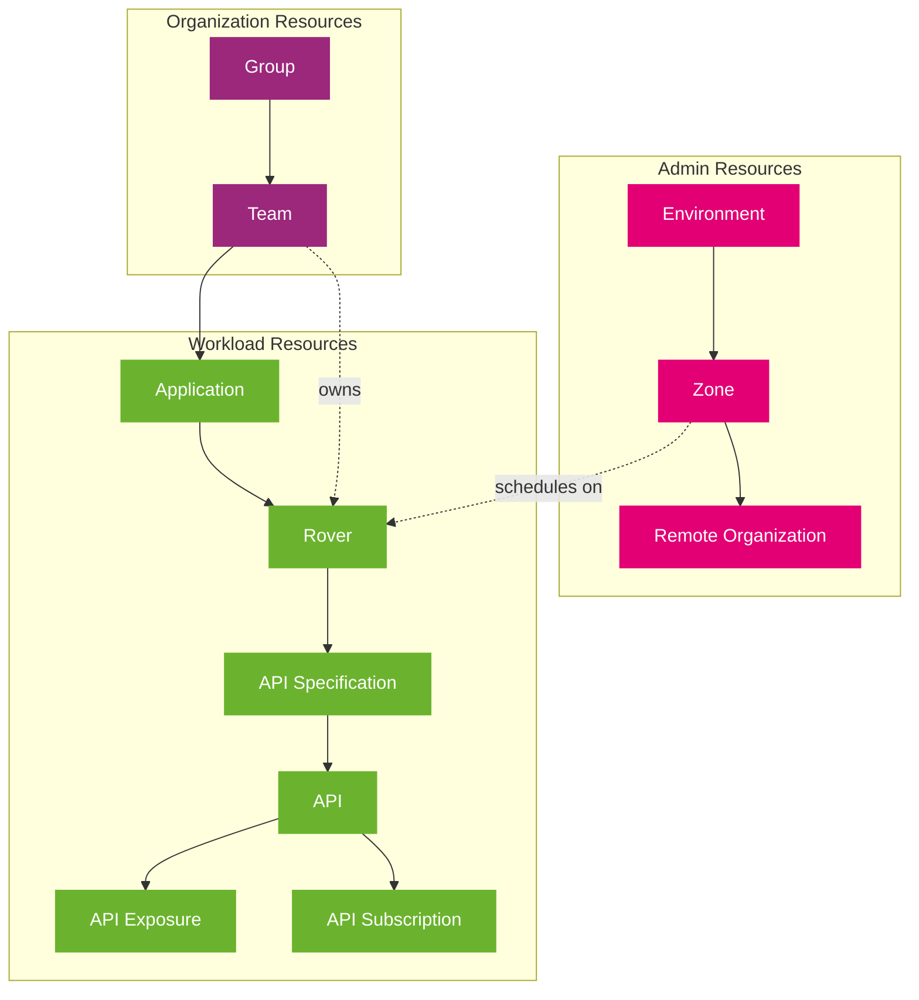

import PageHeader from '@site/src/components/PageHeader';
import TableOfContents from '@site/src/components/TableOfContents';
import FeatureGrid from '@site/src/components/FeatureGrid';
import FeatureCard from '@site/src/components/FeatureCard';
import CardGrid from '@site/src/components/CardGrid';
import ButtonLink from '@site/src/components/ButtonLink';
import InfoSection from '@site/src/components/InfoSection';
import ComponentTable from '@site/src/components/ComponentTable';

<PageHeader 
  title="Controlplane"
  description="A centralized management layer that maintains the desired state of your systems by orchestrating workloads, scheduling, and system operations through a set of core and custom controllers."
  logo={{
    src: "/controlplane/img/eni-tardis-small.png",
    alt: "Open Telekom Integration Platform Logo",
    width: 200
  }}
/>

## Table of Contents

<TableOfContents
  items={[
    {
      title: "Documentation",
      icon: "📓",
      links: [
        { text: "About Control Plane", url: "#about" },
        { text: "Key Features", url: "#features" },
        { text: "Component Overview", url: "#components" },
        { text: "Architecture", url: "#architecture" }
      ]
    },
    {
      title: "Get Started",
      icon: "🚀",
      links: [
        { text: "Getting Started Guide", url: "#getting-started" },
        { text: "Quickstart Tutorial", url: "../2-Installation/quickstart" },
        { text: "Installation Guide", url: "../2-Installation/installation" },
        { text: "Technology Overview", url: "../1-Technology/intro" }
      ]
    }
  ]}
/>

## About

  

    

      As part of the Open Telekom Integration Platform, the Control Plane is the central management layer that governs the operation of your Kubernetes cluster. It maintains the desired state of the system, manages workloads, and provides interfaces for user interaction and automation.
    

    

      The Control Plane follows a modular architecture with specialized components that work together to provide a complete platform for API management and workload orchestration. It extends the native Kubernetes capabilities through custom controllers and operators that implement domain-specific logic.
    

  

  

    <FeatureCard
      title="Why Control Plane?"
      description={
        <ul>
          <li>🌐 <b>Unified management</b> across clusters</li>
          <li>🔒 <b>Security by design</b> with OAuth 2.0</li>
          <li>🧲 <b>API-first approach</b> for integration</li>
          <li>🔄 <b>Declarative configuration</b> for consistency</li>
        </ul>
      }
    />
  

## Features

<InfoSection type="info" title="Key capabilities">
  The Open Telekom Integration Platform Control Plane supports the complete API lifecycle and enables seamless, cloud-independent integration of services. It provides fine-grained API access control with security by design through OAuth 2.0 and integrated permission management.
</InfoSection>

Key features of the Control Plane include:

<FeatureGrid
  columns={2}
  features={[
    {
      title: "API Management",
      description: "Complete API lifecycle management with cloud-independent service integration. Provides fine-grained access control with OAuth 2.0 security and integrated permission management."
    },
    {
      title: "Approval Management",
      description: "Secure and auditable access to APIs with features like 4-eyes-principle, approval expiration, recertification, and more."
    },
    {
      title: "Organization and Admin",
      description: "Administrative tools for efficient organization management, including zones, gateways, and identity providers."
    },
    {
      title: "Team Management",
      description: "Comprehensive team management with team creation, member management, and role-based access control."
    },
    {
      title: "Secret Management",
      description: "Securely store, access, and distribute sensitive information like passwords, API keys, and certificates. Ensures encryption at rest and secure transmission."
    },
    {
      title: "REST APIs",
      description: <>
        <ul>
          <li>Rover API: Manage Rover functionalities</li>
          <li>Approval API: Handle approval processes</li>
          <li>Team API: Manage teams and members</li>
          <li>Catalog API: Access and manage API catalog</li>
          <li>ControlPlane API: Access controlplane resources</li>
        </ul>
      </>
    }
  ]}
/>

## Components

<InfoSection type="tip" title="Platform composition">
  The Control Plane consists of multiple specialized components that work together to provide a complete platform for API management and workload orchestration.
</InfoSection>

### Resource Hierarchy

<InfoSection type="note" title="Resource model">
  The Control Plane uses a hierarchical resource model with three main resource types that interact with each other. This model provides clear separation of concerns while enabling powerful resource relationships.
</InfoSection>

1. **Admin Resources**: Platform-level resources managed by administrators
   - Environments: Logical groupings of zones and clusters
   - Zones: Represent deployment targets with specific capabilities
   - RemoteOrganizations: References to organizations in remote clusters

2. **Organization Resources**: Team and project management resources
   - Groups: Logical groupings of teams
   - Teams: Represent development or operational teams with members

3. **Workload Resources**: Application and API resources
   - Rovers: Deployable units that can be scheduled on clusters
   - Applications: Collections of related services
   - APIs: Service interfaces with specifications

### Operators

  

    

      In addition to the core components, the control plane may also run custom operators. These are specialized control loops designed to manage complex domain-specific applications and configurations. These operators extend Kubernetes functionality using the <a href="https://kubernetes.io/docs/concepts/extend-kubernetes/operator/">Operator pattern</a>, combining custom resource definitions (CRDs) with controllers that automate lifecycle management.
    

    

      Each operator encapsulates a distinct domain of responsibility, operating independently with minimal interdependencies, which promotes modularity, simplifies maintenance, and enhances the scalability of the overall control plane architecture.
    

  

  

    <FeatureCard
      title="Operator Benefits"
      description={
        <ul>
          <li>🔧 <b>Domain-specific logic</b></li>
          <li>🛠️ <b>Automated lifecycle management</b></li>
          <li>🔗 <b>Minimal interdependencies</b></li>
          <li>💡 <b>Specialized expertise</b></li>
        </ul>
      }
    />
  

<ComponentTable 
  components={[
    {
      name: "Rover Operator",
      description: "Manages the lifecycle of Rover-domain resources such as Rovers and ApiSpecifications.",
      link: {
        url: "https://github.com/telekom/controlplane/blob/main/rover/README.md"
      }
    },
    {
      name: "Application Operator",
      description: "Manages the lifecycle of resources of kind Application.",
      link: {
        url: "https://github.com/telekom/controlplane/blob/main/application/README.md"
      }
    },
    {
      name: "Admin Operator",
      description: "Manages the lifecycle of Admin-domain resources such as Environments, Zones and RemoteOrganizations.",
      link: {
        url: "https://github.com/telekom/controlplane/blob/main/admin/README.md"
      }
    },
    {
      name: "Organization Operator",
      description: "Manages the lifecycle of Organization-domain resources such as Groups and Teams.",
      link: {
        url: "https://github.com/telekom/controlplane/blob/main/organization/README.md"
      }
    },
    {
      name: "Api Operator",
      description: "Manages the lifecycle of API-domain resources such as Apis, ApiExposures, ApiSubscriptions and RemoteApiSubscriptions.",
      link: {
        url: "https://github.com/telekom/controlplane/blob/main/api/README.md"
      }
    },
    {
      name: "Gateway Operator",
      description: "Manages the lifecycle of Gateway-domain resources such as Gateways, Gateway-Realms, Consumers, Routes and ConsumerRoutes.",
      link: {
        url: "https://github.com/telekom/controlplane/blob/main/gateway/README.md"
      }
    },
    {
      name: "Identity Operator",
      description: "Manages the lifecycle of Identity-domain resources such as IdentityProviders, Identity-Realms and Clients.",
      link: {
        url: "https://github.com/telekom/controlplane/blob/main/identity/README.md"
      }
    },
    {
      name: "Approval Operator",
      description: "Manages the lifecycle of resources of kind Approval.",
      link: {
        url: "https://github.com/telekom/controlplane/blob/main/approval/README.md"
      }
    }
  ]}
/>

These operators work alongside the Kubernetes API server and etcd, watching for changes to custom resources and ensuring the actual state of their managed components aligns with the desired configuration.

### API Servers

  

    

      API Servers are RESTful APIs for managing Kubernetes custom resources. They provide standardized HTTP-based interfaces to create, read, update, and delete (CRUD) custom-defined objects within the Kubernetes cluster. 
    

    

      These custom resources are typically defined using Custom Resource Definitions (CRDs) and extend the Kubernetes API with domain-specific objects (e.g., Application, Gateway, Organization). The API follows REST principles and standard HTTP methods (GET, POST, PUT, DELETE) to interact with resources. It supports authentication and authorization, enabling automation and integration with UIs and external systems.
    

  

  

    <FeatureCard
      title="API Server Capabilities"
      description={
        <ul>
          <li>🔐 <b>Authentication & Authorization</b></li>
          <li>🔄 <b>CRUD operations</b> on custom resources</li>
          <li>📚 <b>OpenAPI specifications</b></li>
          <li>🔌 <b>Integration</b> with external systems</li>
        </ul>
      }
    />
  

<InfoSection type="info" title="API Servers">
  The following API Servers run on the control plane:
</InfoSection>

<CardGrid columns={2}>
  <FeatureCard
    title="Secret Manager"
    description={
      <>
        
RESTful API for managing secrets. It allows you to store, retrieve, and delete secrets securely.

        <a href="https://github.com/telekom/controlplane/blob/main/secret-manager/README.md">Documentation →</a>
      </>
    }
  />
  
  <FeatureCard
    title="Rover Server"
    description={
      <>
        
RESTful API for managing Rover resources such as Rover Exposures and Subscriptions as well as ApiSpecifications.

        <a href="https://github.com/telekom/controlplane/blob/main/rover-server/README.md">Documentation →</a>
      </>
    }
  />
  
  <FeatureCard
    title="Organization Server"
    description={
      <>
        
RESTful API for managing Organization resources such as Groups and Teams.

        <a href="https://github.com/telekom/controlplane/blob/main/organization-server/README.md">Documentation →</a>
      </>
    }
  />
  
  <FeatureCard
    title="Controlplane API"
    description={
      <>
        
RESTful API for reading custom resources from the control plane from all domains.

        <a href="https://github.com/telekom/controlplane/blob/main/cpapi/README.md">Documentation →</a>
      </>
    }
  />
</CardGrid>

### Libraries

<InfoSection type="note" title="Shared code">
  The Control Plane uses several shared libraries to provide common functionality across different components.
</InfoSection>

<CardGrid columns={2}>
  <FeatureCard
    title="Common"
    description={
      <>
        
A core library that provides shared code and utilities used across the different Control Plane projects. Includes common types, helpers, and utilities.

        <a href="https://github.com/telekom/controlplane/blob/main/common/README.md">Documentation →</a>
      </>
    }
  />
  
  <FeatureCard
    title="Common-Server"
    description={
      <>
        
Module used to dynamically create REST-APIs for Kubernetes-CRDs. Provides consistent API generation and handling across multiple components.

        <a href="https://github.com/telekom/controlplane/blob/main/common-server/README.md">Documentation →</a>
      </>
    }
  />
</CardGrid>

### Infrastructure Components

<InfoSection type="info" title="Required components">
  The Control Plane requires the following infrastructure components to operate correctly. These components provide essential services for the platform's functionality.
</InfoSection>

<FeatureGrid
  columns={2}
  features={[
    {
      title: "⎈ Kubernetes",
      description: "The underlying platform where the Control Plane is deployed. Currently tested with Kubernetes version 1.31.",
      link: {
        text: "Learn more →",
        url: "https://kubernetes.io/"
      }
    },
    {
      title: "🔒 cert-manager",
      description: "Creates and manages TLS certificates for workloads in your Kubernetes cluster.",
      link: {
        text: "Learn more →",
        url: "https://cert-manager.io/docs/"
      }
    },
    {
      title: "🔐 trust-manager",
      description: "Manages trust bundles in Kubernetes clusters.",
      link: {
        text: "Learn more →",
        url: "https://cert-manager.io/docs/trust/trust-manager/"
      }
    },
    {
      title: "📈 Prometheus CRDs",
      description: "Enables monitoring based on Prometheus, required by the kubebuilder framework.",
      link: {
        text: "Learn more →",
        url: "https://book.kubebuilder.io/reference/metrics"
      }
    },
    {
      title: "🔎 Gateway (Kong)",
      description: "A Kong-based managed gateway providing hybrid API management.",
      link: {
        text: "GitHub →",
        url: "https://github.com/telekom/gateway-kong-charts"
      }
    },
    {
      title: "👤 Iris (Keycloak)",
      description: "A Keycloak-based Machine-to-Machine (M2M) Identity Provider for authentication and authorization.",
      link: {
        text: "GitHub →",
        url: "https://github.com/telekom/identity-iris-keycloak-charts"
      }
    }
  ]}
/>

## Architecture

<InfoSection type="info" title="Modular design">
  The Control Plane follows a modular architecture with specialized components that work together to provide a complete platform for API management and workload orchestration. This approach enables extensibility, maintainability, and scalability.
</InfoSection>

### Component Interactions

The diagram below illustrates how the different components of the Control Plane interact with each other and with external systems:

  

    <h3>Component Architecture</h3>
  

  

    
The Control Plane consists of operators, API servers, and libraries that interact with Kubernetes and external infrastructure components:

    
  

  

    
<strong>Key interactions:</strong>

    <ul>
      <li>Operators use the Kubernetes API to manage custom resources</li>
      <li>API Servers provide RESTful interfaces for clients and services</li>
      <li>Integration with external components like Gateway and Identity Providers</li>
    </ul>
  

## Getting Started

<InfoSection type="tip" title="Start your journey">
  The Control Plane can be approached in different ways depending on your needs. Choose the path that suits you best.
</InfoSection>

<CardGrid columns={3}>
  <FeatureCard
    title="🧠 Learn"
    description={
      <>
        

          Understand the technologies and frameworks used in the Control Plane and how they work together.
        

        <ul>
          <li>Core technologies overview</li>
          <li>Architecture principles</li>
          <li>Component interactions</li>
        </ul>
        <ButtonLink to="../1-Technology/intro.md" fullWidth>Technology Overview</ButtonLink>
      </>
    }
  />
  
  <FeatureCard
    title="🚀 Try"
    description={
      <>
        

          Set up a local development environment quickly to try out the Control Plane functionality.
        

        <ul>
          <li>5-minute local setup</li>
          <li>Sample resources</li>
          <li>Quick verification</li>
        </ul>
        <ButtonLink to="../2-Installation/quickstart.md" fullWidth>Quickstart Guide</ButtonLink>
      </>
    }
  />
  
  <FeatureCard
    title="🛠️ Install"
    description={
      <>
        

          Get detailed instructions for installing the Control Plane in a Kubernetes environment.
        

        <ul>
          <li>Production setup</li>
          <li>Configuration options</li>
          <li>Integration guides</li>
        </ul>
        <ButtonLink to="../2-Installation/installation.md" fullWidth>Installation Guide</ButtonLink>
      </>
    }
  />
</CardGrid>

## Next Steps

<InfoSection type="tip" title="Ready to dive deeper?">
  Now that you've explored the Control Plane overview, take your next steps with these resources:
</InfoSection>

<CardGrid columns={3}>
  <FeatureCard
    title="📚 Documentation"
    description={
      <ul>
        <li><a href="../1-Technology/intro.md">Technology Guides</a></li>
        <li><a href="../2-Installation/installation.md">Installation Guide</a></li>
        <li><a href="../2-Installation/quickstart.md">Quickstart Guide</a></li>
      </ul>
    }
  />
  
  <FeatureCard
    title="💻 Development"
    description={
      <ul>
        <li><a href="https://github.com/telekom/controlplane">GitHub Repository</a></li>
        <li><a href="https://github.com/telekom/controlplane/blob/main/CONTRIBUTING.md">Contributing Guide</a></li>
        <li><a href="https://github.com/telekom/controlplane/issues">Issue Tracker</a></li>
      </ul>
    }
  />
  
  <FeatureCard
    title="👨‍💻 Community"
    description={
      <ul>
        <li><a href="https://stackoverflow.com/questions/tagged/controlplane">Stack Overflow</a></li>
        <li><a href="https://github.com/telekom/controlplane/discussions">GitHub Discussions</a></li>
        <li><a href="https://github.com/telekom/controlplane/blob/main/CODE_OF_CONDUCT.md">Code of Conduct</a></li>
      </ul>
    }
  />
</CardGrid>

## Code of Conduct

This project has adopted the [Contributor Covenant](https://www.contributor-covenant.org/) in version 2.1 as our code of conduct. Please see the details in our [CODE_OF_CONDUCT.md](https://github.com/telekom/controlplane/blob/main/CODE_OF_CONDUCT.md). All contributors must abide by the code of conduct.

By participating in this project, you agree to abide by its [Code of Conduct](https://github.com/telekom/controlplane/blob/main/CODE_OF_CONDUCT.md) at all times.

## Licensing

This project follows the [REUSE standard for software licensing](https://reuse.software/).    
Each file contains copyright and license information, and license texts can be found in the [./LICENSES](https://github.com/telekom/controlplane/tree/main/LICENSES) folder. For more information visit https://reuse.software/.    
You can find a guide for developers at https://telekom.github.io/reuse-template/.