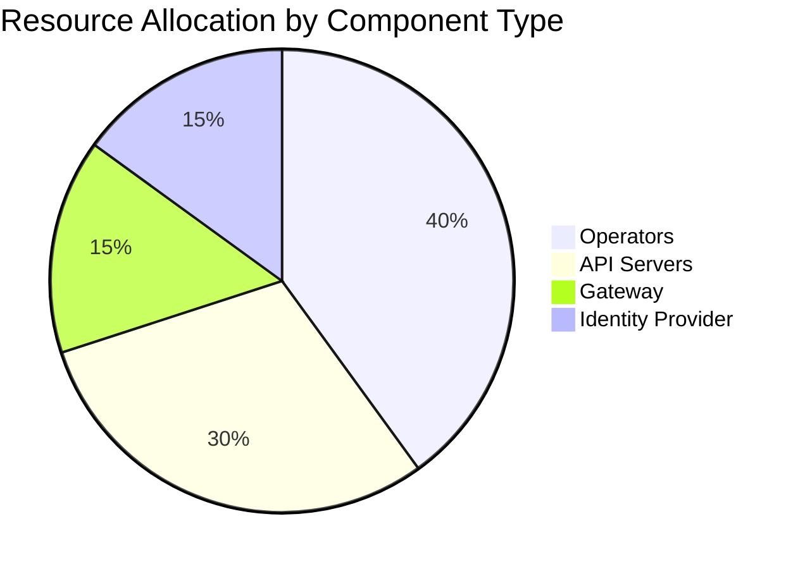

import PageHeader from '@site/src/components/PageHeader';
import FeatureCard from '@site/src/components/FeatureCard';
import FeatureGrid from '@site/src/components/FeatureGrid';
import CardGrid from '@site/src/components/CardGrid';
import InfoSection from '@site/src/components/InfoSection';
import NoAutoTitle from '@site/src/components/NoAutoTitle';

<NoAutoTitle />

<PageHeader 
  title="Control Plane Infrastructure"
  description="Essential infrastructure components required to run the Control Plane"
/>

## Infrastructure Overview

<InfoSection type="info" title="Required components">
  The Control Plane requires several infrastructure components to operate correctly. These components provide essential services for the platform's functionality.
</InfoSection>

The Control Plane is built on top of a foundation of reliable infrastructure components that provide essential services. These components work together to create a secure, scalable, and resilient platform for API management and workload orchestration.

## Core Infrastructure

<FeatureGrid
  columns={2}
  features={[
    {
      title: "⎈ Kubernetes",
      description: "The underlying container orchestration platform where the Control Plane is deployed. Currently tested with Kubernetes version 1.31.",
      link: {
        text: "Learn more →",
        url: "https://kubernetes.io/"
      }
    },
    {
      title: "🔒 cert-manager",
      description: "Creates and manages TLS certificates for workloads in your Kubernetes cluster. Provides automated certificate management for secure communications.",
      link: {
        text: "Learn more →",
        url: "https://cert-manager.io/docs/"
      }
    },
    {
      title: "🔐 trust-manager",
      description: "Manages trust bundles in Kubernetes clusters. Ensures consistent and secure certificate validation across the platform.",
      link: {
        text: "Learn more →",
        url: "https://cert-manager.io/docs/trust/trust-manager/"
      }
    },
    {
      title: "📈 Prometheus CRDs",
      description: "Enables monitoring based on Prometheus, required by the kubebuilder framework. Provides metrics collection and alerting capabilities.",
      link: {
        text: "Learn more →",
        url: "https://book.kubebuilder.io/reference/metrics"
      }
    }
  ]}
/>

## API Management Infrastructure

<CardGrid columns={2}>
  <FeatureCard
    title="🔎 Gateway (Kong)"
    description={
      <>
        
A Kong-based managed gateway providing hybrid API management. Routes API traffic, enforces policies, and secures API endpoints.

        

          <a href="https://github.com/telekom/gateway-kong-charts">GitHub →</a> | <a href="https://konghq.com/products/kong-gateway">Kong →</a>
        

      </>
    }
  />
  
  <FeatureCard
    title="👤 Iris (Keycloak)"
    description={
      <>
        
A Keycloak-based Machine-to-Machine (M2M) Identity Provider for authentication and authorization. Manages identity and access for services and users.

        

          <a href="https://github.com/telekom/identity-iris-keycloak-charts">GitHub →</a> | <a href="https://www.keycloak.org/">Keycloak →</a>
        

      </>
    }
  />
</CardGrid>

## Kubernetes Resource Requirements

The Control Plane components have specific resource requirements to ensure optimal performance. Below are the recommended resources for a standard deployment:

### CPU and Memory Requirements

| Component Type | CPU Request | CPU Limit | Memory Request | Memory Limit |
|----------------|------------|-----------|---------------|-------------|
| Operators | 100m | 500m | 128Mi | 512Mi |
| API Servers | 100m | 500m | 256Mi | 1Gi |
| Gateway | 500m | 1000m | 512Mi | 2Gi |
| Identity Provider | 500m | 1000m | 1Gi | 2Gi |

## Storage Infrastructure

The Control Plane uses a combination of storage solutions for different purposes:

<InfoSection type="note" title="Storage options">
  Depending on your deployment environment, different storage options may be appropriate. The Control Plane supports multiple storage backends.
</InfoSection>

### Database Storage

<CardGrid columns={2}>
  <FeatureCard
    title="PostgreSQL"
    description="Used for storing structured data such as user information, configuration settings, and relationship data. Required by components like the Identity Provider."
  />
  <FeatureCard
    title="Redis"
    description="Used for caching and temporary storage of session data, improving performance for frequently accessed data."
  />
</CardGrid>

### File Storage

<CardGrid columns={2}>
  <FeatureCard
    title="Amazon S3"
    description="Object storage service that provides scalable storage for files and large objects. Used by the File Manager component for storing files."
  />
  <FeatureCard
    title="MinIO"
    description="Self-hosted S3-compatible object storage. Can be used as an alternative to Amazon S3 for on-premises deployments."
  />
</CardGrid>

## Network Infrastructure

The Control Plane requires specific network configurations to operate correctly:

### Ingress and Egress

<CardGrid columns={2}>
  <FeatureCard
    title="Ingress Controller"
    description="Manages external access to the services within the Kubernetes cluster. Routes HTTP and HTTPS traffic to appropriate services."
  />
  <FeatureCard
    title="Network Policies"
    description="Kubernetes Network Policies define how pods communicate with each other and with external network endpoints. Used to secure communication between components."
  />
</CardGrid>

### Service Mesh (Optional)

<CardGrid columns={1}>
  <FeatureCard
    title="Istio/Linkerd"
    description="A service mesh can be used to provide additional traffic management, security, and observability features. This is optional but recommended for production deployments."
  />
</CardGrid>

## High Availability Configuration

For production environments, consider the following high availability configurations:

<CardGrid columns={2}>
  <FeatureCard
    title="Multiple Replicas"
    description="Deploy multiple replicas of each component to ensure continued operation even if some pods fail."
  />
  <FeatureCard
    title="Pod Anti-Affinity"
    description="Configure pod anti-affinity to spread replicas across different nodes, reducing the risk of complete service failure."
  />
  <FeatureCard
    title="Database HA"
    description="Use database clustering or replication for PostgreSQL and Redis to prevent data loss and ensure continuous availability."
  />
  <FeatureCard
    title="Multi-Zone Deployment"
    description="Spread the deployment across multiple availability zones to protect against zone failures."
  />
</CardGrid>

## Deployment Considerations

When planning your Control Plane deployment, consider the following factors:

<CardGrid columns={3}>
  <FeatureCard
    title="Scaling"
    description="Start with the recommended resource allocations and scale components based on load and performance monitoring."
  />
  <FeatureCard
    title="Security"
    description="Implement network policies, use TLS for all communications, and follow the principle of least privilege for service accounts."
  />
  <FeatureCard
    title="Monitoring"
    description="Set up monitoring and alerting for all infrastructure components using Prometheus and Grafana."
  />
</CardGrid>

## Related Pages

- [Components](components): Learn about the core components of the Control Plane
- [Operators](operators): Explore the specialized controllers that manage Control Plane resources
- [Architecture](architecture): See how infrastructure components fit into the overall system design