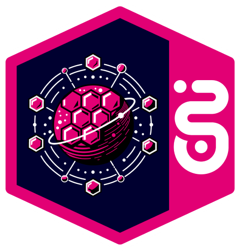

# Controlplane

 A centralized management layer that maintains the desired state of your systems by orchestrating workloads, scheduling, and system operations through a set of core and custom controllers.

  <a href="#features">Features</a> •
  <a href="#components"> Components</a> •
  <a href="#getting-started">Getting started</a>

## About

As Part of Open TeleKom Integration Platform, the Control Plane is the central management layer that governs the operation of your Kubernetes cluster. It maintains the desired state of the system, manages workloads, and provides interfaces for user interaction and automation.

The Control Plane components run on one or more nodes in the cluster and coordinate all cluster activities, including scheduling, monitoring, and responding to events.

## Features

The Open Telekom Integration Platform Control Plane supports the whole API lifecycle and allows seamless, cloud-independent integration of services. Further, it enables a fine-grained and vigilant API access control. The communication is secure by design, utilizing OAuth 2.0 and an integrated permission management.

Key features of the Control Plane include:

<strong>API Management</strong>
  
Control Plane supports the whole API lifecycle and allows seamless, cloud-independent integration of services. Further, it enables a fine-grained and vigilant API access control. The communication is secure by design, utilizing OAuth 2.0 and an integrated permission management. 

 

<strong>Approval Management</strong>
  
It provides secure and auditable access to APIs, with features like 4-eyes-principle, approval expiration, recertification, and more.

 

<strong>Organization and Admin Mechanism</strong>
  
Provides Administrative tools for efficient organization management, including zones, gateways, and identity providers.

 

<strong>Team Management:</strong>
  
Provides team management capabilities within the control plane

 

<strong>Secret-Management</strong>

Secret management involves securely storing, accessing, and distributing sensitive information such as passwords, API keys, and certificates within a Kubernetes cluster. It ensures that secrets are encrypted at rest and transmitted securely, while limiting access to only authorized workloads and users.  

 

<strong>REST APIs for Key Actions</strong>

* Rover API: API to interact with and manage Rover functionalities.
* Approval API: API for handling approval processes and workflows.
* Team API: API for team management and related actions.
* Catalog API: API to access and manage an API catalog
* ControlPlane API: API for accessing controlplane information

## Components

### Operators
In addition to the core components, the control plane may also run custom operators. These are specialized control loops designed to manage complex domain-specific applications and configurations. These operators extend Kubernetes functionality using the [Operator pattern](https://kubernetes.io/docs/concepts/extend-kubernetes/operator/), combining custom resource definitions (CRDs) with controllers that automate lifecycle management.

Each operator encapsulates a distinct domain of responsibility, operating independently with minimal interdependencies, which promotes modularity, simplifies maintenance, and enhances the scalability of the overall control plane architecture.

The following operators run on the control plane:
- [Rover Operator](https://github.com/telekom/controlplane/blob/main/rover): Manages the lifecycle of Rover-domain resources such as Rovers and ApiSpecifications.
- [Application Operator](https://github.com/telekom/controlplane/blob/main/application) Manages the lifecycle of resources of kind Application.
- [Admin Operator](https://github.com/telekom/controlplane/blob/main/admin): Manages the lifecycle of Admin-domain resources such as Environments, Zones and RemoteOrganizations.
- [Organization Operator](https://github.com/telekom/controlplane/blob/main/organization):  Manages the lifecycle of Organization-domain resources such as Groups and Teams.
- [Api Operator](https://github.com/telekom/controlplane/blob/main/api):  Manages the lifecycle of API-domain resources such as Apis, ApiExposures, ApiSubscriptions and RemoteApiSubscriptions.
- [Gateway Operator}](https://github.com/telekom/controlplane/blob/main/gateway):  Manages the lifecycle of Gateway-domain resources such as Gateways, Gateway-Realms, Consumers, Routes and ConsumerRoutes.
- [Identity Operator](https://github.com/telekom/controlplane/blob/main/identity):  Manages the lifecycle of Identity-domain resources such as IdentityProviders, Identity-Realms and Clients.
- [Approval Operator](https://github.com/telekom/controlplane/blob/main/approval):  Manages the lifecycle of resources of kind Approval.

These operators work alongside the Kubernetes API server and etcd, watching for changes to custom resources and ensuring the actual state of their managed components aligns with the desired configuration.

### API Servers
API Servers are  RESTful APIs for managing Kubernetes custom resources. They provide a standardized HTTP-based interfaces to create, read, update, and delete (CRUD) custom-defined objects within the Kubernetes cluster. These custom resources are typically defined using Custom Resource Definitions (CRDs) and extend the Kubernetes API with domain-specific objects (e.g., Application, Gateway, Organization). The API follows REST principles and standard HTTP methods (GET, POST, PUT, DELETE) to interact with resources. It supports authentication and authorization, enabling automation and integration with UIs and external systems.

The following API Servers run on the control plane:

- [Secret Manager](https://github.com/telekom/controlplane/blob/main/secret-manager): RESTful API for managing secrets. It allows you to store, retrieve, and delete secrets securely.
- [Rover-Server](https://github.com/telekom/controlplane/blob/main/rover-server): RESTful API for managing Rover resources such as Rover Exposures and Subscriptions as well as ApiSpecifications
- [Organization-Server](https://github.com/telekom/controlplane/blob/main/organization): RESTful API for managing Organization resources such as Groups and Teams
- [Controlplane API](https://github.com/telekom/controlplane/blob/main/cpapi): RESTful API for reading custom resources from the control plane from all domains

### Libraries
- [Common](https://github.com/telekom/controlplane/blob/main/common): A library that provides shared code between the different projects
- [Common-Server](https://github.com/telekom/controlplane/blob/main/common-server): Module used to dynamically create REST-APIs for Kubernetes-CRDs.

### Infrastructure

The Control Plane requires the following infrastructure components in order to operate correctly:

- **Kubernetes**: The Open Telekom Integration Platform Control Plane is designed to be deployed on [Kubernetes](https://kubernetes.io/). Currently, it is tested with Kubernetes version 1.31.
- **cert-manager**: [cert-manager](https://cert-manager.io/docs/) creates TLS certificates for workloads in your Kubernetes cluster and renews the certificates before they expire.
- **trust-manager**: [trust-manager](https://cert-manager.io/docs/trust/trust-manager/) is the easiest way to manage trust bundles in Kubernetes clusters.
  **Prometheus CRDs**: By default, Prometheus based monitoring is enabled ([kubebuilder](https://book.kubebuilder.io/reference/metrics) default) and hence needs the CRDs to be installed in the Control Plane
- **API Management component**: [Gateway](https://github.com/telekom/gateway-kong-charts) is a [kong](https://konghq.com/products/kong-gateway)-based managed gateway of the Open Telekom Integration Platform, providing Hybrid API management.
- **Identity Management component**: [Iris](https://github.com/telekom/identity-iris-keycloak-charts) is the [keycloak](https://www.keycloak.org/)-based Machine-to-Machine (M2M) Identity Provider of the Open Telekom Integration Platform. It enables the authentication and the authorization of consumers to access a subscribed service.

## Architecture
The diagram below shows the general flow and interfaces between the most important components of The Rover Control Plane.

## Getting started
If you want to learn more about how to install and run the Control Plane in a Kubernetes environment in general, visit: [Installing Control Plane](../2-Installation/installation.md)  
But if you want to get started right away with a non-productive local environment and try out the Control Plane, we recommend visting: [Local installation (Quickstart)](../2-Installation/quickstart.md).

## Code of Conduct

This project has adopted the [Contributor Covenant](https://www.contributor-covenant.org/) in version 2.1 as our code of conduct. Please see the details in our [CODE_OF_CONDUCT.md](https://github.com/telekom/controlplane/blob/main/CODE_OF_CONDUCT.md). All contributors must abide by the code of conduct.

By participating in this project, you agree to abide by its [Code of Conduct](https://github.com/telekom/controlplane/blob/main/CODE_OF_CONDUCT.md) at all times.

## Licensing

This project follows the [REUSE standard for software licensing](https://reuse.software/).    
Each file contains copyright and license information, and license texts can be found in the [./LICENSES](https://github.com/telekom/controlplane/tree/main/LICENSES) folder. For more information visit https://reuse.software/.    
You can find a guide for developers at https://telekom.github.io/reuse-template/.