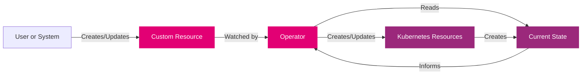
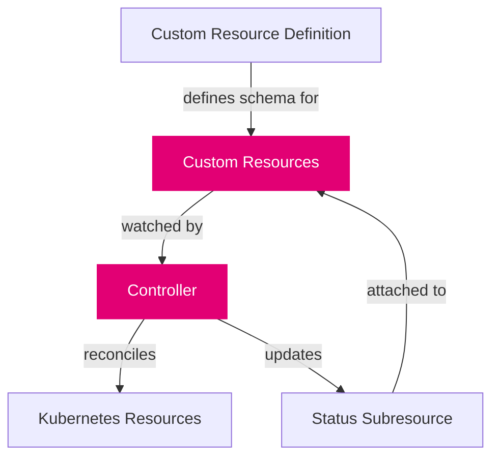

import PageHeader from '@site/src/components/PageHeader';
import FeatureCard from '@site/src/components/FeatureCard';
import CardGrid from '@site/src/components/CardGrid';
import InfoSection from '@site/src/components/InfoSection';
import ComponentTable from '@site/src/components/ComponentTable';
import NoAutoTitle from '@site/src/components/NoAutoTitle';

<NoAutoTitle />

<PageHeader 
  title="Control Plane Operators"
  description="Specialized controllers that extend Kubernetes with domain-specific functionality"
/>

## What are Operators?

  

    

      In addition to the core components, the control plane runs custom operators. These are specialized control loops designed to manage complex domain-specific applications and configurations. These operators extend Kubernetes functionality using the <a href="https://kubernetes.io/docs/concepts/extend-kubernetes/operator/">Operator pattern</a>, combining custom resource definitions (CRDs) with controllers that automate lifecycle management.
    

    

      Each operator encapsulates a distinct domain of responsibility, operating independently with minimal interdependencies, which promotes modularity, simplifies maintenance, and enhances the scalability of the overall control plane architecture.
    

  

  

    <FeatureCard
      title="Operator Benefits"
      description={
        <ul>
          <li>🔧 <b>Domain-specific logic</b></li>
          <li>🛠️ <b>Automated lifecycle management</b></li>
          <li>🔗 <b>Minimal interdependencies</b></li>
          <li>💡 <b>Specialized expertise</b></li>
        </ul>
      }
    />
  

## How Operators Work

<InfoSection type="info" title="Operator Pattern">
  Operators follow the Kubernetes controller pattern, continuously reconciling the actual state with the desired state. They extend the Kubernetes API with custom resources that represent application-specific concepts.
</InfoSection>

The basic operation of an operator consists of:

1. **Watching** for changes to specific custom resources
2. **Analyzing** the difference between desired and current state
3. **Taking action** to make the current state match the desired state
4. **Reporting** status back to the custom resource

## Control Plane Operators

The Control Plane includes the following specialized operators, each responsible for managing specific domain resources:

<ComponentTable 
  components={[
    {
      name: "Rover Operator",
      description: "Manages the lifecycle of Rover-domain resources such as Rovers and ApiSpecifications. Handles deployment, scaling, and monitoring of Rover resources.",
      link: {
        url: "https://github.com/telekom/controlplane/blob/main/rover/README.md"
      }
    },
    {
      name: "Application Operator",
      description: "Manages the lifecycle of resources of kind Application. Coordinates the deployment and configuration of application components.",
      link: {
        url: "https://github.com/telekom/controlplane/blob/main/application/README.md"
      }
    },
    {
      name: "Admin Operator",
      description: "Manages the lifecycle of Admin-domain resources such as Environments, Zones and RemoteOrganizations. Handles platform-level administrative functions.",
      link: {
        url: "https://github.com/telekom/controlplane/blob/main/admin/README.md"
      }
    },
    {
      name: "Organization Operator",
      description: "Manages the lifecycle of Organization-domain resources such as Groups and Teams. Handles organizational structure and membership.",
      link: {
        url: "https://github.com/telekom/controlplane/blob/main/organization/README.md"
      }
    },
    {
      name: "Api Operator",
      description: "Manages the lifecycle of API-domain resources such as Apis, ApiExposures, ApiSubscriptions and RemoteApiSubscriptions. Controls API visibility and access.",
      link: {
        url: "https://github.com/telekom/controlplane/blob/main/api/README.md"
      }
    },
    {
      name: "Gateway Operator",
      description: "Manages the lifecycle of Gateway-domain resources such as Gateways, Gateway-Realms, Consumers, Routes and ConsumerRoutes. Handles API routing and proxying.",
      link: {
        url: "https://github.com/telekom/controlplane/blob/main/gateway/README.md"
      }
    },
    {
      name: "Identity Operator",
      description: "Manages the lifecycle of Identity-domain resources such as IdentityProviders, Identity-Realms and Clients. Handles authentication and identity management.",
      link: {
        url: "https://github.com/telekom/controlplane/blob/main/identity/README.md"
      }
    },
    {
      name: "Approval Operator",
      description: "Manages the lifecycle of resources of kind Approval. Implements access control workflows and approval processes.",
      link: {
        url: "https://github.com/telekom/controlplane/blob/main/approval/README.md"
      }
    }
  ]}
/>

These operators work alongside the Kubernetes API server and etcd, watching for changes to custom resources and ensuring the actual state of their managed components aligns with the desired configuration.

## Operator Architecture

<InfoSection type="note" title="Modular Design">
  Control Plane operators are designed to be modular, with each operator focusing on a specific domain of responsibility.
</InfoSection>

Each operator in the Control Plane follows a similar architectural pattern:

### Core Components

1. **Custom Resource Definition (CRD)**: Defines the schema and validation for the custom resource
2. **Controller**: Implements the reconciliation logic
3. **Kubernetes Resources**: Standard or custom resources created and managed by the operator
4. **Status Subresource**: Used to report the current state of the managed resources

## Operator Interactions

<CardGrid columns={2}>
  <FeatureCard
    title="Rover & Application"
    description="The Rover Operator and Application Operator work together to deploy and manage application workloads, with Applications containing Rovers that are deployed to appropriate zones."
  />
  <FeatureCard
    title="API & Gateway"
    description="The API Operator and Gateway Operator collaborate to expose APIs to consumers, with the API Operator managing API definitions and the Gateway Operator handling routing and access control."
  />
  <FeatureCard
    title="Identity & Approval"
    description="The Identity Operator and Approval Operator cooperate on authentication and authorization, with the Identity Operator managing identities and the Approval Operator handling access approval workflows."
  />
  <FeatureCard
    title="Admin & Organization"
    description="The Admin Operator and Organization Operator establish the hierarchical structure, with Admin resources defining the platform environment and Organization resources defining team structure."
  />
</CardGrid>

For more details on how these operators interact within the overall system architecture, see the [Architecture](architecture) page.

## Custom Resources

Each operator defines and manages several custom resources. Here are some key custom resources:

<CardGrid columns={3}>
  <FeatureCard
    title="Application"
    description="Defines a logical grouping of related services and components that make up an application."
  />
  <FeatureCard
    title="Rover"
    description="Represents a deployable workload that can be scheduled on a Kubernetes cluster."
  />
  <FeatureCard
    title="API"
    description="Defines an API provided by a service, including its specifications and metadata."
  />
  <FeatureCard
    title="Team"
    description="Represents a development or operational team that owns and manages resources."
  />
  <FeatureCard
    title="Zone"
    description="Defines a deployment target with specific capabilities where workloads can run."
  />
  <FeatureCard
    title="Gateway"
    description="Configures API routing and access control for exposed services."
  />
</CardGrid>

## Related Pages

- [Components](components): Learn about the core components of the Control Plane
- [Architecture](architecture): See how operators fit into the overall system design
- [Infrastructure](infrastructure): Explore the underlying infrastructure components required by operators