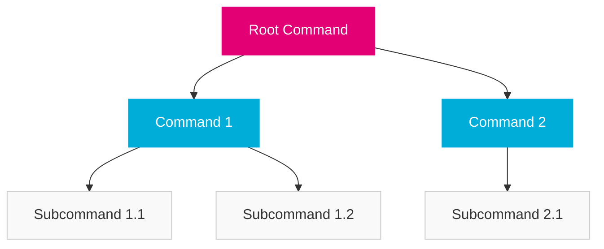
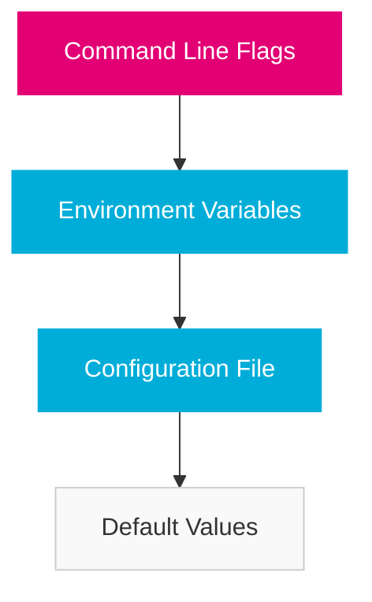

import PageHeader from '@site/src/components/PageHeader';
import FeatureCard from '@site/src/components/FeatureCard';
import CardGrid from '@site/src/components/CardGrid';
import InfoSection from '@site/src/components/InfoSection';
import FeatureGrid from '@site/src/components/FeatureGrid';
import NoAutoTitle from '@site/src/components/NoAutoTitle';

<NoAutoTitle />

<PageHeader 
  title="Cobra and Viper"
  description="CLI and configuration libraries for Go applications"
/>

[Cobra](https://github.com/spf13/cobra) and [Viper](https://github.com/spf13/viper) are foundational libraries used throughout the Control Plane for building CLIs and managing configuration.

<InfoSection type="info" title="Command and configuration framework">
  Cobra provides a framework for building sophisticated command-line interfaces, while Viper offers a complete configuration solution. Together, they form the backbone of the Control Plane's CLI tools and configuration management.
</InfoSection>

## Overview

<CardGrid columns={2}>
  <FeatureCard
    title="Cobra"
    description={<>
      <p>Cobra is a library for creating powerful command-line interfaces in Go. It's used in the Control Plane for building tools like:</p>
      <ul>
        <li>rover-ctl - The Control Plane management CLI</li>
        <li>route-tester - API route testing utility</li>
        <li>snapshotter - State capture tool</li>
        <li>Admin and maintenance utilities</li>
      </ul>
    </>}
  />
  
  <FeatureCard
    title="Viper"
    description={<>
      <p>Viper is a configuration solution for Go applications that prioritizes configuration sources and works with:</p>
      <ul>
        <li>JSON, TOML, YAML, and other config formats</li>
        <li>Environment variables</li>
        <li>Command line flags</li>
        <li>Remote config systems</li>
        <li>Live configuration reloading</li>
      </ul>
    </>}
  />
</CardGrid>

## Cobra in the Control Plane

<InfoSection type="tip" title="CLI development framework">
  Cobra's structured approach to command-line applications helps maintain consistency across all Control Plane CLIs.
</InfoSection>

### Command Structure

Cobra uses a command structure with the following components:



### Basic Usage Example

```go
// cmd/root.go
package cmd

import (
    "fmt"
    "os"

    "github.com/spf13/cobra"
)

var rootCmd = &cobra.Command{
    Use:   "rover-ctl",
    Short: "Rover Control is a CLI for managing Control Plane resources",
    Long: `Rover Control provides a command line interface to 
manage resources in the Control Plane, including deployments, 
configurations, and monitoring.`,
    Run: func(cmd *cobra.Command, args []string) {
        // Root command implementation
    },
}

func Execute() {
    if err := rootCmd.Execute(); err != nil {
        fmt.Fprintln(os.Stderr, err)
        os.Exit(1)
    }
}

func init() {
    // Initialize flags
    rootCmd.PersistentFlags().StringP("config", "c", "", "config file (default is $HOME/.rover-ctl.yaml)")
}
```

```go
// cmd/deploy.go
package cmd

import (
    "fmt"

    "github.com/spf13/cobra"
)

var deployCmd = &cobra.Command{
    Use:   "deploy [resource]",
    Short: "Deploy Control Plane resources",
    Long:  `Deploy Control Plane resources such as operators, services, and configurations.`,
    Run: func(cmd *cobra.Command, args []string) {
        fmt.Println("Deploying resources...")
    },
}

func init() {
    rootCmd.AddCommand(deployCmd)
    
    // Add flags specific to deploy command
    deployCmd.Flags().BoolP("force", "f", false, "Force deployment even if resources exist")
}
```

### Usage in rover-ctl

The Control Plane's primary CLI tool, rover-ctl, uses Cobra to define its command structure:

```
rover-ctl
├── deploy       # Deploy Control Plane components
│   ├── operator # Deploy specific operator
│   └── service  # Deploy specific service
├── config       # Manage configurations
│   ├── view     # View current configuration
│   ├── set      # Set configuration value
│   └── import   # Import configuration from file
├── get          # Get Control Plane resources
│   ├── operator # List operators
│   └── service  # List services
└── logs         # View logs for Control Plane components
```

<FeatureGrid columns={2} features={[
  {
    title: "🧩 Modular Commands",
    description: "Cobra enables modular command organization that scales with application complexity."
  },
  {
    title: "🚩 Integrated Flags",
    description: "Built-in flag support with Pflag library for consistent flag parsing."
  },
  {
    title: "📚 Automatic Help",
    description: "Automatic generation of help text based on command definitions."
  },
  {
    title: "⚙️ Shell Completions",
    description: "Generation of shell completion scripts for bash, zsh, and other shells."
  },
  {
    title: "🔄 Middleware Support",
    description: "Pre and post-run hooks for command execution."
  },
  {
    title: "🧪 Testable Commands",
    description: "Design that makes commands easy to test in isolation."
  }
]} />

### Best Practices for Cobra in Control Plane

<InfoSection type="note" title="CLI design patterns">
  The Control Plane follows these best practices for CLI design with Cobra.
</InfoSection>

<CardGrid columns={2}>
  <FeatureCard
    title="Command Organization"
    description={<>
      <p>Structure commands logically with a noun-verb pattern:</p>
      <ul>
        <li>Group related commands as subcommands</li>
        <li>Use consistent naming conventions</li>
        <li>Keep command hierarchy shallow (max 2-3 levels)</li>
        <li>Use clear, descriptive command names</li>
      </ul>
    </>}
  />
  
  <FeatureCard
    title="Flag Design"
    description={<>
      <p>Design flags for usability and consistency:</p>
      <ul>
        <li>Use short flags for common options</li>
        <li>Provide sensible defaults</li>
        <li>Use consistent flag names across commands</li>
        <li>Group related flags logically</li>
      </ul>
    </>}
  />
  
  <FeatureCard
    title="Error Handling"
    description={<>
      <p>Handle errors gracefully and informatively:</p>
      <ul>
        <li>Return detailed error messages</li>
        <li>Set appropriate exit codes</li>
        <li>Use color for error highlighting</li>
        <li>Provide suggestions for common errors</li>
      </ul>
    </>}
  />
  
  <FeatureCard
    title="User Experience"
    description={<>
      <p>Enhance user experience with:</p>
      <ul>
        <li>Progress indicators for long-running operations</li>
        <li>Colorized output for readability</li>
        <li>Confirmation prompts for destructive actions</li>
        <li>Verbose mode for debugging</li>
      </ul>
    </>}
  />
</CardGrid>

## Viper in the Control Plane

<InfoSection type="tip" title="Configuration management">
  Viper provides a complete configuration solution that gives the Control Plane flexibility in how configurations are loaded and prioritized.
</InfoSection>

### Configuration Precedence

Viper establishes a clear precedence for configuration sources:



### Basic Usage Example

```go
package config

import (
    "fmt"

    "github.com/spf13/viper"
)

// InitConfig initializes the configuration
func InitConfig(cfgFile string) error {
    if cfgFile != "" {
        // Use config file from the flag
        viper.SetConfigFile(cfgFile)
    } else {
        // Search for config in predefined locations
        viper.AddConfigPath(".")
        viper.AddConfigPath("$HOME/.controlplane")
        viper.AddConfigPath("/etc/controlplane")
        viper.SetConfigName("config")
    }

    // Read environment variables with CP_ prefix
    viper.SetEnvPrefix("CP")
    viper.AutomaticEnv()

    // Set defaults
    viper.SetDefault("server.port", 8080)
    viper.SetDefault("database.host", "localhost")
    viper.SetDefault("database.port", 5432)
    viper.SetDefault("log.level", "info")

    // Read the config file
    if err := viper.ReadInConfig(); err != nil {
        if _, ok := err.(viper.ConfigFileNotFoundError); !ok {
            return fmt.Errorf("error reading config file: %w", err)
        }
        // Config file not found, using defaults and env vars
    }

    return nil
}

// GetDatabaseConfig returns database configuration
func GetDatabaseConfig() DatabaseConfig {
    return DatabaseConfig{
        Host:     viper.GetString("database.host"),
        Port:     viper.GetInt("database.port"),
        User:     viper.GetString("database.user"),
        Password: viper.GetString("database.password"),
        Name:     viper.GetString("database.name"),
    }
}

// DatabaseConfig holds database connection configuration
type DatabaseConfig struct {
    Host     string
    Port     int
    User     string
    Password string
    Name     string
}
```

### Configuration Loading in Practice

The Control Plane uses a layered approach to configuration:

1. **Default Configuration**: Base settings defined in code
2. **Global Configuration**: System-wide settings in `/etc/controlplane`
3. **User Configuration**: User-specific settings in `~/.controlplane`
4. **Project Configuration**: Project-specific settings in the working directory
5. **Environment Variables**: Settings from environment variables with prefix
6. **Command Line Flags**: Explicitly specified settings via flags

<FeatureGrid columns={2} features={[
  {
    title: "🗃️ Multiple Formats",
    description: "Support for JSON, YAML, TOML, HCL, and other configuration formats."
  },
  {
    title: "🔄 Live Reloading",
    description: "Watch and reload configuration changes without application restart."
  },
  {
    title: "🧩 Nested Configuration",
    description: "Support for nested configuration structures with dot notation access."
  },
  {
    title: "🔌 Remote Config",
    description: "Integration with remote configuration systems like etcd or Consul."
  },
  {
    title: "🌐 Environment Variable Binding",
    description: "Automatic binding of environment variables to configuration keys."
  },
  {
    title: "🧬 Configuration Aliasing",
    description: "Create aliases for configuration keys for backward compatibility."
  }
]} />

### Best Practices for Viper in Control Plane

<InfoSection type="note" title="Configuration patterns">
  The Control Plane follows these best practices for configuration management with Viper.
</InfoSection>

<CardGrid columns={2}>
  <FeatureCard
    title="Configuration Structure"
    description={<>
      <p>Organize configuration logically:</p>
      <ul>
        <li>Group related settings under namespaces</li>
        <li>Use consistent naming conventions</li>
        <li>Keep configuration flat when possible</li>
        <li>Document all configuration options</li>
      </ul>
    </>}
  />
  
  <FeatureCard
    title="Environment Variables"
    description={<>
      <p>Standardized environment variable usage:</p>
      <ul>
        <li>Use CP_ prefix for all environment variables</li>
        <li>Use uppercase with underscores</li>
        <li>Map to dot notation config keys</li>
        <li>Document environment variable mappings</li>
      </ul>
    </>}
  />
  
  <FeatureCard
    title="Secret Management"
    description={<>
      <p>Handle sensitive configuration carefully:</p>
      <ul>
        <li>Never store secrets in version control</li>
        <li>Use environment variables for secrets</li>
        <li>Support external secret managers</li>
        <li>Mask secrets in logs and output</li>
      </ul>
    </>}
  />
  
  <FeatureCard
    title="Validation and Safety"
    description={<>
      <p>Ensure configuration is valid and safe:</p>
      <ul>
        <li>Validate configuration at startup</li>
        <li>Provide helpful error messages for invalid config</li>
        <li>Set reasonable defaults for all settings</li>
        <li>Use typed configuration access</li>
      </ul>
    </>}
  />
</CardGrid>

## Integration of Cobra and Viper

<InfoSection type="tip" title="Seamless integration">
  Cobra and Viper are designed to work together seamlessly, creating a powerful framework for CLI applications with sophisticated configuration management.
</InfoSection>

### Binding Flags to Configuration

The Control Plane binds command-line flags to Viper configuration:

```go
package cmd

import (
    "fmt"

    "github.com/spf13/cobra"
    "github.com/spf13/viper"
)

func init() {
    // Define flags
    rootCmd.PersistentFlags().StringP("log-level", "l", "info", "Logging level (debug, info, warn, error)")
    rootCmd.PersistentFlags().IntP("port", "p", 8080, "Server port")
    
    // Bind flags to Viper configuration
    viper.BindPFlag("log.level", rootCmd.PersistentFlags().Lookup("log-level"))
    viper.BindPFlag("server.port", rootCmd.PersistentFlags().Lookup("port"))
}
```

### Configuration Command Pattern

The Control Plane implements a common pattern for configuration management:

```go
var configCmd = &cobra.Command{
    Use:   "config",
    Short: "Manage configuration",
    Long:  `View, set, or import configuration for the Control Plane components.`,
}

var configViewCmd = &cobra.Command{
    Use:   "view",
    Short: "View current configuration",
    Run: func(cmd *cobra.Command, args []string) {
        format, _ := cmd.Flags().GetString("format")
        switch format {
        case "json":
            fmt.Println(viper.AllSettings())
        case "yaml":
            yaml, _ := yaml.Marshal(viper.AllSettings())
            fmt.Println(string(yaml))
        default:
            // Print in a human-readable format
            printConfiguration(viper.AllSettings())
        }
    },
}

func init() {
    configCmd.AddCommand(configViewCmd)
    configViewCmd.Flags().StringP("format", "f", "human", "Output format (human, json, yaml)")
}
```

### Real-World Example

A complete example of Cobra and Viper integration in rover-ctl:

```go
package cmd

import (
    "fmt"
    "os"
    "path/filepath"

    homedir "github.com/mitchellh/go-homedir"
    "github.com/spf13/cobra"
    "github.com/spf13/viper"
)

var cfgFile string
var verbose bool

var rootCmd = &cobra.Command{
    Use:   "rover-ctl",
    Short: "Rover Control Tool",
    Long:  `A CLI tool for managing the Control Plane resources.`,
}

func Execute() {
    if err := rootCmd.Execute(); err != nil {
        fmt.Fprintln(os.Stderr, err)
        os.Exit(1)
    }
}

func init() {
    cobra.OnInitialize(initConfig)

    rootCmd.PersistentFlags().StringVar(&cfgFile, "config", "", "config file (default is $HOME/.rover-ctl.yaml)")
    rootCmd.PersistentFlags().BoolVarP(&verbose, "verbose", "v", false, "Enable verbose output")
    rootCmd.PersistentFlags().StringP("kubeconfig", "k", "", "Path to kubeconfig file")
    
    viper.BindPFlag("kubeconfig", rootCmd.PersistentFlags().Lookup("kubeconfig"))
    viper.BindPFlag("verbose", rootCmd.PersistentFlags().Lookup("verbose"))
}

func initConfig() {
    if cfgFile != "" {
        // Use config file from the flag
        viper.SetConfigFile(cfgFile)
    } else {
        // Find home directory
        home, err := homedir.Dir()
        if err != nil {
            fmt.Fprintln(os.Stderr, err)
            os.Exit(1)
        }

        // Search for config in standard locations
        viper.AddConfigPath(filepath.Join(home, ".rover-ctl"))
        viper.AddConfigPath("/etc/rover-ctl")
        viper.AddConfigPath(".")
        viper.SetConfigName("config")
    }

    // Read environment variables
    viper.SetEnvPrefix("ROVER")
    viper.AutomaticEnv()

    // If a config file is found, read it in
    if err := viper.ReadInConfig(); err == nil {
        if verbose {
            fmt.Println("Using config file:", viper.ConfigFileUsed())
        }
    }
}
```

## Control Plane CLI Components

The Control Plane includes several CLI tools built with Cobra and Viper:

<CardGrid columns={2}>
  <FeatureCard
    title="rover-ctl"
    description={<>
      <p>The primary management CLI for the Control Plane:</p>
      <ul>
        <li>Resource deployment and management</li>
        <li>Configuration management</li>
        <li>Monitoring and diagnostics</li>
        <li>User and access management</li>
      </ul>
    </>}
  />
  
  <FeatureCard
    title="route-tester"
    description={<>
      <p>A utility for testing API routes:</p>
      <ul>
        <li>Route validation</li>
        <li>Performance testing</li>
        <li>Authentication testing</li>
        <li>Response validation</li>
      </ul>
    </>}
  />
  
  <FeatureCard
    title="snapshotter"
    description={<>
      <p>A tool for capturing system state:</p>
      <ul>
        <li>Resource state capture</li>
        <li>Configuration export</li>
        <li>Diagnostic information collection</li>
        <li>Snapshot comparison</li>
      </ul>
    </>}
  />
  
  <FeatureCard
    title="controller-gen"
    description={<>
      <p>Code generation utility for controllers:</p>
      <ul>
        <li>CRD generation from Go types</li>
        <li>RBAC manifest generation</li>
        <li>OpenAPI schema generation</li>
        <li>Webhook configuration generation</li>
      </ul>
    </>}
  />
</CardGrid>

## Common Configuration Patterns

<InfoSection type="note" title="Configuration management patterns">
  Common patterns for configuration management in the Control Plane.
</InfoSection>

<FeatureGrid columns={2} features={[
  {
    title: "🔒 Secure Configuration",
    description: "Support for encrypted configuration values and external secret managers."
  },
  {
    title: "📊 Environment-Specific Config",
    description: "Environment-aware configuration loading (dev, staging, production)."
  },
  {
    title: "📝 Schema Validation",
    description: "JSON Schema validation for configuration files to catch errors early."
  },
  {
    title: "🔄 Configuration Reloading",
    description: "Hot reloading of configuration changes without service restart."
  },
  {
    title: "📦 Cascading Configuration",
    description: "Layered configuration from system to user to project levels."
  },
  {
    title: "🌐 Remote Configuration",
    description: "Support for loading configuration from centralized services."
  }
]} />

### Example Configuration Structure

```yaml
# config.yaml
server:
  host: 0.0.0.0
  port: 8080
  timeoutSeconds: 30
  tls:
    enabled: true
    certFile: /etc/controlplane/certs/server.crt
    keyFile: /etc/controlplane/certs/server.key

database:
  host: postgres
  port: 5432
  user: controlplane
  password: ${CP_DB_PASSWORD}  # Interpolated from environment
  name: controlplane
  poolSize: 10
  sslMode: require

logging:
  level: info  # debug, info, warn, error
  format: json  # text, json
  output: stdout  # stdout, file
  file: /var/log/controlplane.log
  
metrics:
  enabled: true
  endpoint: /metrics
  interval: 15s
```

## Related Resources

<CardGrid columns={2}>
  <FeatureCard
    title="Go Language"
    description="Learn about the foundation language used for all Control Plane components."
    linkText="View Go Language"
    linkUrl="golang"
  />
  
  <FeatureCard
    title="CLI Overview"
    description="Explore the CLI tools available in the Control Plane."
    linkText="View CLI Overview"
    linkUrl="../../Overview/clis"
  />
  
  <FeatureCard
    title="Official Cobra Documentation"
    description="Visit the official Cobra documentation for comprehensive guides."
    linkText="Visit Cobra"
    linkUrl="https://github.com/spf13/cobra"
  />
  
  <FeatureCard
    title="Official Viper Documentation"
    description="Visit the official Viper documentation for detailed configuration options."
    linkText="Visit Viper"
    linkUrl="https://github.com/spf13/viper"
  />
</CardGrid>