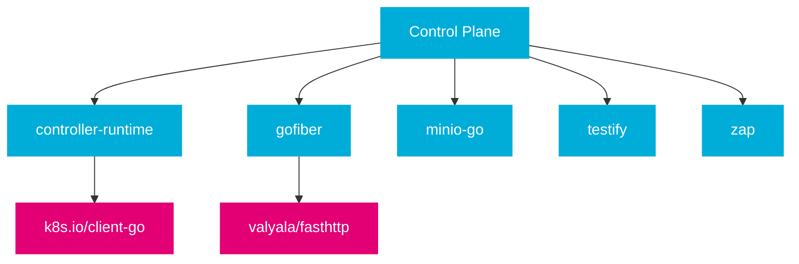

import PageHeader from '@site/src/components/PageHeader';
import FeatureCard from '@site/src/components/FeatureCard';
import CardGrid from '@site/src/components/CardGrid';
import InfoSection from '@site/src/components/InfoSection';
import FeatureGrid from '@site/src/components/FeatureGrid';
import NoAutoTitle from '@site/src/components/NoAutoTitle';

<NoAutoTitle />

<PageHeader 
  title="Go Language"
  description="The foundation of the Control Plane's architecture"
/>

The Control Plane is primarily implemented in Go version 1.24.4, taking advantage of the language's concurrency features, strong typing, and excellent standard library.

<InfoSection type="info" title="Go in the Control Plane">
  Go serves as the foundational programming language for the Control Plane, powering its microservices, operators, and shared libraries. Its performance characteristics and ecosystem make it ideal for cloud-native applications.
</InfoSection>

## Why Go?

<FeatureGrid columns={2} features={[
  {
    title: "☁️ Cloud-native ecosystem",
    description: "Go is the de-facto standard for Kubernetes and cloud-native applications, with extensive libraries and tooling."
  },
  {
    title: "⚡ Concurrency model",
    description: "Goroutines and channels provide efficient handling of concurrent operations with minimal overhead."
  },
  {
    title: "🔒 Static typing",
    description: "Catches errors at compile time, reducing runtime issues and improving code reliability."
  },
  {
    title: "🧩 Cross-compilation",
    description: "Easy to build for different platforms, simplifying deployment across diverse environments."
  },
  {
    title: "📚 Rich standard library",
    description: "Reduces dependency on third-party packages, improving stability and security."
  },
  {
    title: "🧪 Built-in testing",
    description: "Native support for unit tests and benchmarking, encouraging a test-driven approach."
  }
]} />

## Key Go Patterns Used

<InfoSection type="tip" title="Idiomatic Go">
  The Control Plane follows idiomatic Go patterns to ensure maintainable, readable, and efficient code.
</InfoSection>

### Context Propagation

The Control Plane extensively uses Go's context package for propagating deadlines, cancellation signals, and request-scoped values.

```go
func (c *Controller) ProcessFile(ctx context.Context, fileID string) error {
    // Context is passed through the call stack
    logger := log.FromContext(ctx).WithValues("fileID", fileID)
    
    // Create child context with timeout
    ctxWithTimeout, cancel := context.WithTimeout(ctx, 30*time.Second)
    defer cancel()
    
    return c.backend.ProcessFile(ctxWithTimeout, fileID)
}
```

<InfoSection type="note" title="Context best practices">
  Always pass context as the first parameter and ensure proper cancellation to prevent resource leaks. Use context values sparingly and only for request-scoped data that crosses API boundaries.
</InfoSection>

### Error Handling

We follow idiomatic Go error handling patterns:

```go
func (s *service) UploadFile(ctx context.Context, fileID string, content []byte) error {
    if fileID == "" {
        return errors.New("fileID cannot be empty")
    }
    
    err := s.validateFileContent(content)
    if err != nil {
        return fmt.Errorf("invalid file content: %w", err)
    }
    
    return s.storage.Store(ctx, fileID, content)
}
```

<InfoSection type="warning" title="Error wrapping">
  Use error wrapping with %w to maintain error context while allowing error checks with errors.Is() and errors.As(). This preserves the error chain for better diagnostics.
</InfoSection>

### Interfaces

Interfaces are defined by consumers rather than implementers, following Go's interface philosophy:

```go
// Defined by the consumer
type FileStorage interface {
    Store(ctx context.Context, id string, content []byte) error
    Retrieve(ctx context.Context, id string) ([]byte, error)
}

// Implemented elsewhere
type S3Storage struct {
    client *minio.Client
    bucket string
}

func (s *S3Storage) Store(ctx context.Context, id string, content []byte) error {
    // Implementation
}
```

<CardGrid columns={2}>
  <FeatureCard
    title="Interface Design Philosophy"
    description={
      <>
        <p>In Go, interfaces are designed to be:</p>
        <ul>
          <li><strong>Small</strong> - Focused on specific behavior</li>
          <li><strong>Composable</strong> - Can be combined to form more complex behaviors</li>
          <li><strong>Consumer-defined</strong> - Created by the code that uses them</li>
        </ul>
        <p>This approach leads to more maintainable and flexible code.</p>
      </>
    }
  />
  
  <FeatureCard
    title="Interface Implementation Pattern"
    description={
      <>
        <p>The Control Plane follows these interface implementation patterns:</p>
        <ul>
          <li>Define interfaces in the package that uses them</li>
          <li>Keep interfaces small and focused on specific behavior</li>
          <li>Use interface composition for complex behaviors</li>
          <li>Create mock implementations for testing</li>
        </ul>
      </>
    }
  />
</CardGrid>

## Go Modules and Dependencies

The Control Plane uses Go modules for dependency management. Key dependencies include:

<InfoSection type="note" title="Dependency management">
  All dependencies are versioned and tracked in go.mod files, ensuring reproducible builds and controlled updates.
</InfoSection>



### Key Dependencies

<FeatureGrid columns={2} features={[
  {
    title: "sigs.k8s.io/controller-runtime",
    description: "Framework for building Kubernetes operators, providing tools for handling custom resources and implementing controllers."
  },
  {
    title: "github.com/gofiber/fiber/v2",
    description: "Fast HTTP framework used for building API servers and web services with minimal overhead and maximum performance."
  },
  {
    title: "github.com/minio/minio-go/v7",
    description: "S3-compatible storage client for interfacing with object storage systems, used primarily in the file-manager component."
  },
  {
    title: "github.com/stretchr/testify",
    description: "Testing utilities that simplify writing assertions, mocks, and test suites for comprehensive test coverage."
  },
  {
    title: "go.uber.org/zap",
    description: "Structured logging library that provides fast, leveled, structured logging with minimal allocations."
  }
]} />

## Best Practices

<CardGrid columns={2}>
  <FeatureCard
    title="Code Organization"
    description={
      <>
        <p>We follow these organization principles:</p>
        <ul>
          <li>Package by feature, not by layer</li>
          <li>Keep related code together</li>
          <li>Minimize package dependencies</li>
          <li>Use internal packages for implementation details</li>
        </ul>
      </>
    }
  />
  
  <FeatureCard
    title="Error Handling"
    description={
      <>
        <p>Our error handling practices include:</p>
        <ul>
          <li>Return errors rather than panicking</li>
          <li>Use error wrapping for context</li>
          <li>Create custom error types when needed</li>
          <li>Always check returned errors</li>
        </ul>
      </>
    }
  />
  
  <FeatureCard
    title="Testing"
    description={
      <>
        <p>Testing guidelines include:</p>
        <ul>
          <li>Write table-driven tests</li>
          <li>Use subtests for better organization</li>
          <li>Mock dependencies for unit tests</li>
          <li>Use testify for assertions</li>
        </ul>
      </>
    }
  />
  
  <FeatureCard
    title="Performance"
    description={
      <>
        <p>Performance considerations include:</p>
        <ul>
          <li>Minimize allocations in hot paths</li>
          <li>Use sync.Pool for frequently allocated objects</li>
          <li>Profile before optimizing</li>
          <li>Consider concurrency for I/O-bound operations</li>
        </ul>
      </>
    }
  />
</CardGrid>

## Go Version Compatibility

The Control Plane is built with Go 1.24.4 and takes advantage of several modern Go features:

<InfoSection type="note" title="Go version support">
  The Control Plane requires Go 1.24 or later for development due to its use of features like generics and improved error handling.
</InfoSection>

| Feature | Go Version | Used in Control Plane |
|---------|------------|----------------------|
| Generics | Go 1.18+ | Type-safe collections and algorithms |
| Error wrapping | Go 1.13+ | Enhanced error context and diagnostics |
| Embed directive | Go 1.16+ | Embedding static files in binaries |
| Module support | Go 1.16+ | Dependency management |
| Interface satisfaction | Go 1.20+ | Compile-time interface checks |

## Related Resources

<CardGrid columns={3}>
  <FeatureCard
    title="Kubernetes"
    description="Learn about the Control Plane's integration with Kubernetes."
    linkText="View Kubernetes"
    linkUrl="../Core-Technologies/kubernetes"
  />
  
  <FeatureCard
    title="Gofiber"
    description="Explore the web framework used in the Control Plane's APIs."
    linkText="View Gofiber"
    linkUrl="../Web-Frameworks/gofiber"
  />
  
  <FeatureCard
    title="Testing"
    description="Learn about the testing tools and practices used in the project."
    linkText="View Testing"
    linkUrl="../Testing/testify"
  />
</CardGrid>