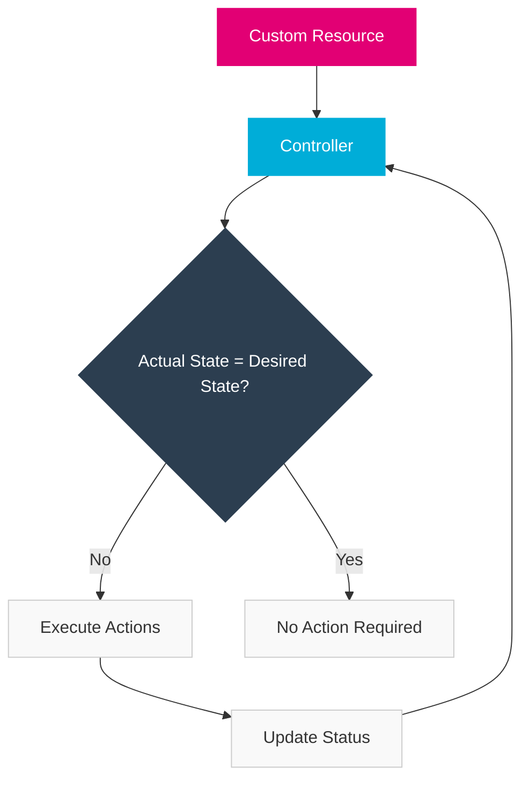
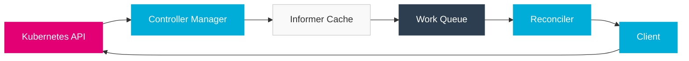

import PageHeader from '@site/src/components/PageHeader';
import FeatureCard from '@site/src/components/FeatureCard';
import CardGrid from '@site/src/components/CardGrid';
import InfoSection from '@site/src/components/InfoSection';
import FeatureGrid from '@site/src/components/FeatureGrid';
import NoAutoTitle from '@site/src/components/NoAutoTitle';

<NoAutoTitle />

<PageHeader 
  title="Kubernetes & Operators"
  description="Cloud-native infrastructure and extension patterns"
/>

The Control Plane extensively uses Kubernetes and the Operator pattern to manage resources and implement business logic.

<InfoSection type="info" title="Kubernetes at the core">
  Kubernetes serves as the foundation for the Control Plane, providing a robust platform for deploying, scaling, and managing containerized services. The Control Plane extends Kubernetes with custom resources and operators to implement domain-specific functionality.
</InfoSection>

## Why Kubernetes?

<FeatureGrid columns={2} features={[
  {
    title: "🚀 Container Orchestration",
    description: "Automated deployment, scaling, and management of containerized applications."
  },
  {
    title: "⚖️ Workload Distribution",
    description: "Efficient distribution of application instances across infrastructure."
  },
  {
    title: "🔄 Self-healing",
    description: "Automatic recovery from failures with restart, replacement, and rescheduling capabilities."
  },
  {
    title: "📈 Horizontal Scaling",
    description: "Automatic scaling based on resource usage and custom metrics."
  },
  {
    title: "🔌 Service Discovery",
    description: "Built-in DNS for service-to-service communication."
  },
  {
    title: "🔧 Extensibility",
    description: "Custom Resource Definitions (CRDs) and API extensions."
  }
]} />

## Kubernetes Operators

<InfoSection type="tip" title="Operator pattern">
  The Operator pattern extends Kubernetes with domain-specific knowledge, allowing for automated management of complex stateful applications.
</InfoSection>

Kubernetes operators are software extensions to Kubernetes that use custom resources to manage applications and their components. The Control Plane implements several operators:

<CardGrid columns={3}>
  <FeatureCard
    title="API Operator"
    description={
      <>
        <p>Manages API lifecycle including:</p>
        <ul>
          <li>API definitions and versioning</li>
          <li>API exposures and visibility</li>
          <li>Subscription management</li>
          <li>API documentation</li>
          <li>Schema validation</li>
        </ul>
      </>
    }
  />
  
  <FeatureCard
    title="Gateway Operator"
    description={
      <>
        <p>Controls API gateway configurations:</p>
        <ul>
          <li>Route management</li>
          <li>Traffic policies</li>
          <li>Rate limiting</li>
          <li>Authentication integration</li>
          <li>Gateway deployments</li>
        </ul>
      </>
    }
  />
  
  <FeatureCard
    title="Identity Operator"
    description={
      <>
        <p>Handles identity management:</p>
        <ul>
          <li>Identity provider integration</li>
          <li>Client registrations</li>
          <li>Token management</li>
          <li>OIDC configuration</li>
          <li>Credential rotation</li>
        </ul>
      </>
    }
  />
</CardGrid>

### How Operators Work

<InfoSection type="note" title="Reconciliation loop">
  Operators follow the Kubernetes reconciliation pattern, continuously monitoring resources and bringing the actual state in line with the desired state.
</InfoSection>



## Controller Runtime

<InfoSection type="tip" title="Core library">
  The controller-runtime library provides the foundation for building Kubernetes operators in the Control Plane, offering high-level abstractions for interacting with the Kubernetes API.
</InfoSection>

The Control Plane uses the [controller-runtime](https://github.com/kubernetes-sigs/controller-runtime) library (v0.21.0) to build Kubernetes operators. This library provides high-level APIs for:

<FeatureGrid columns={2} features={[
  {
    title: "🎮 Controllers",
    description: "Creating and managing controllers that reconcile resources."
  },
  {
    title: "📋 Custom Resources",
    description: "Working with custom resource definitions and instances."
  },
  {
    title: "🔄 Reconciliation",
    description: "Implementing reconciliation loops for maintaining desired state."
  },
  {
    title: "📣 Events",
    description: "Managing events, predicates, and webhooks for resource notifications."
  },
  {
    title: "🔌 Client-Go Integration",
    description: "Seamless integration with Kubernetes client-go library."
  },
  {
    title: "📊 Metrics",
    description: "Built-in metrics for monitoring controller performance."
  }
]} />

### Example Controller Implementation

```go
func (r *FileManagerReconciler) Reconcile(ctx context.Context, req ctrl.Request) (ctrl.Result, error) {
    log := r.Log.WithValues("filemanager", req.NamespacedName)
    
    // Fetch the FileManager resource
    fileManager := &apiV1.FileManager{}
    if err := r.Get(ctx, req.NamespacedName, fileManager); err != nil {
        return ctrl.Result{}, client.IgnoreNotFound(err)
    }
    
    // Implement controller logic
    if fileManager.Spec.Storage.Type == "s3" {
        // Configure S3 backend
        if err := r.configureS3Backend(ctx, fileManager); err != nil {
            log.Error(err, "Failed to configure S3 backend")
            return ctrl.Result{Requeue: true}, err
        }
    }
    
    // Update status
    fileManager.Status.Ready = true
    if err := r.Status().Update(ctx, fileManager); err != nil {
        log.Error(err, "Failed to update FileManager status")
        return ctrl.Result{Requeue: true}, err
    }
    
    return ctrl.Result{}, nil
}
```

### Controller Architecture

<InfoSection type="note" title="Controller design">
  The Control Plane follows best practices for controller design, including separation of concerns, idempotent operations, and level-triggered reconciliation.
</InfoSection>



## Custom Resources

<InfoSection type="note" title="Domain-specific extensions">
  The Control Plane extends the Kubernetes API with custom resources that model domain-specific concepts and enable declarative configuration.
</InfoSection>

The Control Plane defines several Custom Resource Definitions (CRDs) that extend the Kubernetes API. Examples include:

<CardGrid columns={3}>
  <FeatureCard
    title="API"
    description={
      <>
        <p>Represents an API specification with properties for:</p>
        <ul>
          <li>API version and name</li>
          <li>OpenAPI specification reference</li>
          <li>Visibility and access control</li>
          <li>Documentation URLs</li>
          <li>Security requirements</li>
        </ul>
      </>
    }
  />
  
  <FeatureCard
    title="Gateway"
    description={
      <>
        <p>Represents an API gateway instance with:</p>
        <ul>
          <li>Gateway type and version</li>
          <li>Listener configurations</li>
          <li>Route definitions</li>
          <li>Plugin configurations</li>
          <li>Health check endpoints</li>
        </ul>
      </>
    }
  />
  
  <FeatureCard
    title="FileManager"
    description={
      <>
        <p>Represents a file storage service with:</p>
        <ul>
          <li>Storage backend type</li>
          <li>Authentication configuration</li>
          <li>Upload/download policies</li>
          <li>Retention settings</li>
          <li>Access permissions</li>
        </ul>
      </>
    }
  />
</CardGrid>

### Example CRD

```yaml
apiVersion: apiextensions.k8s.io/v1
kind: CustomResourceDefinition
metadata:
  name: filemanagers.storage.cp.ei.telekom.de
spec:
  group: storage.cp.ei.telekom.de
  names:
    kind: FileManager
    plural: filemanagers
    singular: filemanager
  scope: Namespaced
  versions:
    - name: v1
      served: true
      storage: true
      schema:
        openAPIV3Schema:
          type: object
          properties:
            spec:
              type: object
              properties:
                storage:
                  type: object
                  properties:
                    type:
                      type: string
                      enum: ["s3"]
                    s3:
                      type: object
                      properties:
                        endpoint:
                          type: string
                        bucket:
                          type: string
            status:
              type: object
              properties:
                ready:
                  type: boolean
```

### Custom Resource Validation

<InfoSection type="tip" title="Schema validation">
  The Control Plane uses OpenAPI v3 schemas to validate custom resources, ensuring that only valid configurations are accepted.
</InfoSection>

<CardGrid columns={2}>
  <FeatureCard
    title="Schema-based Validation"
    description={
      <>
        <p>CRDs include comprehensive schemas for:</p>
        <ul>
          <li>Type validation (string, number, boolean, etc.)</li>
          <li>Pattern matching with regular expressions</li>
          <li>Enumeration of allowed values</li>
          <li>Required fields and defaults</li>
          <li>Maximum and minimum constraints</li>
        </ul>
      </>
    }
  />
  
  <FeatureCard
    title="Admission Webhooks"
    description={
      <>
        <p>For advanced validation beyond schemas:</p>
        <ul>
          <li>Cross-field validation logic</li>
          <li>Existence checks against other resources</li>
          <li>Custom business rule enforcement</li>
          <li>Defaulting of complex fields</li>
          <li>Status calculation and updates</li>
        </ul>
      </>
    }
  />
</CardGrid>

## Kubebuilder

<InfoSection type="tip" title="Development framework">
  Kubebuilder provides the scaffolding and tooling used to develop the Control Plane's operators and custom resources.
</InfoSection>

[Kubebuilder](https://book.kubebuilder.io/) is used as a framework for building Kubernetes APIs using CRDs, controllers, and webhooks. It provides:

<FeatureGrid columns={2} features={[
  {
    title: "🏗️ Scaffolding",
    description: "Generate code and manifests for new API types and controllers."
  },
  {
    title: "🧪 Testing",
    description: "Framework for controller and webhook testing with envtest."
  },
  {
    title: "🔒 RBAC",
    description: "Automatic generation of role-based access control manifests."
  },
  {
    title: "🔍 Webhooks",
    description: "Infrastructure for validation and defaulting webhooks."
  },
  {
    title: "📖 Documentation",
    description: "Marker-based API documentation generation."
  },
  {
    title: "🔧 CLI Tools",
    description: "Command-line tools for project management and scaffolding."
  }
]} />

The Control Plane follows the Kubebuilder project structure:

```
├── api/
│   └── v1/
│       ├── filemanager_types.go
│       ├── groupversion_info.go
│       └── zz_generated.deepcopy.go
├── controllers/
│   ├── filemanager_controller.go
│   └── suite_test.go
├── config/
│   ├── crd/
│   │   └── bases/
│   │       └── storage.cp.ei.telekom.de_filemanagers.yaml
│   ├── rbac/
│   │   ├── role.yaml
│   │   └── role_binding.yaml
│   ├── manager/
│   │   └── manager.yaml
│   └── samples/
│       └── storage_v1_filemanager.yaml
└── main.go
```

## Deployment Model

<InfoSection type="note" title="Kubernetes-native deployment">
  The Control Plane components are deployed as standard Kubernetes resources, leveraging the platform's built-in capabilities for high availability and scaling.
</InfoSection>

The Control Plane components are deployed as standard Kubernetes resources:

<CardGrid columns={2}>
  <FeatureCard
    title="Deployments"
    description={
      <>
        <p>Used for controller managers and API servers with:</p>
        <ul>
          <li>Multiple replicas for high availability</li>
          <li>Rolling update strategy for zero downtime</li>
          <li>Resource limits and requests</li>
          <li>Health probes for reliability</li>
        </ul>
      </>
    }
  />
  
  <FeatureCard
    title="Services"
    description={
      <>
        <p>Expose APIs with:</p>
        <ul>
          <li>ClusterIP for internal communication</li>
          <li>LoadBalancer for external access</li>
          <li>Named ports for clarity</li>
          <li>Session affinity when needed</li>
        </ul>
      </>
    }
  />
  
  <FeatureCard
    title="ConfigMaps"
    description={
      <>
        <p>Store configuration data:</p>
        <ul>
          <li>Controller settings</li>
          <li>Feature flags</li>
          <li>Environment-specific values</li>
          <li>Template files</li>
        </ul>
      </>
    }
  />
  
  <FeatureCard
    title="Secrets"
    description={
      <>
        <p>Store sensitive data:</p>
        <ul>
          <li>API keys</li>
          <li>Credentials</li>
          <li>TLS certificates</li>
          <li>Encryption keys</li>
        </ul>
      </>
    }
  />
  
  <FeatureCard
    title="NetworkPolicies"
    description={
      <>
        <p>Secure network traffic with:</p>
        <ul>
          <li>Pod-to-pod communication rules</li>
          <li>Namespace isolation</li>
          <li>Ingress/egress controls</li>
          <li>Protocol and port restrictions</li>
        </ul>
      </>
    }
  />
  
  <FeatureCard
    title="PodDisruptionBudgets"
    description={
      <>
        <p>Ensure availability during disruptions:</p>
        <ul>
          <li>Minimum available replicas</li>
          <li>Maximum unavailable replicas</li>
          <li>Protection during node maintenance</li>
          <li>Controlled rollouts</li>
        </ul>
      </>
    }
  />
</CardGrid>

### High Availability Configuration

<InfoSection type="tip" title="Resilience">
  Control Plane components are designed for high availability with multiple replicas, anti-affinity rules, and careful resource management.
</InfoSection>

```yaml
apiVersion: apps/v1
kind: Deployment
metadata:
  name: api-operator
  namespace: controlplane-system
spec:
  replicas: 3
  selector:
    matchLabels:
      app: api-operator
  strategy:
    rollingUpdate:
      maxSurge: 1
      maxUnavailable: 1
    type: RollingUpdate
  template:
    metadata:
      labels:
        app: api-operator
    spec:
      affinity:
        podAntiAffinity:
          preferredDuringSchedulingIgnoredDuringExecution:
          - weight: 100
            podAffinityTerm:
              labelSelector:
                matchExpressions:
                - key: app
                  operator: In
                  values:
                  - api-operator
              topologyKey: kubernetes.io/hostname
      containers:
      - name: manager
        image: controlplane/api-operator:latest
        resources:
          limits:
            cpu: 500m
            memory: 512Mi
          requests:
            cpu: 100m
            memory: 128Mi
        livenessProbe:
          httpGet:
            path: /healthz
            port: 8081
        readinessProbe:
          httpGet:
            path: /readyz
            port: 8081
```

## Related Resources

<CardGrid columns={2}>
  <FeatureCard
    title="Go Language"
    description="Learn about the programming language used to build the Control Plane operators."
    linkText="View Go Language"
    linkUrl="golang"
  />
  
  <FeatureCard
    title="Infrastructure"
    description="Explore the infrastructure components of the Control Plane."
    linkText="View Infrastructure"
    linkUrl="../../Overview/infrastructure"
  />
</CardGrid>