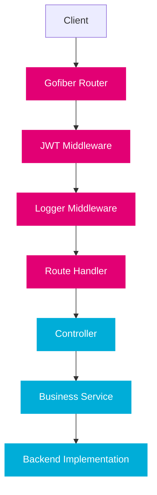

import PageHeader from '@site/src/components/PageHeader';
import FeatureCard from '@site/src/components/FeatureCard';
import CardGrid from '@site/src/components/CardGrid';
import InfoSection from '@site/src/components/InfoSection';
import FeatureGrid from '@site/src/components/FeatureGrid';
import NoAutoTitle from '@site/src/components/NoAutoTitle';

<NoAutoTitle />

<PageHeader 
  title="Gofiber Web Framework"
  description="High-performance web framework for the Control Plane's API services"
/>

The Control Plane uses Gofiber v2.52.8 as its primary HTTP framework, particularly in the file-manager and secret-manager components.

<InfoSection type="info" title="Performance-focused HTTP framework">
  Gofiber is an Express-inspired web framework for Go built on top of Fasthttp, providing exceptional performance while maintaining developer-friendly APIs.
</InfoSection>

## Introduction to Gofiber

[Gofiber](https://gofiber.io/) is an Express-inspired web framework for Go that's built on top of Fasthttp, the fastest HTTP engine for Go. It provides a robust set of features with minimal overhead and maximum performance.

<div align="center">
  
</div>

## Why Gofiber?

<FeatureGrid columns={2} features={[
  {
    title: "⚡ Performance",
    description: "Built on Fasthttp, offering high throughput and low latency for API services."
  },
  {
    title: "🪶 Low memory footprint",
    description: "Efficient resource utilization, critical for containerized deployments."
  },
  {
    title: "🔄 Middleware support",
    description: "Extensible middleware system for cross-cutting concerns like logging and authentication."
  },
  {
    title: "🧩 Express-like API",
    description: "Familiar for developers with Node.js experience, reducing learning curve."
  },
  {
    title: "🗂️ Route grouping",
    description: "Structured API organization through logical grouping of related endpoints."
  }
]} />

## Basic Usage Example

Here's a simplified example of how Gofiber is used in the Control Plane:

```go
func setupRoutes(app *fiber.App, controller *Controller) {
    // Group API routes
    api := app.Group("/api/v1")
    
    // Apply middleware to all routes in this group
    api.Use(middleware.JWT())
    api.Use(middleware.Logger())
    
    // Define routes
    api.Get("/files/:id", controller.GetFile)
    api.Put("/files/:id", controller.UploadFile)
}

// Handler function
func (c *Controller) GetFile(ctx *fiber.Ctx) error {
    fileID := ctx.Params("id")
    
    file, err := c.service.GetFile(ctx.Context(), fileID)
    if err != nil {
        return fiber.NewError(fiber.StatusNotFound, "File not found")
    }
    
    return ctx.Send(file)
}
```

<InfoSection type="tip" title="Routing best practices">
  Group related endpoints under a common prefix and apply shared middleware to route groups rather than individual routes. This keeps your code DRY and makes middleware management more maintainable.
</InfoSection>

## Gofiber Architecture in Control Plane

<CardGrid columns={2}>
  <FeatureCard
    title="API Layer"
    description={
      <>
        <p>The Control Plane API layer uses Gofiber to:</p>
        <ul>
          <li>Define RESTful API endpoints</li>
          <li>Handle HTTP requests and responses</li>
          <li>Apply cross-cutting concerns via middleware</li>
          <li>Validate request payloads</li>
          <li>Handle content negotiation</li>
        </ul>
      </>
    }
  />
  
  <FeatureCard
    title="Controller Layer"
    description={
      <>
        <p>Controllers in the Control Plane:</p>
        <ul>
          <li>Map HTTP requests to business logic</li>
          <li>Handle parameter extraction and validation</li>
          <li>Manage request/response serialization</li>
          <li>Implement proper error handling</li>
          <li>Apply resource-specific authorization</li>
        </ul>
      </>
    }
  />
</CardGrid>



## JWT Authentication

<InfoSection type="note" title="Secure by default">
  All API endpoints in the Control Plane are secured by JWT authentication middleware by default, with specific public routes explicitly marked as unauthenticated.
</InfoSection>

The Control Plane uses Gofiber's JWT middleware for authentication:

```go
import "github.com/gofiber/contrib/jwt"

func setupAuth(app *fiber.App) {
    app.Use(jwt.New(jwt.Config{
        SigningKey:    []byte(os.Getenv("JWT_SECRET")),
        ErrorHandler: jwtError,
    }))
}

func jwtError(c *fiber.Ctx, err error) error {
    return c.Status(fiber.StatusUnauthorized).JSON(fiber.Map{
        "error": "Unauthorized",
        "message": "Invalid or expired JWT",
    })
}
```

## Custom Middleware

The project includes several custom middleware components built on Gofiber:

<FeatureGrid columns={2} features={[
  {
    title: "📝 Request Logging",
    description: "Structured logging of requests with contextual information like request ID, user, and timing."
  },
  {
    title: "📊 Metrics Collection",
    description: "Prometheus metrics for request counts, latency, and error rates."
  },
  {
    title: "🛡️ Panic Recovery",
    description: "Gracefully handles panics in request handlers, preventing service crashes."
  },
  {
    title: "🌐 CORS Handling",
    description: "Configures Cross-Origin Resource Sharing for browser security."
  },
  {
    title: "🧩 Context Injection",
    description: "Injects business context like team ID and environment into request context."
  }
]} />

### Example: Custom Logger Middleware

```go
func Logger() fiber.Handler {
    return func(c *fiber.Ctx) error {
        start := time.Now()
        
        // Get request ID or generate new one
        requestID := c.Get("X-Request-ID")
        if requestID == "" {
            requestID = uuid.New().String()
            c.Set("X-Request-ID", requestID)
        }
        
        // Store in context
        ctx := context.WithValue(c.Context(), "requestID", requestID)
        c.SetUserContext(ctx)
        
        // Process request
        err := c.Next()
        
        // Log after completion
        latency := time.Since(start)
        status := c.Response().StatusCode()
        
        logger.With(
            "request_id", requestID,
            "method", c.Method(),
            "path", c.Path(),
            "status", status,
            "latency_ms", latency.Milliseconds(),
            "ip", c.IP(),
            "user_agent", c.Get("User-Agent"),
        ).Info("request completed")
        
        return err
    }
}
```

## Integration with OpenAPI

<InfoSection type="tip" title="Code generation">
  The Control Plane uses OpenAPI specifications to generate server stubs, ensuring API documentation and implementation are always in sync.
</InfoSection>

The Gofiber routes are generated from OpenAPI specifications using code generators:

```go
// Generated server from OpenAPI spec
func RegisterHandlers(app *fiber.App, si ServerInterface) {
    app.Get("/v1/files/:fileId", func(c *fiber.Ctx) error {
        var err error
        
        // Parameter bindings
        var fileId string
        fileId = c.Params("fileId")
        
        // Call handler function
        err = si.DownloadFile(c, fileId)
        return err
    })
    
    app.Put("/v1/files/:fileId", func(c *fiber.Ctx) error {
        var err error
        
        // Parameter bindings
        var fileId string
        fileId = c.Params("fileId")
        
        // Call handler function
        err = si.UploadFile(c, fileId)
        return err
    })
}
```

## Error Handling

<InfoSection type="warning" title="Consistent error responses">
  Always use Gofiber's structured error handling to ensure consistent error responses across all APIs. This improves client experience and debuggability.
</InfoSection>

Gofiber provides a standardized way to handle errors:

```go
func errorHandler(ctx *fiber.Ctx, err error) error {
    // Default 500 status code
    code := fiber.StatusInternalServerError
    
    // Check if it's a fiber error
    if e, ok := err.(*fiber.Error); ok {
        code = e.Code
    }
    
    // Format as API Problem (RFC 7807)
    problem := &Problem{
        Type:   "https://example.org/problems/general-error",
        Title:  "An error occurred",
        Status: code,
        Detail: err.Error(),
    }
    
    return ctx.Status(code).JSON(problem)
}
```

## Performance Configurations

The Gofiber framework is configured for optimal performance:

```go
app := fiber.New(fiber.Config{
    // Pre-allocate memory for the server
    Prefork:               false,
    ServerHeader:          "Controlplane",
    StrictRouting:         true,
    CaseSensitive:         true,
    DisableStartupMessage: true,
    
    // JSON Configuration
    JSONEncoder: json.Marshal,
    JSONDecoder: json.Unmarshal,
    
    // Error Handler
    ErrorHandler: errorHandler,
})
```

<CardGrid columns={2}>
  <FeatureCard
    title="Performance Settings"
    description={
      <>
        <p>Key performance configurations include:</p>
        <ul>
          <li>Disabling prefork for containerized environments</li>
          <li>Setting strict routing for API clarity</li>
          <li>Using case-sensitive routes for correctness</li>
          <li>Custom JSON encoders for performance</li>
          <li>Custom error handlers for consistent responses</li>
        </ul>
      </>
    }
  />
  
  <FeatureCard
    title="Benchmarks"
    description={
      <>
        <p>Gofiber offers excellent performance metrics:</p>
        <ul>
          <li>~30% faster than Echo or Gin</li>
          <li>~40-45% less memory usage</li>
          <li>~10x the throughput of standard net/http</li>
          <li>Zero memory allocations in hot paths</li>
          <li>Optimized for high-concurrency workloads</li>
        </ul>
      </>
    }
  />
</CardGrid>

## Best Practices

<InfoSection type="tip" title="Gofiber best practices">
  The Control Plane follows these best practices for Gofiber development to ensure maintainable and performant APIs.
</InfoSection>

<FeatureGrid columns={2} features={[
  {
    title: "🗂️ Route Organization",
    description: "Group related routes and use consistent URL patterns across all APIs."
  },
  {
    title: "🔐 Security First",
    description: "Always apply authentication and authorization middleware to protect resources."
  },
  {
    title: "📝 Structured Logging",
    description: "Use consistent logging patterns with appropriate context for observability."
  },
  {
    title: "🧪 Testing",
    description: "Write comprehensive API tests using Fiber's test utilities."
  },
  {
    title: "⚙️ Configuration",
    description: "Use environment variables for all configurable aspects of the server."
  },
  {
    title: "📊 Metrics",
    description: "Instrument all endpoints with Prometheus metrics for monitoring."
  }
]} />

## Related Resources

<CardGrid columns={2}>
  <FeatureCard
    title="Go Language"
    description="Learn about the foundational language used in the Control Plane."
    linkText="View Go Language"
    linkUrl="../Core-Technologies/golang"
  />
  
  <FeatureCard
    title="JWT Authentication"
    description="Explore how JWT is used for authentication in the Control Plane."
    linkText="View JWT Authentication"
    linkUrl="../Authentication/jwt"
  />
</CardGrid>