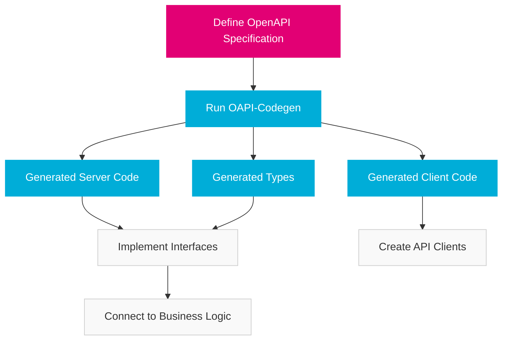

import PageHeader from '@site/src/components/PageHeader';
import FeatureCard from '@site/src/components/FeatureCard';
import CardGrid from '@site/src/components/CardGrid';
import InfoSection from '@site/src/components/InfoSection';
import FeatureGrid from '@site/src/components/FeatureGrid';
import NoAutoTitle from '@site/src/components/NoAutoTitle';

<NoAutoTitle />

<PageHeader 
  title="OAPI-Codegen"
  description="OpenAPI code generation for Go API services"
/>

[OAPI-Codegen](https://github.com/deepmap/oapi-codegen) is used in the Control Plane to generate server and client code from OpenAPI specifications, ensuring that APIs are consistent, well-documented, and type-safe.

<InfoSection type="info" title="OpenAPI-driven development">
  The Control Plane follows an OpenAPI-first approach, where API specifications are written first and code is generated from those specifications.
</InfoSection>

## Overview

OAPI-Codegen is a utility that generates Go code from OpenAPI 3.0 specifications, bridging the gap between API design and implementation. It supports various targets including server stubs, client code, type definitions, and spec validation.

<FeatureGrid columns={2} features={[
  {
    title: "🔄 API Consistency",
    description: "Ensures API implementation matches the OpenAPI specification exactly."
  },
  {
    title: "🏗️ Automatic Code Generation",
    description: "Reduces boilerplate code and implementation errors."
  },
  {
    title: "📝 Type Safety",
    description: "Generates Go types that match API request and response schemas."
  },
  {
    title: "🧩 Framework Integration",
    description: "Works with multiple web frameworks including Gofiber, Echo, and Chi."
  },
  {
    title: "🔍 Validation",
    description: "Validates request data against the schema defined in the OpenAPI spec."
  },
  {
    title: "📚 Self-documenting",
    description: "OpenAPI spec serves as living documentation for the API."
  }
]} />

## Integration in the Control Plane

<InfoSection type="tip" title="API-first development workflow">
  Control Plane developers define the API contract in OpenAPI specification files first, then generate server and client code, ensuring the implementation aligns with the design.
</InfoSection>

The Control Plane uses OAPI-Codegen for several components:

<CardGrid columns={2}>
  <FeatureCard
    title="File Manager API"
    description={<>
      <p>The file manager service uses generated code for:</p>
      <ul>
        <li>Server request validation</li>
        <li>Route registration with Gofiber</li>
        <li>Type definitions for requests and responses</li>
        <li>Client SDK generation for service consumers</li>
      </ul>
    </>}
  />
  
  <FeatureCard
    title="Control Plane API"
    description={<>
      <p>The main API server leverages generated code for:</p>
      <ul>
        <li>Consistent error handling</li>
        <li>Request/response marshaling</li>
        <li>Type-safe handler interfaces</li>
        <li>OpenAPI specification serving</li>
      </ul>
    </>}
  />
</CardGrid>

## Basic Usage Example

The workflow for using OAPI-Codegen in the Control Plane:



### 1. Define OpenAPI Specification

```yaml
openapi: 3.0.0
info:
  title: File Manager API
  version: 1.0.0
  description: API for managing file uploads and downloads
paths:
  /v1/files/{fileId}:
    get:
      summary: Download a file
      operationId: downloadFile
      parameters:
        - name: fileId
          in: path
          required: true
          schema:
            type: string
      responses:
        '200':
          description: The file content
          content:
            application/octet-stream:
              schema:
                type: string
                format: binary
        '404':
          description: File not found
          content:
            application/json:
              schema:
                $ref: '#/components/schemas/Error'
    put:
      summary: Upload a file
      operationId: uploadFile
      parameters:
        - name: fileId
          in: path
          required: true
          schema:
            type: string
      requestBody:
        content:
          application/octet-stream:
            schema:
              type: string
              format: binary
        required: true
      responses:
        '201':
          description: File uploaded successfully
        '400':
          description: Invalid request
          content:
            application/json:
              schema:
                $ref: '#/components/schemas/Error'
components:
  schemas:
    Error:
      type: object
      required:
        - code
        - message
      properties:
        code:
          type: integer
        message:
          type: string
```

### 2. Generate Code

```bash
# Install oapi-codegen
go install github.com/deepmap/oapi-codegen/cmd/oapi-codegen@latest

# Generate server code
oapi-codegen -generate fiber,types -package api -o api/server.gen.go api/file-manager-oas.yaml

# Generate client code
oapi-codegen -generate client,types -package client -o client/client.gen.go api/file-manager-oas.yaml
```

### 3. Implement the Generated Interface

```go
// Server interface generated by oapi-codegen
type ServerInterface interface {
    // Download a file
    // (GET /v1/files/{fileId})
    DownloadFile(c *fiber.Ctx, fileId string) error
    
    // Upload a file
    // (PUT /v1/files/{fileId})
    UploadFile(c *fiber.Ctx, fileId string) error
}

// Implement the interface
type FileManagerServer struct {
    service *service.FileManager
}

func (s *FileManagerServer) DownloadFile(c *fiber.Ctx, fileId string) error {
    file, err := s.service.DownloadFile(c.Context(), fileId)
    if err != nil {
        if errors.Is(err, service.ErrFileNotFound) {
            return fiber.NewError(fiber.StatusNotFound, "File not found")
        }
        return fiber.NewError(fiber.StatusInternalServerError, "Failed to download file")
    }
    
    return c.SendStream(file)
}

func (s *FileManagerServer) UploadFile(c *fiber.Ctx, fileId string) error {
    body := c.Body()
    
    err := s.service.UploadFile(c.Context(), fileId, body)
    if err != nil {
        return fiber.NewError(fiber.StatusBadRequest, "Failed to upload file")
    }
    
    return c.SendStatus(fiber.StatusCreated)
}
```

### 4. Register Routes

```go
func SetupRoutes(app *fiber.App, service *service.FileManager) {
    server := &FileManagerServer{service: service}
    
    // Register handlers with the generated RegisterHandlers function
    api.RegisterHandlers(app, server)
}
```

## Configuration Options

<InfoSection type="note" title="Code generation control">
  OAPI-Codegen offers fine-grained control over the generated code through a configuration file.
</InfoSection>

The Control Plane uses custom configuration files to tailor the generated code:

```yaml
# config.yaml
package: api
generate:
  models: true
  server: true
  embedded-spec: true
output: api/generated.gen.go
import-mapping:
  ./common.yaml: github.com/telekom/controlplane/pkg/common
output-options:
  skip-prune: true
```

<CardGrid columns={2}>
  <FeatureCard
    title="Generation Targets"
    description={<>
      <p>Different generation targets can be specified:</p>
      <ul>
        <li><code>types</code>: Only generate type definitions</li>
        <li><code>server</code>: Generate server boilerplate</li>
        <li><code>client</code>: Generate API client</li>
        <li><code>spec</code>: Embed the OpenAPI spec</li>
      </ul>
    </>}
  />
  
  <FeatureCard
    title="Web Framework Support"
    description={<>
      <p>Control Plane uses different web frameworks:</p>
      <ul>
        <li><code>fiber</code>: For Gofiber integration</li>
        <li><code>chi</code>: For Chi router integration</li>
        <li><code>echo</code>: For Echo framework integration</li>
        <li><code>gin</code>: For Gin framework integration</li>
      </ul>
    </>}
  />
</CardGrid>

### Example Configuration Command

```bash
# Generate code using configuration file
oapi-codegen -config config.yaml api/file-manager-oas.yaml
```

## Type Generation

<InfoSection type="tip" title="Generated types">
  The generated type definitions ensure that your Go code and API schema are always aligned. Use these types throughout your application to maintain type safety.
</InfoSection>

OAPI-Codegen generates Go types from OpenAPI schemas:

```go
// Generated from OpenAPI schema
type Error struct {
    Code    int    `json:"code"`
    Message string `json:"message"`
}

type FileMetadata struct {
    FileId      string    `json:"fileId"`
    Name        string    `json:"name"`
    Size        int64     `json:"size"`
    ContentType string    `json:"contentType"`
    UploadedAt  time.Time `json:"uploadedAt"`
    Checksum    string    `json:"checksum,omitempty"`
}
```

## Client Generation

The Control Plane uses generated clients for service-to-service communication:

```go
// Create a new client
client, err := client.NewClientWithResponses("https://file-manager.example.com")
if err != nil {
    log.Fatalf("Error creating client: %v", err)
}

// Use the client to download a file
resp, err := client.DownloadFileWithResponse(context.Background(), "my-file-id")
if err != nil {
    log.Fatalf("Error downloading file: %v", err)
}

if resp.StatusCode() == http.StatusOK {
    // Process the file content
    fileContent := resp.Body
    // ...
} else if resp.StatusCode() == http.StatusNotFound {
    // Handle not found error
    var errorResp client.Error
    if err := json.Unmarshal(resp.Body, &errorResp); err == nil {
        log.Printf("Error: %s (code: %d)", errorResp.Message, errorResp.Code)
    }
}
```

## Advanced Features

<CardGrid columns={2}>
  <FeatureCard
    title="Request Validation"
    description={<>
      <p>Automatic validation of incoming requests:</p>
      <code>
      // In generated code<br/>
      if err := body.Validate(); err != nil {'{'}<br/>
      &nbsp;&nbsp;return err<br/>
      {'}'}<br/>
      </code>
      <p>This validates request bodies against the OpenAPI schema.</p>
    </>}
  />
  
  <FeatureCard
    title="Response Validation"
    description={<>
      <p>Optional validation of outgoing responses:</p>
      <code>
      // Enable response validation<br/>
      validator := middleware.OapiResponseValidator(swagger)<br/>
      app.Use(validator)
      </code>
      <p>Ensures responses match the API contract.</p>
    </>}
  />
  
  <FeatureCard
    title="Custom Type Mappings"
    description={<>
      <p>Define custom Go types for specific formats:</p>
      <code>
      // Map UUID strings to uuid.UUID<br/>
      type UUID uuid.UUID<br/><br/>
      // In config.yaml<br/>
      type-mappings:<br/>
      &nbsp;&nbsp;uuid: github.com/google/uuid.UUID
      </code>
    </>}
  />
  
  <FeatureCard
    title="Schema References"
    description={<>
      <p>Reference shared schemas across APIs:</p>
      <code>
      components:<br/>
      &nbsp;&nbsp;schemas:<br/>
      &nbsp;&nbsp;&nbsp;&nbsp;Error:<br/>
      &nbsp;&nbsp;&nbsp;&nbsp;&nbsp;&nbsp;$ref: '../common/errors.yaml#/Error'
      </code>
      <p>Promotes consistent error handling across services.</p>
    </>}
  />
</CardGrid>

## Best Practices in the Control Plane

<FeatureGrid columns={2} features={[
  {
    title: "📜 API-First Development",
    description: "Define the API contract in OpenAPI before writing any implementation code."
  },
  {
    title: "🔄 Regenerate on Spec Changes",
    description: "Automate code regeneration as part of the build process when specs change."
  },
  {
    title: "🧩 Separate Generated Code",
    description: "Keep generated code in separate files (*.gen.go) to distinguish from hand-written code."
  },
  {
    title: "🚫 Don't Modify Generated Code",
    description: "Implement custom logic by implementing interfaces, not by modifying generated code."
  },
  {
    title: "📚 Consistent Error Formats",
    description: "Use shared error schemas across all APIs for consistent client experiences."
  },
  {
    title: "✅ Validate Input Data",
    description: "Use the generated validation functions for all incoming data."
  }
]} />

## Integration with Gofiber

<InfoSection type="note" title="Framework integration">
  OAPI-Codegen generates code specifically tailored for Gofiber in the Control Plane, making integration seamless.
</InfoSection>

```go
import (
    "github.com/gofiber/fiber/v2"
    "github.com/deepmap/oapi-codegen/pkg/middleware"
    
    "github.com/telekom/controlplane/api"
)

func SetupAPI(app *fiber.App, service *Service) {
    // Create the API implementation
    serverImpl := &ServerImpl{Service: service}
    
    // Register the handlers
    api.RegisterHandlers(app, serverImpl)
    
    // Optional: Add validation middleware
    swagger, err := api.GetSwagger()
    if err != nil {
        panic(err)
    }
    
    // Remove external references
    swagger.Components.Schemas = make(map[string]*openapi3.SchemaRef)
    
    // Add request validation middleware
    validator := middleware.OapiRequestValidator(swagger)
    app.Use(validator)
}
```

## Related Resources

<CardGrid columns={2}>
  <FeatureCard
    title="OpenAPI Specification"
    description="The foundation of API design in the Control Plane."
    linkText="OpenAPI Docs"
    linkUrl="https://spec.openapis.org/oas/latest.html"
  />
  
  <FeatureCard
    title="Gofiber"
    description="The high-performance web framework used with OAPI-Codegen."
    linkText="View Gofiber"
    linkUrl="gofiber"
  />
  
  <FeatureCard
    title="Swagger UI"
    description="Interactive API documentation generated from OpenAPI specs."
    linkText="View Swagger"
    linkUrl="https://swagger.io/"
  />
  
  <FeatureCard
    title="API Design Patterns"
    description="Best practices for API design in the Control Plane."
    linkText="View API Patterns"
    linkUrl="https://developer.telekom.de/docs/src/api_standards_conventions/"
  />
</CardGrid>