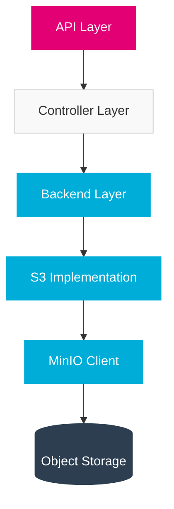

import PageHeader from '@site/src/components/PageHeader';
import FeatureCard from '@site/src/components/FeatureCard';
import CardGrid from '@site/src/components/CardGrid';
import InfoSection from '@site/src/components/InfoSection';
import FeatureGrid from '@site/src/components/FeatureGrid';

<PageHeader 
  title="S3 Storage with MinIO"
  description="High-performance object storage for the Control Plane's file management"
/>

The file-manager component of the Control Plane uses MinIO as an S3-compatible storage backend for file operations.

<InfoSection type="info" title="Object storage for cloud-native applications">
  MinIO provides a high-performance, S3-compatible object storage system that allows the Control Plane to store and retrieve files efficiently while maintaining compatibility with cloud environments.
</InfoSection>

## Overview

MinIO is a high-performance, S3-compatible object storage system. The file-manager component implements storage interfaces that use the MinIO Go client library (`minio-go/v7`) to provide file upload and download capabilities.

<div align="center">
  
</div>

## Why MinIO?

<FeatureGrid columns={2} features={[
  {
    title: "🔄 S3 Compatibility",
    description: "Full compatibility with Amazon S3 API, ensuring portability across cloud environments."
  },
  {
    title: "⚡ High Performance",
    description: "Optimized for high throughput and low latency operations, even with large files."
  },
  {
    title: "🔒 Built-in Security",
    description: "Support for TLS encryption, IAM policies, and encryption-at-rest."
  },
  {
    title: "🪶 Lightweight",
    description: "Small footprint makes it ideal for containerized deployments in Kubernetes."
  },
  {
    title: "☁️ Cloud Native",
    description: "Designed for modern cloud environments with distributed architecture."
  },
  {
    title: "📦 Scalability",
    description: "Scales horizontally to accommodate growing storage needs."
  }
]} />

## Integration Architecture

The file-manager component follows a clean separation of concerns with well-defined interfaces between layers:



<InfoSection type="tip" title="Clean architecture">
  This layered approach ensures that the file-manager component can be easily extended to support other storage backends in the future by implementing the same interfaces.
</InfoSection>

## Backend Interface

<CardGrid columns={2}>
  <FeatureCard
    title="Interface-Driven Design"
    description={
      <>
        <p>The file-manager uses a clean interface-driven design to:</p>
        <ul>
          <li>Abstract storage implementation details</li>
          <li>Enable multiple backend implementations</li>
          <li>Facilitate testing with mock implementations</li>
          <li>Enforce consistent behavior across backends</li>
          <li>Allow for future backend additions without API changes</li>
        </ul>
      </>
    }
  />
  
  <FeatureCard
    title="Storage Interfaces"
    description={
      <>
        <p>Key interfaces include:</p>
        <ul>
          <li><strong>FileUploader</strong>: For file upload operations</li>
          <li><strong>FileDownloader</strong>: For file retrieval operations</li>
          <li><strong>FileDeleter</strong>: For file removal operations</li>
          <li><strong>FileLister</strong>: For listing available files</li>
          <li><strong>FileMetadata</strong>: For managing file metadata</li>
        </ul>
      </>
    }
  />
</CardGrid>

The file-manager defines abstract interfaces for file operations:

```go
// pkg/backend/interface.go
type FileUploader interface {
    UploadFile(ctx context.Context, fileID string, file io.Reader) error
}

type FileDownloader interface {
    DownloadFile(ctx context.Context, fileID string) (io.ReadCloser, error)
}
```

<InfoSection type="note" title="Interface segregation">
  Following the Interface Segregation Principle, the file-manager splits functionality into focused interfaces rather than a single monolithic one. This allows components to depend only on the functionality they need.
</InfoSection>

## MinIO Implementation

The S3 backend implementation uses the MinIO client to fulfill these interfaces:

```go
// pkg/backend/s3/minio_wrapper.go
type MinioWrapper struct {
    client    *minio.Client
    bucket    string
    logger    logr.Logger
}

func NewMinioWrapper(endpoint, accessKey, secretKey, bucket string, useSSL bool) (*MinioWrapper, error) {
    // Initialize MinIO client
    client, err := minio.New(endpoint, &minio.Options{
        Creds:  credentials.NewStaticV4(accessKey, secretKey, ""),
        Secure: useSSL,
    })
    if err != nil {
        return nil, err
    }

    return &MinioWrapper{
        client: client,
        bucket: bucket,
        logger: log.WithName("minio-wrapper"),
    }, nil
}
```

### File Upload Implementation

<InfoSection type="tip" title="Error handling">
  Note the careful error wrapping to preserve context while providing detailed error information. This is an important pattern throughout the codebase.
</InfoSection>

```go
// pkg/backend/s3/file_uploader.go
func (m *MinioWrapper) UploadFile(ctx context.Context, fileID string, file io.Reader) error {
    // Get file size and create options
    options := minio.PutObjectOptions{
        ContentType: "application/octet-stream",
    }

    // Check if bucket exists and create it if needed
    exists, err := m.client.BucketExists(ctx, m.bucket)
    if err != nil {
        return fmt.Errorf("failed to check bucket existence: %w", err)
    }
    
    if !exists {
        err = m.client.MakeBucket(ctx, m.bucket, minio.MakeBucketOptions{})
        if err != nil {
            return fmt.Errorf("failed to create bucket: %w", err)
        }
    }

    // Upload the file
    _, err = m.client.PutObject(ctx, m.bucket, fileID, file, -1, options)
    if err != nil {
        return fmt.Errorf("failed to upload file: %w", err)
    }

    return nil
}
```

### File Download Implementation

```go
// pkg/backend/s3/file_downloader.go
func (m *MinioWrapper) DownloadFile(ctx context.Context, fileID string) (io.ReadCloser, error) {
    // Check if object exists
    _, err := m.client.StatObject(ctx, m.bucket, fileID, minio.StatObjectOptions{})
    if err != nil {
        return nil, fmt.Errorf("file not found: %w", err)
    }

    // Get object
    obj, err := m.client.GetObject(ctx, m.bucket, fileID, minio.GetObjectOptions{})
    if err != nil {
        return nil, fmt.Errorf("failed to get file: %w", err)
    }

    return obj, nil
}
```

## File Identifiers

<InfoSection type="note" title="Structured file IDs">
  The file-manager uses a structured approach for file identifiers that incorporates environment, group, team, and filename to ensure proper organization and access control.
</InfoSection>

The file-manager uses a structured approach for file identifiers:

```go
// pkg/backend/identifier/fileid_parser.go
type FileId struct {
    Environment string
    Group       string
    Team        string
    FileName    string
}

func ParseFileId(fileId string) (FileId, error) {
    parts := strings.Split(fileId, "--")
    if len(parts) != 4 {
        return FileId{}, errors.New("invalid file id format")
    }

    return FileId{
        Environment: parts[0],
        Group:       parts[1],
        Team:        parts[2],
        FileName:    parts[3],
    }, nil
}
```

### File ID Structure Example

<CardGrid columns={1}>
  <FeatureCard
    title="File ID Format"
    description={
      <>
        <p><code>environment--group--team--filename</code></p>
        <p>For example:</p>
        <ul>
          <li><code>prod--finance--reporting--quarterly-results.xlsx</code></li>
          <li><code>dev--marketing--campaigns--summer-campaign.pdf</code></li>
          <li><code>test--engineering--platform--load-test-results.json</code></li>
        </ul>
        <p>This structure allows for:</p>
        <ul>
          <li>Multi-tenancy through environment isolation</li>
          <li>Organizational hierarchy reflection</li>
          <li>Team-based access control</li>
          <li>Logical file organization</li>
        </ul>
      </>
    }
  />
</CardGrid>

## Checksum Validation

<InfoSection type="warning" title="Data integrity">
  Checksum validation is critical for ensuring file integrity throughout the upload and download process. Always verify file checksums when handling user uploads.
</InfoSection>

The file-manager uses CRC64 checksum validation to ensure file integrity:

```go
// api/copy_hash.go
func CalculateChecksum(reader io.Reader) (string, error) {
    hasher := crc64nvme.New()
    if _, err := io.Copy(hasher, reader); err != nil {
        return "", err
    }
    
    return strconv.FormatUint(hasher.Sum64(), 16), nil
}
```

## Security Considerations

<FeatureGrid columns={2} features={[
  {
    title: "🔐 Credentials Management",
    description: "Access keys are managed securely through Kubernetes secrets and environment variables."
  },
  {
    title: "🔒 TLS Encryption",
    description: "Communication with MinIO uses TLS encryption when useSSL is enabled."
  },
  {
    title: "🛡️ JWT Authentication",
    description: "API endpoints require valid JWT tokens, ensuring only authorized users can access files."
  },
  {
    title: "👤 Access Control",
    description: "File IDs include group and team information to enable fine-grained access control."
  },
  {
    title: "🔍 Audit Logging",
    description: "All file operations are logged with user context for auditability."
  },
  {
    title: "⏱️ Temporary URLs",
    description: "Support for time-limited presigned URLs for secure file sharing."
  }
]} />

## Configuration

The S3 backend is configured through environment variables or config files:

```yaml
# Example configuration
s3:
  endpoint: "s3.example.com"
  accessKey: "${S3_ACCESS_KEY}"
  secretKey: "${S3_SECRET_KEY}"
  bucket: "file-manager"
  useSSL: true
```

### Kubernetes Configuration

<InfoSection type="tip" title="Kubernetes integration">
  In a Kubernetes environment, the MinIO credentials are typically stored in a Secret and injected as environment variables.
</InfoSection>

```yaml
apiVersion: v1
kind: Secret
metadata:
  name: minio-credentials
type: Opaque
data:
  accessKey: base64-encoded-access-key
  secretKey: base64-encoded-secret-key
---
apiVersion: apps/v1
kind: Deployment
metadata:
  name: file-manager
spec:
  template:
    spec:
      containers:
      - name: file-manager
        env:
        - name: S3_ENDPOINT
          value: "minio.storage.svc.cluster.local:9000"
        - name: S3_ACCESS_KEY
          valueFrom:
            secretKeyRef:
              name: minio-credentials
              key: accessKey
        - name: S3_SECRET_KEY
          valueFrom:
            secretKeyRef:
              name: minio-credentials
              key: secretKey
        - name: S3_BUCKET
          value: "file-manager"
        - name: S3_USE_SSL
          value: "true"
```

## Advanced Features

<CardGrid columns={2}>
  <FeatureCard
    title="Object Lifecycle Management"
    description={
      <>
        <p>The file-manager supports object lifecycle policies for:</p>
        <ul>
          <li>Automatic deletion of temporary files</li>
          <li>Moving older files to archive storage</li>
          <li>Setting retention policies by file type</li>
          <li>Version management of important documents</li>
        </ul>
      </>
    }
  />
  
  <FeatureCard
    title="Multi-part Uploads"
    description={
      <>
        <p>For large files, multi-part uploads provide:</p>
        <ul>
          <li>Better handling of network interruptions</li>
          <li>Parallel upload of file parts</li>
          <li>Progress tracking for large transfers</li>
          <li>Improved performance for large files</li>
        </ul>
      </>
    }
  />
</CardGrid>

## Related Resources

<CardGrid columns={2}>
  <FeatureCard
    title="File Manager"
    description="Learn about the file manager component that uses MinIO for storage."
    linkText="Component Overview"
    linkUrl="../../0-Overview/components"
  />
  
  <FeatureCard
    title="Go Language"
    description="Explore the foundational language used in the Control Plane."
    linkText="Go Language"
    linkUrl="../1-Core-Technologies/golang"
  />
</CardGrid>