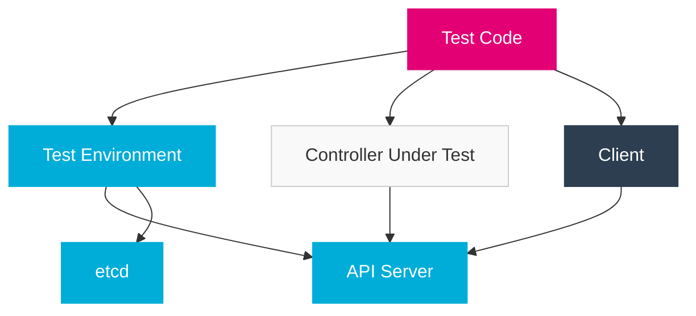

import PageHeader from '@site/src/components/PageHeader';
import FeatureCard from '@site/src/components/FeatureCard';
import CardGrid from '@site/src/components/CardGrid';
import InfoSection from '@site/src/components/InfoSection';
import FeatureGrid from '@site/src/components/FeatureGrid';
import NoAutoTitle from '@site/src/components/NoAutoTitle';

<NoAutoTitle />

<PageHeader 
  title="Kubebuilder Testing"
  description="Testing Kubernetes controllers with in-memory API server"
/>

The Control Plane uses Kubebuilder's testing framework to validate controller behavior using an in-memory Kubernetes API server.

<InfoSection type="info" title="Controller testing">
  Testing Kubernetes controllers requires a special approach since they interact with the Kubernetes API server. Kubebuilder provides tools to set up an in-memory API server for efficient and reliable testing.
</InfoSection>

## Overview

Kubebuilder's testing framework, built on the `controller-runtime` library's `envtest` package, allows you to test controllers without a real Kubernetes cluster. This approach offers several advantages:

<FeatureGrid columns={2} features={[
  {
    title: "🚀 Fast Execution",
    description: "Tests run quickly without the overhead of a full Kubernetes cluster."
  },
  {
    title: "🔄 Isolation",
    description: "Each test runs in a clean environment without side effects from other tests."
  },
  {
    title: "💻 Local Development",
    description: "No need for a real cluster during development and CI pipelines."
  },
  {
    title: "📊 Comprehensive Testing",
    description: "Test edge cases and error conditions that are hard to reproduce in real clusters."
  },
  {
    title: "🛠️ Integration Testing",
    description: "True integration tests with a real API server implementation."
  },
  {
    title: "⚙️ CRD Support",
    description: "Register and test Custom Resource Definitions (CRDs) used by your controllers."
  }
]} />

## In-Memory Testing Architecture

<InfoSection type="note" title="Test environment">
  The test environment includes an API server, etcd, and controller-runtime components that closely simulate a real Kubernetes cluster.
</InfoSection>



## Basic Test Setup

<InfoSection type="tip" title="Test structure">
  Control Plane controller tests follow a common pattern for setting up the test environment.
</InfoSection>

```go
package controllers

import (
    "context"
    "path/filepath"
    "testing"
    "time"

    . "github.com/onsi/ginkgo/v2"
    . "github.com/onsi/gomega"

    corev1 "k8s.io/api/core/v1"
    metav1 "k8s.io/apimachinery/pkg/apis/meta/v1"
    "k8s.io/apimachinery/pkg/runtime"
    clientgoscheme "k8s.io/client-go/kubernetes/scheme"
    "sigs.k8s.io/controller-runtime/pkg/client"
    "sigs.k8s.io/controller-runtime/pkg/envtest"
    logf "sigs.k8s.io/controller-runtime/pkg/log"
    "sigs.k8s.io/controller-runtime/pkg/log/zap"

    myapiv1 "github.com/telekom/controlplane/api/v1"
)

var (
    k8sClient client.Client
    testEnv   *envtest.Environment
    scheme    = runtime.NewScheme()
    ctx       context.Context
    cancel    context.CancelFunc
)

func TestControllers(t *testing.T) {
    RegisterFailHandler(Fail)
    RunSpecs(t, "Controller Suite")
}

var _ = BeforeSuite(func() {
    logf.SetLogger(zap.New(zap.WriteTo(GinkgoWriter), zap.UseDevMode(true)))

    ctx, cancel = context.WithCancel(context.Background())

    By("bootstrapping test environment")
    testEnv = &envtest.Environment{
        CRDDirectoryPaths:     []string{filepath.Join("..", "..", "config", "crd", "bases")},
        ErrorIfCRDPathMissing: true,
    }

    cfg, err := testEnv.Start()
    Expect(err).NotTo(HaveOccurred())
    Expect(cfg).NotTo(BeNil())

    // Add built-in schemes
    err = clientgoscheme.AddToScheme(scheme)
    Expect(err).NotTo(HaveOccurred())

    // Add your API types to the scheme
    err = myapiv1.AddToScheme(scheme)
    Expect(err).NotTo(HaveOccurred())

    k8sClient, err = client.New(cfg, client.Options{Scheme: scheme})
    Expect(err).NotTo(HaveOccurred())
    Expect(k8sClient).NotTo(BeNil())
})

var _ = AfterSuite(func() {
    cancel()
    By("tearing down the test environment")
    err := testEnv.Stop()
    Expect(err).NotTo(HaveOccurred())
})
```

## Writing Controller Tests

<InfoSection type="tip" title="Test cases">
  Control Plane controller tests typically follow these patterns for testing controller behavior.
</InfoSection>

### Basic Controller Test Structure

```go
var _ = Describe("FileManager Controller", func() {
    // Define common variables
    var (
        fileManager *myapiv1.FileManager
        namespace   string
        ctx         context.Context
    )

    // Setup before each test case
    BeforeEach(func() {
        // Create a unique namespace for test isolation
        namespace = "test-ns-" + RandomString(5)
        ns := &corev1.Namespace{
            ObjectMeta: metav1.ObjectMeta{
                Name: namespace,
            },
        }
        Expect(k8sClient.Create(context.Background(), ns)).To(Succeed())

        // Create the custom resource
        fileManager = &myapiv1.FileManager{
            ObjectMeta: metav1.ObjectMeta{
                Name:      "test-file-manager",
                Namespace: namespace,
            },
            Spec: myapiv1.FileManagerSpec{
                Storage: myapiv1.StorageSpec{
                    Type: "s3",
                    S3: &myapiv1.S3Config{
                        Endpoint: "https://s3.example.com",
                        Bucket:   "test-bucket",
                    },
                },
            },
        }

        ctx = context.Background()
    })

    // Cleanup after each test case
    AfterEach(func() {
        // Clean up the namespace and all resources in it
        ns := &corev1.Namespace{}
        if err := k8sClient.Get(ctx, client.ObjectKey{Name: namespace}, ns); err == nil {
            Expect(k8sClient.Delete(ctx, ns)).To(Succeed())
        }
    })

    // Test cases
    Context("When creating a FileManager resource", func() {
        It("Should set status to Ready when backend is properly configured", func() {
            // Create the FileManager resource
            Expect(k8sClient.Create(ctx, fileManager)).To(Succeed())

            // Wait for reconciliation to happen and status to be updated
            createdFileManager := &myapiv1.FileManager{}
            Eventually(func() bool {
                err := k8sClient.Get(ctx, client.ObjectKey{
                    Name:      fileManager.Name,
                    Namespace: fileManager.Namespace,
                }, createdFileManager)
                if err != nil {
                    return false
                }
                return createdFileManager.Status.Ready
            }, time.Second*10, time.Millisecond*250).Should(BeTrue())
        })

        It("Should create the required secret with credentials", func() {
            // Create the FileManager resource
            Expect(k8sClient.Create(ctx, fileManager)).To(Succeed())

            // Check for the secret
            secret := &corev1.Secret{}
            Eventually(func() error {
                return k8sClient.Get(ctx, client.ObjectKey{
                    Name:      fileManager.Name + "-credentials",
                    Namespace: fileManager.Namespace,
                }, secret)
            }, time.Second*10, time.Millisecond*250).Should(Succeed())

            // Verify secret contents
            Expect(secret.Data).To(HaveKey("accessKey"))
            Expect(secret.Data).To(HaveKey("secretKey"))
        })
    })

    Context("When updating a FileManager resource", func() {
        It("Should update the backend configuration", func() {
            // Create the FileManager resource
            Expect(k8sClient.Create(ctx, fileManager)).To(Succeed())

            // Wait for it to be created
            createdFileManager := &myapiv1.FileManager{}
            Eventually(func() error {
                return k8sClient.Get(ctx, client.ObjectKey{
                    Name:      fileManager.Name,
                    Namespace: fileManager.Namespace,
                }, createdFileManager)
            }, time.Second*5, time.Millisecond*250).Should(Succeed())

            // Update the resource
            updatedFileManager := createdFileManager.DeepCopy()
            updatedFileManager.Spec.Storage.S3.Bucket = "updated-bucket"
            Expect(k8sClient.Update(ctx, updatedFileManager)).To(Succeed())

            // Verify the update was processed
            Eventually(func() string {
                err := k8sClient.Get(ctx, client.ObjectKey{
                    Name:      fileManager.Name,
                    Namespace: fileManager.Namespace,
                }, createdFileManager)
                if err != nil {
                    return ""
                }
                return createdFileManager.Spec.Storage.S3.Bucket
            }, time.Second*5, time.Millisecond*250).Should(Equal("updated-bucket"))
        })
    })
})
```

## Setting Up the Controller

<InfoSection type="note" title="Controller setup">
  For comprehensive testing, you need to set up the controller in your test environment.
</InfoSection>

There are two main approaches used in the Control Plane:

### Approach 1: Start the Manager

Run the controller manager in the test environment:

```go
var _ = BeforeSuite(func() {
    // ... standard setup code ...

    // Set up the controller manager
    k8sManager, err := ctrl.NewManager(cfg, ctrl.Options{
        Scheme: scheme,
        Metrics: metricsserver.Options{
            BindAddress: "0",
        },
    })
    Expect(err).NotTo(HaveOccurred())

    // Set up the controller
    err = (&controllers.FileManagerReconciler{
        Client: k8sManager.GetClient(),
        Scheme: k8sManager.GetScheme(),
        Log:    logf.Log.WithName("controllers").WithName("FileManager"),
    }).SetupWithManager(k8sManager)
    Expect(err).NotTo(HaveOccurred())

    // Start the controller manager
    go func() {
        err := k8sManager.Start(ctx)
        Expect(err).NotTo(HaveOccurred())
    }()
})
```

### Approach 2: Manual Reconciliation

Directly invoke the Reconcile method in tests:

```go
var _ = Describe("FileManager Controller", func() {
    var (
        reconciler *controllers.FileManagerReconciler
        // ... other variables ...
    )

    BeforeEach(func() {
        // ... setup code ...

        // Create the reconciler
        reconciler = &controllers.FileManagerReconciler{
            Client: k8sClient,
            Scheme: scheme,
            Log:    logf.Log.WithName("controllers").WithName("FileManager"),
        }
    })

    It("Should reconcile successfully", func() {
        // Create the FileManager resource
        Expect(k8sClient.Create(ctx, fileManager)).To(Succeed())

        // Manually trigger reconciliation
        req := ctrl.Request{
            NamespacedName: types.NamespacedName{
                Name:      fileManager.Name,
                Namespace: fileManager.Namespace,
            },
        }
        result, err := reconciler.Reconcile(ctx, req)
        Expect(err).NotTo(HaveOccurred())
        Expect(result.Requeue).To(BeFalse())

        // Verify the results
        // ... verification code ...
    })
})
```

## Testing Webhooks

<InfoSection type="tip" title="Webhook testing">
  The Control Plane also tests validation and defaulting webhooks in the same test environment.
</InfoSection>

To test webhooks, you need to enable webhook installation in the test environment:

```go
testEnv = &envtest.Environment{
    CRDDirectoryPaths:     []string{filepath.Join("..", "..", "config", "crd", "bases")},
    WebhookInstallOptions: envtest.WebhookInstallOptions{
        Paths: []string{filepath.Join("..", "..", "config", "webhook")},
    },
    ErrorIfCRDPathMissing: true,
}
```

Then register the webhook with the manager:

```go
err = (&myapiv1.FileManager{}).SetupWebhookWithManager(k8sManager)
Expect(err).NotTo(HaveOccurred())
```

Example webhook test:

```go
It("Should validate resource correctly", func() {
    // Create an invalid resource
    invalidFileManager := &myapiv1.FileManager{
        ObjectMeta: metav1.ObjectMeta{
            Name:      "invalid-file-manager",
            Namespace: namespace,
        },
        Spec: myapiv1.FileManagerSpec{
            Storage: myapiv1.StorageSpec{
                Type: "unknown", // Invalid type
            },
        },
    }

    // Expect validation to reject it
    err := k8sClient.Create(ctx, invalidFileManager)
    Expect(err).To(HaveOccurred())
    Expect(err.Error()).To(ContainSubstring("unsupported storage type"))
})

It("Should apply defaults", func() {
    // Create a resource without optional fields
    fileManagerWithoutDefaults := &myapiv1.FileManager{
        ObjectMeta: metav1.ObjectMeta{
            Name:      "defaults-file-manager",
            Namespace: namespace,
        },
        Spec: myapiv1.FileManagerSpec{
            Storage: myapiv1.StorageSpec{
                Type: "s3",
                S3: &myapiv1.S3Config{
                    Endpoint: "https://s3.example.com",
                    Bucket:   "test-bucket",
                    // Region is missing and should be defaulted
                },
            },
        },
    }

    // Create the resource
    Expect(k8sClient.Create(ctx, fileManagerWithoutDefaults)).To(Succeed())

    // Check if defaults were applied
    createdFileManager := &myapiv1.FileManager{}
    Eventually(func() string {
        err := k8sClient.Get(ctx, client.ObjectKey{
            Name:      fileManagerWithoutDefaults.Name,
            Namespace: fileManagerWithoutDefaults.Namespace,
        }, createdFileManager)
        if err != nil {
            return ""
        }
        return createdFileManager.Spec.Storage.S3.Region
    }, time.Second*5, time.Millisecond*250).Should(Equal("eu-central-1"))
})
```

## Testing Controllers with External Dependencies

<InfoSection type="note" title="Mocking external services">
  Controllers often interact with external services, which need to be mocked for testing.
</InfoSection>

The Control Plane uses several approaches for mocking external dependencies:

<CardGrid columns={3}>
  <FeatureCard
    title="Interface Mocking"
    description={<>
      <p>Using Mockery or testify/mock to create mock implementations of interfaces:</p>
      <ul>
        <li>Define interfaces for external services</li>
        <li>Generate mocks from interfaces</li>
        <li>Inject mocks into the controller</li>
      </ul>
    </>}
  />
  
  <FeatureCard
    title="In-Memory Implementations"
    description={<>
      <p>Creating test implementations that run in-memory:</p>
      <ul>
        <li>Simple implementations of service interfaces</li>
        <li>Tracking calls and responses for verification</li>
        <li>Simulating specific behaviors for testing</li>
      </ul>
    </>}
  />
  
  <FeatureCard
    title="HTTP Request Mocking"
    description={<>
      <p>Using httptest or similar libraries:</p>
      <ul>
        <li>Mock HTTP servers for external APIs</li>
        <li>Test client-server interactions</li>
        <li>Verify request formatting and handling</li>
      </ul>
    </>}
  />
</CardGrid>

### Example with Mock S3 Client

```go
// Define the mock client
type MockS3Client struct {
    mock.Mock
}

func (m *MockS3Client) CreateBucket(ctx context.Context, params *s3.CreateBucketInput) (*s3.CreateBucketOutput, error) {
    args := m.Called(ctx, params)
    return args.Get(0).(*s3.CreateBucketOutput), args.Error(1)
}

// Use the mock in tests
var _ = Describe("FileManager Controller with S3", func() {
    var (
        reconciler *controllers.FileManagerReconciler
        mockS3     *MockS3Client
    )

    BeforeEach(func() {
        mockS3 = new(MockS3Client)
        
        reconciler = &controllers.FileManagerReconciler{
            Client:    k8sClient,
            Scheme:    scheme,
            Log:       logf.Log.WithName("controllers").WithName("FileManager"),
            S3Factory: func(endpoint, region string) (s3client.Client, error) {
                return mockS3, nil
            },
        }
    })

    It("Should create S3 bucket if it doesn't exist", func() {
        // Set up expectations
        mockS3.On("CreateBucket", mock.Anything, mock.MatchedBy(func(input *s3.CreateBucketInput) bool {
            return *input.Bucket == "test-bucket"
        })).Return(&s3.CreateBucketOutput{}, nil)

        // Create the FileManager resource
        Expect(k8sClient.Create(ctx, fileManager)).To(Succeed())

        // Trigger reconciliation
        req := ctrl.Request{
            NamespacedName: types.NamespacedName{
                Name:      fileManager.Name,
                Namespace: fileManager.Namespace,
            },
        }
        result, err := reconciler.Reconcile(ctx, req)
        Expect(err).NotTo(HaveOccurred())
        Expect(result.Requeue).To(BeFalse())

        // Verify the mock was called
        mockS3.AssertExpectations(GinkgoT())
    })
})
```

## Best Practices for Controller Testing

<InfoSection type="tip" title="Testing guidelines">
  The Control Plane follows these best practices for effective controller testing.
</InfoSection>

<FeatureGrid columns={2} features={[
  {
    title: "🔍 Test Isolation",
    description: "Use unique namespaces for each test to prevent test interference."
  },
  {
    title: "⏱️ Use Eventually",
    description: "Use Eventually assertions for asynchronous operations with appropriate timeouts."
  },
  {
    title: "🧪 Test All Resource Operations",
    description: "Cover create, update, delete, and error scenarios in your tests."
  },
  {
    title: "🧩 Mock External Dependencies",
    description: "Use interfaces and mocks for external services to ensure tests are self-contained."
  },
  {
    title: "📊 Verify Status Updates",
    description: "Check that status fields are properly updated by controllers."
  },
  {
    title: "🔄 Test Finalizers",
    description: "Verify that finalizers are added/removed and cleanup logic runs correctly."
  },
  {
    title: "⚠️ Test Error Handling",
    description: "Simulate error conditions to test controller resilience and error propagation."
  },
  {
    title: "🧹 Clean Up Resources",
    description: "Ensure all resources are cleaned up after tests to prevent interference."
  }
]} />

## Debugging Controller Tests

<InfoSection type="note" title="Troubleshooting">
  When controller tests fail, these debugging techniques can help identify the issue.
</InfoSection>

<CardGrid columns={2}>
  <FeatureCard
    title="Enable Verbose Logging"
    description={<>
      <p>Increase log verbosity to see what's happening:</p>
      <code>
      logf.SetLogger(zap.New(zap.WriteTo(GinkgoWriter), zap.UseDevMode(true), zap.Level(zapcore.DebugLevel)))
      </code>
    </>}
  />
  
  <FeatureCard
    title="Use Ginkgo Debug Capabilities"
    description={<>
      <p>Use Ginkgo's debugging features:</p>
      <ul>
        <li>Focus on specific tests with <code>FIt</code>, <code>FDescribe</code>, etc.</li>
        <li>Use <code>GinkgoWriter</code> for test-specific logging</li>
        <li>Run with <code>ginkgo -v</code> for verbose output</li>
      </ul>
    </>}
  />
  
  <FeatureCard
    title="Inspect API Objects"
    description={<>
      <p>Dump API object contents for inspection:</p>
      <code>
      By("Dumping FileManager")
      fileManagerJSON, _ := json.MarshalIndent(fileManager, "", "  ")
      GinkgoWriter.Printf("FileManager: %s\n", fileManagerJSON)
      </code>
    </>}
  />
  
  <FeatureCard
    title="Check Controller Logs"
    description={<>
      <p>Set up a custom logger to capture controller logs:</p>
      <code>
      var logBuffer bytes.Buffer
      logger := zap.New(zap.WriteTo(&logBuffer), zap.UseDevMode(true))
      reconciler.Log = logger.WithName("controllers").WithName("FileManager")
      
      // After reconciliation
      GinkgoWriter.Printf("Controller logs: %s\n", logBuffer.String())
      </code>
    </>}
  />
</CardGrid>

## Performance Considerations

<InfoSection type="note" title="Test efficiency">
  The in-memory test environment can be resource-intensive. These strategies help optimize test performance.
</InfoSection>

<FeatureGrid columns={2} features={[
  {
    title: "🚀 Single Test Environment",
    description: "Start the test environment once for the whole test suite instead of per-test."
  },
  {
    title: "📊 Selective Testing",
    description: "Group and organize tests to minimize setup/teardown overhead."
  },
  {
    title: "🔄 Resource Reuse",
    description: "Reuse test environment resources when possible instead of recreating them."
  },
  {
    title: "⏱️ Appropriate Timeouts",
    description: "Use reasonable timeouts for Eventually assertions to avoid long waits."
  },
  {
    title: "🧪 Parallelization",
    description: "Run independent tests in parallel with Ginkgo's parallel testing features."
  },
  {
    title: "🔍 Focused Testing",
    description: "Use Ginkgo's focus features to run only relevant tests during development."
  }
]} />

## Related Resources

<CardGrid columns={2}>
  <FeatureCard
    title="Kubebuilder"
    description="Learn about the framework used to build Kubernetes operators."
    linkText="View Kubebuilder"
    linkUrl="../Core-Technologies/kubebuilder"
  />
  
  <FeatureCard
    title="Ginkgo"
    description="BDD-style testing framework used with Kubebuilder."
    linkText="View Ginkgo"
    linkUrl="ginkgo"
  />
  
  <FeatureCard
    title="Gomega"
    description="Matcher/assertion library used for controller testing."
    linkText="View Gomega"
    linkUrl="gomega"
  />
  
  <FeatureCard
    title="Controller Runtime"
    description="The library that powers Kubebuilder-based controllers and their tests."
    linkText="View Documentation"
    linkUrl="https://github.com/kubernetes-sigs/controller-runtime"
  />
</CardGrid>