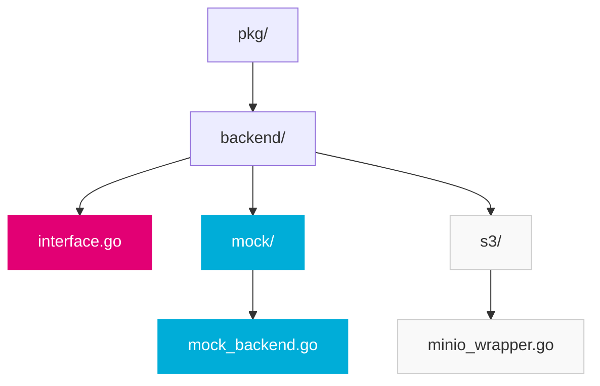

import PageHeader from '@site/src/components/PageHeader';
import FeatureCard from '@site/src/components/FeatureCard';
import CardGrid from '@site/src/components/CardGrid';
import InfoSection from '@site/src/components/InfoSection';
import FeatureGrid from '@site/src/components/FeatureGrid';
import NoAutoTitle from '@site/src/components/NoAutoTitle';

<NoAutoTitle />

<PageHeader 
  title="Mockery"
  description="Automated mock generation for Go interfaces"
/>

[Mockery](https://github.com/vektra/mockery) is a mock code generation tool used in the Control Plane to generate mocks for interfaces.

<InfoSection type="info" title="Auto-generated test doubles">
  Mockery automatically generates type-safe mock implementations of Go interfaces, saving development time and ensuring mocks stay in sync with interface changes.
</InfoSection>

## Overview

Mockery automatically generates mock implementations of Go interfaces to use in tests. This helps:

<FeatureGrid columns={3} features={[
  {
    title: "🔄 Isolate Components",
    description: "Test components in isolation without real dependencies for faster, more focused tests."
  },
  {
    title: "🎮 Control Behavior",
    description: "Precisely control how dependencies respond during tests to simulate various scenarios."
  },
  {
    title: "✅ Verify Interactions",
    description: "Confirm that components interact with dependencies correctly with expected arguments."
  },
  {
    title: "🔄 Stay in Sync",
    description: "Auto-generated mocks update when interfaces change, preventing test/implementation drift."
  },
  {
    title: "⚡ Test Edge Cases",
    description: "Easily simulate error conditions and edge cases that would be difficult with real implementations."
  },
  {
    title: "🚀 Faster Tests",
    description: "Avoid slow external dependencies like databases and APIs for quicker test execution."
  }
]} />

## Integration in the Control Plane

<InfoSection type="tip" title="Comprehensive mocking">
  The Control Plane uses Mockery extensively to enable thorough testing of all components without external dependencies.
</InfoSection>

The Control Plane uses Mockery to generate mocks for various interfaces:

<CardGrid columns={3}>
  <FeatureCard
    title="Backend Interfaces"
    description={<>
      <p>Core storage and processing interfaces like:</p>
      <ul>
        <li>FileUploader</li>
        <li>FileDownloader</li>
        <li>FileDeleter</li>
        <li>FileMetadata</li>
      </ul>
    </>}
  />
  
  <FeatureCard
    title="Client Interfaces"
    description={<>
      <p>External service clients such as:</p>
      <ul>
        <li>MinioClient</li>
        <li>K8sClient</li>
        <li>VaultClient</li>
        <li>TokenService</li>
      </ul>
    </>}
  />
  
  <FeatureCard
    title="Service Interfaces"
    description={<>
      <p>Business logic interfaces including:</p>
      <ul>
        <li>FileService</li>
        <li>AuthService</li>
        <li>ValidationService</li>
        <li>NotificationService</li>
      </ul>
    </>}
  />
</CardGrid>

## Directory Structure

<InfoSection type="note" title="Mock organization">
  The Control Plane follows a consistent pattern for organizing mock implementations to make them easy to find and use.
</InfoSection>

Mocks in the Control Plane follow a consistent pattern:

```
pkg/
  backend/
    interface.go      # Contains the interface definitions
    mock/
      mock_backend.go # Generated mock implementations
```



## Code Generation

<InfoSection type="tip" title="Automated generation">
  Mocks are generated automatically during the build process, ensuring they're always up to date with the latest interface definitions.
</InfoSection>

Mocks are generated using the Mockery CLI tool. Configuration is stored in `mockery.yaml` files:

```yaml
with-expecter: true
packages:
  github.com/telekom/controlplane/file-manager/pkg/backend:
    interfaces:
      FileUploader:
        config:
          dir: "pkg/backend/mock"
      FileDownloader:
        config:
          dir: "pkg/backend/mock"
```

The `tools/generate.go` file ensures consistent mock generation:

```go
//go:generate mockery --dir ../pkg/backend --name FileUploader --output ../pkg/backend/mock
//go:generate mockery --dir ../pkg/backend --name FileDownloader --output ../pkg/backend/mock
```

### Generating Mocks

<CardGrid columns={2}>
  <FeatureCard
    title="Manual Generation"
    description={<>
      <p>To manually generate mocks:</p>
      <p><code>go generate ./tools/generate.go</code></p>
      <p>Or directly using mockery:</p>
      <p><code>mockery --dir pkg/backend --name FileUploader --output pkg/backend/mock</code></p>
    </>}
  />
  
  <FeatureCard
    title="CI/CD Integration"
    description={<>
      <p>Mocks are automatically verified in CI/CD:</p>
      <ul>
        <li>Pre-commit hooks generate mocks</li>
        <li>CI checks that mocks are up to date</li>
        <li>Tests fail if mocks don't match interfaces</li>
      </ul>
    </>}
  />
</CardGrid>

## Using Mocks in Tests

<InfoSection type="note" title="Expecter API">
  The Control Plane uses Mockery's Expecter API, which provides a type-safe way to set expectations on mock methods.
</InfoSection>

Mocks are used extensively in the Control Plane test suite:

```go
func TestUploadController(t *testing.T) {
    // Create a mock uploader
    mockUploader := mocks.NewFileUploader(t)
    
    // Set expectations
    mockUploader.On("UploadFile", mock.Anything, "test-id", mock.Anything).
        Return(nil).
        Once()
    
    // Create controller with mock dependency
    controller := NewUploadController(mockUploader)
    
    // Call the controller method
    err := controller.HandleUpload(context.Background(), "test-id", strings.NewReader("test content"))
    
    // Assertions
    assert.NoError(t, err)
    
    // Verify all expectations were met
    mockUploader.AssertExpectations(t)
}
```

### Advanced Mock Usage

<CardGrid columns={2}>
  <FeatureCard
    title="Argument Matching"
    description={<>
      <p>Control Plane tests use various matchers:</p>
      <p><code>{`// Match exact values`}</code></p>
      <p><code>{`mock.On("Method", "exact-value")`}</code></p>
      <p><code>{`// Match any value`}</code></p>
      <p><code>{`mock.On("Method", mock.Anything)`}</code></p>
      <p><code>{`// Custom matchers`}</code></p>
      <p><code>{`mock.On("Method", mock.MatchedBy(func(s string) bool {`}</code></p>
      <p><code>{`    return strings.HasPrefix(s, "test-")`}</code></p>
      <p><code>{`}))`}</code></p>
    </>}
  />
  
  <FeatureCard
    title="Return Values"
    description={<>
      <p>Configure mock responses:</p>
      <p><code>{`// Return static values`}</code></p>
      <p><code>{`mock.On("Method").Return(result, nil)`}</code></p>
      <p><code>{`// Return different values on successive calls`}</code></p>
      <p><code>{`mock.On("Method").`}</code></p>
      <p><code>{`    Return(nil, errors.New("first error")).Once().`}</code></p>
      <p><code>{`    On("Method").`}</code></p>
      <p><code>{`    Return("success", nil)`}</code></p>
      <p><code>{`// Dynamic returns`}</code></p>
      <p><code>{`mock.On("Method", mock.Anything).`}</code></p>
      <p><code>{`    Return(func(arg string) string {`}</code></p>
      <p><code>{`        return "processed-" + arg`}</code></p>
      <p><code>{`    }, nil)`}</code></p>
    </>}
  />
</CardGrid>

## Best Practices Used in Control Plane

<InfoSection type="tip" title="Mock best practices">
  Following these best practices ensures effective and maintainable mocks throughout the codebase.
</InfoSection>

<FeatureGrid columns={2} features={[
  {
    title: "📝 Generate mocks for all public interfaces",
    description: "Ensures comprehensive testing coverage and flexibility for all public components."
  },
  {
    title: "🎯 Use mock.Anything for irrelevant arguments",
    description: "Simplifies test setup by only specifying values that matter for the test case."
  },
  {
    title: "✅ Verify mock expectations",
    description: "Always call AssertExpectations() to verify that mocks were used as expected."
  },
  {
    title: "🔢 Specify call counts",
    description: "Use Once(), Times(n), or Maybe() to verify the correct number of interactions."
  },
  {
    title: "🧩 Mock at interface boundaries",
    description: "Focus mocks on external dependencies and service boundaries, not internal implementation details."
  },
  {
    title: "🔄 Regenerate mocks after interface changes",
    description: "Keep mocks in sync with interfaces to avoid subtle test failures or false positives."
  }
]} />

### Common Mock Patterns

<CardGrid columns={2}>
  <FeatureCard
    title="Dependency Injection"
    description={<>
      <p>The Control Plane uses dependency injection to make components testable:</p>
      <p><code>{`// Constructor accepts interfaces, not implementations`}</code></p>
      <p><code>{`func NewController(uploader FileUploader) *Controller {`}</code></p>
      <p><code>{`    return &Controller{uploader: uploader}`}</code></p>
      <p><code>{`}`}</code></p>
      <p><code>{`// In tests, inject a mock`}</code></p>
      <p><code>{`controller := NewController(mockUploader)`}</code></p>
    </>}
  />
  
  <FeatureCard
    title="Test Setup Helpers"
    description={<>
      <p>Helper functions simplify test setup with mocks:</p>
      <p><code>{`func setupTest(t *testing.T) (*Controller, *mocks.FileUploader) {`}</code></p>
      <p><code>{`    mockUploader := mocks.NewFileUploader(t)`}</code></p>
      <p><code>{`    controller := NewController(mockUploader)`}</code></p>
      <p><code>{`    return controller, mockUploader`}</code></p>
      <p><code>{`}`}</code></p>
      <p><code>{`// In tests`}</code></p>
      <p><code>{`func TestSomething(t *testing.T) {`}</code></p>
      <p><code>{`    controller, mockUploader := setupTest(t)`}</code></p>
      <p><code>{`    // Set expectations and continue test`}</code></p>
      <p><code>{`}`}</code></p>
    </>}
  />
</CardGrid>

## Related Resources

<CardGrid columns={2}>
  <FeatureCard
    title="Testify"
    description="Learn about the testing toolkit used alongside Mockery."
    linkText="View Testify"
    linkUrl="testify"
  />
  
  <FeatureCard
    title="Go Language"
    description="Explore the foundational language used in the Control Plane."
    linkText="View Go Language"
    linkUrl="../Core-Technologies/golang"
  />
</CardGrid>