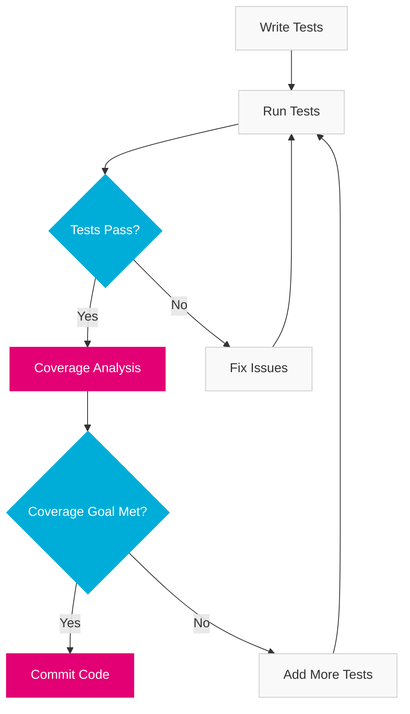

import PageHeader from '@site/src/components/PageHeader';
import FeatureCard from '@site/src/components/FeatureCard';
import CardGrid from '@site/src/components/CardGrid';
import InfoSection from '@site/src/components/InfoSection';
import FeatureGrid from '@site/src/components/FeatureGrid';
import NoAutoTitle from '@site/src/components/NoAutoTitle';

<NoAutoTitle />

<PageHeader 
  title="Testify"
  description="Comprehensive testing toolkit for Go applications"
/>

[Testify](https://github.com/stretchr/testify) is a toolkit for assertions and mocks used extensively in the Control Plane for testing.

<InfoSection type="info" title="Testing framework of choice">
  Testify enhances Go's native testing capabilities with expressive assertions, mocking, and test suite organization, making it easier to write comprehensive and maintainable tests.
</InfoSection>

## Overview

Testify provides a set of packages that enhance Go's built-in testing capabilities:

<CardGrid columns={2}>
  <FeatureCard
    title="assert"
    description={
      <>
        <p>Provides a rich set of assertion functions that help verify test conditions and generate clear, informative failure messages.</p>
        <p>Example:</p>
        <pre><code>assert.Equal(t, expected, actual, "values should be equal")</code></pre>
      </>
    }
  />
  
  <FeatureCard
    title="require"
    description={
      <>
        <p>Similar to assert, but stops test execution immediately on failure, preventing cascading failures and unnecessary test code execution.</p>
        <p>Example:</p>
        <pre><code>require.NotNil(t, obj, "object should not be nil")</code></pre>
      </>
    }
  />
  
  <FeatureCard
    title="mock"
    description={
      <>
        <p>A flexible mocking framework that helps create test doubles for interfaces, enabling isolated testing of components.</p>
        <p>Example:</p>
        <pre><code>mockObj.On("Method", arg1).Return(result, nil)</code></pre>
      </>
    }
  />
  
  <FeatureCard
    title="suite"
    description={
      <>
        <p>Provides a structure for organizing related tests into suites with shared setup and teardown functionality.</p>
        <p>Example:</p>
        <pre><code>type MySuite struct {'{'} suite.Suite {'}'}</code></pre>
      </>
    }
  />
</CardGrid>

## Why Testify?

<FeatureGrid columns={2} features={[
  {
    title: "✅ Expressive Assertions",
    description: "Rich set of assertion functions that clearly express intent and provide helpful error messages."
  },
  {
    title: "🧪 Comprehensive Testing",
    description: "Supports unit, integration, and end-to-end testing with the same consistent API."
  },
  {
    title: "🛠️ Mocking Framework",
    description: "Built-in mocking capabilities for isolating components during testing."
  },
  {
    title: "📦 Test Organization",
    description: "Suite functionality for grouping related tests with shared setup and teardown."
  },
  {
    title: "🔄 Go Integration",
    description: "Seamlessly integrates with Go's built-in testing framework and tools."
  },
  {
    title: "🧩 Extensibility",
    description: "Can be extended with custom assertions and test helpers to fit project needs."
  }
]} />

## Assertions Example

<InfoSection type="tip" title="Assertion best practices">
  Always provide meaningful error messages in assertions to make test failures easier to diagnose. Use require for critical assumptions and assert for non-critical checks.
</InfoSection>

```go
func TestFileUploader(t *testing.T) {
    uploader := NewFileUploader()
    
    // Basic assertions
    assert.NotNil(t, uploader, "Uploader should not be nil")
    
    // Testing error conditions
    err := uploader.UploadFile(context.Background(), "", []byte("content"))
    assert.Error(t, err, "Empty file ID should return error")
    
    // Testing successful paths
    err = uploader.UploadFile(context.Background(), "valid-id", []byte("content"))
    assert.NoError(t, err, "Valid upload should not return error")
}
```

### Common Assertions Used in Control Plane

<CardGrid columns={3}>
  <FeatureCard
    title="Equality"
    description={
      <>
        <ul>
          <li><code>assert.Equal</code></li>
          <li><code>assert.NotEqual</code></li>
          <li><code>assert.EqualValues</code></li>
          <li><code>assert.Exactly</code></li>
        </ul>
      </>
    }
  />
  
  <FeatureCard
    title="Error Handling"
    description={
      <>
        <ul>
          <li><code>assert.Error</code></li>
          <li><code>assert.NoError</code></li>
          <li><code>assert.ErrorIs</code></li>
          <li><code>assert.ErrorContains</code></li>
        </ul>
      </>
    }
  />
  
  <FeatureCard
    title="Collections"
    description={
      <>
        <ul>
          <li><code>assert.Contains</code></li>
          <li><code>assert.Len</code></li>
          <li><code>assert.ElementsMatch</code></li>
          <li><code>assert.Subset</code></li>
        </ul>
      </>
    }
  />
  
  <FeatureCard
    title="Types"
    description={
      <>
        <ul>
          <li><code>assert.IsType</code></li>
          <li><code>assert.Implements</code></li>
          <li><code>assert.NotNil</code></li>
          <li><code>assert.Nil</code></li>
        </ul>
      </>
    }
  />
  
  <FeatureCard
    title="Numeric"
    description={
      <>
        <ul>
          <li><code>assert.Greater</code></li>
          <li><code>assert.Less</code></li>
          <li><code>assert.InDelta</code></li>
          <li><code>assert.Positive</code></li>
        </ul>
      </>
    }
  />
  
  <FeatureCard
    title="Strings"
    description={
      <>
        <ul>
          <li><code>assert.Contains</code></li>
          <li><code>assert.Regexp</code></li>
          <li><code>assert.StartsWith</code></li>
          <li><code>assert.EndsWith</code></li>
        </ul>
      </>
    }
  />
</CardGrid>

## Test Suites

<InfoSection type="note" title="Suite organization">
  Testify's suite capabilities help organize related tests and share common setup and teardown code, making tests more maintainable and reducing duplication.
</InfoSection>

The Control Plane uses Testify's suite capabilities to organize related tests:

```go
type ControllerSuite struct {
    suite.Suite
    controller *Controller
    mockBackend *mocks.Backend
}

func (suite *ControllerSuite) SetupTest() {
    suite.mockBackend = new(mocks.Backend)
    suite.controller = NewController(suite.mockBackend)
}

func (suite *ControllerSuite) TestDownloadFile() {
    // Setup mock expectations
    suite.mockBackend.On("DownloadFile", mock.Anything, "test-id").
        Return(io.NopCloser(strings.NewReader("test content")), nil)
    
    // Call the controller
    result, err := suite.controller.DownloadFile(context.Background(), "test-id")
    
    // Assertions
    suite.NoError(err)
    suite.NotNil(result)
    
    // Verify mock expectations
    suite.mockBackend.AssertExpectations(suite.T())
}

func TestControllerSuite(t *testing.T) {
    suite.Run(t, new(ControllerSuite))
}
```

### Suite Lifecycle Methods

<FeatureGrid columns={2} features={[
  {
    title: "SetupSuite",
    description: "Runs once before any test in the suite, ideal for expensive setup operations that can be shared across all tests."
  },
  {
    title: "TearDownSuite",
    description: "Runs once after all tests in the suite, used for cleaning up resources created in SetupSuite."
  },
  {
    title: "SetupTest",
    description: "Runs before each test in the suite, perfect for creating fresh test fixtures for each test."
  },
  {
    title: "TearDownTest",
    description: "Runs after each test in the suite, useful for cleaning up resources created during tests."
  },
  {
    title: "BeforeTest",
    description: "Runs before a specific test method, allowing for test-specific setup based on method name."
  },
  {
    title: "AfterTest",
    description: "Runs after a specific test method, enabling test-specific cleanup based on method name."
  }
]} />

## Integration with Go Tests

<InfoSection type="tip" title="Testing workflow">
  Control Plane testing follows a standard workflow that combines Go's testing tools with Testify for comprehensive test coverage.
</InfoSection>

Testify integrates seamlessly with Go's built-in testing framework, allowing for:



### Running Tests

<CardGrid columns={2}>
  <FeatureCard
    title="Standard Commands"
    description={
      <>
        <p>Run all tests:</p>
        <pre><code>go test ./...</code></pre>
        <p>Run specific tests:</p>
        <pre><code>go test ./pkg/controller -run TestUpload</code></pre>
        <p>Run with verbose output:</p>
        <pre><code>go test -v ./...</code></pre>
      </>
    }
  />
  
  <FeatureCard
    title="Coverage Reports"
    description={
      <>
        <p>Run tests with coverage:</p>
        <pre><code>go test -cover ./...</code></pre>
        <p>Generate HTML coverage report:</p>
        <pre><code>go test -coverprofile=coverage.out ./...
go tool cover -html=coverage.out</code></pre>
      </>
    }
  />
</CardGrid>

## Best Practices Used in Control Plane

<InfoSection type="tip" title="Testing best practices">
  The Control Plane follows these testing best practices to ensure reliable, maintainable, and comprehensive tests.
</InfoSection>

<FeatureGrid columns={2} features={[
  {
    title: "🚫 Use require for fatal assertions",
    description: "Prevents further test execution when critical assumptions fail, avoiding confusing cascade failures."
  },
  {
    title: "📝 Use descriptive error messages",
    description: "Clear messages help quickly identify and fix test failures without having to dig through code."
  },
  {
    title: "🗂️ Create test suites for related functionality",
    description: "Organizes tests logically and enables sharing of common setup and teardown code."
  },
  {
    title: "🔄 Mock external dependencies",
    description: "Isolates the code under test and enables testing of specific behaviors without external services."
  },
  {
    title: "📊 Aim for high coverage",
    description: "The Control Plane targets at least 80% test coverage for critical components."
  },
  {
    title: "🧪 Test edge cases",
    description: "Explicitly test error conditions, empty inputs, and boundary values for robust code."
  }
]} />

### Table-Driven Tests

<InfoSection type="note" title="Table-driven tests">
  Table-driven tests are a Go idiom that allows testing multiple test cases with the same test logic, reducing duplication and making it easy to add new test cases.
</InfoSection>

```go
func TestParseFileId(t *testing.T) {
    tests := []struct {
        name     string
        input    string
        expected FileId
        wantErr  bool
    }{
        {
            name:  "Valid file ID",
            input: "prod--finance--reporting--report.pdf",
            expected: FileId{
                Environment: "prod",
                Group:       "finance",
                Team:        "reporting",
                FileName:    "report.pdf",
            },
            wantErr: false,
        },
        {
            name:     "Invalid format",
            input:    "invalid-format",
            wantErr:  true,
        },
        // More test cases...
    }
    
    for _, tc := range tests {
        t.Run(tc.name, func(t *testing.T) {
            result, err := ParseFileId(tc.input)
            
            if tc.wantErr {
                assert.Error(t, err)
            } else {
                assert.NoError(t, err)
                assert.Equal(t, tc.expected, result)
            }
        })
    }
}
```

## Related Resources

<CardGrid columns={2}>
  <FeatureCard
    title="Mockery"
    description="Learn about the mock code generation tool used alongside Testify."
    linkText="View Mockery"
    linkUrl="mockery"
  />
  
  <FeatureCard
    title="Go Language"
    description="Explore the foundational language used in the Control Plane."
    linkText="View Go Language"
    linkUrl="../Core-Technologies/golang"
  />
</CardGrid>