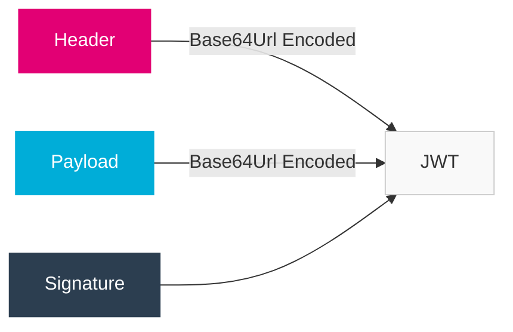
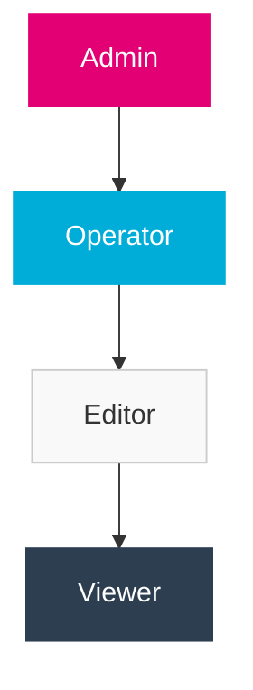

import PageHeader from '@site/src/components/PageHeader';
import FeatureCard from '@site/src/components/FeatureCard';
import CardGrid from '@site/src/components/CardGrid';
import InfoSection from '@site/src/components/InfoSection';
import FeatureGrid from '@site/src/components/FeatureGrid';
import NoAutoTitle from '@site/src/components/NoAutoTitle';

<NoAutoTitle />

<PageHeader 
  title="JWT Authentication"
  description="Secure, stateless authentication for the Control Plane"
/>

JSON Web Tokens (JWT) are used throughout the Control Plane for authentication and authorization.

<InfoSection type="info" title="Token-based authentication">
  JWTs provide a secure, stateless mechanism for authenticating users and services across the distributed Control Plane architecture.
</InfoSection>

## Overview

JWT is an open standard (RFC 7519) for securely transmitting information between parties as a JSON object. The Control Plane uses JWTs for:

<FeatureGrid columns={3} features={[
  {
    title: "👤 User Authentication",
    description: "Authenticating end users accessing Control Plane services and interfaces."
  },
  {
    title: "🔄 Service-to-Service",
    description: "Secure communication between Control Plane microservices."
  },
  {
    title: "🔒 Role-Based Access",
    description: "Implementing fine-grained role-based access control across services."
  },
  {
    title: "🔑 API Authorization",
    description: "Securing API endpoints against unauthorized access."
  },
  {
    title: "🔍 Identity Verification",
    description: "Validating user and service identities throughout the system."
  },
  {
    title: "📊 Audit Trail",
    description: "Tracking user actions through JWT subject and claims."
  }
]} />

## Why JWT?

<CardGrid columns={2}>
  <FeatureCard
    title="Stateless Architecture"
    description={<>
      <p>JWTs enable a stateless authentication architecture:</p>
      <ul>
        <li>No need to store session data on the server</li>
        <li>Improved scalability with horizontally scaled services</li>
        <li>Reduced database load for authentication checks</li>
        <li>Self-contained tokens with all necessary information</li>
        <li>Works seamlessly across multiple services</li>
      </ul>
    </>}
  />
  
  <FeatureCard
    title="Security Features"
    description={<>
      <p>JWTs provide robust security through:</p>
      <ul>
        <li>Cryptographic signing to verify integrity</li>
        <li>Expiration timestamps to limit token lifetime</li>
        <li>Standard claim validation for issuer and audience</li>
        <li>Support for multiple signing algorithms</li>
        <li>Ability to encode permissions directly in the token</li>
      </ul>
    </>}
  />
</CardGrid>

## JWT Integration

<InfoSection type="tip" title="Middleware approach">
  The Control Plane uses middleware to handle JWT authentication, making it easy to secure endpoints with minimal code duplication.
</InfoSection>

The Control Plane uses the `github.com/gofiber/contrib/jwt` middleware for JWT authentication:

```go
func setupAuth(app *fiber.App) {
    app.Use(jwt.New(jwt.Config{
        SigningKey:    []byte(os.Getenv("JWT_SECRET")),
        SigningMethod: "HS256",
        ErrorHandler: func(c *fiber.Ctx, err error) error {
            return c.Status(fiber.StatusUnauthorized).JSON(fiber.Map{
                "error": "Unauthorized",
                "message": err.Error(),
            })
        },
    }))
}
```

### Protecting Routes

<InfoSection type="note" title="Selective protection">
  Routes can be selectively protected by applying middleware at different levels or to specific route groups.
</InfoSection>

```go
func setupRoutes(app *fiber.App) {
    // Public routes
    app.Get("/health", healthCheck)
    app.Get("/version", getVersion)
    
    // Protected API routes
    api := app.Group("/api/v1")
    api.Use(jwt.New(jwt.Config{
        SigningKey: []byte(os.Getenv("JWT_SECRET")),
    }))
    
    // Routes under /api/v1 now require valid JWT
    api.Get("/files", listFiles)
    api.Post("/files", uploadFile)
    
    // Admin routes with additional role check
    admin := app.Group("/admin")
    admin.Use(jwt.New(jwt.Config{
        SigningKey: []byte(os.Getenv("JWT_SECRET")),
    }))
    admin.Use(requireAdmin) // Additional middleware for admin role check
    
    admin.Get("/metrics", getMetrics)
    admin.Post("/users", createUser)
}

func requireAdmin(c *fiber.Ctx) error {
    user := c.Locals("user").(*jwt.Token)
    claims := user.Claims.(jwt.MapClaims)
    
    if !hasRole(claims, "admin") {
        return c.Status(fiber.StatusForbidden).JSON(fiber.Map{
            "error": "Forbidden",
            "message": "Admin role required",
        })
    }
    
    return c.Next()
}
```

## JWT Structure

<InfoSection type="note" title="Token structure">
  Understanding the JWT structure is key to properly implementing and troubleshooting authentication in the Control Plane.
</InfoSection>

JWTs used in the Control Plane follow a standard three-part structure:



### Example JWT

```
{
  "header": {
    "alg": "RS256",
    "typ": "JWT",
    "kid": "2022-key-1"
  },
  "payload": {
    "sub": "user-123",
    "name": "John Doe",
    "roles": ["admin", "editor"],
    "groups": ["group-123", "group-456"],
    "exp": 1640995200,
    "iat": 1640908800,
    "iss": "https://auth.telekom.de"
  },
  "signature": "signature-data"
}
```

### Standard Claims

<CardGrid columns={3}>
  <FeatureCard
    title="sub (Subject)"
    description="Unique identifier for the user or service. In the Control Plane, this is typically a user ID or service name."
  />
  
  <FeatureCard
    title="exp (Expiration)"
    description="Unix timestamp indicating when the token expires. The Control Plane validates this claim to ensure tokens are not used after expiration."
  />
  
  <FeatureCard
    title="iat (Issued At)"
    description="Unix timestamp indicating when the token was issued. Used for token tracking and audit purposes."
  />
  
  <FeatureCard
    title="iss (Issuer)"
    description="Entity that issued the token. The Control Plane validates this to ensure tokens come from trusted sources."
  />
  
  <FeatureCard
    title="aud (Audience)"
    description="Intended recipient of the token. Used to ensure tokens are used only with intended services."
  />
  
  <FeatureCard
    title="jti (JWT ID)"
    description="Unique identifier for the token. Used for token revocation and tracking."
  />
</CardGrid>

### Custom Claims

<InfoSection type="tip" title="Custom claims">
  The Control Plane extends standard JWT claims with custom claims for role-based access control and multi-tenancy.
</InfoSection>

<CardGrid columns={2}>
  <FeatureCard
    title="roles"
    description={<>
      <p>Array of role strings assigned to the user.</p>
      <p>Example:</p>
      <p><code>{`{"roles": ["admin", "editor", "viewer"]}`}</code></p>
      <p>Used for role-based access control across services.</p>
    </>}
  />
  
  <FeatureCard
    title="groups"
    description={<>
      <p>Array of group identifiers the user belongs to.</p>
      <p>Example:</p>
      <p><code>{`{"groups": ["finance", "marketing"]}`}</code></p>
      <p>Used for organizational access boundaries.</p>
    </>}
  />
  
  <FeatureCard
    title="permissions"
    description={<>
      <p>Fine-grained permission descriptors.</p>
      <p>Example:</p>
      <p><code>{`{
  "permissions": {
    "files": ["read", "write"],
    "users": ["read"]
  }
}`}</code></p>
    </>}
  />
  
  <FeatureCard
    title="tenant"
    description={<>
      <p>Multi-tenancy identifier for resource isolation.</p>
      <p>Example:</p>
      <p><code>{`{"tenant": "org-123456"}`}</code></p>
      <p>Ensures users can only access resources within their tenant.</p>
    </>}
  />
</CardGrid>

## RBAC with JWT

<InfoSection type="tip" title="Role-based access">
  Role-based access control is implemented through JWT claims, allowing for consistent access control across all Control Plane services.
</InfoSection>

The Control Plane implements Role-Based Access Control (RBAC) using JWT claims:

```go
func checkAccess(ctx *fiber.Ctx, requiredRole string) bool {
    user := ctx.Locals("user").(*jwt.Token)
    claims := user.Claims.(jwt.MapClaims)
    
    // Extract roles from the token
    rolesData := claims["roles"]
    if rolesData == nil {
        return false
    }
    
    roles := make([]string, 0)
    if rolesArray, ok := rolesData.([]interface{}); ok {
        for _, role := range rolesArray {
            if roleStr, ok := role.(string); ok {
                roles = append(roles, roleStr)
            }
        }
    }
    
    // Check if the user has the required role
    for _, role := range roles {
        if role == requiredRole {
            return true
        }
    }
    
    return false
}
```

### Role Hierarchy

<InfoSection type="note" title="Role hierarchy">
  The Control Plane implements a role hierarchy where higher-level roles inherit permissions from lower-level roles.
</InfoSection>



## Token Validation

<InfoSection type="warning" title="Comprehensive validation">
  Always validate JWT tokens thoroughly for security. The Control Plane performs multiple validation steps to ensure token integrity and authenticity.
</InfoSection>

The Control Plane validates JWTs for:

<FeatureGrid columns={2} features={[
  {
    title: "✅ Signature Integrity",
    description: "Verifies the token has not been tampered with using cryptographic signatures."
  },
  {
    title: "⏱️ Expiration Time",
    description: "Checks that the token has not expired based on the 'exp' claim."
  },
  {
    title: "🔍 Issuer Validation",
    description: "Confirms the token was issued by a trusted source using the 'iss' claim."
  },
  {
    title: "👥 Audience Verification",
    description: "Ensures the token is intended for the current service using the 'aud' claim."
  },
  {
    title: "🔄 Not Before Time",
    description: "Verifies the token is not used before its valid time using the 'nbf' claim."
  },
  {
    title: "⚙️ Algorithm Validation",
    description: "Confirms the token uses the expected signing algorithm."
  }
]} />

```go
func validateToken(tokenString string) (*jwt.Token, error) {
    token, err := jwt.Parse(tokenString, func(token *jwt.Token) (interface{}, error) {
        // Validate signing method
        if _, ok := token.Method.(*jwt.SigningMethodHMAC); !ok {
            return nil, fmt.Errorf("unexpected signing method: %v", token.Header["alg"])
        }
        
        // Return the secret key for validation
        return []byte(os.Getenv("JWT_SECRET")), nil
    })
    
    if err != nil {
        return nil, err
    }
    
    // Check if token is valid
    if !token.Valid {
        return nil, errors.New("invalid token")
    }
    
    return token, nil
}
```

## Token Generation

<InfoSection type="note" title="Token issuance">
  Services in the Control Plane generate JWTs for clients after successful authentication, using secure methods to create signed tokens.
</InfoSection>

Services in the Control Plane generate JWTs for clients:

```go
func generateToken(userID string, roles []string) (string, error) {
    // Create claims
    claims := jwt.MapClaims{
        "sub":   userID,
        "roles": roles,
        "exp":   time.Now().Add(time.Hour * 24).Unix(),
        "iat":   time.Now().Unix(),
        "iss":   "controlplane",
    }
    
    // Create token with claims
    token := jwt.NewWithClaims(jwt.SigningMethodHS256, claims)
    
    // Generate signed token
    signedToken, err := token.SignedString([]byte(os.Getenv("JWT_SECRET")))
    if err != nil {
        return "", err
    }
    
    return signedToken, nil
}
```

## Security Best Practices

<InfoSection type="warning" title="JWT security">
  The Control Plane follows these security best practices for JWT implementation to minimize vulnerability risks.
</InfoSection>

<CardGrid columns={2}>
  <FeatureCard
    title="Short-lived Tokens"
    description={<>
      <p>The Control Plane uses short-lived access tokens to reduce the risk of token misuse:</p>
      <ul>
        <li>Access tokens expire in 1 hour or less</li>
        <li>Refresh tokens have a maximum lifetime of 7 days</li>
        <li>Session tokens include device fingerprinting</li>
        <li>Critical operations require re-authentication</li>
      </ul>
    </>}
  />
  
  <FeatureCard
    title="Secret Management"
    description={<>
      <p>JWT signing secrets are carefully managed:</p>
      <ul>
        <li>Secrets stored in Kubernetes secrets or Vault</li>
        <li>Different keys for development and production</li>
        <li>Regular key rotation (every 90 days)</li>
        <li>Key compromise procedures in place</li>
        <li>Minimum 256-bit key strength</li>
      </ul>
    </>}
  />
  
  <FeatureCard
    title="Algorithm Selection"
    description={<>
      <p>The Control Plane uses robust algorithms:</p>
      <ul>
        <li>RS256 (RSA Signature with SHA-256) for production</li>
        <li>HS256 (HMAC with SHA-256) for development/testing</li>
        <li>Explicitly verifies the algorithm in tokens</li>
        <li>Rejects tokens with "none" algorithm</li>
      </ul>
    </>}
  />
  
  <FeatureCard
    title="Transport Security"
    description={<>
      <p>JWTs are always transmitted securely:</p>
      <ul>
        <li>TLS/HTTPS for all API communications</li>
        <li>Token transmitted in Authorization header</li>
        <li>No storage in local storage or cookies (XSS protection)</li>
        <li>Secure, HttpOnly cookies when browser storage is needed</li>
      </ul>
    </>}
  />
</CardGrid>

## Related Resources

<CardGrid columns={2}>
  <FeatureCard
    title="Gofiber"
    description="Learn about the web framework used in conjunction with JWT authentication."
    linkText="View Gofiber"
    linkUrl="../Web-Frameworks/gofiber"
  />
  
  <FeatureCard
    title="Architecture"
    description="Understand how JWT fits into the overall Control Plane architecture."
    linkText="View Architecture"
    linkUrl="../../Overview/architecture"
  />
</CardGrid>