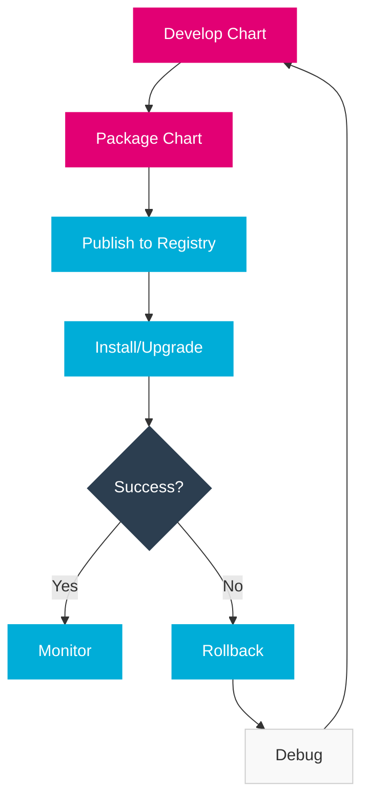

import PageHeader from '@site/src/components/PageHeader';
import FeatureCard from '@site/src/components/FeatureCard';
import CardGrid from '@site/src/components/CardGrid';
import InfoSection from '@site/src/components/InfoSection';
import FeatureGrid from '@site/src/components/FeatureGrid';

<PageHeader 
  title="Helm Charts"
  description="Kubernetes package management for the Control Plane"
/>

Helm is used for packaging, versioning, and deploying the Control Plane components to Kubernetes clusters.

<InfoSection type="info" title="Kubernetes package manager">
  Helm provides a standardized way to package and deploy Control Plane components, handling complex dependencies and configurations through a template-based approach.
</InfoSection>

## Overview

[Helm](https://helm.sh/) is the package manager for Kubernetes. The Control Plane uses Helm to:

<FeatureGrid columns={2} features={[
  {
    title: "📦 Package Components",
    description: "Bundle applications, dependencies, and configurations as reusable charts."
  },
  {
    title: "⚙️ Manage Configuration",
    description: "Centralize and parameterize application settings through values files."
  },
  {
    title: "🚀 Simplify Deployment",
    description: "Streamline the process of deploying complex applications to Kubernetes."
  },
  {
    title: "🔄 Version Control",
    description: "Track application versions and changes through chart versioning."
  },
  {
    title: "↩️ Handle Rollbacks",
    description: "Quickly revert to previous versions if issues arise during updates."
  },
  {
    title: "🔌 Manage Dependencies",
    description: "Handle relationships between components and third-party services."
  }
]} />

<div align="center">
  
</div>

## Chart Structure

<InfoSection type="tip" title="Standardized structure">
  The Control Plane follows a consistent Helm chart structure across all components, making maintenance and updates more predictable.
</InfoSection>

The Control Plane components follow a standard Helm chart structure:

```
common-server/
├── Chart.yaml             # Chart metadata
├── values.yaml            # Default values
└── templates/             # Kubernetes manifests templates
    ├── _helpers.tpl       # Template helpers
    ├── deployment.yaml    # Deployment template
    ├── service.yaml       # Service template
    ├── configmap.yaml     # ConfigMap template
    ├── ingress.yaml       # Ingress template
    ├── servicemonitor.yaml # Prometheus ServiceMonitor
    └── rbac/              # RBAC templates
        ├── binding.yaml
        ├── clusterrole.yaml
        └── serviceaccount.yaml
```

### Directory Structure Explained

<CardGrid columns={2}>
  <FeatureCard
    title="Chart.yaml"
    description={
      <>
        <p>Contains metadata about the chart including:</p>
        <ul>
          <li>Chart name and version</li>
          <li>Application version</li>
          <li>Description and maintainer information</li>
          <li>Dependencies on other charts</li>
          <li>Keywords for searchability</li>
        </ul>
      </>
    }
  />
  
  <FeatureCard
    title="values.yaml"
    description={
      <>
        <p>Default configuration values for the chart:</p>
        <ul>
          <li>Image references and versions</li>
          <li>Resource limits and requests</li>
          <li>Service and ingress configurations</li>
          <li>Feature flags and toggles</li>
          <li>Environment-specific settings</li>
        </ul>
      </>
    }
  />
  
  <FeatureCard
    title="templates/"
    description={
      <>
        <p>Directory containing template files:</p>
        <ul>
          <li>Kubernetes resource definitions</li>
          <li>Dynamic templates with Go templating</li>
          <li>Helper functions in _helpers.tpl</li>
          <li>NOTES.txt for post-install instructions</li>
          <li>Tests for chart validation</li>
        </ul>
      </>
    }
  />
  
  <FeatureCard
    title="Additional Files"
    description={
      <>
        <p>Other important files in Control Plane charts:</p>
        <ul>
          <li>README.md for documentation</li>
          <li>NOTES.txt for usage instructions</li>
          <li>LICENSE for license information</li>
          <li>requirements.yaml (for v2 charts)</li>
          <li>values.schema.json for value validation</li>
        </ul>
      </>
    }
  />
</CardGrid>

## Chart.yaml Example

<InfoSection type="note" title="Chart metadata">
  The Chart.yaml file defines essential metadata and dependencies for the Helm chart.
</InfoSection>

```yaml
apiVersion: v2
name: common-server
description: Common Server components for the Control Plane
type: application
version: 0.1.0
appVersion: "0.1.0"
dependencies:
  - name: postgresql
    version: 10.3.18
    repository: https://charts.bitnami.com/bitnami
    condition: postgresql.enabled
```

### Chart Versioning Strategy

<InfoSection type="tip" title="Semantic versioning">
  The Control Plane uses semantic versioning (MAJOR.MINOR.PATCH) for all Helm charts, with careful separation of chart version and app version.
</InfoSection>

<CardGrid columns={2}>
  <FeatureCard
    title="Chart Version"
    description={
      <>
        <p>The version field in Chart.yaml follows these principles:</p>
        <ul>
          <li>MAJOR: Breaking changes to values schema or templates</li>
          <li>MINOR: New features and backwards-compatible changes</li>
          <li>PATCH: Bug fixes and minor template improvements</li>
          <li>Always incremented when chart contents change</li>
        </ul>
      </>
    }
  />
  
  <FeatureCard
    title="App Version"
    description={
      <>
        <p>The appVersion field in Chart.yaml follows these principles:</p>
        <ul>
          <li>Represents the version of the application being deployed</li>
          <li>Independent of the chart version</li>
          <li>May change without chart version change (for image updates)</li>
          <li>Used as the default tag for container images</li>
        </ul>
      </>
    }
  />
</CardGrid>

## Values.yaml Example

<InfoSection type="note" title="Default configuration">
  The values.yaml file provides default configuration that can be overridden during deployment.
</InfoSection>

```yaml
# Default configuration values
replicaCount: 1

image:
  repository: controlplane/common-server
  tag: latest
  pullPolicy: IfNotPresent

service:
  type: ClusterIP
  port: 80

ingress:
  enabled: false
  className: nginx
  hosts:
    - host: controlplane.example.com
      paths:
        - path: /
          pathType: Prefix

resources:
  limits:
    cpu: 100m
    memory: 128Mi
  requests:
    cpu: 50m
    memory: 64Mi

serviceMonitor:
  enabled: true
  interval: 15s

postgresql:
  enabled: false
  auth:
    username: controlplane
    database: controlplane
```

### Configuration Categories

<FeatureGrid columns={2} features={[
  {
    title: "📦 Deployment Configuration",
    description: "Settings for the Deployment resource, including replica count, update strategy, and pod specifications."
  },
  {
    title: "🖼️ Container Images",
    description: "Image repository, tag, and pull policy settings for consistency across environments."
  },
  {
    title: "🔌 Networking",
    description: "Service, ingress, and network policy configurations for connectivity."
  },
  {
    title: "⚙️ Resources",
    description: "CPU, memory, and storage resource requests and limits to ensure proper scheduling."
  },
  {
    title: "🧩 Dependencies",
    description: "Configuration for dependent services like databases and message queues."
  },
  {
    title: "🔍 Observability",
    description: "Settings for monitoring, logging, and tracing integration."
  }
]} />

## Template Example

<InfoSection type="tip" title="Templating power">
  Helm templates use Go template syntax to dynamically generate Kubernetes manifests based on values and context.
</InfoSection>

```yaml
# templates/deployment.yaml
apiVersion: apps/v1
kind: Deployment
metadata:
  name: {{ include "common-server.fullname" . }}
  labels:
    {{- include "common-server.labels" . | nindent 4 }}
spec:
  replicas: {{ .Values.replicaCount }}
  selector:
    matchLabels:
      {{- include "common-server.selectorLabels" . | nindent 6 }}
  template:
    metadata:
      labels:
        {{- include "common-server.selectorLabels" . | nindent 8 }}
    spec:
      serviceAccountName: {{ include "common-server.serviceAccountName" . }}
      containers:
        - name: {{ .Chart.Name }}
          image: "{{ .Values.image.repository }}:{{ .Values.image.tag | default .Chart.AppVersion }}"
          imagePullPolicy: {{ .Values.image.pullPolicy }}
          ports:
            - name: http
              containerPort: 8080
              protocol: TCP
          {{- if .Values.configMap.enabled }}
          volumeMounts:
            - name: config-volume
              mountPath: /etc/controlplane
          {{- end }}
          resources:
            {{- toYaml .Values.resources | nindent 12 }}
      {{- if .Values.configMap.enabled }}
      volumes:
        - name: config-volume
          configMap:
            name: {{ include "common-server.fullname" . }}-config
      {{- end }}
```

### Template Functions

<CardGrid columns={2}>
  <FeatureCard
    title="Value References"
    description={
      <>
        <p>Ways to reference values in templates:</p>
        <ul>
          <li><code>{`{{ .Values.key }}`}</code> - Access values.yaml data</li>
          <li><code>{`{{ .Release.Name }}`}</code> - Reference release metadata</li>
          <li><code>{`{{ .Chart.Name }}`}</code> - Access chart information</li>
          <li><code>{`{{ .Capabilities.KubeVersion }}`}</code> - Check Kubernetes version</li>
        </ul>
      </>
    }
  />
  
  <FeatureCard
    title="Flow Control"
    description={
      <>
        <p>Logic operations in templates:</p>
        <ul>
          <li><code>{`{{- if .Values.enabled }}`}</code> - Conditional blocks</li>
          <li><code>{`{{- range .Values.items }}`}</code> - Iteration</li>
          <li><code>{`{{- with .Values.nested }}`}</code> - Scope changing</li>
          <li><code>{`{{- else }}`}</code> - Alternative paths</li>
        </ul>
      </>
    }
  />
  
  <FeatureCard
    title="Template Modifiers"
    description={
      <>
        <p>Common output modifiers:</p>
        <ul>
          <li><code>| quote</code> - Add quotes around a value</li>
          <li><code>| nindent 4</code> - Indent with newline</li>
          <li><code>| toYaml</code> - Convert to YAML</li>
          <li><code>| default "fallback"</code> - Provide default value</li>
        </ul>
      </>
    }
  />
  
  <FeatureCard
    title="Named Templates"
    description={
      <>
        <p>Reusable template snippets:</p>
        <ul>
          <li><code>{`{{ include "name" . }}`}</code> - Include with current scope</li>
          <li><code>{`{{- define "name" }}`}</code> - Define a template</li>
          <li><code>{`{{- template "name" . }}`}</code> - Include without chaining</li>
          <li>Stored in _helpers.tpl files</li>
        </ul>
      </>
    }
  />
</CardGrid>

## Deployment Process

<InfoSection type="note" title="Deployment workflow">
  The Control Plane uses a standardized workflow for deploying and managing Helm charts across environments.
</InfoSection>

To deploy a Control Plane component using Helm:

```bash
# Add the Control Plane Helm repository
helm repo add controlplane https://charts.controlplane.example.com

# Update repositories
helm repo update

# Install a component
helm install file-manager controlplane/file-manager \
  --namespace controlplane-system \
  --create-namespace \
  --values custom-values.yaml

# Upgrade an existing installation
helm upgrade file-manager controlplane/file-manager \
  --namespace controlplane-system \
  --values custom-values.yaml

# Rollback to a previous version
helm rollback file-manager 1 \
  --namespace controlplane-system
```

### Deployment Workflow



## Template Helpers

<InfoSection type="tip" title="DRY templates">
  Helper templates promote the DRY (Don't Repeat Yourself) principle by centralizing common functionality.
</InfoSection>

The Control Plane Helm charts use common template helpers:

```
{{/* Generate basic labels */}}
{{- define "common-server.labels" -}}
helm.sh/chart: {{ include "common-server.chart" . }}
{{ include "common-server.selectorLabels" . }}
app.kubernetes.io/version: {{ .Chart.AppVersion | quote }}
app.kubernetes.io/managed-by: {{ .Release.Service }}
{{- end }}

{{/* Selector labels */}}
{{- define "common-server.selectorLabels" -}}
app.kubernetes.io/name: {{ include "common-server.name" . }}
app.kubernetes.io/instance: {{ .Release.Name }}
{{- end }}
```

### Common Helpers

<CardGrid columns={2}>
  <FeatureCard
    title="Naming Helpers"
    description={
      <>
        <p>Functions for consistent resource naming:</p>
        <ul>
          <li><code>name</code> - Base name for resources</li>
          <li><code>fullname</code> - Unique name with release name</li>
          <li><code>chart</code> - Chart name and version</li>
          <li><code>serviceAccountName</code> - Service account reference</li>
        </ul>
      </>
    }
  />
  
  <FeatureCard
    title="Label Helpers"
    description={
      <>
        <p>Functions for standardized Kubernetes labels:</p>
        <ul>
          <li><code>labels</code> - Common metadata labels</li>
          <li><code>selectorLabels</code> - For service selectors</li>
          <li><code>commonLabels</code> - Org-specific standards</li>
          <li><code>matchLabels</code> - For selectors and affinity</li>
        </ul>
      </>
    }
  />
  
  <FeatureCard
    title="Configuration Helpers"
    description={
      <>
        <p>Functions for configuration processing:</p>
        <ul>
          <li><code>postgresqlConnectionString</code> - Format DB connection</li>
          <li><code>metricsPort</code> - Calculate consistent port</li>
          <li><code>tlsConfig</code> - Standard TLS settings</li>
          <li><code>jwtSecret</code> - Reference or generate JWT secret</li>
        </ul>
      </>
    }
  />
  
  <FeatureCard
    title="Capability Checks"
    description={
      <>
        <p>Functions to check for capabilities:</p>
        <ul>
          <li><code>hasNetworkPolicy</code> - Check NetworkPolicy support</li>
          <li><code>hasPodSecurityContext</code> - Check PodSecurityContext</li>
          <li><code>hasIngressClass</code> - Check for IngressClass</li>
          <li><code>hasPrometheusOperator</code> - Check for monitoring</li>
        </ul>
      </>
    }
  />
</CardGrid>

## Chart Dependencies

<InfoSection type="note" title="Modular architecture">
  The Control Plane leverages Helm's dependency management for a modular architecture with reusable components.
</InfoSection>

The Control Plane uses Helm chart dependencies to include common infrastructure:

```bash
# Update dependencies
helm dependency update

# Build dependencies
helm dependency build
```

### Common Dependencies

<FeatureGrid columns={3} features={[
  {
    title: "PostgreSQL",
    description: "Relational database for persistent storage of configuration and operational data."
  },
  {
    title: "Redis",
    description: "In-memory data store used for caching, session storage, and message queuing."
  },
  {
    title: "MinIO",
    description: "S3-compatible object storage for file storage and distribution."
  },
  {
    title: "Prometheus",
    description: "Monitoring system for metrics collection and alerting."
  },
  {
    title: "Grafana",
    description: "Visualization and dashboarding for monitoring data."
  },
  {
    title: "Jaeger",
    description: "Distributed tracing for monitoring and troubleshooting microservices."
  }
]} />

## Best Practices

<InfoSection type="tip" title="Helm best practices">
  The Control Plane follows these best practices for Helm charts to ensure maintainability and reliability.
</InfoSection>

<CardGrid columns={2}>
  <FeatureCard
    title="Configuration"
    description={
      <>
        <p>Best practices for values and configuration:</p>
        <ul>
          <li>Parameterize all configurable values</li>
          <li>Provide sensible defaults for all parameters</li>
          <li>Document each value in values.yaml</li>
          <li>Group related values logically</li>
          <li>Use consistent naming conventions</li>
        </ul>
      </>
    }
  />
  
  <FeatureCard
    title="Templates"
    description={
      <>
        <p>Best practices for templates:</p>
        <ul>
          <li>Use conditionals for optional features</li>
          <li>Leverage helper functions for common patterns</li>
          <li>Maintain consistent indentation</li>
          <li>Validate templates with <code>helm lint</code></li>
          <li>Add comments for complex logic</li>
        </ul>
      </>
    }
  />
  
  <FeatureCard
    title="Documentation"
    description={
      <>
        <p>Best practices for chart documentation:</p>
        <ul>
          <li>Include NOTES.txt with usage instructions</li>
          <li>Maintain a comprehensive README.md</li>
          <li>Document all values with descriptions</li>
          <li>Provide usage examples</li>
          <li>Include upgrade notes for breaking changes</li>
        </ul>
      </>
    }
  />
  
  <FeatureCard
    title="Versioning and Distribution"
    description={
      <>
        <p>Best practices for chart release:</p>
        <ul>
          <li>Follow semantic versioning</li>
          <li>Include a changelog</li>
          <li>Sign charts for verification</li>
          <li>Use a chart repository for distribution</li>
          <li>Test charts in CI/CD pipeline</li>
        </ul>
      </>
    }
  />
</CardGrid>

### Control Plane Specific Practices

<InfoSection type="note" title="Control Plane standards">
  Beyond general Helm best practices, the Control Plane follows specific standards for consistency across all components.
</InfoSection>

<FeatureGrid columns={2} features={[
  {
    title: "🏷️ Standardized Labels",
    description: "All resources use consistent labeling for improved organization and filtering."
  },
  {
    title: "🔒 Security Context",
    description: "Non-root users and read-only file systems are used wherever possible."
  },
  {
    title: "🔍 Monitoring Integration",
    description: "ServiceMonitor resources for automatic Prometheus integration."
  },
  {
    title: "📊 Resource Management",
    description: "All containers have explicit resource requests and limits."
  },
  {
    title: "🩺 Health Checks",
    description: "Comprehensive readiness and liveness probes for all services."
  },
  {
    title: "🔐 Secret Management",
    description: "Secure handling of secrets with external references where appropriate."
  }
]} />

## Related Resources

<CardGrid columns={2}>
  <FeatureCard
    title="Kubernetes"
    description="Learn about the container orchestration platform that runs the Control Plane."
    linkText="View Kubernetes"
    linkUrl="kubernetes"
  />
  
  <FeatureCard
    title="Infrastructure"
    description="Explore the overall infrastructure components of the Control Plane."
    linkText="View Infrastructure"
    linkUrl="../../0-Overview/infrastructure"
  />
</CardGrid>