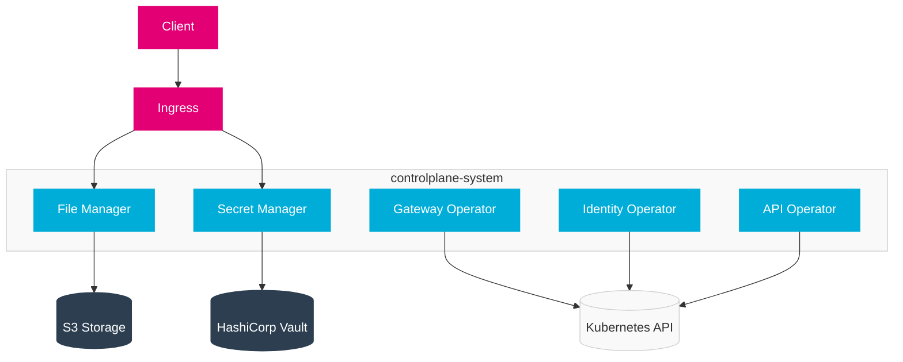
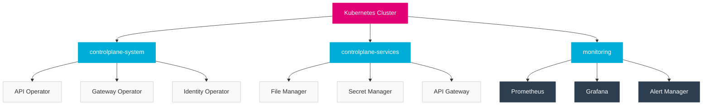

import PageHeader from '@site/src/components/PageHeader';
import FeatureCard from '@site/src/components/FeatureCard';
import CardGrid from '@site/src/components/CardGrid';
import InfoSection from '@site/src/components/InfoSection';
import FeatureGrid from '@site/src/components/FeatureGrid';
import NoAutoTitle from '@site/src/components/NoAutoTitle';

<NoAutoTitle />

<PageHeader 
  title="Kubernetes Deployment"
  description="Cloud-native deployment architecture for the Control Plane"
/>

The Control Plane components are deployed as Kubernetes resources, following cloud-native best practices.

<InfoSection type="info" title="Container-based architecture">
  The Control Plane follows a microservices architecture with each component deployed separately in Kubernetes, enabling independent scaling, resilience, and lifecycle management.
</InfoSection>

## Deployment Architecture

<InfoSection type="note" title="Component isolation">
  Each component in the Control Plane is deployed as a separate Kubernetes deployment for independent lifecycle management.
</InfoSection>

Each component in the Control Plane is deployed as a separate Kubernetes deployment:



### Key Components

<CardGrid columns={3}>
  <FeatureCard
    title="File Manager"
    description={
      <>
        <p>Provides file storage and retrieval services:</p>
        <ul>
          <li>Secure file uploads and downloads</li>
          <li>S3 backend integration</li>
          <li>JWT authentication</li>
          <li>Quota management</li>
          <li>File metadata handling</li>
        </ul>
      </>
    }
  />
  
  <FeatureCard
    title="Secret Manager"
    description={
      <>
        <p>Manages sensitive information:</p>
        <ul>
          <li>Secure storage of credentials</li>
          <li>HashiCorp Vault integration</li>
          <li>Secret rotation</li>
          <li>Access control</li>
          <li>Audit logging</li>
        </ul>
      </>
    }
  />
  
  <FeatureCard
    title="Gateway Operator"
    description={
      <>
        <p>Manages API gateway resources:</p>
        <ul>
          <li>Route configuration</li>
          <li>Traffic policies</li>
          <li>Rate limiting</li>
          <li>Authentication integration</li>
          <li>Gateway deployments</li>
        </ul>
      </>
    }
  />
  
  <FeatureCard
    title="Identity Operator"
    description={
      <>
        <p>Handles identity management:</p>
        <ul>
          <li>Identity provider integration</li>
          <li>Client registrations</li>
          <li>Token management</li>
          <li>OIDC configuration</li>
          <li>Credential rotation</li>
        </ul>
      </>
    }
  />
  
  <FeatureCard
    title="API Operator"
    description={
      <>
        <p>Manages API lifecycle:</p>
        <ul>
          <li>API definitions and versioning</li>
          <li>API exposures and visibility</li>
          <li>Subscription management</li>
          <li>Documentation integration</li>
          <li>Schema validation</li>
        </ul>
      </>
    }
  />
</CardGrid>

## Kubernetes Resources

<InfoSection type="tip" title="Resource types">
  The Control Plane uses standard Kubernetes resource types for deployment, combined with custom resources for domain-specific functionality.
</InfoSection>

The Control Plane uses the following Kubernetes resource types:

### Deployments

<InfoSection type="note" title="Workload management">
  Deployments manage the desired state for replica sets and pods, ensuring the specified number of pods are running with the correct configuration.
</InfoSection>

```yaml
apiVersion: apps/v1
kind: Deployment
metadata:
  name: file-manager
  namespace: controlplane-system
spec:
  replicas: 2
  selector:
    matchLabels:
      app: file-manager
  template:
    metadata:
      labels:
        app: file-manager
    spec:
      containers:
      - name: file-manager
        image: controlplane/file-manager:v1.0.0
        ports:
        - containerPort: 8080
        env:
        - name: S3_ENDPOINT
          valueFrom:
            configMapKeyRef:
              name: file-manager-config
              key: s3.endpoint
        resources:
          limits:
            cpu: 500m
            memory: 512Mi
          requests:
            cpu: 100m
            memory: 128Mi
```

### Services

<InfoSection type="note" title="Service discovery">
  Services provide stable network endpoints for pods, enabling service discovery and load balancing between components.
</InfoSection>

```yaml
apiVersion: v1
kind: Service
metadata:
  name: file-manager
  namespace: controlplane-system
spec:
  selector:
    app: file-manager
  ports:
  - port: 80
    targetPort: 8080
  type: ClusterIP
```

### ConfigMaps

<InfoSection type="note" title="Configuration management">
  ConfigMaps store non-sensitive configuration data that can be consumed by pods as environment variables or mounted volumes.
</InfoSection>

```yaml
apiVersion: v1
kind: ConfigMap
metadata:
  name: file-manager-config
  namespace: controlplane-system
data:
  s3.endpoint: "minio.storage.svc.cluster.local"
  s3.bucket: "file-manager"
  s3.useSSL: "true"
```

### Network Policies

<InfoSection type="tip" title="Security boundaries">
  Network Policies enforce communication boundaries between components, implementing the principle of least privilege for network access.
</InfoSection>

```yaml
apiVersion: networking.k8s.io/v1
kind: NetworkPolicy
metadata:
  name: allow-api-traffic
  namespace: controlplane-system
spec:
  podSelector:
    matchLabels:
      app: file-manager
  ingress:
  - from:
    - podSelector:
        matchLabels:
          app: api-gateway
    ports:
    - protocol: TCP
      port: 8080
```

## Resource Organization

<InfoSection type="note" title="Namespace structure">
  The Control Plane uses a structured namespace approach for logical separation of components.
</InfoSection>



## Custom Resources

<InfoSection type="tip" title="Domain-specific extensions">
  The Control Plane extends Kubernetes with custom resources that model domain-specific concepts and enable declarative configuration.
</InfoSection>

The Control Plane defines and uses several Custom Resource Definitions (CRDs):

```yaml
apiVersion: apiextensions.k8s.io/v1
kind: CustomResourceDefinition
metadata:
  name: apis.api.cp.ei.telekom.de
spec:
  group: api.cp.ei.telekom.de
  names:
    kind: API
    plural: apis
    singular: api
  scope: Namespaced
  versions:
    - name: v1
      served: true
      storage: true
      schema:
        openAPIV3Schema:
          type: object
          properties:
            spec:
              type: object
              # Schema details...
```

### Custom Resource Types

<FeatureGrid columns={2} features={[
  {
    title: "API",
    description: "Represents an API specification with OpenAPI definition, versioning, and visibility settings."
  },
  {
    title: "Gateway",
    description: "Defines API gateway configuration including routes, plugins, and listener settings."
  },
  {
    title: "IdentityProvider",
    description: "Configures external identity providers for authentication and authorization."
  },
  {
    title: "FileManager",
    description: "Defines file storage service configuration including backend and access settings."
  },
  {
    title: "APIExposure",
    description: "Connects APIs to gateways for public exposure with specific policies."
  },
  {
    title: "APISubscription",
    description: "Grants consumers access to specific APIs with usage plans."
  }
]} />

## RBAC Configuration

<InfoSection type="warning" title="Access control">
  The Control Plane implements the principle of least privilege through Role-Based Access Control, ensuring components only have the permissions they need.
</InfoSection>

The Control Plane uses Role-Based Access Control (RBAC) for secure access to the Kubernetes API:

```yaml
apiVersion: rbac.authorization.k8s.io/v1
kind: Role
metadata:
  name: file-manager-role
  namespace: controlplane-system
rules:
- apiGroups: [""]
  resources: ["secrets", "configmaps"]
  verbs: ["get", "list"]
---
apiVersion: rbac.authorization.k8s.io/v1
kind: RoleBinding
metadata:
  name: file-manager-rolebinding
  namespace: controlplane-system
subjects:
- kind: ServiceAccount
  name: file-manager
  namespace: controlplane-system
roleRef:
  kind: Role
  name: file-manager-role
  apiGroup: rbac.authorization.k8s.io
```

### RBAC Best Practices

<CardGrid columns={2}>
  <FeatureCard
    title="Principle of Least Privilege"
    description={
      <>
        <p>The Control Plane follows these RBAC practices:</p>
        <ul>
          <li>Services only have permissions they strictly need</li>
          <li>Namespaced resources use Roles, not ClusterRoles</li>
          <li>No wildcard verbs in production RBAC rules</li>
          <li>ServiceAccounts are used for each component</li>
          <li>Regular RBAC audits to identify unused permissions</li>
        </ul>
      </>
    }
  />
  
  <FeatureCard
    title="Common RBAC Patterns"
    description={
      <>
        <p>Standardized RBAC patterns in the Control Plane:</p>
        <ul>
          <li>Operator pattern: Watch resources and own CRDs</li>
          <li>Service pattern: Read-only access to specific ConfigMaps</li>
          <li>Gateway pattern: Access to Secrets and endpoint resources</li>
          <li>Monitoring pattern: Read-only metrics and health endpoints</li>
          <li>Admin pattern: Complete management of all resources</li>
        </ul>
      </>
    }
  />
</CardGrid>

## Resource Management

<InfoSection type="tip" title="Resource efficiency">
  The Control Plane components use resource requests and limits to ensure efficient utilization of cluster resources and predictable performance.
</InfoSection>

The Control Plane components use resource requests and limits to ensure efficient utilization of cluster resources:

<FeatureGrid columns={2} features={[
  {
    title: "🧠 Memory Requests/Limits",
    description: "Prevent Out-of-Memory (OOM) issues and ensure pods are scheduled on nodes with sufficient resources."
  },
  {
    title: "⚙️ CPU Requests/Limits",
    description: "Ensure fair scheduling and prevent CPU starvation in multi-tenant clusters."
  },
  {
    title: "📈 HorizontalPodAutoscaler",
    description: "Dynamic scaling based on CPU, memory utilization, or custom metrics for handling variable load."
  },
  {
    title: "🔍 Resource Quotas",
    description: "Namespace-level constraints on resource consumption to prevent cluster resource exhaustion."
  },
  {
    title: "🛑 LimitRanges",
    description: "Default resource limits for containers to ensure consistent resource allocation."
  },
  {
    title: "⏱️ PodDisruptionBudgets",
    description: "Ensure high availability during voluntary disruptions like node maintenance."
  }
]} />

### Resource Guidelines

<CardGrid columns={2}>
  <FeatureCard
    title="Memory Management"
    description={
      <>
        <p>Guidelines for memory allocation:</p>
        <table>
          <thead>
            <tr>
              <th>Component Type</th>
              <th>Request</th>
              <th>Limit</th>
            </tr>
          </thead>
          <tbody>
            <tr>
              <td>API Services</td>
              <td>128-256Mi</td>
              <td>256-512Mi</td>
            </tr>
            <tr>
              <td>Operators</td>
              <td>64-128Mi</td>
              <td>256Mi</td>
            </tr>
            <tr>
              <td>Stateful Services</td>
              <td>256-512Mi</td>
              <td>512Mi-1Gi</td>
            </tr>
            <tr>
              <td>File Processing</td>
              <td>256-512Mi</td>
              <td>1-2Gi</td>
            </tr>
          </tbody>
        </table>
      </>
    }
  />
  
  <FeatureCard
    title="CPU Management"
    description={
      <>
        <p>Guidelines for CPU allocation:</p>
        <table>
          <thead>
            <tr>
              <th>Component Type</th>
              <th>Request</th>
              <th>Limit</th>
            </tr>
          </thead>
          <tbody>
            <tr>
              <td>API Services</td>
              <td>100m-200m</td>
              <td>500m-1000m</td>
            </tr>
            <tr>
              <td>Operators</td>
              <td>50m-100m</td>
              <td>200m-500m</td>
            </tr>
            <tr>
              <td>Stateful Services</td>
              <td>200m-500m</td>
              <td>1000m-2000m</td>
            </tr>
            <tr>
              <td>File Processing</td>
              <td>200m-500m</td>
              <td>1000m-2000m</td>
            </tr>
          </tbody>
        </table>
      </>
    }
  />
</CardGrid>

## High Availability Configuration

<InfoSection type="tip" title="Resilience patterns">
  The Control Plane implements various high availability patterns to ensure resilience against node failures and maintenance events.
</InfoSection>

```yaml
apiVersion: apps/v1
kind: Deployment
metadata:
  name: file-manager
  namespace: controlplane-system
spec:
  replicas: 3
  strategy:
    type: RollingUpdate
    rollingUpdate:
      maxUnavailable: 1
      maxSurge: 1
  template:
    spec:
      affinity:
        podAntiAffinity:
          requiredDuringSchedulingIgnoredDuringExecution:
          - labelSelector:
              matchExpressions:
              - key: app
                operator: In
                values:
                - file-manager
            topologyKey: "kubernetes.io/hostname"
      topologySpreadConstraints:
      - maxSkew: 1
        topologyKey: kubernetes.io/zone
        whenUnsatisfiable: DoNotSchedule
        labelSelector:
          matchLabels:
            app: file-manager
```

### HA Best Practices

<FeatureGrid columns={2} features={[
  {
    title: "🔄 Multiple Replicas",
    description: "Running 3+ replicas of each component to survive node failures."
  },
  {
    title: "🌐 Pod Anti-Affinity",
    description: "Spreading pods across nodes to avoid single points of failure."
  },
  {
    title: "⚖️ Topology Spread Constraints",
    description: "Distributing pods across availability zones for zone failures."
  },
  {
    title: "🔄 Rolling Updates",
    description: "Ensuring zero-downtime updates with controlled pod replacement."
  },
  {
    title: "🩺 Readiness Probes",
    description: "Preventing traffic to pods that aren't ready to serve requests."
  },
  {
    title: "❤️ Liveness Probes",
    description: "Automatically restarting pods that become unhealthy."
  }
]} />

## Related Resources

<CardGrid columns={2}>
  <FeatureCard
    title="Helm Charts"
    description="Learn about the package management used to deploy the Control Plane to Kubernetes."
    linkText="View Helm Charts"
    linkUrl="helm"
  />
  
  <FeatureCard
    title="Infrastructure"
    description="Understand the overall infrastructure architecture of the Control Plane."
    linkText="View Infrastructure"
    linkUrl="../../Overview/infrastructure"
  />
</CardGrid>