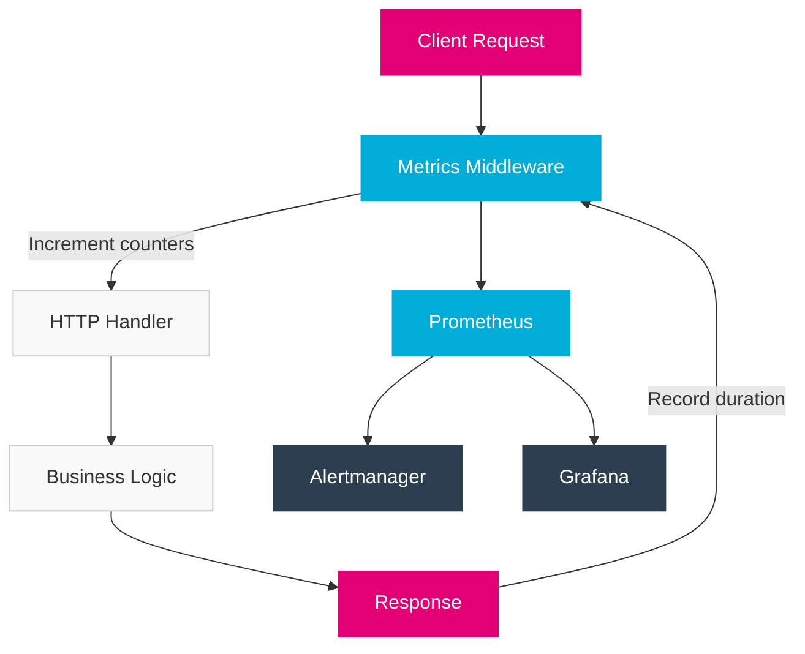

import PageHeader from '@site/src/components/PageHeader';
import FeatureCard from '@site/src/components/FeatureCard';
import CardGrid from '@site/src/components/CardGrid';
import InfoSection from '@site/src/components/InfoSection';
import FeatureGrid from '@site/src/components/FeatureGrid';

<PageHeader 
  title="Prometheus Metrics"
  description="Real-time monitoring and metrics collection for the Control Plane"
/>

The Control Plane uses Prometheus for monitoring and metrics collection.

<InfoSection type="info" title="Comprehensive observability">
  Prometheus enables real-time monitoring of Control Plane services, providing insights into performance, resource usage, and operational health through a robust metrics collection system.
</InfoSection>

## Overview

[Prometheus](https://prometheus.io/) is an open-source systems monitoring and alerting toolkit. The Control Plane integrates Prometheus for:

<FeatureGrid columns={2} features={[
  {
    title: "📊 Performance Monitoring",
    description: "Track response times, throughput, and error rates across all services."
  },
  {
    title: "💻 Resource Utilization",
    description: "Monitor CPU, memory, and network usage for capacity planning."
  },
  {
    title: "🎯 SLO/SLI Measurements",
    description: "Measure service level objectives and indicators for reliability."
  },
  {
    title: "🔍 Operational Insights",
    description: "Gain visibility into system behavior for troubleshooting."
  },
  {
    title: "⚠️ Alerting",
    description: "Trigger notifications when metrics exceed defined thresholds."
  },
  {
    title: "📈 Trend Analysis",
    description: "Track changes in system behavior over time for planning."
  }
]} />

<div align="center">
  
</div>

## Metric Types

<InfoSection type="tip" title="Choosing the right metric type">
  Select the appropriate metric type based on what you're measuring: counters for events that accumulate, gauges for values that rise and fall, histograms for distributions, and summaries for percentile calculations.
</InfoSection>

The Control Plane implements various Prometheus metric types:

### Counters

<InfoSection type="note" title="Cumulative metrics">
  Counters track values that only increase, such as request counts or error counts. They're ideal for measuring events or occurrences.
</InfoSection>

Counters track values that only increase (e.g., request counts, error counts):

```go
var (
    requestsTotal = prometheus.NewCounterVec(
        prometheus.CounterOpts{
            Name: "http_requests_total",
            Help: "Total number of HTTP requests",
        },
        []string{"method", "path", "status"},
    )
)

func init() {
    prometheus.MustRegister(requestsTotal)
}

// Usage
requestsTotal.WithLabelValues("GET", "/files", "200").Inc()
```

### Gauges

<InfoSection type="note" title="Point-in-time metrics">
  Gauges measure values that can increase or decrease, representing a "current state" such as memory usage or active connections.
</InfoSection>

Gauges track values that can go up and down (e.g., current active requests):

```go
var (
    activeRequests = prometheus.NewGauge(
        prometheus.GaugeOpts{
            Name: "http_active_requests",
            Help: "Number of active HTTP requests",
        },
    )
)

func init() {
    prometheus.MustRegister(activeRequests)
}

// Usage
activeRequests.Inc()
defer activeRequests.Dec()
```

### Histograms

<InfoSection type="note" title="Distribution metrics">
  Histograms track the distribution of values, such as request durations or response sizes, providing insights into performance patterns.
</InfoSection>

Histograms track distributions of values (e.g., request durations):

```go
var (
    requestDuration = prometheus.NewHistogramVec(
        prometheus.HistogramOpts{
            Name:    "http_request_duration_seconds",
            Help:    "HTTP request duration in seconds",
            Buckets: prometheus.DefBuckets,
        },
        []string{"method", "path"},
    )
)

func init() {
    prometheus.MustRegister(requestDuration)
}

// Usage
timer := prometheus.NewTimer(requestDuration.WithLabelValues("GET", "/files"))
defer timer.ObserveDuration()
```

### Metric Naming Convention

<CardGrid columns={1}>
  <FeatureCard
    title="Control Plane Metric Naming"
    description={<>
      <p>The Control Plane follows these naming conventions for metrics:</p>
      <ul>
        <li><strong>Component</strong>: Component name (e.g., <code>file_manager</code>, <code>api_operator</code>)</li>
        <li><strong>Area</strong>: Functional area (e.g., <code>http</code>, <code>database</code>)</li>
        <li><strong>Measurement</strong>: Specific measurement (e.g., <code>requests_total</code>, <code>latency_seconds</code>)</li>
      </ul>
      <p>Full format: <code>component_area_measurement</code></p>
      <p>Examples:</p>
      <ul>
        <li><code>file_manager_http_requests_total</code></li>
        <li><code>api_operator_reconcile_duration_seconds</code></li>
        <li><code>gateway_router_cache_hits_total</code></li>
      </ul>
    </>}
  />
</CardGrid>

## Middleware Integration

<InfoSection type="tip" title="Automated instrumentation">
  Middleware integration automatically collects metrics for all HTTP requests without modifying business logic code.
</InfoSection>

The Control Plane integrates Prometheus metrics with Gofiber middleware:

```go
func metricsMiddleware() fiber.Handler {
    return func(c *fiber.Ctx) error {
        startTime := time.Now()
        method := c.Method()
        path := c.Route().Path
        
        // Track active requests
        activeRequests.Inc()
        defer activeRequests.Dec()
        
        // Process request
        err := c.Next()
        
        // Record metrics
        status := strconv.Itoa(c.Response().StatusCode())
        duration := time.Since(startTime).Seconds()
        
        requestsTotal.WithLabelValues(method, path, status).Inc()
        requestDuration.WithLabelValues(method, path).Observe(duration)
        
        return err
    }
}
```

### How Metrics Flow



## Service Monitors

<InfoSection type="note" title="Prometheus Operator">
  The Control Plane uses the Prometheus Operator pattern with ServiceMonitor resources to declaratively define monitoring targets.
</InfoSection>

The Control Plane uses Prometheus Operator's ServiceMonitor resources to configure scraping:

```yaml
apiVersion: monitoring.coreos.com/v1
kind: ServiceMonitor
metadata:
  name: file-manager
  namespace: controlplane-system
spec:
  selector:
    matchLabels:
      app: file-manager
  endpoints:
  - port: metrics
    path: /metrics
    interval: 15s
    scheme: http
  namespaceSelector:
    matchNames:
    - controlplane-system
```

### ServiceMonitor Configuration

<CardGrid columns={2}>
  <FeatureCard
    title="Endpoint Configuration"
    description={<>
      <p>Key settings for ServiceMonitor endpoints:</p>
      <ul>
        <li><strong>port</strong>: Named port to scrape (usually "metrics")</li>
        <li><strong>path</strong>: HTTP path for metrics (default "/metrics")</li>
        <li><strong>interval</strong>: Scrape frequency (e.g., "15s")</li>
        <li><strong>scheme</strong>: HTTP or HTTPS for scraping</li>
        <li><strong>tlsConfig</strong>: Optional TLS settings for secure endpoints</li>
        <li><strong>bearerTokenSecret</strong>: For authenticated endpoints</li>
      </ul>
    </>}
  />
  
  <FeatureCard
    title="Target Selection"
    description={<>
      <p>How ServiceMonitors select targets:</p>
      <ul>
        <li><strong>selector</strong>: Label selector to find Services</li>
        <li><strong>namespaceSelector</strong>: Controls which namespaces to search</li>
        <li><strong>matchNames</strong>: Explicit namespace list</li>
        <li><strong>any</strong>: Search all namespaces when true</li>
        <li><strong>sampleLimit</strong>: Maximum samples per scrape</li>
      </ul>
    </>}
  />
</CardGrid>

## Metrics Endpoint

<InfoSection type="tip" title="Standard exposure">
  Each Control Plane service exposes a standard /metrics endpoint that follows Prometheus exposition format for consistent scraping.
</InfoSection>

Each Control Plane service exposes a `/metrics` endpoint:

```go
func setupMetricsEndpoint(app *fiber.App) {
    // Create metrics handler
    promHandler := promhttp.Handler()
    
    // Register metrics endpoint
    app.Get("/metrics", func(c *fiber.Ctx) error {
        handler := adaptor.HTTPHandler(promHandler)
        return handler(c)
    })
}
```

### Sample Metrics Output

<CardGrid columns={1}>
  <FeatureCard
    title="Example /metrics Endpoint Output"
    description={<>
        <pre>
{`# HELP http_requests_total Total number of HTTP requests
# TYPE http_requests_total counter
http_requests_total{method="GET",path="/files",status="200"} 1352
http_requests_total{method="PUT",path="/files",status="201"} 423
http_requests_total{method="GET",path="/files",status="404"} 15
http_requests_total{method="GET",path="/health",status="200"} 8721

# HELP http_request_duration_seconds HTTP request duration in seconds
# TYPE http_request_duration_seconds histogram
http_request_duration_seconds_bucket{method="GET",path="/files",le="0.005"} 742
http_request_duration_seconds_bucket{method="GET",path="/files",le="0.01"} 983
http_request_duration_seconds_bucket{method="GET",path="/files",le="0.025"} 1204
http_request_duration_seconds_bucket{method="GET",path="/files",le="0.05"} 1329
http_request_duration_seconds_bucket{method="GET",path="/files",le="0.1"} 1344
http_request_duration_seconds_bucket{method="GET",path="/files",le="0.25"} 1352
http_request_duration_seconds_bucket{method="GET",path="/files",le="+Inf"} 1352
http_request_duration_seconds_sum{method="GET",path="/files"} 10.23
http_request_duration_seconds_count{method="GET",path="/files"} 1352

# HELP process_cpu_seconds_total Total user and system CPU time spent in seconds
# TYPE process_cpu_seconds_total counter
process_cpu_seconds_total 65.89`}
        </pre>
    </>}
  />
</CardGrid>

## Default Metrics

<InfoSection type="note" title="Standard metrics">
  The Control Plane includes a standard set of metrics for consistent monitoring across all services.
</InfoSection>

The Control Plane includes the following standard metrics:

### HTTP Metrics

<FeatureGrid columns={2} features={[
  {
    title: "http_requests_total",
    description: "Total request count with labels for method, path, and status code."
  },
  {
    title: "http_request_duration_seconds",
    description: "Request duration histogram for performance analysis."
  },
  {
    title: "http_active_requests",
    description: "Current active requests gauge for load monitoring."
  },
  {
    title: "http_response_size_bytes",
    description: "Response size histogram for bandwidth analysis."
  },
  {
    title: "http_request_size_bytes",
    description: "Request size histogram for client usage patterns."
  },
  {
    title: "http_errors_total",
    description: "Total error count by error type and status code."
  }
]} />

### System Metrics

<FeatureGrid columns={2} features={[
  {
    title: "process_cpu_seconds_total",
    description: "CPU time spent by the process for resource tracking."
  },
  {
    title: "process_resident_memory_bytes",
    description: "Memory usage for capacity planning and leak detection."
  },
  {
    title: "process_open_fds",
    description: "Open file descriptors for resource limit monitoring."
  },
  {
    title: "go_goroutines",
    description: "Number of goroutines for concurrency analysis."
  },
  {
    title: "go_gc_duration_seconds",
    description: "Garbage collection duration for performance tuning."
  },
  {
    title: "go_memstats_alloc_bytes",
    description: "Memory allocation metrics for memory management analysis."
  }
]} />

### Custom Metrics

<InfoSection type="tip" title="Service-specific metrics">
  Beyond standard metrics, each Control Plane service implements custom metrics relevant to its specific domain and functionality.
</InfoSection>

The File Manager service includes these custom metrics:

<CardGrid columns={2}>
  <FeatureCard
    title="Operation Metrics"
    description={<>
      <ul>
        <li><strong>file_manager_uploads_total</strong>: Total file uploads with labels for file type and size category</li>
        <li><strong>file_manager_downloads_total</strong>: Total file downloads with labels for file type and source</li>
        <li><strong>file_manager_upload_errors_total</strong>: Upload error count by error type</li>
        <li><strong>file_manager_download_errors_total</strong>: Download error count by error type</li>
      </ul>
    </>}
  />
  
  <FeatureCard
    title="Performance Metrics"
    description={<>
      <ul>
        <li><strong>file_manager_file_size_bytes</strong>: File size histogram to analyze upload patterns</li>
        <li><strong>file_manager_upload_duration_seconds</strong>: Time taken to complete uploads</li>
        <li><strong>file_manager_download_duration_seconds</strong>: Time taken to serve downloads</li>
        <li><strong>file_manager_backend_latency_seconds</strong>: S3 backend operation latency</li>
      </ul>
    </>}
  />
  
  <FeatureCard
    title="Resource Metrics"
    description={<>
      <ul>
        <li><strong>file_manager_storage_bytes_total</strong>: Total storage used by files</li>
        <li><strong>file_manager_files_count</strong>: Total number of files being managed</li>
        <li><strong>file_manager_cache_size_bytes</strong>: Memory used by the file cache</li>
        <li><strong>file_manager_cache_hit_ratio</strong>: Cache effectiveness measurement</li>
      </ul>
    </>}
  />
  
  <FeatureCard
    title="Business Metrics"
    description={<>
      <ul>
        <li><strong>file_manager_files_by_team</strong>: File count breakdown by team</li>
        <li><strong>file_manager_storage_by_team_bytes</strong>: Storage usage by team</li>
        <li><strong>file_manager_bandwidth_bytes_total</strong>: Total bandwidth consumed</li>
        <li><strong>file_manager_quota_usage_ratio</strong>: Storage quota utilization</li>
      </ul>
    </>}
  />
</CardGrid>

## Grafana Dashboards

<InfoSection type="note" title="Visualization">
  The Control Plane includes pre-built Grafana dashboards that visualize key metrics for operational monitoring and troubleshooting.
</InfoSection>

The Control Plane provides pre-built Grafana dashboards for monitoring:

<FeatureGrid columns={2} features={[
  {
    title: "🔍 Controller Overview",
    description: "High-level metrics showing the health and performance of Control Plane controllers."
  },
  {
    title: "💻 Resource Utilization",
    description: "CPU, memory, and network usage patterns across Control Plane components."
  },
  {
    title: "⚙️ Controller Runtime",
    description: "Detailed metrics about reconciliation loops, queue depth, and processing times."
  },
  {
    title: "🌐 HTTP Requests",
    description: "API usage patterns, latency distributions, and error rates for HTTP endpoints."
  },
  {
    title: "📊 SLO Dashboard",
    description: "Service Level Objective tracking against defined targets."
  },
  {
    title: "❗ Alert Overview",
    description: "Current and recent alerts with status and resolution information."
  }
]} />

The dashboards are stored in the repository under `grafana/` directories.

### Sample Dashboard

<div align="center">
  
</div>

## PromQL Examples

<InfoSection type="tip" title="Query language">
  PromQL (Prometheus Query Language) is used to query metrics data for dashboards and alerts. These examples show common queries used in the Control Plane.
</InfoSection>

<CardGrid columns={2}>
  <FeatureCard
    title="Request Rate"
    description={<>
      <p>Calculate requests per second over 5 minutes:</p>
      <p><code>rate(http_requests_total[5m])</code></p>
      <p>With status code filter:</p>
      <p><code>rate(http_requests_total{status=~"5.."}[5m])</code></p>
    </>}
  />
  
  <FeatureCard
    title="Error Rate"
    description={<>
      <p>Calculate error percentage:</p>
      <p><code>sum(rate(http_requests_total{status=~"5.."}[5m])) / sum(rate(http_requests_total[5m])) * 100</code></p>
    </>}
  />
  
  <FeatureCard
    title="Latency"
    description={<>
      <p>95th percentile response time:</p>
      <p><code>histogram_quantile(0.95, sum(rate(http_request_duration_seconds_bucket[5m])) by (le, method, path))</code></p>
    </>}
  />
  
  <FeatureCard
    title="Resource Usage"
    description={<>
      <p>Memory usage per service:</p>
      <p><code>sum by(service) (process_resident_memory_bytes)</code></p>
      <p>CPU usage per service:</p>
      <p><code>rate(process_cpu_seconds_total[5m]) * 100</code></p>
    </>}
  />
</CardGrid>

## Related Resources

<CardGrid columns={2}>
  <FeatureCard
    title="Zap Logging"
    description="Learn about the structured logging used alongside Prometheus metrics."
    linkText="View Zap Logging"
    linkUrl="zap"
  />
  
  <FeatureCard
    title="Architecture"
    description="Understand how monitoring fits into the overall Control Plane architecture."
    linkText="View Architecture"
    linkUrl="../../0-Overview/architecture"
  />
</CardGrid>