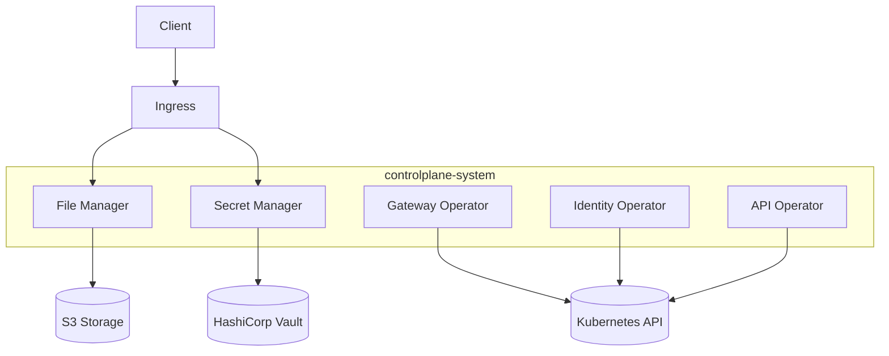

# Kubernetes Deployment

The Control Plane components are deployed as Kubernetes resources, following cloud-native best practices.

## Deployment Architecture

Each component in the Control Plane is deployed as a separate Kubernetes deployment:



## Kubernetes Resources

The Control Plane uses the following Kubernetes resource types:

### Deployments

```yaml
apiVersion: apps/v1
kind: Deployment
metadata:
  name: file-manager
  namespace: controlplane-system
spec:
  replicas: 2
  selector:
    matchLabels:
      app: file-manager
  template:
    metadata:
      labels:
        app: file-manager
    spec:
      containers:
      - name: file-manager
        image: controlplane/file-manager:v1.0.0
        ports:
        - containerPort: 8080
        env:
        - name: S3_ENDPOINT
          valueFrom:
            configMapKeyRef:
              name: file-manager-config
              key: s3.endpoint
        resources:
          limits:
            cpu: 500m
            memory: 512Mi
          requests:
            cpu: 100m
            memory: 128Mi
```

### Services

```yaml
apiVersion: v1
kind: Service
metadata:
  name: file-manager
  namespace: controlplane-system
spec:
  selector:
    app: file-manager
  ports:
  - port: 80
    targetPort: 8080
  type: ClusterIP
```

### ConfigMaps

```yaml
apiVersion: v1
kind: ConfigMap
metadata:
  name: file-manager-config
  namespace: controlplane-system
data:
  s3.endpoint: "minio.storage.svc.cluster.local"
  s3.bucket: "file-manager"
  s3.useSSL: "true"
```

### Network Policies

```yaml
apiVersion: networking.k8s.io/v1
kind: NetworkPolicy
metadata:
  name: allow-api-traffic
  namespace: controlplane-system
spec:
  podSelector:
    matchLabels:
      app: file-manager
  ingress:
  - from:
    - podSelector:
        matchLabels:
          app: api-gateway
    ports:
    - protocol: TCP
      port: 8080
```

## Custom Resources

The Control Plane defines and uses several Custom Resource Definitions (CRDs):

```yaml
apiVersion: apiextensions.k8s.io/v1
kind: CustomResourceDefinition
metadata:
  name: apis.api.cp.ei.telekom.de
spec:
  group: api.cp.ei.telekom.de
  names:
    kind: API
    plural: apis
    singular: api
  scope: Namespaced
  versions:
    - name: v1
      served: true
      storage: true
      schema:
        openAPIV3Schema:
          type: object
          properties:
            spec:
              type: object
              # Schema details...
```

## RBAC Configuration

The Control Plane uses Role-Based Access Control (RBAC) for secure access to the Kubernetes API:

```yaml
apiVersion: rbac.authorization.k8s.io/v1
kind: Role
metadata:
  name: file-manager-role
  namespace: controlplane-system
rules:
- apiGroups: [""]
  resources: ["secrets", "configmaps"]
  verbs: ["get", "list"]
---
apiVersion: rbac.authorization.k8s.io/v1
kind: RoleBinding
metadata:
  name: file-manager-rolebinding
  namespace: controlplane-system
subjects:
- kind: ServiceAccount
  name: file-manager
  namespace: controlplane-system
roleRef:
  kind: Role
  name: file-manager-role
  apiGroup: rbac.authorization.k8s.io
```

## Resource Management

The Control Plane components use resource requests and limits to ensure efficient utilization of cluster resources:

- **Memory requests/limits**: Prevent Out-of-Memory (OOM) issues
- **CPU requests/limits**: Ensure fair scheduling
- **HorizontalPodAutoscaler**: Dynamic scaling based on resource utilization