<!--
SPDX-FileCopyrightText: 2025 Deutsche Telekom AG

SPDX-License-Identifier: CC0-1.0
-->

# Event Domain -- Architecture Overview

This document describes how the **Event domain** (`event.cp.ei.telekom.de/v1`) interacts with its surrounding domains in the Control Plane.

## Domain Interaction Diagram

```mermaid
flowchart TB
    %% ── Styling ──────────────────────────────────────────────
    classDef eventCls fill:#4a90d9,color:#fff,stroke:#2c5f8a,stroke-width:2px
    classDef adminCls fill:#e8a838,color:#fff,stroke:#b07d1e,stroke-width:2px
    classDef gatewayCls fill:#50b86c,color:#fff,stroke:#2e7d42,stroke-width:2px
    classDef identityCls fill:#ab47bc,color:#fff,stroke:#7b1fa2,stroke-width:2px
    classDef pubsubCls fill:#ef5350,color:#fff,stroke:#c62828,stroke-width:2px
    classDef approvalCls fill:#ff7043,color:#fff,stroke:#bf360c,stroke-width:2px
    classDef appCls fill:#26a69a,color:#fff,stroke:#00796b,stroke-width:2px

    %% ── Admin Domain ────────────────────────────────────────
    subgraph admin["Admin Domain"]
        direction TB
        AdminZone["Zone"]:::adminCls
    end

    %% ── Application Domain ──────────────────────────────────
    subgraph application["Application Domain"]
        direction TB
        App["Application"]:::appCls
    end

    %% ── Identity Domain ─────────────────────────────────────
    subgraph identity["Identity Domain"]
        direction TB
        IdRealm["Realm"]:::identityCls
        IdClient["Client"]:::identityCls
    end

    %% ── Gateway Domain ──────────────────────────────────────
    subgraph gateway["Gateway Domain"]
        direction TB
        GwRealm["Realm"]:::gatewayCls
        GwRoute["Route"]:::gatewayCls
    end

    %% ── PubSub Domain ───────────────────────────────────────
    subgraph pubsub["PubSub Domain"]
        direction TB
        EventStore["EventStore"]:::pubsubCls
        Publisher["Publisher"]:::pubsubCls
        Subscriber["Subscriber"]:::pubsubCls
    end

    %% ── Approval Domain ─────────────────────────────────────
    subgraph approval["Approval Domain"]
        direction TB
        ApprovalReq["ApprovalRequest"]:::approvalCls
        ApprovalRes["Approval"]:::approvalCls
    end

    %% ── Event Domain (center) ───────────────────────────────
    subgraph event["Event Domain"]
        direction TB
        EventConfig["EventConfig"]:::eventCls
        EventType["EventType"]:::eventCls
        EventExposure["EventExposure"]:::eventCls
        EventSubscription["EventSubscription"]:::eventCls

        EventType -. "referenced by" .-> EventExposure
        EventType -. "referenced by" .-> EventSubscription
        EventConfig -. "configures zone for" .-> EventExposure
        EventConfig -. "configures zone for" .-> EventSubscription
        EventExposure -. "triggers reconcile" .-> EventSubscription
    end

    %% ── EventConfig interactions ────────────────────────────
    EventConfig -- "creates" --> IdClient
    EventConfig -- "creates" --> EventStore
    EventConfig -- "creates" --> GwRoute
    EventConfig -. "reads" .-> IdRealm
    EventConfig -. "watches" .-> AdminZone

    %% ── EventExposure interactions ──────────────────────────
    EventExposure -- "creates" --> Publisher
    EventExposure -- "creates" --> GwRoute
    EventExposure -. "reads" .-> App
    EventExposure -. "reads" .-> EventStore
    EventExposure -. "reads" .-> GwRealm
    EventExposure -. "watches" .-> AdminZone

    %% ── EventSubscription interactions ──────────────────────
    EventSubscription -- "creates" --> Subscriber
    EventSubscription -- "creates" --> ApprovalReq
    EventSubscription -- "creates" --> ApprovalRes
    EventSubscription -. "reads" .-> App
    EventSubscription -. "watches" .-> App
```

### Legend

| Arrow style | Meaning |
|---|---|
| **Solid line** (`--creates-->`) | The event controller **creates and owns** this resource (full CRUD lifecycle) |
| **Dashed line** (`-.watches.->`) | The event controller **watches** this resource for changes that trigger reconciliation |
| **Dashed line** (`-.reads.->`) | The event controller **reads** this resource during reconciliation (GET/LIST) |

## Interaction Details

### EventConfig Controller

The zone-level configuration controller. One `EventConfig` exists per zone and bootstraps the infrastructure resources needed by the event system in that zone.

| Target Domain | Resource | Relationship | Purpose |
|---|---|---|---|
| **Identity** | `Client` | creates/owns (x2) | Creates a **mesh client** for cross-zone OAuth2 communication and an **admin client** for the configuration backend |
| **Identity** | `Realm` | reads | Resolves token URL for OAuth2 authentication |
| **PubSub** | `EventStore` | creates/owns | Provisions the event store (connection to the pubsub backend) |
| **Gateway** | `Route` | creates/owns | Creates **publish**, **callback**, and **proxy callback** routes for event ingestion and delivery |
| **Admin** | `Zone` | watches | Reacts to zone changes; reads zone details and namespace references |

Internal: watches other `EventConfig` resources in the same environment (for mesh topology updates).

### EventType Controller

Self-contained. Manages singleton semantics (oldest non-deleted `EventType` for a given type string becomes "active"). No cross-domain interactions.

### EventExposure Controller

The publisher-side controller. Declares that an application exposes events of a specific type.

| Target Domain | Resource | Relationship | Purpose |
|---|---|---|---|
| **PubSub** | `Publisher` | creates/owns | Registers the application as a publisher on the event store |
| **PubSub** | `EventStore` | reads | Retrieves the event store reference for the zone |
| **Gateway** | `Route` | creates/owns | Creates **SSE routes** and **cross-zone SSE proxy routes** for event streaming |
| **Gateway** | `Realm` | reads | Resolves gateway realm for route upstream/downstream configuration |
| **Application** | `Application` | reads | Resolves provider application info (client ID for publisher registration) |
| **Admin** | `Zone` | watches/reads | Reacts to zone changes; resolves namespace and realm references |

Internal: watches `EventType`, `EventConfig`, `EventSubscription` (for SSE proxy routes), and other `EventExposure` resources (active/standby failover).

### EventSubscription Controller

The consumer-side controller. Declares that an application subscribes to events of a specific type.

| Target Domain | Resource | Relationship | Purpose |
|---|---|---|---|
| **PubSub** | `Subscriber` | creates/owns | Registers the application as a subscriber with delivery and trigger configuration |
| **Approval** | `ApprovalRequest` | creates/owns | Initiates the approval workflow for the subscription |
| **Approval** | `Approval` | creates/owns | Manages the approval decision (auto/simple/four-eyes strategy) |
| **Application** | `Application` | watches/reads | Watches for application changes; reads requestor and provider application info |

Internal: watches `EventExposure` (to react when the provider appears/disappears), `EventConfig` (for zone configuration), reads `EventType` (for type validation).

## Registered Schemes

The event operator registers API types from **7 domains** (including itself):

| Domain | API Group | Resources Used |
|---|---|---|
| **Event** | `event.cp.ei.telekom.de` | EventConfig, EventType, EventExposure, EventSubscription |
| **Admin** | `admin.cp.ei.telekom.de` | Zone |
| **Application** | `application.cp.ei.telekom.de` | Application |
| **Approval** | `approval.cp.ei.telekom.de` | ApprovalRequest, Approval |
| **Gateway** | `gateway.cp.ei.telekom.de` | Route, Realm |
| **Identity** | `identity.cp.ei.telekom.de` | Client, Realm |
| **PubSub** | `pubsub.cp.ei.telekom.de` | EventStore, Publisher, Subscriber |
