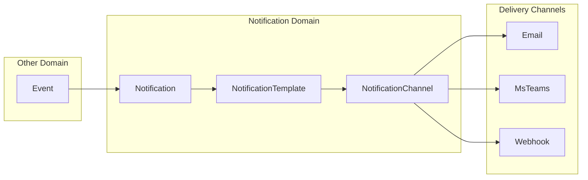
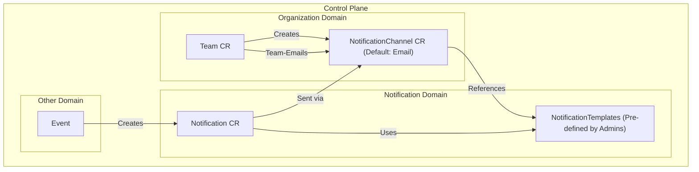

<!--
SPDX-FileCopyrightText: 2025 Deutsche Telekom AG

SPDX-License-Identifier: CC0-1.0
-->

<p align="center">
  <h1 align="center">Notification</h1>
</p>

<p align="center">
  The Notification domain is responsible for managing notifications within the system, including their creation, delivery, and tracking.
</p>


<p align="center">
  <a href="#about">About</a> •
  <a href="#features">Features</a> •
  <a href="#architecture">Architecture</a> •
  <a href="#notification-builder">Notification Builder</a>
</p>


## About

The Notification domain manages the creation, delivery, and tracking of notifications within the Control Plane system. It is built on three core Kubernetes Custom Resource Definitions (CRDs):

1. **NotificationChannel**: Defines communication channels through which notifications are delivered (Email, MsTeams, Webhook)
2. **NotificationTemplate**: Contains purpose-specific templates (e.g., "ApprovalGranted") for different channel types
3. **Notification**: Created by other domains to trigger notifications to users/teams when specific events occur

The domain handles the lifecycle of these resources, from creation to delivery, ensuring proper formatting and routing of messages to the appropriate channels.

## Features

- **Multiple Notification Channels**: Support for Email, MsTeams, and Webhook delivery mechanisms
- **Purpose-Specific Templates**: Pre-defined templates for different notification purposes
- **Channel-Specific Formatting**: Templates adapted for optimal display on each channel type
- **Cross-Domain Integration**: Allows other domains to trigger notifications through a standard interface
- **Event-Driven Design**: Notifications triggered by specific system events
- **Kubernetes-Native**: Implemented as CRDs for seamless integration with the Control Plane

## Architecture

### Component Overview



### Flow Description

1. **Event Trigger**: An event occurs in another domain requiring notification (e.g., approval granted)
2. **Notification Creation**: The external domain creates a Notification CR with a specific purpose
3. **Template Selection**: The system selects the appropriate NotificationTemplate based on the purpose
4. **Channel Selection**: The system determines the delivery channel(s) from the NotificationChannel resources
5. **Message Formatting**: Content is formatted according to the template for the specific channel
6. **Delivery**: The notification is sent through the selected channel(s) to the intended recipients

### Team-NotificationChannel Relationship

<div align="center">



</div>

### NotificationChannel Management

1. **Automatic Creation**: When a Team CR is created in the Organization domain, a corresponding NotificationChannel CR is automatically created
2. **Default Configuration**: If not customized, the default channel type is Email, using the Team's email address
3. **1:1 Relationship**: Each Team has exactly one NotificationChannel, ensuring consistent notification delivery
4. **Customization Options**: Teams can customize their NotificationChannel to use MsTeams or Webhook instead of the default Email

### NotificationTemplate Management

1. **Admin-Defined Templates**: All NotificationTemplates are pre-defined by Control Plane administrators
2. **Purpose-Specific**: Each template is created for a specific purpose (e.g., "ApprovalGranted", "RequestRejected")
3. **Channel-Specific Formatting**: Templates are tailored for optimal display on each channel type (Email, MsTeams, Webhook)
4. **Consistent Messaging**: Using predefined templates ensures consistent communication across the platform

## Notification Builder

The Notification domain provides a `NotificationBuilder` interface to simplify the creation and sending of notifications from other domains. This builder pattern abstracts away the complexity of creating notifications, allowing external domains to easily trigger notifications without understanding the internal details of the notification system.

### Usage

```go
// Create and send a notification
notification, err := builder.NewNotificationBuilder().
    WithOwner(eventSourceResource).
    WithPurpose("ApprovalGranted").
    WithSender(notificationv1.SenderTypeSystem, "ApprovalService").
    WithChannels(types.ObjectRef{Name: "email", Namespace: "env--group--team"}).
    WithProperties(map[string]any{
        "resourceName": "example-resource",
        "approvedBy": "admin",
    }).
    Send(ctx)
```

### Key Features

- **Fluent API**: Chain-style method calls for readable code
- **Required Fields**: Ensures all required fields are set before sending
- **Property Management**: Simple way to add template properties
- **Delivery Options**: Support for asynchronous sending
- **Self-Contained**: No dependencies on external domains