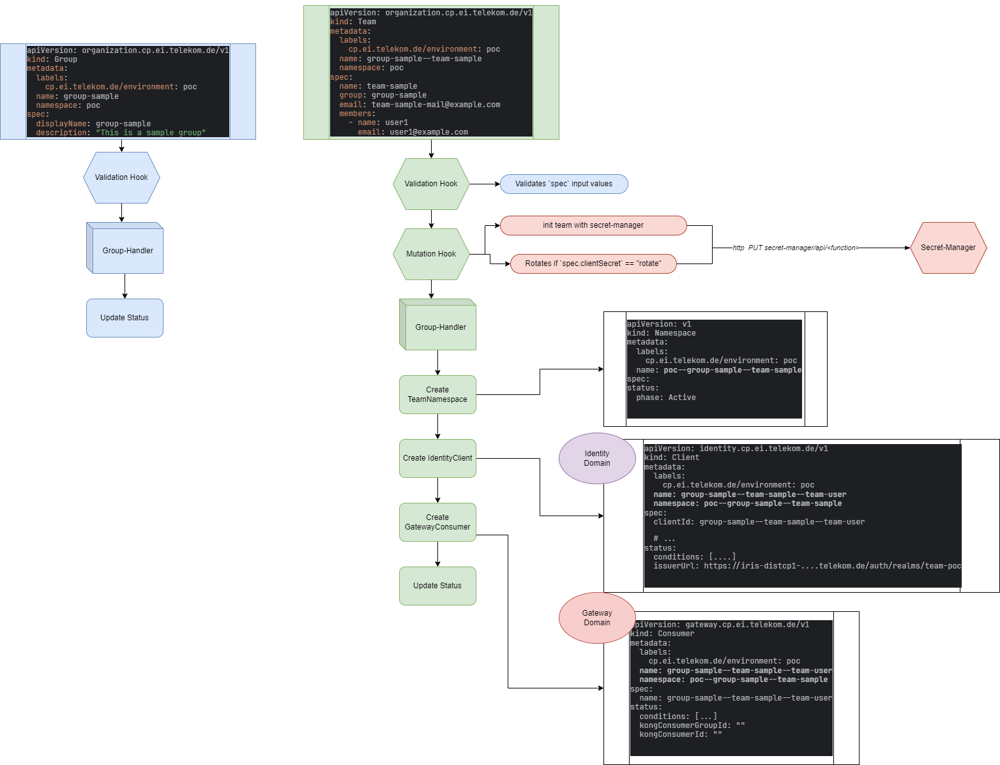

<!--
Copyright 2025 Deutsche Telekom IT GmbH

SPDX-License-Identifier: Apache-2.0
-->

[](https://github.com/telekom/controlplane/actions/workflows/ci.yaml)
[](https://github.com/telekom/controlplane/actions/workflows/reuse-compliance.yml)
[](https://github.com/telekom/controlplane/actions/workflows/ort.yaml)

[](https://golang.org/dl/)
[](./LICENSES)

<p align="center">
  <h1 align="center">Organization</h1>

<p align="center">
  The Organization domain is responsible for managing the lifecycle of Organization-domain resources such as 
  Groups and Teams.
</p>

<p align="center">
  <a href="#about">📖 About</a> •
  <a href="#features">✨ Features</a> •
  <a href="#crds">📄 CRDs</a> •
  <a href="#getting-started">🚀 Getting Started</a> •
  <a href="#contributing">🤝 Contributing</a> •
  <a href="#code-of-conduct">📜 Code of Conduct</a> •
  <a href="#licensing">📝 Licensing</a>
</p>

## About

This repository contains the implementation of the Organization domain, which is responsible for managing the lifecycle 
of Organization-domain resources such as Groups and Teams.

The following diagram illustrates the reconciler process of the Organization domain:

<div align="center">
    
</div>

## Features

- **Group Management**: Provides Administrative tools for efficient organization management.
- **Team Management**: Provides team management capabilities within the control plane.

## CRDs

The Organization domain defines the following Custom Resource Definitions (CRDs) as an API:

<details>
<summary>
<strong>Group</strong>
This CRD represents an organizational group, which is a logical unit that contains multiple Teams. 
You can think of a Group as a higher-level organizational structure that can contain multiple Teams, allowing for better 
organization and management of resources within the Control Plane. The group has a display name and a description.

</summary>  

```yaml
apiVersion: organization.cp.ei.telekom.de/v1
kind: Group
metadata:
  labels:
    app.kubernetes.io/name: organization-operator
    app.kubernetes.io/managed-by: kustomize
  name: group-sample
spec:
  displayName: group-sample
  description: "This is a sample group"
```

</details>
<br />

<details>
<summary>
<strong>Team</strong>
This CRD represents an organizational team, which is a logical unit that contains multiple users.
You can think of a Team as a structure that can contain multiple users that all work on a project. They can be part of 
one (or more) groups. The Team has a name, a description and an email. It is associated with a Group and can have 
multiple members, who are represented by their names and emails. 

</summary>  

```yaml
apiVersion: organization.cp.ei.telekom.de/v1
kind: Team
metadata:
  labels:
    cp.ei.telekom.de/environment: default
  name: team-sample
  namespace: default
spec:
  name: team-sample
  description: "This is a sample team."
  group: group-sample
  email: team-sample-mail@example.com
  members:
    - name: user1
      email: user1@example.com
```

</details>
<br />

## Getting Started
If you want to learn more about how to install and run the Control Plane in a Kubernetes environment in general, 
visit: [Installing Control Plane](../docs/files/installation.md)  
But if you want to get started right away with a non-productive local environment and try out the Control Plane, we 
recommend visting: [Local installation (Quickstart)](../docs/files/quickstart.md).

### Prerequisites
- go version v1.24.0+
- docker version 17.03+.
- kubectl version v1.11.3+.
- Access to a Kubernetes v1.11.3+ cluster.

### To Deploy on the cluster
**Build and push your image to the location specified by `IMG`:**

```sh
make docker-build docker-push IMG=<some-registry>/organization-operator:tag
```

**NOTE:** This image ought to be published in the personal registry you specified.
And it is required to have access to pull the image from the working environment.
Make sure you have the proper permission to the registry if the above commands don’t work.

**Install the CRDs into the cluster:**

```sh
make install
```

**Deploy the Manager to the cluster with the image specified by `IMG`:**

```sh
make deploy IMG=<some-registry>/organization-operator:tag
```

> **NOTE**: If you encounter RBAC errors, you may need to grant yourself cluster-admin
privileges or be logged in as admin.

**Create instances of your solution**
You can apply the samples (examples) from the config/sample:

```sh
kubectl apply -k config/samples/
```

>**NOTE**: Ensure that the samples has default values to test it out.

### To Uninstall
**Delete the instances (CRs) from the cluster:**

```sh
kubectl delete -k config/samples/
```

**Delete the APIs(CRDs) from the cluster:**

```sh
make uninstall
```

**UnDeploy the controller from the cluster:**

```sh
make undeploy
```

## Project Distribution

Following the options to release and provide this solution to the users.

### By providing a bundle with all YAML files

1. Build the installer for the image built and published in the registry:

```sh
make build-installer IMG=<some-registry>/organization-operator:tag
```

**NOTE:** The makefile target mentioned above generates an 'install.yaml'
file in the dist directory. This file contains all the resources built
with Kustomize, which are necessary to install this project without its
dependencies.

2. Using the installer

Users can just run 'kubectl apply -f <URL for YAML BUNDLE>' to install
the project, i.e.:

```sh
kubectl apply -f https://raw.githubusercontent.com/<org>/organization-operator/<tag or branch>/dist/install.yaml
```

### By providing a Helm Chart

1. Build the chart using the optional helm plugin

```sh
kubebuilder edit --plugins=helm/v1-alpha
```

2. See that a chart was generated under 'dist/chart', and users
can obtain this solution from there.

**NOTE:** If you change the project, you need to update the Helm Chart
using the same command above to sync the latest changes. Furthermore,
if you create webhooks, you need to use the above command with
the '--force' flag and manually ensure that any custom configuration
previously added to 'dist/chart/values.yaml' or 'dist/chart/manager/manager.yaml'
is manually re-applied afterwards.

More information can be found via the [Kubebuilder Documentation](https://book.kubebuilder.io/introduction.html)
**NOTE:** Run `make help` for more information on all potential `make` targets


## Contributing
We welcome contributions to this project! If you would like to contribute, please see the details in our 
[CONTRIBUTING.md](../CONTRIBUTING.md).

## Code of Conduct

This project has adopted the [Contributor Covenant](https://www.contributor-covenant.org/) in version 2.1 as our code of conduct. Please see the details 
in our [CODE_OF_CONDUCT.md](../CODE_OF_CONDUCT.md). All contributors must abide by the code of conduct.

By participating in this project, you agree to abide by its [Code of Conduct](../CODE_OF_CONDUCT.md) at all times.

## Licensing

This project follows the [REUSE standard for software licensing](https://reuse.software/).    
Each file contains copyright and license information, and license texts can be found in the [./LICENSES](../LICENSES) 
folder. For more information visit https://reuse.software/.    
You can find a guide for developers at https://telekom.github.io/reuse-template/.
