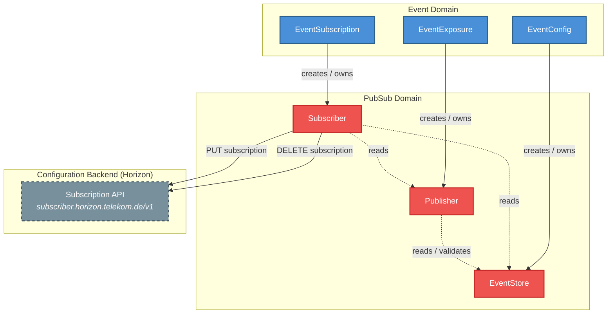

<!--
SPDX-FileCopyrightText: 2025 Deutsche Telekom AG

SPDX-License-Identifier: CC0-1.0
-->

# PubSub Domain -- Architecture Overview

This document describes how the **PubSub domain** (`pubsub.cp.ei.telekom.de/v1`) interacts with its surrounding domains in the Control Plane.

## Domain Interaction Diagram



### Legend

| Arrow style | Meaning |
|---|---|
| **Solid line** (`--creates/owns-->`) | The source controller **creates and owns** this resource (full CRUD lifecycle) |
| **Dashed line** (`-.reads.->`) | The controller **reads** this resource during reconciliation (GET) |
| **Solid line to backend** (`--PUT/DELETE-->`) | The controller makes **HTTP REST calls** to an external service |
| **Dashed border** | External system (not a Kubernetes CRD) |

## PubSub Domain Resources

The PubSub domain manages **3 CRDs** under the API group `pubsub.cp.ei.telekom.de/v1`:

| CRD | Purpose | Creates external resources? |
|---|---|---|
| **EventStore** | Stores connection details (URL, OAuth2 credentials) for the configuration backend | No -- pure configuration, sets Ready condition |
| **Publisher** | Registers an event publisher; validates its EventStore is ready | No (TODO: future REST API registration) |
| **Subscriber** | Registers an event subscription in the configuration backend via REST API | Yes -- calls Horizon Configuration Backend |

### Internal Dependency Chain

```
Subscriber ──reads──▶ Publisher ──reads──▶ EventStore
```

The `Subscriber` controller resolves the full chain at reconciliation time:
1. Reads the referenced `Publisher` to obtain event type and publisher ID
2. Reads the `Publisher`'s referenced `EventStore` to obtain backend connection details
3. Uses the EventStore credentials to call the configuration backend REST API

## Interaction Details

### EventStore Controller

The simplest controller. Reconciles `EventStore` resources by validating the configuration and setting status conditions.

| Aspect | Detail |
|---|---|
| **Watches** | `EventStore` (own resource, `GenerationChangedPredicate`) |
| **Owns** | Nothing |
| **Cross-domain reads** | None |
| **External calls** | None |
| **Status fields** | `conditions` |

The EventStore is a **leaf resource** with no cross-domain references. It is created and owned by the **Event domain's `EventConfig` controller**.

### Publisher Controller

Validates that the referenced EventStore exists and is ready, then sets status conditions.

| Aspect | Detail |
|---|---|
| **Watches** | `Publisher` (own resource, `ResourceVersionChangedPredicate`) |
| **Owns** | Nothing |
| **Reads** | `pubsub.EventStore` (validates existence and readiness) |
| **External calls** | None (TODO: future config backend registration) |
| **Status fields** | `conditions` |

The Publisher is created and owned by the **Event domain's `EventExposure` controller**.

### Subscriber Controller

The most complex controller. Resolves the Publisher and EventStore chain, generates a deterministic subscription ID, and calls the configuration backend REST API to register or deregister the subscription.

| Aspect | Detail |
|---|---|
| **Watches** | `Subscriber` (own resource, `ResourceVersionChangedPredicate`) |
| **Owns** | Nothing |
| **Reads** | `pubsub.Publisher` (for event type, publisher ID), `pubsub.EventStore` (for backend connection) |
| **External calls** | `PUT /subscriber.horizon.telekom.de/v1/subscriptions/{id}` (create/update), `DELETE .../{id}` (delete) |
| **Status fields** | `conditions`, `subscriptionId` |

The Subscriber is created and owned by the **Event domain's `EventSubscription` controller**.

#### External REST API Details

The Subscriber handler calls the **Horizon Configuration Backend** using OAuth2 client credentials:

| Operation | HTTP Method | Path | Auth |
|---|---|---|---|
| Register subscription | `PUT` | `{EventStore.Spec.Url}/subscriber.horizon.telekom.de/v1/subscriptions/{subscriptionID}` | OAuth2 client credentials (token from `EventStore.Spec.TokenUrl`) |
| Deregister subscription | `DELETE` | same path | same |

The subscription ID is generated deterministically via SHA-1 hash of `"{environment}--{eventType}--{subscriberId}"`.

The payload is a Kubernetes-style resource envelope:
```json
{
  "apiVersion": "subscriber.horizon.telekom.de/v1",
  "kind": "Subscription",
  "metadata": { "name": "<subscriptionID>", "namespace": "default" },
  "spec": {
    "environment": "<environment>",
    "subscription": {
      "subscriptionId": "...",
      "subscriberId": "...",
      "publisherId": "...",
      "type": "<eventType>",
      "deliveryType": "Callback|ServerSentEvent",
      "callback": "...",
      "trigger": { ... },
      "publisherTrigger": { ... }
    }
  }
}
```

## Upstream Domains (Who Creates PubSub Resources)

The PubSub domain does **not** create resources in other domains. All three PubSub CRDs are created exclusively by the **Event domain**:

| PubSub Resource | Created by | Event Controller |
|---|---|---|
| `EventStore` | Event domain | `EventConfig` controller |
| `Publisher` | Event domain | `EventExposure` controller |
| `Subscriber` | Event domain | `EventSubscription` controller |

## Registered Schemes

The PubSub operator registers only **1 domain** scheme (plus the base client-go scheme):

| Domain | API Group | Resources |
|---|---|---|
| **PubSub** | `pubsub.cp.ei.telekom.de` | EventStore, Publisher, Subscriber |

The PubSub operator is intentionally self-contained -- it does not import or register API types from any other domain. Cross-domain orchestration is handled by the Event domain, which creates PubSub resources as owned children.
