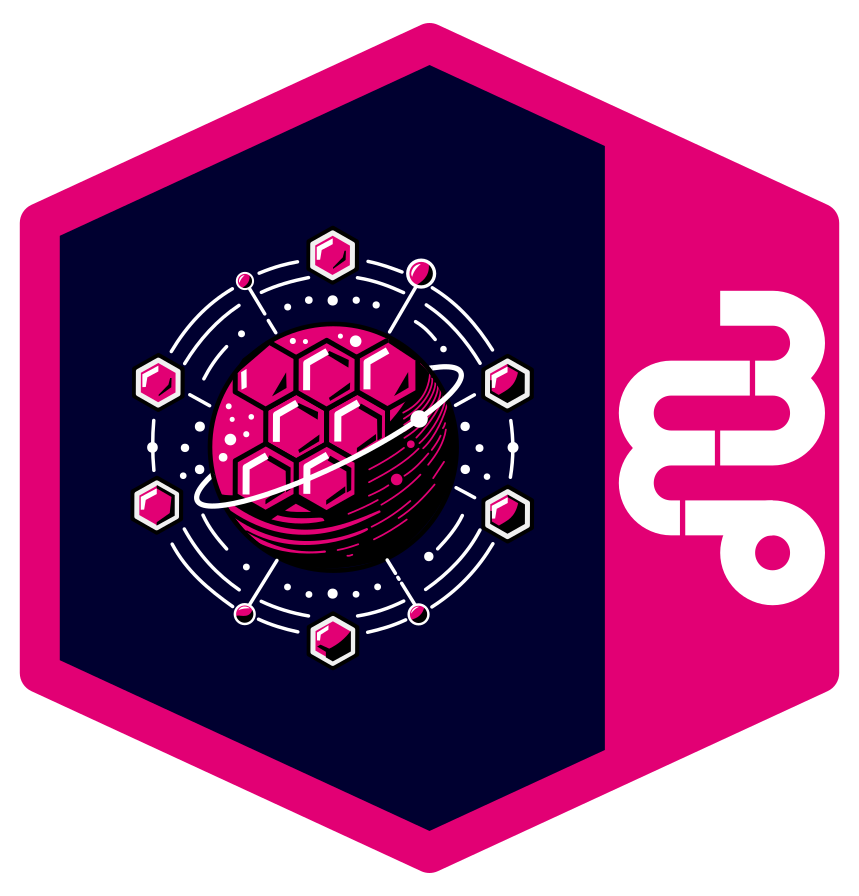

<!--
Copyright 2025 Deutsche Telekom IT GmbH

SPDX-License-Identifier: Apache-2.0
-->

<p align="center">
  
  <h1 align="center">Rover-CTL</h1>
</p>

<p align="center">
  The Rover-CTL CLI tool is a command-line interface for managing and interacting with the Rover control plane.
  It provides a user-friendly way to perform operations such as applying configurations, retrieving information, and managing resources within the Rover ecosystem.
</p>

<p align="center">
  <a href="#about">About</a> •
  <a href="#getting-started">Getting Started</a> •
  <a href="#configuration">Configuration</a>
</p>


# About

Rover Control CLI (roverctl) is a command-line tool for managing rover resources via the REST API. It handles configuration files and maps them to the appropriate resource handlers.

<div align="center">
    
</div>

# Getting Started


## Installation


### From Source

To build and install `roverctl` from source, follow these steps:

1. Clone the repository:
   ```bash
   git clone github.com/telekom/controlplane.git
    cd controlplane/rover-ctl
    ```

2. Build the binary:
   ```bash
   make build
   ```

3. Install the binary:
   ```bash
   make install
   ```

## Usage

See [rover-ctl help](./docs/roverctl.md) for a complete list of commands and options.

# Configuration

Rover-ctl can be configured using environment variables. The tool uses Viper for configuration management with the following options:

## Environment Variables

All environment variables are prefixed with `ROVER_` and use underscores instead of dots for nested keys. For example, `server.url` becomes `ROVER_SERVER_URL`.

| Environment Variable | Description | Default |
|---------------------|-------------|---------|
| `ROVER_SERVER_URL` | URL of the Rover server | - |
| `ROVER_TOKEN_URL` | URL for token authentication | - |
| `ROVER_TOKEN` | Authentication token | - |
| `ROVER_LOG_LEVEL` | Log level (debug, info, warn, error) | info |
| `ROVER_LOG_FORMAT` | Log format (json or console) | console |
| `ROVER_OUTPUT_FORMAT` | Output format (yaml or json) | yaml |

## Authentication

The CLI uses token-based authentication to interact with the Rover server. The token is a base64-encoded JSON object with the following structure:

```json
{
  "environment": "required",
  "group": "required",
  "team": "required",
  "client_id": "required",
  "client_secret": "required",
  "token_url": "required URL",
  "server_url": "required URL",
  "generated_at": 1692345678000
}
```

The token can be set using the `ROVER_TOKEN` environment variable or through a configuration file.
