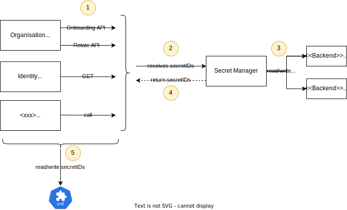
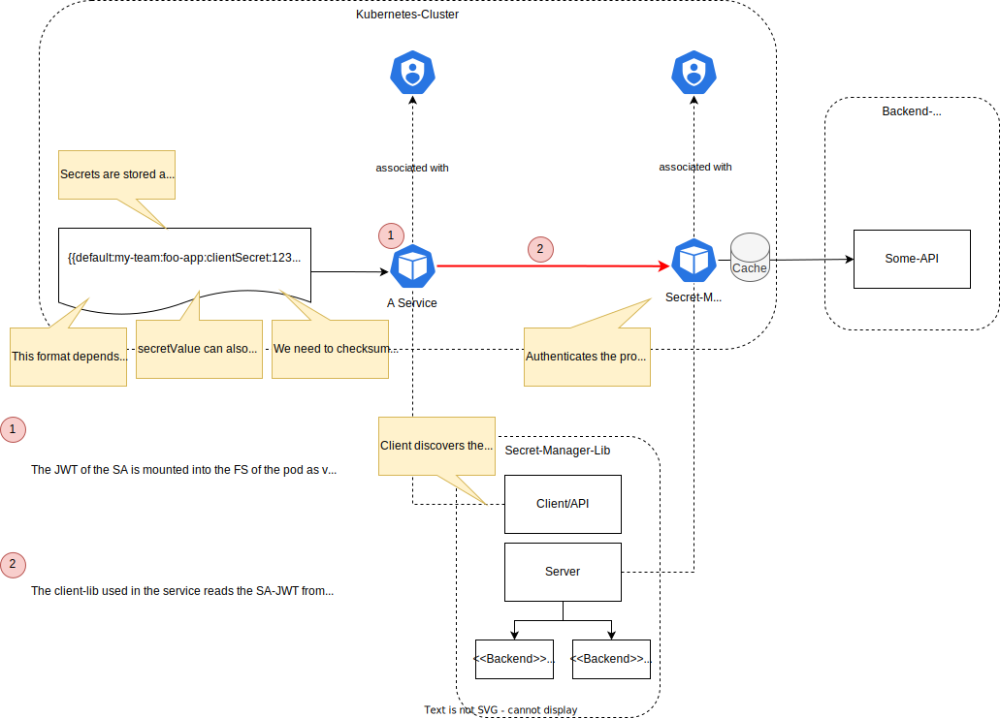

<!--
Copyright 2025 Deutsche Telekom IT GmbH

SPDX-License-Identifier: Apache-2.0
-->

<p align="center">
  <h1 align="center">Secret Manager</h1>
</p>

<p align="center">
  Secret Manager (SM) is a RESTful API for managing secrets. It allows for storing, retrieving, and deleting secrets securely.
</p>

<p align="center">
  <a href="#about">About</a> •
  <a href="#backends">Backends</a> •
  <a href="#security">Security</a> •
  <a href="#getting-started">Getting Started</a>
</p>

## About

Secret Manager (SM) is a RESTful API for managing secrets. It allows you to store, retrieve, and delete secrets securely. 

> [!NOTE]
> The main goal of this is to obfuscate the secrets in Custom-Resources (CR) with placeholders "secret references".




The general flow is as follows:
1. Any domain can access the SM to store a secret, if configured to do so by calling various endpoints depending on the purpose.
2. In the request, the domain will send a reference **secretID**, which is a unique identifier for the secret.
3. The secret manager will then store/receive the secret in the configured backend.
4. The secret manager will return a reference **secretID** to the domain operators.
5. The domain operators will then use this reference in their Custom-Resources (CRs) instead of the actual secret.


The following problems are solved:

* **Secret obfuscation:** The SM is used to replace secrets in CRs with a placeholder and if the secret is needed, retrieve it (jit).
* **Secret onboarding:** The SM provides a unified API for onboarding new entities and secrets.
* **Secret storage:** The SM provides a unified API for storing secrets in different backends.
* **Secret retrieval:** The SM provides a unified API for retrieving secrets using references (IDs) to secrets.
* **Auditing:** As the SM is a single point of access for secrets, it can provide auditing capabilities for secret access.

## Architecture

The following diagram provides a high-level overview of how the SM is integrated into the Controlplane.




## Backends

The SM itself does not store anything. This is done using backend implementations.
Currently, the SM supports the following backends.

### Kubernetes Secrets

This backend uses [Kubernetes Secrets](https://kubernetes.io/docs/concepts/configuration/secret/) to store secrets. 
It will therefore work with any Kubernetes cluster. 

The **upside** of this backend is that it is easy to set up and does not require any additional components. It also enables fast development and testing cycles.
The **downside** of this backend is that the secrets are stored in Kubernetes and therefore visible to anyone with access to the Kubernetes cluster.

For more information about the Kubernetes implementation, see the [Kubernetes Backend](./pkg/backend/kubernetes/README.md) documentation.

### Conjur

This backend uses [Conjur](https://www.conjur.org/) to store secrets. 
It is a more secure option than the Kubernetes backend, as it provides more fine-grained access control and auditing capabilities.

For more information about the Conjur implementation, see the [Conjur Backend](./pkg/backend/conjur/README.md) documentation.

## Security

### Access Rights

We have implemented a simple access control mechanism that allows you to define which services are allowed to access the SM at different levels.

* `secrets_read`: Allows GET requests to the SM.
* `secrets_write`: Allows PUT/DELETE requests to the SM.
* `onboarding_write`: Allows access to `v1/onboarding` endpoints. This is used to onboard new teams, groups and environments.
  * For more information about teams/groups and environments, see [Organization](../organization/README.md) and [Admin](../admin/README.md) domains, respectively.

For more details on how to configure, see the [Server Configuration](#server-configuration) section.

### Network Policies

Additionally, traffic towards the SM is further protected by [Kubernetes Network Policies](https://kubernetes.io/docs/concepts/services-networking/network-policies/),
so that only the services that are registered in advance can access the SM.
See the [Deployment Integration](#deployment-integration) section for more information on how to integrate the SM into your custom operator deployment.

## Getting Started

### Server

The following section describes how to set up the SM server.

#### Configuration
An example configuration can be found [./config/default/config.yaml](./config/default/config.yaml).

```yaml
backend:
  type: conjur

security:
  enabled: true  # enables the security features of the SM
  access_config:  # defines a list of services that are allowed to access the SM
  - service_account_name: default
    deployment_name: secret-client-shell
    namespace: secret-manager-client
    allowed_access: 
    - secrets_read
    - secrets_write
    - onboarding_write
```

#### Starting
To start the server, you need to provide the configuration file as a command-line argument.

> [!NOTE]
> The backend flag `-backend` will override the backend type defined in the configuration file if the flag is used.

Example for Kubernetes:

```bash
go run ./cmd/server/server.go -backend kubernetes -configfile ./config/default/config.yaml
```

Example for Conjur:

```bash
go run ./cmd/server/server.go -backend conjur -configfile ./config/default/config.yaml
```

For loading the Conjur configuration [github.com/cyberark/conjur-api-go](https://github.com/cyberark/conjur-api-go) is used. 
Configuration is done using environment variables. Please refer to their documentation for more information on how to set up the Conjur backend.

### Client Configuration

For developing and integration purposes, we have included a client that can be used to test the SM in the cluster.
You can find the client in the [cmd/client](./cmd/client) directory.

### Code Integration
We've included an [OpenAPI spec](./api/openapi.yaml) that can be used to generate client code for the SM.

However, we also provide a basic Go implementation that can be used to **easily** integrate the SM into your code.
Please take a look at that [api/README.md](./api/README.md) for more information on how to use it. 


Example taken from the [Identity Domain](../identity):

```go
package client

import (
	secrets "github.com/telekom/controlplane/secret-manager/api"
)

func (h *HandlerClient) CreateOrUpdate(ctx context.Context, client *identityv1.Client) (err error) {
	/*
	    Handler Code
	 */

  secret, err := secrets.Get(ctx, client.Spec.ClientSecret)
  if err != nil {
    return errors.Wrap(err, "failed to get client secret from secret-manager")
  }
    /*
       Handler Code
        
     */
}
```

If you want to use the onboarding functionality, take a look at the code base from [Organization Domain](../organization/README.md) and the [Admin Domain](../admin/README.md) for examples on how to use it.
Additionally, the [Organization Domain](../organization/README.md) also uses the rotation functionality.

### Deployment Integration
To integrate the following [Deployment and Namespaces Patches](./config/patches) into your custom operator deployment, so that the new operator can communicate with the SM.
Otherwise, the communication to the SM will be blocked on a [network policy](https://kubernetes.io/docs/concepts/services-networking/network-policies/) level in k8s. 

