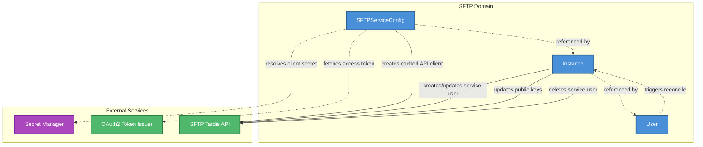

<!--
SPDX-FileCopyrightText: 2025 Deutsche Telekom AG

SPDX-License-Identifier: CC0-1.0
-->

# SFTP Domain -- Architecture Overview

This document describes how the **SFTP domain** (`sftp.cp.ei.telekom.de/v1`) reconciles SFTP resources and interacts with external services.

## Domain Interaction Diagram

### Legend

| Arrow style | Meaning |
|---|---|
| **Solid line** (`--creates-->`) | The SFTP controller performs an external operation or prepares a cached client for that service |
| **Dashed line** (`-.reads.->`) | The SFTP controller reads or resolves data during reconciliation |
| **Dashed line** (`-.triggers reconcile.->`) | The watched resource change enqueues reconciliation of another resource |

## Interaction Details

### SFTPServiceConfig Controller

The SFTP service configuration controller prepares the HTTP client used to call the SFTP Tardis API. A `SFTPServiceConfig` contains the SFTP Tardis API endpoint, OAuth2 issuer URL, client ID, and client secret.

| Target | Relationship | Purpose |
|---|---|---|
| **Secret Manager** | resolves | Resolves `spec.api.clientSecret` when the value is a Secret Manager reference |
| **OAuth2 Token Issuer** | reads | Fetches a client credentials access token to validate the API configuration |
| **SFTP Tardis API** | caches client for | Creates or refreshes the generated HTTP API client for the referenced endpoint |

The controller stores the observed generation in status and marks the resource ready once the client has been created or refreshed. On deletion, it removes the cached client for that SFTPServiceConfig.

### Instance Controller

The instance controller provisions and maintains the external SFTP service user represented by an `Instance`.

| Target | Relationship | Purpose |
|---|---|---|
| **SFTPServiceConfig** | watches/uses | Uses `spec.sftpServiceConfigRef` to resolve the cached SFTP Tardis client |
| **User** | watches/reads | Lists Users in the Instance namespace and selects Users whose `spec.instanceRef` points to the Instance |
| **SFTP Tardis API** | creates/updates/deletes | Creates or updates the SFTP service user, deletes it during finalization, and synchronizes its public keys |

When an Instance spec changes, the controller creates or updates the SFTP user in the external service. On every reconciliation, it collects SSH public keys from all matching Users, canonicalizes them, deduplicates them by fingerprint, and sends the resulting key list to the SFTP Tardis API.

### User Resource

The SFTP domain does not run a standalone User reconciler. User resources are watched by the Instance controller. A User contributes SSH public keys to the Instance referenced by `spec.instanceRef`.

Invalid SSH public keys are skipped during payload generation. Valid keys are sent with the target SFTP user name set to the Instance name and a description based on the User namespace/name.

## Registered Schemes

The SFTP operator registers API types from **1 domain**:

| Domain | API Group | Resources Used |
|---|---|---|
| **SFTP** | `sftp.cp.ei.telekom.de` | SFTPServiceConfig, Instance, User |

The operator also calls the Secret Manager API and the SFTP Tardis API as external services, but it does not register Kubernetes API types from those domains.
