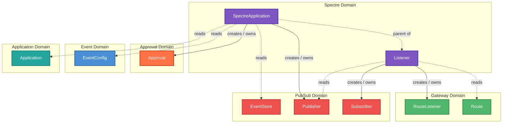

<!--
SPDX-FileCopyrightText: 2025 Deutsche Telekom AG

SPDX-License-Identifier: CC0-1.0
-->

# Spectre Domain -- Architecture Overview

This document describes how the **Spectre domain** (`spectre.cp.ei.telekom.de/v1`) interacts with its surrounding domains in the Control Plane.

## Domain Interaction Diagram

### Legend

| Arrow style | Meaning |
|---|---|
| **Solid line** (`--creates/owns-->`) | The controller **creates and owns** this resource (full CRUD lifecycle) |
| **Dashed line** (`-.reads.->`) | The controller **reads** this resource during reconciliation (GET/LIST) |

## Interaction Details

### SpectreApplication Handler

Reconciles `SpectreApplication` resources. One SpectreApplication groups all Listeners for a given application.

| Target Domain | Resource | Relationship | Purpose |
|---|---|---|---|
| **PubSub** | `Publisher` | creates/owns | Registers a shared generic Publisher for the application's listener event type |
| **PubSub** | `EventStore` | reads | Resolves the zone's EventStore for backend connection details |
| **Approval** | `Approval` | creates/owns | Creates an Approval capturing consumer, provider, path, listener app, directions, delivery mode, callback, and filters |
| **Event** | `EventConfig` | reads | Reads `CallbackURL` and zone configuration |
| **Application** | `Application` | reads | Resolves consumer and provider application metadata |

The shared generic Publisher uses event type `de.telekom.ei.listener.<applicationId>`. Multiple Listeners may reference the same Publisher; it is not exclusively owned by any single Listener.

### Listener Handler

Reconciles `Listener` resources. Each Listener represents one consumer-to-provider binding for a specific API path.

| Target Domain | Resource | Relationship | Purpose |
|---|---|---|---|
| **PubSub** | `Subscriber` | creates/owns | Creates a bridge Subscriber that routes events through the Horizon callback path |
| **Gateway** | `RouteListener` | creates/owns | Creates a RouteListener that exposes the listener endpoint on the API Gateway |
| **Gateway** | `Route` | reads | Resolves the existing API Route to extract the service path for the RouteListener |
| **PubSub** | `Publisher` | reads | Verifies the parent SpectreApplication's Publisher is ready |

## Ownership Model

Event and Spectre are **peer business-logic domains**. PubSub is a **shared Horizon runtime adapter**.

| PubSub Resource | Created by |
|---|---|
| `EventStore` | Event domain (`EventConfig` controller) |
| `Publisher` | Event domain (`EventExposure`) **and** Spectre domain (`SpectreApplication`) |
| `Subscriber` | Event domain (`EventSubscription`) **and** Spectre domain (`Listener`) |

Users do not create PubSub resources directly. EventStore ownership is unchanged -- Spectre only consumes it.

## Cross-Namespace Children

Spectre creates child resources (Publishers, Subscribers, RouteListeners) in the zone namespace, which differs from the Listener's own namespace. Standard Kubernetes `ownerReferences` cannot cross namespace boundaries, so Spectre uses `OwnerUidLabelKey` labels to track ownership. Deletion cleanup uses label-based listing instead of garbage collection.

## Lifecycle Contracts

- **Deletion order**: Subscriber -> Publisher -> EventStore. A Publisher is retained until all referencing Subscribers have finalized.
- **Pass-through and failover listeners** are rejected at reconciliation time.
- **SSE delivery** is local-zone-only. Cross-zone SSE proxy routes are not yet implemented for Spectre listeners.
- **Callback traffic** is Gateway-mediated: the Subscriber's callback URL is constructed from `EventConfig.Status.CallbackURL`, routing through the Gateway's callback route.

## Internal Event-Type Namespace

Spectre uses the `de.telekom.ei.listener*` prefix for its internal event types. These are generated automatically from the application ID and are not user-configurable. Ordinary EventType admission does not allow claiming names under this prefix, preventing collisions.

## Registered Schemes

The Spectre operator registers API types from **5 domains** (including itself):

| Domain | API Group | Resources Used |
|---|---|---|
| **Spectre** | `spectre.cp.ei.telekom.de` | SpectreApplication, Listener |
| **PubSub** | `pubsub.cp.ei.telekom.de` | EventStore, Publisher, Subscriber |
| **Gateway** | `gateway.cp.ei.telekom.de` | RouteListener, Route |
| **Approval** | `approval.cp.ei.telekom.de` | Approval |
| **Event** | `event.cp.ei.telekom.de` | EventConfig |
